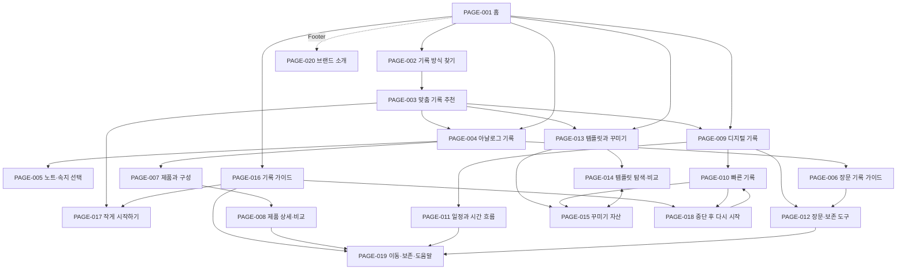

# 07 사이트 흐름도

상태: `DRAFT_REVIEW_PENDING`  
기준: 66개 사이트·462개 경험 통합 분석, 7명 Client, PAGE-001~020 사이트맵

## 1. 목적

20개 Page의 진입·분기·교차 연결·복귀 관계를 정의한다. 사용자 행동과 시스템 상태의 상세 처리는 `07-서비스-흐름도.md`에서 다룬다.

## 2. 전체 Page 흐름

## 3. 연결 명세

| From | To | 목적 | 유형 |
|---|---|---|---|
| PAGE-001 | PAGE-002·004·009·013·016 | 5개 핵심 과업 진입 | Primary |
| PAGE-002 | PAGE-003 | 비교 후 맞춤 추천 | Child |
| PAGE-003 | PAGE-004·009·013·017 | 추천 근거를 유지한 선택 이동 | Decision |
| PAGE-004 | PAGE-005·006·007 | 아날로그 조건별 탐색 | Child |
| PAGE-007 | PAGE-008 | 개별 제품 사실과 비교 | Child |
| PAGE-006 | PAGE-012 | 장문 기준의 디지털 대안 | Cross Link |
| PAGE-009 | PAGE-010·011·012 | 입력량·시간·보존 목적별 탐색 | Child |
| PAGE-010 | PAGE-015·018 | 기록 후 표현 또는 복귀 처리 | Cross Link |
| PAGE-011·012 | PAGE-019 | 상태·제한·복구 확인 | Support |
| PAGE-013 | PAGE-014·015 | 기능 템플릿과 표현 자산 분기 | Child |
| PAGE-014 | PAGE-015 | 템플릿과 표현 자산 교차 비교 | Cross Link |
| PAGE-016 | PAGE-017·018·019 | 시작·복귀·보존 안내 | Child |
| PAGE-018 | PAGE-010 | 다시 시작할 최소 행동 | Return |
| PAGE-001 | PAGE-020 | 브랜드 원칙 확인 | Footer |

## 4. 핵심 경로

- 선택: `PAGE-001 → PAGE-002 → PAGE-003 → 목적별 Page`
- 아날로그: `PAGE-004 → PAGE-005/006/007 → PAGE-008`
- 빠른 기록: `PAGE-009 → PAGE-010 → 완료/꾸미기/복귀`
- 일정: `PAGE-009 → PAGE-011 → PAGE-019(필요 시)`
- 템플릿: `PAGE-013 → PAGE-014 ↔ PAGE-015`
- 재시작: `PAGE-016 → PAGE-017/018 → PAGE-010`
- 보존: `PAGE-012/019 → 호출 Page 복귀`

## 5. 검증

- Page 반영: 20/20
- 고립 Page: 0
- GNB: 5개
- 최대 Depth: 3
- Footer Page: PAGE-020
- 조건부 Page: PAGE-018
- HOLD 기능을 정상 제공 경로로 확정: 0

