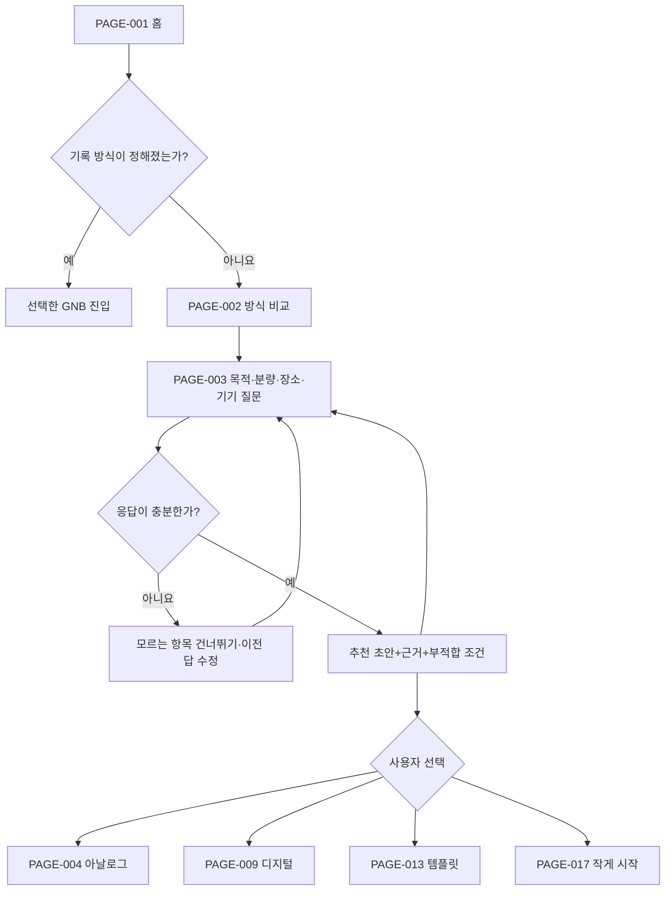

# 07 서비스 흐름도

상태: `DRAFT_REVIEW_PENDING`  
기준: PAGE-001~020, Client 7명, SR-001~020

## 1. 서비스 흐름 원칙

1. 상품·기능보다 기록 목적·분량·장소·기기를 먼저 묻는다.
2. 추천은 강제 결과가 아니라 근거가 보이고 수정 가능한 초안이다.
3. 한 줄·사진·음성·한 항목처럼 가장 작은 완료 단위를 제공한다.
4. 템플릿은 목적·입력량·난도·편집 범위·완성 예시로 비교한다.
5. 중단은 실패로 처리하지 않고 지금 하기·보류·나누기·삭제를 선택하게 한다.
6. 저장·동기화·백업·복구 상태를 한 문구로 축약하지 않는다.
7. SR-013~017은 검증 분기로만 표시한다.

## 2. 공통 시작·추천 흐름

성공 기준은 추천 수락이 아니라 사용자가 이유를 이해하고 선택 또는 수정할 수 있는 것이다.

## 3. Client별 핵심 흐름

### 은재 — 장문·필기·물성

`PAGE-002 → PAGE-003 → PAGE-004 → PAGE-005/006 → PAGE-007 → PAGE-008`

- 크기·줄 간격·종이·제본·리필·휴대성을 비교한다.
- 장문 조건이 맞지 않으면 PAGE-012의 디지털 장문 후보를 대안으로 제시한다.
- 실물 촉감은 화면에서 검증됐다고 표현하지 않는다.

### 지안 — 일정·시간 흐름

`PAGE-003 → PAGE-009 → PAGE-011 → PAGE-019(필요 시)`

- 주간 개요에서 일간 시간축으로 이동한다.
- 중요도와 선택적 알림 원칙을 확인한다.
- 외부 달력은 표시·가져오기·편집·충돌·복구를 분리한 HOLD 분기로 둔다.

### 하람 — 저부담 빠른 기록

`PAGE-003 → PAGE-009 → PAGE-010 → 완료 또는 PAGE-015`

- 사진·기분·음성·한 줄 중 하나만 선택해도 완료할 수 있다.
- 분류·태그·템플릿 선택을 최초 완료 전에 강제하지 않는다.
- 추가 꾸미기는 완료 이후의 선택 행동이다.

### 소담 — 템플릿 비교

`PAGE-003 → PAGE-013 → PAGE-014 → 적용 초안 → 수정/취소`

- 썸네일만 나열하지 않고 구조·입력량·난도·편집 범위·완성 예시를 비교한다.
- 적용 전 미리보기와 원래 기록으로 돌아가는 취소 경로를 제공한다.

### 태오 — 이동·보존 상태

`PAGE-009 → PAGE-012 → PAGE-019 → 호출 Page 복귀`

- 저장 위치·로컬 사본·전송 중·최신 상태·충돌·백업·복구·내보내기를 구분한다.
- 다기기 최신 상태와 가격·품질 판단은 검증 전 확정하지 않는다.

### 나린 — 꾸미기 자산

`PAGE-013 → PAGE-015 → 미리보기 → 저장/재사용 또는 취소`

- 표지·스티커·색상·사진·서식을 기능 템플릿·태그·테마와 구분한다.
- 자산 적용은 원본을 덮지 않는 미리보기 상태에서 시작한다.

### 이준 — 중단 후 재시작

`PAGE-016 → PAGE-017 또는 PAGE-018 → PAGE-010`

- 최근 작업 1개·미완료 1개·재발견 1개를 먼저 보여준다.
- 지금 하기·보류·더 작게 나누기·삭제 중 하나를 선택한다.
- 자동 이월은 기본값으로 강제하지 않으며 효과는 SR-017 검증 대상으로 남긴다.

## 4. 핵심 행동 흐름

| Flow | 시작 | 주요 판단 | 성공 결과 | 복귀 |
|---|---|---|---|---|
| FL-01 방식 선택 | PAGE-001 | 바로 선택/비교/추천 | 근거를 이해한 방식 선택 | PAGE-003 수정 |
| FL-02 아날로그 비교 | PAGE-004 | 구조·물성·휴대성 | 적합/부적합 조건 확인 | PAGE-004 |
| FL-03 빠른 기록 | PAGE-009 | 사진/한 줄/음성/기분 | 최소 1개 기록 완료 | PAGE-010 임시 기록 |
| FL-04 일정 탐색 | PAGE-009 | 주간/일간·중요도 | 필요한 시간 정보 확인 | PAGE-011 |
| FL-05 템플릿 | PAGE-013 | 입력량·난도·편집 범위 | 미리보기 후 적용 | PAGE-014 취소 |
| FL-06 꾸미기 | PAGE-015 | 자산 유형·재사용 | 원본 보존 상태로 적용 | PAGE-015 미리보기 |
| FL-07 재시작 | PAGE-016 | 하기/보류/나누기/삭제 | 작은 다음 행동 시작 | PAGE-018 |
| FL-08 보존 도움 | PAGE-012·019 | 상태/오류/복구 | 상태 이해 또는 해결 경로 확보 | 호출 Page |

## 5. 상태·예외 흐름

| 상태 | 시스템 표현 | 제공 행동 | 금지 |
|---|---|---|---|
| 첫 기록 Empty | 최소 기록 예시와 임시함 | 사진·한 줄·음성·기분 시작 | 폴더·태그 강제 |
| 추천 응답 부족 | 부족한 조건과 영향 표시 | 건너뛰기·수정·직접 선택 | 임의 확정 |
| 추천 결과 없음 | 조건 충돌 설명 | 조건 완화·직접 비교 | 거짓 추천 |
| 기록 저장 중 | 로컬 저장/전송 중 구분 | 화면 유지·재시도 | 완료로 오표시 |
| 저장 실패 | 보존된 입력과 실패 범위 표시 | 재시도·로컬 사본·내보내기 | 입력 삭제 |
| 동기화 충돌 | 버전·시간·기기 구분 | 비교·한쪽 선택·사본 유지 | 자동 덮어쓰기 |
| 템플릿 적용 실패 | 원본 유지와 실패 지점 표시 | 다시 적용·취소 | 원본 변형 |
| 미완료 복귀 | 최근·미완료·재발견 구분 | 하기·보류·나누기·삭제 | 자동 이월 강제 |
| 외부 달력 요청 | HOLD와 미검증 범위 표시 | 도움말·검증 안내 | 활성 연동처럼 표현 |
| 오프라인 | 현재 가능한 행동 표시 | 로컬 기록·나중 전송 | 동기화 완료 표시 |

## 6. HOLD 검증 분기

| SR | 검증 대상 | 흐름 내 위치 | 통과 전 처리 |
|---|---|---|---|
| SR-013 | 다범주 통합 탐색 효과 | PAGE-003·013 | 범주 구분만 제공 |
| SR-014 | 다기기 최신 상태·충돌 | PAGE-012·019 | 상태 안내와 시나리오만 정의 |
| SR-015 | 외부 달력 표시·편집·충돌 | PAGE-011·019 | 기능 실행 경로 미제공 |
| SR-016 | 가격·품질 비교 우선순위 | PAGE-008·012 | 실제 상품 확정 전 비교 기능 보류 |
| SR-017 | 선택적 복귀 효과 | PAGE-018 | CONDITIONAL 상태 유지 |

## 7. 추적성과 접근성

- Client 7명 → 핵심 흐름 7개 연결
- SR-001~020 → 정상 또는 HOLD 분기 연결
- PAGE-001~020 → 사이트 또는 서비스 흐름에서 모두 참조
- 상태는 색상만으로 구분하지 않고 텍스트 레이블을 함께 제공한다.
- 시간 순서와 추천 근거는 읽기 순서에서도 보존한다.
- 취소·뒤로가기·호출 Page 복귀를 파괴적 동작과 분리한다.

## 8. 다음 단계 전달

화면 설계서는 우선 다음 5개 흐름부터 화면 단위로 변환한다.

1. PAGE-002~003 기록 방식 질문·추천
2. PAGE-013~014 템플릿 미리보기·비교
3. PAGE-009~010 빠른 기록
4. PAGE-016~018 중단 후 복귀
5. PAGE-012·019 저장·보존 상태

사용자 승인 전 와이어프레임·프로토타입·Figma 작업은 시작하지 않는다.

