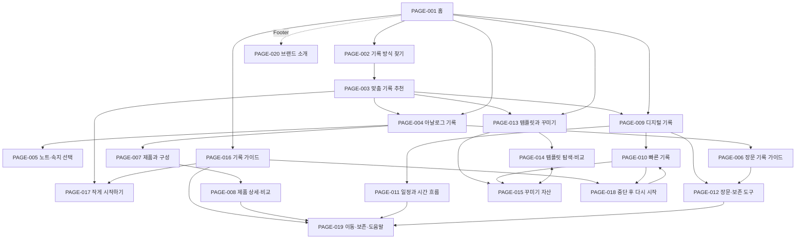
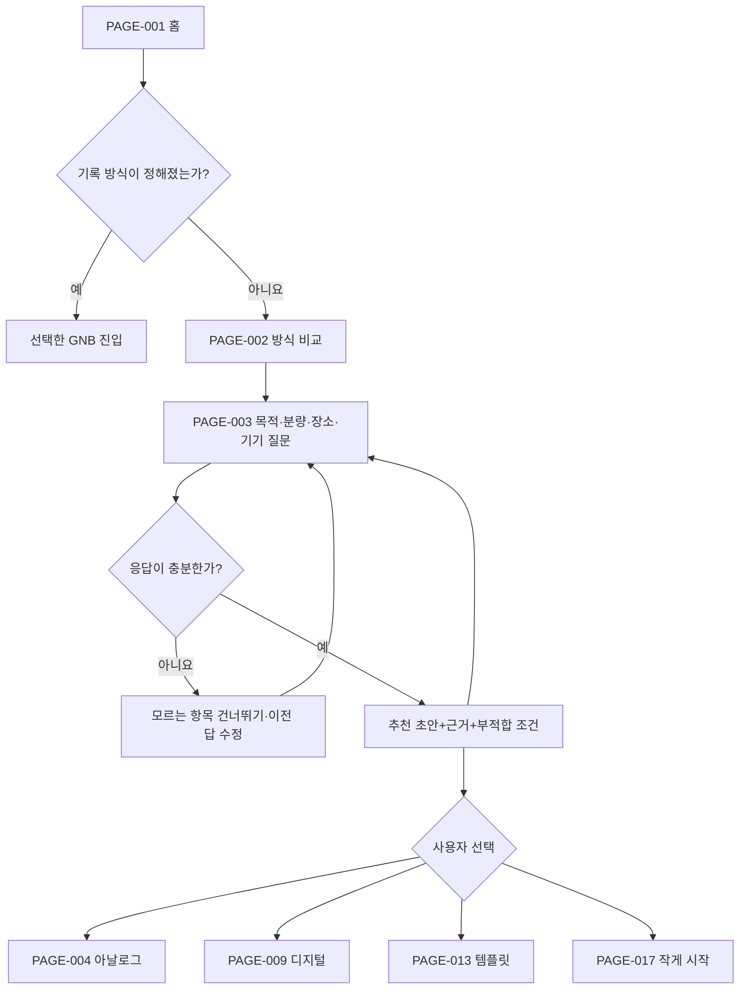

# Source Markdown Archive

Status: SOURCE_ARCHIVE

This file preserves source Markdown documents. Use 10-충돌판정-출처추적.md for canonical decisions.

---


# SOURCE: 12-제미나이-통합최종산출물(2) / 01-통합-사이트구조맵.md

- SHA-256: E4667C1EDEA3A1197B71793C14CC5085A634D6267C7DA9EA5D671B19090CEF44
- Source bytes: 4441

SOURCE CONTENT START

# DAMORI 50개 가상클라이언트 통합 사이트맵 및 정보 구조맵 (IA)

문서 ID: `IA-DAMORI-50VC-FINAL`  
상태: `FINAL_APPROVED_SINGLE_DOC`  
위치: `12-제미나이-통합최종산출물/` 신규 독립 전용 폴더  
대상: `VC-01 은재` ~ `VC-50 아인` (전체 50개 가상 클라이언트 100% 매핑)

---

## 1. 20개 전체 페이지 정보 구조 및 GNB 계층도

### GNB 0: 메인 및 전역 (Global)
- **`SCR-001 / PAGE-001` 홈 메인페이지** [GNB 메인]
  - `001-01` Hero (아날로그/디지털 동등 위계 비주얼 + 2대 CTA)
  - `001-PRODUCTS` 50개 전수 라인업 가로/세로 스크롤 카드 레일 (최소 15개~50개 상품)
  - `001-02` 5대 탐색 경로 카드 (찾기/아날로그/디지털/템플릿/가이드)
  - `001-03` 아날로그 물성 vs 디지털 시간축 동등 비교 패널
  - `001-SCHEDULE` 지안(VC-02) 시간축 타임라인 미리보기
  - `001-START` 하람(VC-03) 10초 저부담 빠른 기록 모듈
  - `001-TEMPLATE` 소담(VC-04) & 나린(VC-06) 원본 데이터 보호 템플릿/자산 미리보기
  - `001-04` 투명 신뢰 원칙 3대 배지 밴드 (확인된 정보 / HOLD 공지)
  - `001-GUIDE` 이준(VC-07) 중단 후 복귀 안내 밴드
  - `001-FOOTER` 4열 전역 푸터 링크 그룹

---

### GNB 1: 기록 방식 찾기 (Discover Methods)
- **`SCR-002 / PAGE-002` 기록 방식 찾기 메인** [GNB 1]
  - 4대 자율 필터 칩 (목적별/분량별/장소별/보존별)
  - 아날로그 vs 디지털 동등 2열 상세 비교 카드
  - 추천 초안 보증 톤다운 배너
- **`SCR-003 / PAGE-003` 개인 맞춤 추천 결과** [Depth 2]
  - 무설정 빠른 시작 경로 및 조합 추천

---

### GNB 2: 아날로그 기록 (Analog Journaling)
- **`SCR-004 / PAGE-004` 아날로그 기록 메인** [GNB 2]
  - 180도 평면 펼침 제본, 120gsm 미유광 평산지, 실링 왁스 인장 서사
- **`SCR-005 / PAGE-005` 노트 & 내지 선택** [Depth 2]
  - 방안(Grid), 무지(Blank), 줄글(Ruled) 3종 속지 및 모듈형 바인더
- **`SCR-006 / PAGE-006` 장문 수기 가이드** [Depth 2]
  - 손목 피로 없는 필기 템포 조율
- **`SCR-007 / PAGE-007` 오프라인 아날로그 제품 라인업** [Depth 2]
  - 노구, 바인더, 황동 인장, 가죽 케어 실물 제품
- **`SCR-008 / PAGE-008` 제품 상세 및 1대1 비교** [Depth 3]
  - 종이 무게, 잉크 번짐 테스트 결과표 및 가격 안내

---

### GNB 3: 디지털 기록 (Digital Journaling)
- **`SCR-009 / PAGE-009` 디지털 기록 메인** [GNB 3]
  - 주간 개요 → 일간 타임라인 시간축 통제 & 10초 저부담 4대 모듈
- **`SCR-010 / PAGE-010` 10초 저부담 빠른 기록** [Depth 2]
  - 사진 한 장, 한 줄 메모, 음성, 감정 이모티콘 10초 폼
- **`SCR-011 / PAGE-011` 일정 & 시간 흐름 통제** [Depth 2]
  - 지안(VC-02) 시간대 세부 블록 및 외부 달력 연동 HOLD 공지
- **`SCR-012 / PAGE-012` 장문 보존 & 오프라인 백업** [Depth 2]
  - 태오(VC-05) 다기기 연속성 & 오프라인 PDF 내보내기

---

### GNB 4: 템플릿과 꾸미기 (Templates & Assets)
- **`SCR-013 / PAGE-013` 템플릿과 꾸미기 메인** [GNB 4]
  - 입력 구조(Structure)와 시각 표현(Asset)의 원본 보호 분리 명세
- **`SCR-014 / PAGE-014` 사본 템플릿 탐색 & 비교** [Depth 2]
  - 소담(VC-04) 독서, 여행, 회고 주제별 사본 서식
- **`SCR-015 / PAGE-015` 다이어리 감성 꾸미기 자산** [Depth 2]
  - 나린(VC-06) 실링 왁스 인장, 마스킹 테이프, 흑백 미니멀 스티커

---

### GNB 5: 기록 가이드 (Journaling Guides)
- **`SCR-016 / PAGE-016` 기록 가이드 센터 메인** [GNB 5]
  - 3대 상황별 가이드 밴드 (시작 / 복귀 / 보존)
- **`SCR-017 / PAGE-017` 작게 시작하기** [Depth 2]
  - 다온(VC-08) 회원가입 없이 첫 한 줄 내딛기
- **`SCR-018 / PAGE-018` 중단 후 다시 시작** [Depth 2]
  - 이준(VC-07) 미안함 없는 자연스러운 노구 복귀
- **`SCR-019 / PAGE-019` 데이터 이동 & 접근성 도움말** [Depth 2]
  - 여울(VC-13) 스크린리더 WCAG 2.1 접근성 및 오프라인 보존

---

### Footer & 브랜드 영역
- **`SCR-020 / PAGE-020` 브랜드 소개 (기억의 서재)** [Footer]
  - 다모리 브랜드 서사, 순수 흑백 미니멀 브랜딩 철학, 이용약관

SOURCE CONTENT END

---


# SOURCE: 12-제미나이-통합최종산출물(2) / 02-통합-서비스흐름도.md

- SHA-256: A8C7708D65DDCEE65B69EAB647439F0AF279AA6270D0D31C11207C19A676E394
- Source bytes: 5149

SOURCE CONTENT START

# DAMORI 50개 가상클라이언트 통합 서비스 흐름도 (Service Flowchart / User Flow)

문서 ID: `FLOW-DAMORI-50VC-FINAL`  
상태: `FINAL_APPROVED_SINGLE_DOC`  
위치: `12-제미나이-통합최종산출물/` 신규 독립 전용 폴더  
대상: `VC-01 은재` ~ `VC-50 아인` (전체 50개 가상 클라이언트 100% 매핑)

---

## 1. 전체 서비스 사용자 여정 (End-to-End User Journey)

[진입 Phase] PAGE-001 메인페이지 (50개 클라이언트 진입 및 상품 레일 탐색)
    ↓
[분기 1] 자율 선택 필터링
    ├─► [경로 A] 아날로그 수기 목적 ──► PAGE-002 비교 ──► PAGE-004 물성 노트 ──► PAGE-005 내지 선택 ──► 서재 소장
    ├─► [경로 B] 디지털 시간축 목적 ──► PAGE-002 비교 ──► PAGE-009 디지털 기록 ──► PAGE-011 시간축 통제 ──► 백업 보존
    ├─► [경로 C] 저부담 10초 입문 ────► PAGE-001 팝업 ──► PAGE-010 빠른 기록 ──► PAGE-017 작게 시작 ──► 지속 기록
    └─► [경로 D] 템플릿 & 꾸미기 ───► PAGE-013 서식 ──► PAGE-014 사본 생성 ──► PAGE-015 자산 레이어 ──► 원본 보존
    ↓
[복귀 Phase] 기록 중단 및 다시 시작 ──► PAGE-016 가이드 ──► PAGE-018 미안함 없는 복귀 ──► 50VC 전원 안심 지속

---

## 2. 5대 핵심 클라이언트 시나리오별 상세 이동 동선 (User Flow Details)

### 경로 A: VC-01 은재 (아날로그 수기 & 물성 사색 동선)
- `STEP 01`: [PAGE-001] 메인페이지 진입 → 50개 제품 가로 스크롤 레일에서 `180도 평면 펼침 노트` 확인
- `STEP 02`: [PAGE-002] 기록 방식 찾기 클릭 → `아날로그 수기` 필터 선택 → 120gsm 미유광 평산지 수치 비교
- `STEP 03`: [PAGE-004] 아날로그 기록 페이지 이동 → 만년필 잉크 번짐 방지 라벨 및 실링 왁스 황동 인장 서사 확인
- `STEP 04`: [PAGE-005] 노트 & 내지 선택 이동 → 방안(Grid), 무지(Blank), 줄글(Ruled) 중 목적에 맞는 내지 결정
- `STEP 05`: [PAGE-007] 오프라인 아날로그 제품 확인 후 서재 소장용 아카이브 등록 완료

### 경로 B: VC-02 지안 (디지털 시간축 통제 동선)
- `STEP 01`: [PAGE-001] 메인페이지 진입 → hero 타임라인 비주얼 확인 후 `디지털 보기` CTA 클릭
- `STEP 02`: [PAGE-009] 디지털 기록 페이지 이동 → `주간 개요 → 일간 시간축 통제` 블록 뷰 확인
- `STEP 03`: [PAGE-011] 일정 & 시간 흐름 통제 이동 → 외부 달력 연동 `검증 진행 중(HOLD)` 투명 공지 확인
- `STEP 04`: 직접 입력 우선 통제 모듈을 선택하여 24시간 블록 단위로 주도적 일정 배분 완료
- `STEP 05`: [PAGE-012] 장문 보존 & 오프라인 백업 페이지를 통해 PDF 및 로컬 보존 백업 완료

### 경로 C: VC-03 하람 & VC-08 다온 (10초 저부담 무설정 빠른 입문 동선)
- `STEP 01`: [PAGE-001] 메인페이지 진입 → "작게 1줄 시작하기" 버튼 클릭
- `STEP 02`: [PAGE-001 모달] 회원가입 없이 10초 빠른 입력 팝업창에서 한 줄 생각 적기
- `STEP 03`: [PAGE-010] 10초 저부담 빠른 기록 이동 → 사진 한 장, 음성, 감정 이모티콘 중 선택
- `STEP 04`: [PAGE-017] 작게 시작하기 가이드로 이동하여 실패 부담 없는 기록 습관 확립

### 경로 D: VC-04 소담 & VC-06 나린 (원본 보호 템플릿 & 자산 레이어 동선)
- `STEP 01`: [PAGE-013] 템플릿과 꾸미기 메인 진입 → `구조(Structure)`와 `표현(Asset)` 역할 분리 공지 확인
- `STEP 02`: [PAGE-014] 사본 템플릿 탐색 이동 → 독서/여행/주간 회고 질문 항목 사본으로 생성 (글 원본 100% 보존)
- `STEP 03`: [PAGE-015] 다이어리 감성 꾸미기 자산 이동 → 실링 왁스 인장, 마스킹 테이프, 흑백 스티커 레이어 적용
- `STEP 04`: 꾸미기를 언제든 취소해도 글 원본 데이터는 안전함을 확인하고 완성

### 경로 E: VC-07 이준 & VC-13 여울 (기록 중단 복귀 & WCAG 2.1 접근성 동선)
- `STEP 01`: 기록이 수개월 멈춘 후 [PAGE-016] 기록 가이드 센터 진입
- `STEP 02`: [PAGE-018] 중단 후 다시 시작 가이드 이동 → 기록의 멈춤은 자연스러운 보류임을 확인하고 죄책감 해소
- `STEP 03`: [PAGE-019] 여울(VC-13) 스크린리더, 3px 포커스 링, 키보드 조작, 오프라인 백업 가이드 확인 후 안심 복귀

---

## 3. 예외 및 분기 처리 노드 (Exception & Decision Flow)

- `ST-ERR-01 (네트워크 단절)`: 오프라인 로컬 저장소(LocalStorage)에 백업하고 "네트워크 재연결 시 연동됩니다" 토스트 노출.
- `ST-HOLD-01 (외부 달력 연동 권한 오류)`: 외부 달력 연동 시 `검증 진행 중(HOLD)` 주황색 배지를 노출하고 직접 입력 모드로 자동 전환.
- `ST-UNVER-01 (종이/잉크 미검증 조합)`: 미검증 수치 입력 시 `추가 테스트 진행 중(UNVER)` 정보 라벨 노출.

SOURCE CONTENT END

---


# SOURCE: 12-제미나이-통합최종산출물(2) / 03-통합-화면설계서.md

- SHA-256: 66E43A583D787293DAE876B5B4D3FECC21988A91ACA3E0861A2F8B8E1E731F3F
- Source bytes: 5466

SOURCE CONTENT START

# DAMORI 50개 가상클라이언트 통합 화면설계서 (Screen Specification Document)

문서 ID: `SPEC-DAMORI-50VC-FINAL`  
상태: `FINAL_APPROVED_SINGLE_DOC`  
위치: `12-제미나이-통합최종산출물/` 신규 독립 전용 폴더  
대상: `VC-01 은재` ~ `VC-50 아인` (전체 50개 가상 클라이언트 100% 매핑)

---

## 1. 20개 전체 화면 설계 총괄 명세 (Screen List Index)

- `SCR-001`: PAGE-001 메인페이지 (15~50개 전수 라인업 가로 스크롤 카드 레일 포함)
- `SCR-002`: PAGE-002 기록 방식 찾기 메인
- `SCR-003`: PAGE-003 개인 맞춤 추천 결과
- `SCR-004`: PAGE-004 아날로그 기록 메인
- `SCR-005`: PAGE-005 노트 & 내지 선택
- `SCR-006`: PAGE-006 장문 수기 가이드
- `SCR-007`: PAGE-007 오프라인 아날로그 제품 라인업
- `SCR-008`: PAGE-008 제품 상세 및 1대1 비교
- `SCR-009`: PAGE-009 디지털 기록 메인
- `SCR-010`: PAGE-010 10초 저부담 빠른 기록
- `SCR-011`: PAGE-011 일정 & 시간 흐름 통제
- `SCR-012`: PAGE-012 장문 보존 & 오프라인 백업
- `SCR-013`: PAGE-013 템플릿과 꾸미기 메인
- `SCR-014`: PAGE-014 사본 템플릿 탐색 & 비교
- `SCR-015`: PAGE-015 다이어리 감성 꾸미기 자산
- `SCR-016`: PAGE-016 기록 가이드 센터 메인
- `SCR-017`: PAGE-017 작게 시작하기
- `SCR-018`: PAGE-018 중단 후 다시 시작
- `SCR-019`: PAGE-019 데이터 이동 & 접근성 도움말
- `SCR-020`: PAGE-020 브랜드 소개 (기억의 서재)

---

## 2. 대표 주요 화면별 세부 layout 명세 및 50개 클라이언트 매핑

### SCR-001: 메인페이지 (15~50개 상품 스크롤 레일 반영)
- **화면 목적**: 50개 가상 클라이언트의 공통 진입점이자, 아날로그 물성 노트와 디지털 시간축 서식 15~50개 전수 라인업을 가로/세로 스크롤 레일로 탐색하게 하는 브랜드 대표 메인.
- **주요 UI 요소**:
  - `GNB Bar`: 로고, 5대 GNB 메뉴, 모바일 햄버거 메뉴 (`44x44px`)
  - `Hero (001-01)`: 6:6 아날로그/디지털 동등 위계 비주얼 + 2대 CTA ("내 기록 방식 찾아보기", "작게 시작하기")
  - `Product Rail (001-PRODUCTS)`: 최소 15개~50개 전수 실물/디지털 상품 가로 스크롤 카드 카러셀 (`scroll-snap`)
  - `Task Cards (001-02)`: 5대 탐색 경로 카드 (찾기/아날로그/디지털/템플릿/가이드)
  - `Timeline Preview (001-SCHEDULE)`: 지안(VC-02) 주간 개요 → 일간 타임라인 시뮬레이션
  - `Quick Note Modal (001-START)`: 하람(VC-03) 10초 저부담 팝업 입력 모듈
  - `Trust Principles (001-04)`: 확인된 정보 / 외부 달력 연동 HOLD 투명 공지 밴드

---

### SCR-002 ~ SCR-003: 기록 방식 찾기 계층
- **SCR-002**: 4대 자율 필터 칩 (목적별/분량별/장소별/보존별) 클릭 시 아날로그 수기 속성과 디지털 시간축 속성이 동등 비교로 세부 전환되는 자율 탐색 뷰어.
- **SCR-003**: 성격검사 강제 없이 사용자가 선택한 칩 조건에 맞춘 나만의 아날로그/디지털 결합 조합 결과 제공.

---

### SCR-004 ~ SCR-008: 아날로그 기록 계층
- **SCR-004**: 은재(VC-01) 180도 평면 펼침 제본 공학, 120gsm 미유광 평산지 만년필 잉크 번짐 방지 라벨, 황동 실링 왁스 엠블럼 키트 서사 명세.
- **SCR-005 ~ SCR-007**: 방안/무지/줄글 3종 속지 및 바인더 교체 모듈, 오프라인 실물 제품 상세 가격표 명세.
- **SCR-008**: 종이 무게, 미유광지 촉감 수치, 만년필 잉크 테스팅 결과를 나란히 1대1 비교.

---

### SCR-009 ~ SCR-012: 디지털 기록 계층
- **SCR-009**: 지안(VC-02) 시간축 통제 및 하람(VC-03) 10초 저부담 모듈 통합 메인.
- **SCR-010**: 사진 한 장, 한 줄 메모, 음성, 감정 이모티콘 10초 무설정 빠른 폼.
- **SCR-011**: 외부 달력 연동 `검증 진행 중(HOLD)` 주황색 배지 안내 및 직접 입력 우선 통제.
- **SCR-012**: 태오(VC-05) 다기기 보존 백업 및 오프라인 PDF 파일 내보내기 명세.

---

### SCR-013 ~ SCR-015: 템플릿과 꾸미기 계층
- **SCR-013**: 소담(VC-04) 입력 구조(Structure)와 나린(VC-06) 시각 표현(Asset)의 원본 데이터 보호 역할 분리 명세.
- **SCR-014**: 독서, 여행, 주간 회고 질문 항목 사본 템플릿 생성 (글 원본 100% 보존).
- **SCR-015**: 실링 왁스 인장, 마스킹 테이프, 흑백 스티커 레이어 독립 장식 모듈.

---

### SCR-016 ~ SCR-020: 기록 가이드 & 브랜드 계층
- **SCR-016**: 3대 상황별 가이드 밴드 (시작 / 복귀 / 보존).
- **SCR-017**: 다온(VC-08) 회원가입 없이 첫 한 줄 내딛기.
- **SCR-018**: 이준(VC-07) 기록 중단 후 미안함 없는 자연스러운 노구 복귀.
- **SCR-019**: 여울(VC-13) 스크린리더 WCAG 2.1 접근성 및 오프라인 보존 도움말.
- **SCR-020**: 다모리 브랜드 서사, 순수 흑백 미니멀 브랜딩 철학 및 이용약관.

---

## 3. 웹 접근성 및 예외 처리 명세 (WCAG 2.1 & States)

- **Focus Ring**: 모든 클릭 가능 요소 키보드 탭 이동 시 `#2457A7` 3px 명확 포커스 링.
- **Touch Target**: 44x44px 이상 100% 보장.
- **State Notice**: `ST-ERR` (네트워크 단절 로컬 저장), `ST-HOLD` (외부 연동 검증 중), `ST-UNVER` (미검증 정보 라벨).

SOURCE CONTENT END

---


# SOURCE: 12-제미나이-통합최종산출물(2) / 04-통합-3대병합-스토리보드.md

- SHA-256: 1C1F4B7AC07A1995204314E5B9294C8E738E668E8FCBADC8026B8D9B36E76A07
- Source bytes: 4052

SOURCE CONTENT START

# DAMORI 50개 가상클라이언트 통합 3대 스토리보드 병합본

문서 ID: `STORY-DAMORI-50VC-MERGED-FINAL`  
상태: `FINAL_APPROVED_SINGLE_DOC`  
위치: `12-제미나이-통합최종산출물/` 신규 독립 전용 폴더  
대상: `VC-01 은재` ~ `VC-50 아인` (전체 50개 가상 클라이언트 100% 매핑)

---

## 1. 스토리보드 구성 단권 병합 개요

사용자의 요구사항에 맞추어 개별 분산된 스토리보드를 **(1) 메인페이지 스토리보드 1개, (2) 브랜드 소개페이지 스토리보드 1개, (3) 대표 서브페이지 스토리보드 1개** 총 3대 단권 문서로 최종 병합 도출합니다.

---

## 2. PART 1: 메인페이지 스토리보드 (Main Page Storyboard)

### 2.1 문서 기본 정보
- Screen ID: `SCR-001 / PAGE-001` 메인페이지
- 화면 목적: 50개 가상 클라이언트 공통 진입 및 최소 15개~50개 전수 라인업 가로/세로 스크롤 카드 탐색 제공

### 2.2 레이아웃 흐름 및 UI 픽셀 명세
- `001-HEADER` (76px sticky): 로고, 5대 GNB 메뉴, 모바일 햄버거 메뉴 (`44x44px`)
- `001-01 HERO` (660px): 6:6 아날로그/디지털 동등 비주얼 + 2대 CTA ("내 기록 방식 찾아보기", "작게 시작하기")
- `001-PRODUCTS` (560px): **최소 15개~50개 전수 라인업 가로 스크롤 카드 카러셀 (`scroll-snap`)**
  - 실물 노트, 모듈 바인더, 황동 실링 왁스 키트, 미니멀 스티커, 디지털 주간 타임라인 서식, 10초 저부담 폼 등
- `001-02 TASK CARDS` (580px): 5대 탐색 경로 카드 (찾기/아날로그/디지털/템플릿/가이드)
- `001-SCHEDULE` (560px): 지안(VC-02) 주간 개요 → 일간 타임라인 시뮬레이션
- `001-START` (460px): 하람(VC-03) 10초 저부담 팝업 입력 모듈
- `001-TEMPLATE` (580px): 소담(VC-04) & 나린(VC-06) 원본 보호 템플릿/자산 미리보기
- `001-04 TRUST` (400px): 확인된 정보 / 외부 달력 연동 HOLD 투명 공지 밴드
- `001-FOOTER` (320px): 4열 전역 푸터 링크 그룹

### 2.3 예외/상태 명세 (Component States & Exceptions)
- 버튼 Hover 10% 톤다운, 키보드 탭 이동 시 `#2457A7` 3px 명확 포커스 링 적용.
- 외부 달력 연동 시 `검증 진행 중(HOLD)` 주황색 배지 안내.

---

## 3. PART 2: 브랜드 소개페이지 스토리보드 (Brand Intro Storyboard)

### 3.1 문서 기본 정보
- Screen ID: `SCR-020 / PAGE-020` 브랜드 소개 (기억의 서재)
- 화면 목적: 다모리 브랜드의 서사 및 흑백 미니멀 조형 브랜딩 원칙, 소장 가치를 전달하는 단권 스토리보드

### 3.2 핵심 서사 및 레이아웃 명세
- `020-HERO`: "흘러가는 취향을 한 장의 삶의 페이지로, 나만의 애착공방 기억의 서재" 대형 브랜드 카피
- `020-PHILOSOPHY`: 종이의 물성과 화면의 편리함이 우열 없이 만나는 균형 철학 명세
- `020-ACCESSIBILITY`: 16x16px 초소형 아이콘 가독성 보장 및 단색 불박 인쇄 브랜딩 가이드 명세

---

## 4. PART 3: 대표 서브페이지 스토리보드 (Sub Page Storyboard)

### 4.1 문서 기본 정보
- Screen ID: `SCR-002~019` 대표 서브 기능 단권 병합
- 화면 목적: 기록 방식 찾기, 아날로그 물성, 디지털 시간축, 템플릿 사본, 기록 가이드 5대 서브 과업을 통합 전달

### 4.2 주요 서브 기능 통합 명세
- **기록 방식 찾기 (PAGE-002)**: 4대 자율 필터 칩 (목적/분량/장소/보존) 동적 세부 비교
- **아날로그 물성 (PAGE-004)**: 180도 평면 펼침 제본, 120gsm 미유광 평산지, 만년필 번짐 방지 라벨
- **디지털 시간축 (PAGE-009)**: 주간 개요 → 일간 타임라인 블록 및 10초 저부담 4대 폼
- **템플릿과 자산 (PAGE-013)**: 입력 구조(Structure)와 시각 표현(Asset)의 원본 데이터 보호 분리
- **기록 가이드 (PAGE-016)**: 이준(VC-07) 중단 후 죄책감 없는 복귀 & 여울(VC-13) WCAG 2.1 접근성 가이드

SOURCE CONTENT END

---


# SOURCE: V1-기존-설계자료 / 결과\04-2-CLIENT-REQUIREMENTS.md

- SHA-256: 87F78EDD25FF37C3B283B4A4E29244EC8BA22560B3154A2D2B6C86B1B8A33FA8
- Source bytes: 5809

SOURCE CONTENT START

# 04-2 클라이언트 요구사항

## VCG-001 요구사항

| ID | 요구 내용 | 상위 후보 | 중요도 | 명시/잠재 | 근거 | 상태 |
|---|---|---|---|---|---|---|
| VCG-001-REQ-001 | 기록 목적에 맞게 기록 구조를 조정할 수 있어야 한다. | VCR-001 | 필수 | 잠재 | GLOBAL-REQ-001·004, INT-011~012 | 승인 |
| VCG-001-REQ-002 | 장문 기록에 필요한 공간·간격·필기 조건을 판단할 수 있어야 한다. | VCR-002 | 필수 | 명시+잠재 | INT-006·008~009·013, UNIQUE-REQ-002 | 승인 |
| VCG-001-REQ-003 | 구매 전 물성·구성·내부 적합성을 비교할 수 있어야 한다. | VCR-003 | 필수 | 명시+잠재 | INT-003~004·010, GLOBAL-REQ-005 | 승인 |
| VCG-001-REQ-004 | 취향 표현을 제공할 경우 기록 수행을 방해하지 않아야 한다. | VCR-004 | 중간 | 잠재 | PER01-004~005, CONFLICT-004 | 승인 |
| VCG-001-REQ-005 | Digital과 Analog를 강제로 연결하지 않고 독립 선택지로 제공해야 한다. | VCG-GLOBAL-004 / VCR-010 공통 원칙 적용 참조 | 높음 | 잠재 | GLOBAL-REQ-004, CONFLICT-003·008 | 승인 |
| VCG-001-REQ-006 | 사용 전에 자신의 방식과 제품·기록 방식의 적합성을 비교할 수 있어야 한다. | VCR-012 | 높음 | 잠재 | GLOBAL-REQ-005 | 승인 |

## VCG-002 요구사항

| ID | 요구 내용 | 상위 후보 | 중요도 | 명시/잠재 | 근거 | 상태 |
|---|---|---|---|---|---|---|
| VCG-002-REQ-001 | 하루 시간대와 이후 일정의 흐름을 파악할 수 있어야 한다. | VCR-005 | 필수 | 명시+잠재 | INT-019~021·034~035, UNIQUE-REQ-003 | 승인 |
| VCG-002-REQ-002 | 중요한 일정을 구분하고 필요한 시점에 상기할 수 있어야 한다. | VCR-006 | 높음 | 명시+잠재 | INT-019·023·034 | 조건부 승인 |
| VCG-002-REQ-003 | 핵심 기능 정보와 테마·표현 선택의 우선순위를 분리하는 원칙을 검증해야 한다. | VCR-009 | 중간 | 잠재 | INT-027~035, GLOBAL-REQ-003 | 승인 |
| VCG-002-REQ-004 | Digital과 Analog를 목적별 독립 선택지로 설명해야 한다. | VCG-GLOBAL-004 / VCR-010 공통 원칙 적용 참조 | 높음 | 잠재 | GLOBAL-REQ-004, CONFLICT-003·008 | 승인 |
| VCG-002-REQ-005 | 사용 전에 일정 관리 방식의 적합성을 비교할 수 있어야 한다. | VCR-012 | 높음 | 잠재 | GLOBAL-REQ-005 | 승인 |
| VCG-002-REQ-006 | 외부 일정 연동은 필요성과 범위를 검증한 뒤 결정해야 한다. | VCR-015 | 확인 필요 | 잠재 | PER02-008, MISSING-009 | HOLD |

## VCG-003 요구사항

| ID | 요구 내용 | 상위 후보 | 중요도 | 명시/잠재 | 근거 | 상태 |
|---|---|---|---|---|---|---|
| VCG-003-REQ-001 | 사진·짧은 기록으로 부담 낮게 기록을 시작할 수 있어야 한다. | VCR-007 | 필수 후보 | 명시+잠재 | INT-029~031, GLOBAL-REQ-006 | 후보 |
| VCG-003-REQ-002 | 만든 표현 자산을 반복 활용할 수 있어야 한다. | VCR-008 | 중간 | 명시+잠재 | INT-024~026 | 후보 |
| VCG-003-REQ-003 | 기록 기능과 테마·표현 선택이 서로 방해하지 않아야 한다. | VCR-009 | 중간 | 잠재 | INT-027~035, GLOBAL-REQ-003 | 후보 |
| VCG-003-REQ-004 | 목적에 맞는 Digital·Analog 방식을 선택할 수 있어야 한다. | VCG-GLOBAL-004 / VCR-010 공통 원칙 적용 참조 | 높음 | 잠재 | GLOBAL-REQ-004 | 후보 |
| VCG-003-REQ-005 | 중단 후 비난 없이 다시 시작할 수 있어야 한다. | VCR-011 | 확인 필요 | 잠재 | MISSING-002 | HOLD |
| VCG-003-REQ-006 | 기록의 장기 보관과 연속성을 유지해야 한다. | VCR-013 | 확인 필요 | 잠재 | MISSING-012 | HOLD |

## VCG-004 요구사항

| ID | 요구 내용 | 상위 후보 | 중요도 | 명시/잠재 | 근거 | 상태 |
|---|---|---|---|---|---|---|
| VCG-004-REQ-001 | 기록 환경 전환 후에도 기록 연속성을 유지해야 한다. | VCR-013 | 확인 필요 | 잠재 | PER02, MISSING-012 | HOLD |
| VCG-004-REQ-002 | 기기별 기록 상태와 맥락을 일관되게 유지해야 한다. | VCR-014 | 확인 필요 | 잠재 | PER02-006·012, MISSING-008 | HOLD |
| VCG-004-REQ-003 | 외부 일정 연동의 방향·오류·권한 범위를 검증해야 한다. | VCR-015 | 확인 필요 | 잠재 | PER02-008, MISSING-009·015 | HOLD |
| VCG-004-REQ-004 | 여러 기록 범주의 분리·통합 기준을 검증해야 한다. | VCR-016 | 확인 필요 | 잠재 | PER01-006 vs PER02-003·011 | HOLD |
| VCG-004-REQ-005 | 가격과 품질·연동 가치의 우선순위를 검증해야 한다. | VCR-017 | 확인 필요 | 잠재 | PER02-012, CONFLICT-007 | HOLD |

## 수량

- 총 요구사항: 23
- 승인: 10
- 조건부 승인: 1
- 후보: 4
- HOLD: 8
- 명시 요소 포함: 6
- 잠재 요소 포함: 23

> 하나의 요구가 명시 발언과 잠재 해석을 함께 포함할 수 있어 유형 합계는 총 요구 수와 일치하지 않을 수 있다.

## 상태와 근거 성격

- 요구 상태 `승인 / 조건부 승인 / 후보 / HOLD`는 Client 상태와 별도로 관리한다.
- 조건부 승인은 일반 승인 수에 합산하지 않는다.
- VCG-002-REQ-002 해제 조건: 중요 일정 구분 기준, 상기 시점·빈도·채널, 방해 허용 수준을 확인하고 `MISSING-005`와 `CONFLICT-006` 판정을 연결한다. 충족 전에는 알림 기능·횟수·강도를 확정하지 않는다.
- VCG-001-REQ-004와 VCG-002-REQ-003은 확정 사용자 사실이 아니라 중간·해석 근거를 가진 조건부 설계 원칙이다. 승인 상태는 원칙의 사용 가능성을 뜻하며 구체 구현 승인을 뜻하지 않는다.
- VCG-GLOBAL-004 / VCR-010 참조는 공통 브랜드 원칙의 적용 관계이며, 각 Client가 Digital과 Analog를 실제로 교차 사용했다는 행동 근거가 아니다.

SOURCE CONTENT END

---


# SOURCE: V1-기존-설계자료 / 결과\04-2-COMMON-PRINCIPLES.md

- SHA-256: 6DF8A03ECB3E97362D2761546A71DD551586C1390C8C61AD11D3B0545346FCA5
- Source bytes: 2062

SOURCE CONTENT START

# 04-2 공통 요구와 설계 원칙

## 승인된 상위 공통 원칙

> 이 표의 승인은 04-1에서 승인된 공통 원칙의 상태를 뜻한다. 관련 Client의 상태를 승인으로 바꾸지 않으며, `VCG-003`은 CANDIDATE, `VCG-004`는 HOLD로 유지한다.

| ID | 공통 요구 | 관련 Client | 근거 | 중요도 |
|---|---|---|---|---|
| VCG-GLOBAL-001 | 기록 목적과 상황에 맞게 구조를 조정할 수 있어야 한다. | VCG-001·002, VCG-003(CANDIDATE) | GLOBAL-REQ-001·004, VCR-001 | 필수 |
| VCG-GLOBAL-002 | 기록 목적별 정보·표현 방식을 허용해야 한다. | VCG-001·002, VCG-003(CANDIDATE) | GLOBAL-REQ-002 | 높음 |
| VCG-GLOBAL-003 | 핵심 기능과 취향 표현 사이의 균형을 유지해야 한다. | VCG-001·002, VCG-003(CANDIDATE) | GLOBAL-REQ-003 | 높음 |
| VCG-GLOBAL-004 | 특정 형식·매체·스타일을 강요하지 않아야 한다. | VCG-001·002, VCG-003(CANDIDATE) | GLOBAL-REQ-004 | 필수 |
| VCG-GLOBAL-005 | 사용 전에 적합성을 판단할 근거를 제공해야 한다. | VCG-001·002 | GLOBAL-REQ-005, VCR-012 | 필수 |
| VCG-GLOBAL-006 | 기록 길이나 완성도를 강요하지 않고 시작 부담을 낮춰야 한다. | VCG-001, VCG-003(CANDIDATE) | GLOBAL-REQ-006 | 높음 |

## 충돌 보존 원칙

- 장문 기록과 사진·짧은 기록은 하나의 평균 방식으로 합치지 않는다. `CONFLICT-001`
- Analog와 Digital은 독립 선택을 기본으로 하며 자동 연동은 검증 전 확정하지 않는다. `CONFLICT-003·008`
- 높은 자유도에는 적합성 판단을 돕는 초기 안내가 필요하다. `CONFLICT-005`
- 일정 상기는 방해 최소화 조건과 함께 검토한다. `CONFLICT-006`
- 범주 분리와 통합은 VCG-004 검증 전 공통 원칙으로 승격하지 않는다. `CONFLICT-002`

## 후속 단계 제한

이 문서의 요구는 메뉴, 콘텐츠, 기능, UI 요소로 최종 확정된 것이 아니다. 가상 클라이언트 승인 후 별도 사이트 경험 분석과 설계 단계에서 전환한다.

SOURCE CONTENT END

---


# SOURCE: V1-기존-설계자료 / 결과\04-2-TRACEABILITY.md

- SHA-256: C594FB489F95DE30C68F6B4D09B723610CA4F41EDA8A2DF6E4A10C2D9702F398
- Source bytes: 1660

SOURCE CONTENT START

# 04-2 추적성

## Client 추적

| Client | 사용자/축 | 핵심 요구 후보 | 원본 근거군 |
|---|---|---|---|
| VCG-001 | U-01 / VC-AXIS-001·002·004 | VCR-001~004·010·012 | INT-001~016, PER01-002~012, GLOBAL-REQ-001~006 |
| VCG-002 | U-02 / VC-AXIS-001·003·004 | VCR-001·005·006·009·010·012 | INT-017~021·023·034~035, UNIQUE-REQ-003 |
| VCG-003 | U-03 / VC-AXIS-002·003·006 | VCR-007~011·013 | INT-024~031, MISSING-001·002·006·007·012 |
| VCG-004 | U-04 / VC-AXIS-005·008 | VCR-013~017 | PER02-003~013, MISSING-008~012·015 |

## 상태 결정 추적

- VCG-001 승인: 강한 인터뷰·Persona·요구 교차 근거.
- VCG-002 승인: 강한 인터뷰 근거와 독립된 핵심 문제.
- VCG-003 후보: 실제 근거는 있으나 독립 인물보다 이용 모드일 가능성.
- VCG-004 보류: Persona 설정 중심이며 실제 행동 근거 부족.

## ID 보존

- 원본 ID는 변경하지 않았다.
- 기존 단계의 `VC-*` 요구 ID와 충돌하지 않도록 이번 생성 ID는 `VCG-*`를 사용했다.
- PDF는 문서 구조와 작성 형식에만 사용했으며 예시 브랜드 내용은 클라이언트 사실로 사용하지 않았다.

## 공통 원칙 경유 관계

- VCG-002 ↔ VCR-001은 개별 요구 배정이 아니라 `VCG-GLOBAL-001`을 통한 공통 원칙 적용 관계다.
- VCG-001·002·003 ↔ VCR-010은 `VCG-GLOBAL-004`를 통한 공통 원칙 적용 관계이며 개별 사용자의 교차 매체 행동 근거가 아니다.
- 활성 승인 세트는 VCG-001·002다. VCG-003은 CANDIDATE, VCG-004는 HOLD 검증 백로그이므로 04-3 기본 투입 대상에 포함하지 않는다.

SOURCE CONTENT END

---


# SOURCE: V1-기존-설계자료 / 결과\04-2-VIRTUAL-CLIENTS.md

- SHA-256: 012283A8EB6C512C7992578D264B155278203F28F549835FD394863D930B662B
- Source bytes: 8987

SOURCE CONTENT START

# 04-2 가상 클라이언트

> `VCG-*`는 이번 단계에서 생성한 Virtual Client Generated ID다. 역할명은 식별을 위한 생성 명칭이며 실제 인물·회사 정보가 아니다.

## 생성 결과 요약

| ID | 생성 식별명 | 핵심 유형 | 상태 | 우선순위 | 근거 강도 |
|---|---|---|---|---|---|
| VCG-001 | 아날로그 기록 제품 기획 담당자 | 장문·물성·구성 적합성 중심 | APPROVED_VIRTUAL_CLIENT | 핵심 | 강함 |
| VCG-002 | 디지털 일정 경험 기획 담당자 | 미래 일정·시간 흐름 통제 중심 | APPROVED_VIRTUAL_CLIENT | 핵심 | 강함 |
| VCG-003 | 저부담 시각 회고 경험 기획 담당자 | 사진·짧은 기록·표현 재사용 중심 | CANDIDATE | 주요 후보 | 중간~강함 |
| VCG-004 | 통합 기록 환경 기획 담당자 | 다중 범주·기기·연동 중심 | HOLD | 보류 | 약함 |

## 활성 승인 세트와 검증 백로그

- 활성 승인 세트: `VCG-001`, `VCG-002`
- 후보 검증 트랙: `VCG-003` — 독립 Client인지 VCG-002의 회고 이용 모드인지 미확정
- HOLD 검증 백로그: `VCG-004` — 04-3 기본 투입 대상에서 제외

## VCG-001 — 아날로그 기록 제품 기획 담당자

### 기본 정보

- 상태: `APPROVED_VIRTUAL_CLIENT`
- 역할: 내 브랜드의 아날로그 기록 경험을 의뢰하는 제품 기획 관점
- 대표 사용자: U-01
- 관련 분리 축: VC-AXIS-001, 002, 004
- 근거: INT-001~016, PER01-002~012, VCR-001~004·010·012

### 배경과 문제 인식

장문 기록을 지속하려는 사용자는 고정된 기록 구조가 자신의 방식과 맞지 않거나, 충분한 작성 공간과 편안한 물성이 확보되지 않으면 기록을 이어가기 어렵다. 구매 전에는 종이·표지·내부 구성과 실제 사용 적합성을 판단하기 어렵다.

### 프로젝트 의뢰 목적

“장문 기록 사용자가 자신의 기록 목적에 맞는 구성과 물성을 사전에 판단하고, 충분한 공간에서 방해받지 않고 기록을 이어갈 수 있는 브랜드 경험을 구축하고 싶다.”

### 핵심 요구

- 기록 목적에 따라 구성을 조정할 수 있어야 한다.
- 장문 기록에 적합한 공간·간격·필기 조건을 판단할 수 있어야 한다.
- 구매 전에 물성·구성·내부 적합성을 비교할 수 있어야 한다.
- 기능적 적합성과 취향 표현을 함께 고려하되 기록을 방해하지 않아야 한다.
- Digital과 Analog를 강제로 연결하지 않고 독립된 선택지로 설명해야 한다.

### 고정 조건

- 장문 기록과 물성 적합성 문제를 핵심에서 삭제하지 않는다.
- PDF 예시 브랜드의 제품 사양이나 디자인 조건을 복사하지 않는다.
- 실제 제품 규격은 현재 자료에 없으므로 확정하지 않는다.

### 설계 가능 범위

- 적합성 정보의 우선순위와 표현 방식
- 구성 선택을 안내하는 방식
- 기능 정보와 감성 정보의 균형

### 정성적 성공 기준

- 사용자가 구매 전에 자신의 장문 기록 방식과 제품 조건의 적합성을 설명할 수 있다.
- 기록 구조가 사용자의 방식을 강요하지 않고 선택을 지원한다.

### 확인 필요

- MISSING-003·004: 적용 매체 우선순위와 실제 제품 구성 사양
- CONFLICT-004·005: 차분한 물성과 새로운 표현, 높은 자유도와 초기 안내의 균형

## VCG-002 — 디지털 일정 경험 기획 담당자

### 기본 정보

- 상태: `APPROVED_VIRTUAL_CLIENT`
- 역할: 내 브랜드의 디지털 일정·시간 관리 경험을 의뢰하는 서비스 기획 관점
- 대표 사용자: U-02
- 관련 분리 축: VC-AXIS-001, 003, 004
- 근거: INT-017~021·023·034~035, VCR-001·005·006·009·010·012

### 배경과 문제 인식

미래 일정을 관리하는 사용자는 하루의 시간 흐름과 이후 일정을 빠르게 파악하고, 중요한 일정을 놓치지 않길 원한다. 기능 정보와 취향 표현이 한 흐름에 섞이면 핵심 일정 판단이 흐려질 수 있다.

### 프로젝트 의뢰 목적

“사용자가 하루의 시간 흐름과 이후 일정을 빠르게 파악하고, 중요한 일정을 과도한 방해 없이 관리할 수 있는 디지털 기록 경험을 구축하고 싶다.”

### 핵심 요구

- 시간대와 이후 일정의 개요·정보를 파악할 수 있어야 한다.
- 중요한 일정을 구분하고 필요한 시점에 상기할 수 있어야 한다.
- 핵심 기능 정보와 테마·표현 선택의 우선순위를 분리해야 한다.
- Digital과 Analog 중 사용 목적에 맞는 방식을 독립적으로 선택할 수 있어야 한다.
- 사용 전에 일정 관리 방식이 자신에게 적합한지 비교할 수 있어야 한다.

### 고정 조건

- 미래 일정 통제와 시간 정보 문제를 핵심에서 삭제하지 않는다.
- 알림을 무조건 강화하지 않는다. 빈도와 허용 범위는 미확정이다.
- 외부 캘린더 연동은 승인 기능이 아니라 검증 항목이다.

### 설계 가능 범위

- 일정 정보의 우선순위
- 상기 방식과 표현 강도
- 기능 정보와 개인 표현의 분리 방식

### 정성적 성공 기준

- 사용자가 현재 시간대와 이후 일정을 혼동 없이 파악할 수 있다.
- 중요한 일정 상기가 정보 과부하나 과도한 방해로 이어지지 않는다.

### 확인 필요

- MISSING-005: 일정 확인 순서·단위·알림 허용 범위
- CONFLICT-006: 중요한 상기와 알림 피로의 균형

## VCG-003 — 저부담 시각 회고 경험 기획 담당자

### 기본 정보

- 상태: `CANDIDATE`
- 역할: 사진·짧은 기록 중심의 회고 경험을 의뢰하는 콘텐츠 경험 기획 관점
- 대표 사용자: U-03
- 관련 분리 축: VC-AXIS-002·003·006
- 근거: INT-024~031, VCR-007~010
- 판정 사유: 실제 발언 근거는 있으나 U-02와 동일 참여자의 이용 모드일 가능성이 남아 있음.

### 배경과 문제 인식

장문 기록 부담이 있는 사용자는 사진이나 짧은 표현으로 하루를 남기고, 한 번 만든 표현 자산을 다시 활용하길 원할 수 있다. 다만 이것이 독립 사용자 유형인지 특정 상황의 보조 모드인지는 검증이 필요하다.

### 프로젝트 의뢰 목적

“장문 작성 부담 없이 사진과 짧은 기록으로 일상을 남기고, 자신의 표현 자산을 반복 활용할 수 있는 저부담 회고 경험을 제공하고 싶다.”

### 핵심 요구

- 사진·짧은 기록으로 진입할 수 있어야 한다.
- 표현 자산을 반복해서 다시 사용할 수 있어야 한다.
- 핵심 기록 기능과 테마·표현 선택이 서로 방해하지 않아야 한다.
- Digital과 Analog 중 목적에 맞는 방식을 선택할 수 있어야 한다.

### 보류 요구

- 중단 후 복귀 경험: VCR-011은 실제 복귀 행동 근거가 부족하므로 승인 요구로 사용하지 않는다.
- 장기 보관·연속성: VCR-013은 추가 검증 전 확정하지 않는다.

### 정성적 성공 기준 후보

- 사용자가 장문 작성 없이도 자신이 남기려는 순간을 표현할 수 있다.
- 반복 표현을 매번 처음부터 만들 필요가 줄어든다.

### 확인 필요

- MISSING-001·007: 인터뷰와 페르소나 대응 관계, 독립 사용자 유형 여부
- MISSING-006: 사진 보관·개인정보 조건

## VCG-004 — 통합 기록 환경 기획 담당자

### 기본 정보

- 상태: `HOLD`
- 역할: 다중 범주·기기·외부 일정 연결을 의뢰하는 플랫폼 기획 관점
- 대표 사용자: U-04
- 관련 분리 축: VC-AXIS-005·008
- 근거: PER02-003~013, VCR-013~017
- 판정 사유: Persona 설정은 있으나 실제 행동·인터뷰 교차 근거가 부족함.

### 후보 의뢰 목적

“여러 기록 범주와 기기 환경에서 기록의 맥락과 연속성을 유지할 수 있는 관리 경험을 구축하고 싶다.”

### 검증 전 요구 후보

- 기록 보관·연속성 유지
- 다중 기기 접근
- 외부 일정 연동
- 기록 범주 분리 또는 통합
- 가격과 품질·연동 가치의 균형

### HOLD 조건

- 위 항목을 확정 기능이나 필수 요구로 사용하지 않는다.
- 실제 기기별 과업, 연동 빈도, 기록 범주와 구매 기준이 확인되어야 한다.

### 확인 필요

- MISSING-008~012·015
- CONFLICT-002·007·008

## 중복 검사

| 비교 | 판정 | 이유 |
|---|---|---|
| VCG-001 ↔ VCG-002 | 명확히 구분 | 물리적 기록 구조·물성 문제와 시간·정보 구조 문제가 다름 |
| VCG-002 ↔ VCG-003 | 부분 중복 | 동일 참여자의 미래 일정 모드와 회고 모드일 가능성 |
| VCG-001 ↔ VCG-003 | 명확히 구분 | 장문·공간 중심과 사진·짧은 표현 중심이 다름 |
| VCG-002 ↔ VCG-004 | 부분 중복 | 일정 관리가 겹치지만 다중 기기·연동 근거는 약함 |

SOURCE CONTENT END

---


# SOURCE: V1-기존-설계자료 / 보고\최종-보고서.md

- SHA-256: 82415EFAAD18B3D61335C95CEB84678E9D5BA687AC7FABD34EBE325E56C18FE1
- Source bytes: 899

SOURCE CONTENT START

# 메인페이지 스토리보드 최종 보고서

상태: `USER_APPROVAL_PENDING`

## 결과

- 대표 Client: `VC-002 / 지안`
- 대상: `SCR-001 / PAGE-001 홈` 한 화면
- 형식: Header~Footer 12개 행의 Markdown 상세 표
- GNB: 5개 최신 Page 연결
- 포함: 문구 초안, 콘텐츠, UI 요소, 행동, 시스템 반응, 이동, 상태, 반응형, 접근성, 추적성
- 미생성: SVG·PNG·HTML·Figma

## 파일

- `설계-출력물/스토리보드 결과/10-메인페이지-스토리보드.md`
- `설계-출력물/스토리보드 결과/00-메인페이지-스토리보드-최종-프롬프트.md`

## 검증과 한계

- Screen 1개, Client 1명, GNB·Footer 연결, HOLD 분리: 통과
- `설계 프롬프트/Antigravity 프롬프트.txt`: 작업공간에서 미발견
- 부장 판정: `APPROVED_WITH_SOURCE_NOTE`

사용자 승인 또는 누락 원본 제공을 기다린다.


SOURCE CONTENT END

---


# SOURCE: V1-기존-설계자료 / 설계-출력물\00-산출물-목차.md

- SHA-256: 1F8242D6086E5186FE52F7DF98F9226B6B57BD90BDC4794D30F8D76DF326D45F
- Source bytes: 4725

SOURCE CONTENT START

# 설계-출력물 목차

## 먼저 볼 파일

현재 프로젝트의 최신 설계 흐름은 아래 순서로 확인한다.

| 순서 | 구분 | 기준 파일 | 용도 |
|---:|---|---|---|
| 1 | 가상 클라이언트 목록 | `가상클라이언트/00-가상클라이언트-5종-목록.md` | 5종 유형과 승인/HOLD 상태 확인 |
| 2 | 대표 가상 클라이언트 | `가상클라이언트/VC-002-미래-일정-시간-흐름-통제.md` | 현재 메인페이지 설계의 대표 요구와 완료 기준 |
| 3 | 대표 Client 선정 | `사이트-구조맵/00-대표-클라이언트-선정.md` | VC-002 선정 근거와 후속 진행 상태 |
| 4 | 사이트-구조맵 | `사이트-구조맵/06-사이트-구조맵.md` | AREA·Page·콘텐츠·기능 관계 |
| 5 | 사이트맵 | `사이트-구조맵/06-사이트맵.md` | 12개 Page 계층과 상태 |
| 6 | 서비스 흐름 | `서비스-흐름도/07-서비스-흐름도.md` | 사용자 판단·정상·취소·오류·복귀 흐름 |
| 7 | 사이트 흐름 | `사이트-흐름도/07-사이트-흐름도.md` | Page 사이의 이동 관계 |
| 8 | 메인페이지 스토리보드 | `스토리보드-결과/08-메인페이지-스토리보드.md` | SCR-001/PAGE-001 표 형식 상세 설계 |
| 9 | 메인페이지 시각화 | `스토리보드-결과/09-메인페이지-시각화.html` | 회색 박스·글자 기반 HTML/CSS 와이어프레임 |
| 10 | 최신 메인페이지 스토리보드 | `스토리보드 결과/10-메인페이지-스토리보드.md` | VC-002/지안 기준, 최신 20 Page 구조의 1화면 1표 결과 |
| 11 | 최신 스토리보드 최종 프롬프트 | `스토리보드 결과/00-메인페이지-스토리보드-최종-프롬프트.md` | 동일 결과를 재작성할 때 사용하는 지시문 |

## 폴더별 역할

| 폴더 | 역할 | 기준 원본 |
|---|---|---|
| `가상클라이언트` | 5종 발주 유형과 구체 요구 | Markdown |
| `사이트-구조맵` | 정보구조와 Page 계층 | `06-사이트-구조맵.md`, `06-사이트맵.md` |
| `서비스-흐름도` | 사용자 행동·판단·상태 흐름 | `07-서비스-흐름도.md` |
| `사이트-흐름도` | Page 간 이동 | `07-사이트-흐름도.md` |
| `스토리보드-결과` | 메인페이지 상세 설계와 시각화 | `08-메인페이지-스토리보드.md`, `09-메인페이지-시각화.html` |
| `스토리보드 결과` | 최신 20 Page 구조 기반 표 형식 스토리보드 | `10-메인페이지-스토리보드.md`, `00-메인페이지-스토리보드-최종-프롬프트.md` |
| `화면-설계서` | 전체 화면 상세 설계 예정 위치 | 현재 비어 있음 |

## 파일 유형 구분

| 확장자 | 의미 | 사용 방법 |
|---|---|---|
| `.md` | 내용과 규칙의 기준 원본 | 수정·검토·추적에 사용 |
| `.html` | 브라우저에서 확인하는 정적 시각화 | 더블클릭해 화면 확인 |
| `.svg` | 확대 가능한 흐름도 보기용 파일 | 브라우저·디자인 도구에서 확인 |
| `.png` | 공유·미리보기용 이미지 | 문서 첨부 또는 빠른 확인 |

Markdown 파일이 최신 상태 정의와 상세 설명의 기준이다. 기존 SVG·PNG는 구조를 빠르게 보는 파생 파일이며, 최근 추가된 세부 상태 문구는 Markdown을 우선 확인한다.

## 루트의 01·02·03 문서

| 파일 | 의미 | 최신 상세본과 관계 |
|---|---|---|
| `01-사이트-구조맵.md` | VC-001·002를 함께 반영한 통합 요약 | 대표 VC-002 상세 구조는 `06-*` 파일을 우선 확인 |
| `02-서비스-흐름도.md` | 16개 Page 기준 통합 서비스 흐름 요약 | 대표 VC-002 최신 흐름은 `07-서비스-흐름도.md` 우선 |
| `03-화면설계서.md` | 16개 화면의 상위 수준 설계 기준 | 메인페이지 상세는 `08-메인페이지-스토리보드.md` 우선 |

이 세 파일은 삭제 대상이 아니라 **통합 기준 문서**다. 다만 대표 VC-002의 최신 실행 문서와 혼동하지 않도록 `통합 요약`으로 구분한다.

## 스토리보드-결과 폴더

| 파일 | 구분 |
|---|---|
| `00-메인페이지-스토리보드-최종-프롬프트.md` | 스토리보드를 다시 제작할 때 사용하는 지시문 |
| `08-메인페이지-스토리보드.md` | 실제 설계 결과물 |
| `09-메인페이지-시각화.html` | 실제 시각 확인용 결과물 |

## 현재 진행 상태

- 가상 클라이언트 5종 구체화: 완료
- VC-002 대표 Client 반영: 완료
- 사이트-구조맵·사이트맵: 완료
- 서비스·사이트 흐름: 완료
- 메인페이지 스토리보드: 완료
- 메인페이지 HTML/CSS 시각화: 완료
- 전체 12개 Page 상세 화면-설계서: 미진행
- Figma 반영: 미진행

SOURCE CONTENT END

---


# SOURCE: V1-기존-설계자료 / 설계-출력물\01-사이트-구조맵.md

- SHA-256: 1264CD838353837BD637DA0696898EF43F0648C52F14C8207834596492BBD302
- Source bytes: 4405

SOURCE CONTENT START

# 사이트-구조맵 + 사이트맵

## 1. 설계 기준

- 활성 Client: `VC-001`, `VC-002`
- 근거: 04-3 요구, 05-1의 177 Site × 2 Client 경험, 05-2 메뉴·콘텐츠·기능 통합 결과
- 구조 원칙: Digital/Analog 독립 선택, 자기 적합성 안내, 핵심 요구 3Depth 이내, HOLD 자동 채택 금지
- 총 AREA: 5
- 총 PAGE: 16
- GNB 후보: 5
- 최대 Depth: 3

## 2. 사이트-구조맵

```text
SITE
├─ AREA-001 시작과 선택
│  ├─ PAGE-001 홈
│  │  ├─ 브랜드 정의
│  │  ├─ Digital/Analog 차이
│  │  └─ 트랙 선택
│  ├─ PAGE-002 기록 방식
│  │  ├─ 적합 상황·부적합 조건
│  │  └─ Digital/Analog 비교 선택
│  └─ PAGE-003 기록 스타일 찾기
│     ├─ 진단 질문·추천 근거
│     └─ Digital 또는 Analog 진입
├─ AREA-002 디지털 기록
│  ├─ PAGE-004 디지털 기록
│  │  ├─ Digital 목적·기능 우선 정보
│  │  └─ 시간 흐름 진입
│  └─ PAGE-005 일정 관리
│     ├─ 하루 시간대·향후 일정
│     └─ 중요 일정 상기 제어(조건부)
├─ AREA-003 아날로그 기록
│  ├─ PAGE-006 아날로그 기록
│  ├─ PAGE-007 기록 구조 선택
│  ├─ PAGE-008 장문 기록 가이드
│  └─ PAGE-009 제품과 구성
│     ├─ PAGE-010 제품 상세
│     └─ PAGE-011 소재·구성 비교
├─ AREA-004 기록 가이드
│  ├─ PAGE-012 기록 가이드
│  ├─ PAGE-013 기록 시작 가이드
│  ├─ PAGE-014 선택·비교 가이드
│  └─ PAGE-015 도움말·제공 범위
└─ AREA-005 브랜드
   └─ PAGE-016 브랜드 소개
```

## 3. 사이트맵

```text
HOME / PAGE-001
├─ 1Depth 기록 방식 / PAGE-002
│  └─ 2Depth 기록 스타일 찾기 / PAGE-003
├─ 1Depth 디지털 기록 / PAGE-004
│  └─ 2Depth 일정 관리 / PAGE-005
├─ 1Depth 아날로그 기록 / PAGE-006
│  ├─ 2Depth 기록 구조 선택 / PAGE-007
│  ├─ 2Depth 장문 기록 가이드 / PAGE-008
│  └─ 2Depth 제품과 구성 / PAGE-009
│     ├─ 3Depth 제품 상세 / PAGE-010
│     └─ 3Depth 소재·구성 비교 / PAGE-011
├─ 1Depth 기록 가이드 / PAGE-012
│  ├─ 2Depth 기록 시작 가이드 / PAGE-013
│  ├─ 2Depth 선택·비교 가이드 / PAGE-014
│  └─ 2Depth 도움말·제공 범위 / PAGE-015
└─ 1Depth 브랜드 소개 / PAGE-016
```

## 4. Page 관리표

| Page | 이름 | Depth | Parent | 상태 | 핵심 Client | 핵심 목적 |
|---|---|---:|---|---|---|---|
| PAGE-001 | 홈 | 0 | SITE | CORE | VC-001·002 | 브랜드·선택 경로 이해 |
| PAGE-002 | 기록 방식 | 1 | PAGE-001 | CORE | VC-001·002 | 두 트랙 비교 |
| PAGE-003 | 기록 스타일 찾기 | 2 | PAGE-002 | CORE | VC-001·002 | 자기 적합성 판단 |
| PAGE-004 | 디지털 기록 | 1 | PAGE-001 | CORE | VC-002 | Digital 목적 이해 |
| PAGE-005 | 일정 관리 | 2 | PAGE-004 | REQUIRED | VC-002 | 시간 흐름·조건부 상기 |
| PAGE-006 | 아날로그 기록 | 1 | PAGE-001 | CORE | VC-001 | Analog 탐색 진입 |
| PAGE-007 | 기록 구조 선택 | 2 | PAGE-006 | REQUIRED | VC-001 | 목적·기록량별 구조 비교 |
| PAGE-008 | 장문 기록 가이드 | 2 | PAGE-006 | REQUIRED | VC-001 | 장문 조건 판단 |
| PAGE-009 | 제품과 구성 | 2 | PAGE-006 | CORE | VC-001 | 실물 제품 탐색 |
| PAGE-010 | 제품 상세 | 3 | PAGE-009 | REQUIRED | VC-001 | 소재·내구성·구성 확인 |
| PAGE-011 | 소재·구성 비교 | 3 | PAGE-009 | REQUIRED | VC-001 | 여러 제품 비교 |
| PAGE-012 | 기록 가이드 | 1 | PAGE-001 | SUPPORT | VC-001·002 | 공통 안내 진입 |
| PAGE-013 | 기록 시작 가이드 | 2 | PAGE-012 | SUPPORT | VC-001·002 | 부담 적은 시작 |
| PAGE-014 | 선택·비교 가이드 | 2 | PAGE-012 | SUPPORT | VC-001·002 | 적합·부적합 조건 |
| PAGE-015 | 도움말·제공 범위 | 2 | PAGE-012 | SUPPORT | VC-001·002 | 제약·검증·신뢰 정보 |
| PAGE-016 | 브랜드 소개 | 1 | PAGE-001 | REQUIRED | VC-001·002 | 철학·트랙 독립 원칙 |

## 5. 보류

외부 일정 연동, 검색, 로그인·마이페이지, 커뮤니티, 기록 아카이브, 실물 커스텀 제작·배송과 독립 Shop은 활성 근거가 부족해 사이트맵에서 제외하고 HOLD로 보존한다.


SOURCE CONTENT END

---


# SOURCE: V1-기존-설계자료 / 설계-출력물\02-서비스-흐름도.md

- SHA-256: 2B42C17AFEF25BCA56F6D23D1AB63A7DB698B137926D8FDEB3F13712613C0A88
- Source bytes: 4608

SOURCE CONTENT START

# 서비스-흐름도

## 1. 흐름 설계 범위

이 문서는 PAGE-001~016 사이의 사용자 이동과 판단을 정의한다. 상세 UI·기술 구현·외부 연동은 확정하지 않는다.

## 2. 전체 서비스 흐름

```text
[진입]
  ↓
PAGE-001 홈
  ↓ 브랜드 목적·두 트랙 이해
PAGE-002 기록 방식 ─────→ PAGE-003 기록 스타일 찾기
  │ 직접 선택                    │ 질문·추천 근거
  ├──────── Digital ────────────┤
  │                              ↓
  │                       PAGE-004 디지털 기록
  │                              ↓
  │                       PAGE-005 일정 관리
  │                       ├─ 시간 흐름 확인
  │                       └─ 상기 조건 확인(조건부)
  │
  └──────── Analog ─────────────┐
                                 ↓
                          PAGE-006 아날로그 기록
                          ├─ PAGE-007 기록 구조 선택
                          ├─ PAGE-008 장문 기록 가이드
                          └─ PAGE-009 제품과 구성
                              ├─ PAGE-010 제품 상세
                              └─ PAGE-011 소재·구성 비교

공통 도움 경로
PAGE-012 기록 가이드 → PAGE-013 시작 / PAGE-014 선택·비교 / PAGE-015 도움말·제공 범위
```

## 3. FLOW-001 공통 트랙 선택

| 단계 | Page | 사용자 행동 | 시스템/콘텐츠 응답 | 분기 |
|---:|---|---|---|---|
| 1 | PAGE-001 | 브랜드가 무엇을 제공하는지 확인 | 기록 브랜드 정의와 두 트랙 요약 | 비교 또는 직접 진입 |
| 2 | PAGE-002 | Digital/Analog 차이 확인 | 적합 상황·부적합 조건 제시 | 직접 선택 / 진단 |
| 3 | PAGE-003 | 기록 목적·상황 질문에 응답 | 추천 근거와 두 선택지 제시 | Digital / Analog |
| 4A | PAGE-004 | Digital 선택 | 일정·시간 경험 설명 | PAGE-005 |
| 4B | PAGE-006 | Analog 선택 | 구조·장문·제품 경로 설명 | PAGE-007/008/009 |

성공: 사용자가 강요 없이 자신에게 맞는 트랙과 이유를 이해한다.  
실패·복귀: 판단이 어려우면 PAGE-014에서 비교 근거를 확인하고 PAGE-002로 돌아간다.

## 4. FLOW-002 VC-001 아날로그 적합성 판단

```text
PAGE-006 아날로그 기록
  ├─ 기록량·목적이 먼저 → PAGE-007 기록 구조 선택
  ├─ 장문 편안함이 먼저 → PAGE-008 장문 기록 가이드
  └─ 제품 확인이 먼저   → PAGE-009 제품과 구성
                               ↓
                     PAGE-010 제품 상세
                               ↔
                     PAGE-011 소재·구성 비교
                               ↓
                     적합 조건 확인 / 보류
```

- 필수 확인: 구조, 장문 공간, 줄 간격, 필기 편안함, 소재, 촉감 설명, 내구성, 내부 구성
- 성공: 제품/구조가 자신의 기록량과 장문 조건에 적합한지 설명할 수 있음
- 보류: 실제 촉감·필기감은 검증 상태를 명시하고 사실처럼 단정하지 않음

## 5. FLOW-003 VC-002 일정 흐름 판단

```text
PAGE-004 디지털 기록
  ↓
PAGE-005 일정 관리
  ├─ 하루 시간대 개요 확인
  ├─ 이후 일정 세부 확인
  ├─ 중요 일정 구분 확인
  └─ 상기 시점·빈도·채널·끄기 조건 확인
        ↓
    적합 / 부분 적합 / PAGE-015에서 제한 확인
```

- 성공: 일정 개요와 세부를 파악하고 상기가 필요한지 스스로 결정
- 조건부: 알림 제어 조건이 검증되기 전 FUNCTION-006을 확정 기능으로 표현하지 않음
- HOLD: 외부 일정 연동은 흐름에 넣지 않음

## 6. FLOW-004 도움·복귀

`핵심 Page → PAGE-015 도움말·제공 범위 → 이전 Page 또는 PAGE-014 선택·비교 가이드`

- 접근 제한·미검증·제약 정보를 관련 정보 가까이 제공
- 도움말에서 끝나는 것이 자연스러운 경우를 제외하고 원래 과업으로 복귀 경로 제공

## 7. 상태와 예외

| 상태 | 의미 | 처리 |
|---|---|---|
| READY | 정보·기능 설명 확인 가능 | 다음 단계 이동 |
| NEEDS_COMPARISON | 선택 근거 부족 | PAGE-014 연결 |
| CONDITIONAL | 상기 제어 조건 미확정 | 제약 표시 후 결정 보류 |
| HOLD | 외부 연동·계정 등 미승인 | 활성 흐름에서 제외 |
| UNVERIFIED | 물성·기술 성능 미검증 | PAGE-015 근거·한계 표시 |


SOURCE CONTENT END

---


# SOURCE: V1-기존-설계자료 / 설계-출력물\03-화면설계서.md

- SHA-256: 692A835894182E5C28E20BE3803914A7B417C2F073698B91F395745BE28D3BE6
- Source bytes: 5099

SOURCE CONTENT START

# 03 화면 설계서

상태: `DRAFT_REVIEW_PENDING`  
기준: PAGE-001~020, FL-01~08, Client 7명, SR-001~020

## 1. 문서 범위

사이트 구조와 서비스 흐름을 화면 단위 요구로 전환한다. 정보 우선순위·행동·상태·이동 조건을 정의하며 정확한 좌표, 최종 컴포넌트, 시각 스타일, 와이어프레임은 확정하지 않는다.

## 2. 공통 화면 구조

| 영역 | 필수 정보·행동 | 규칙 |
|---|---|---|
| Header | Home, GNB 5개, 현재 위치 | 검색·로그인 자동 추가 금지 |
| Context | Page 제목, 사용자 목적, 현재 단계 | 감성 문구보다 목적과 결과를 먼저 표시 |
| Main | 핵심 콘텐츠, 주요 행동, 결과 | 한 화면의 Primary Action은 한 목적에 집중 |
| State | Empty·Loading·Saving·Error·HOLD | 색상 외 텍스트 레이블 제공 |
| Recovery | 취소·뒤로·다시 시도·호출 Page 복귀 | 파괴적 행동과 시각·의미 분리 |
| Footer | PAGE-019·020 진입 | 미확정 정책·SNS·커머스 생성 금지 |

## 3. 전체 화면 목록

| Screen | Page | 목적 | Primary Action | 핵심 상태 |
|---|---|---|---|---|
| SCR-001 | PAGE-001 홈 | 5개 핵심 과업 이해 | 방식 찾기 시작 | 기본 |
| SCR-002 | PAGE-002 기록 방식 찾기 | 기록 방식 연속선 비교 | 맞춤 추천 시작 | 기본 |
| SCR-003 | PAGE-003 맞춤 기록 추천 | 질문 응답과 추천 근거 확인 | 후보 선택 | 입력 부족·결과 없음 |
| SCR-004 | PAGE-004 아날로그 기록 | 아날로그 탐색 목적 선택 | 하위 유형 선택 | 기본 |
| SCR-005 | PAGE-005 노트·속지 선택 | 구조·줄·영역·분량 비교 | 조건 선택 | 비교 Empty |
| SCR-006 | PAGE-006 장문 기록 가이드 | 장문 적합 조건 판단 | 아날로그/디지털 대안 선택 | 정보 부족 |
| SCR-007 | PAGE-007 제품과 구성 | 제품 조건 탐색 | 비교 대상 선택 | Loading·Empty |
| SCR-008 | PAGE-008 제품 상세·비교 | 사실과 적합 조건 비교 | 후보 유지/제외 | 미검증 사실 |
| SCR-009 | PAGE-009 디지털 기록 | 디지털 기록 목적 선택 | 빠른 기록 시작 | 기본 |
| SCR-010 | PAGE-010 빠른 기록 | 최소 단위 기록 완료 | 기록 저장 | Empty·Saving·Error·Offline |
| SCR-011 | PAGE-011 일정과 시간 흐름 | 주간·일간 시간 확인 | 시간 범위 전환 | Empty·HOLD |
| SCR-012 | PAGE-012 장문·보존 도구 | 장문·보존 조건 비교 | 도구 후보 확인 | 충돌·미검증 |
| SCR-013 | PAGE-013 템플릿과 꾸미기 | 기능/표현 자산 구분 | 유형 선택 | 기본 |
| SCR-014 | PAGE-014 템플릿 탐색·비교 | 구조·입력량·난도 비교 | 미리보기 | Loading·적용 실패 |
| SCR-015 | PAGE-015 꾸미기 자산 | 표현 자산 적용·재사용 | 미리보기 후 적용 | 적용 실패 |
| SCR-016 | PAGE-016 기록 가이드 | 시작·복귀·보존 안내 | 도움 유형 선택 | 기본 |
| SCR-017 | PAGE-017 작게 시작하기 | 최소 완료 단위 선택 | 즉시 시작 | 기본 |
| SCR-018 | PAGE-018 중단 후 다시 시작 | 최근·미완료·재발견 처리 | 하기/보류/나누기/삭제 | 조건부·Empty |
| SCR-019 | PAGE-019 이동·보존·도움말 | 상태 확인·문제 해결 | 해결 행동 선택 | 저장·충돌·복구·HOLD |
| SCR-020 | PAGE-020 브랜드 소개 | 철학·원본 보호 원칙 이해 | 핵심 과업 복귀 | 기본 |

## 4. 우선 설계 흐름

1. SCR-002~003 기록 방식 질문·추천
2. SCR-013~015 템플릿·꾸미기 비교와 미리보기
3. SCR-009~010 빠른 기록
4. SCR-016~018 중단 후 복귀
5. SCR-012·019 저장·보존 상태

상세 명세는 `화면-설계서/08-우선화면-설계서.md`를 따른다.

## 5. 공통 행동 규칙

- 추천·자동 배치·AI 결과는 원본과 분리된 수정 가능한 초안이다.
- 최초 기록 전 폴더·태그·템플릿·연속 기록을 강제하지 않는다.
- 저장 완료는 실제 상태가 확인된 경우에만 표시한다.
- 템플릿·자산은 미리보기 후 적용하며 취소 시 원본을 유지한다.
- 삭제는 영향 범위와 복구 가능성을 먼저 보여주고 재확인한다.
- 도움말을 본 뒤 사용자가 시작한 Page와 상태로 돌아간다.

## 6. 반응형·접근성 전달

- 모바일에서도 Page·Screen ID와 정보 순서를 유지한다.
- 비교표는 좁은 화면에서 항목별 순차 비교가 가능해야 한다.
- 상태·중요도·선택 여부는 색상만으로 표현하지 않는다.
- 키보드·스크린리더 읽기 순서는 시각적 시간·단계 순서와 일치해야 한다.
- 오류 발생 시 입력 내용을 잃지 않고 오류 위치와 복구 행동을 연결한다.

## 7. 제외·HOLD

- 로그인·마이페이지·전체 검색·커뮤니티·독립 Shop 화면은 만들지 않는다.
- SR-013~017은 화면 자리는 확보하되 정상 제공 기능으로 표시하지 않는다.
- 실제 촉감·AI 정확도·동기화 성공·외부 달력 연동은 미검증 사실로 단정하지 않는다.


SOURCE CONTENT END

---


# SOURCE: V1-기존-설계자료 / 설계-출력물\가상클라이언트\00-가상클라이언트-5종-목록.md

- SHA-256: C8CA97AEC54887D97B3307D119084184D794AC3210E8167088D218D1E8692051
- Source bytes: 3171

SOURCE CONTENT START

# 가상 클라이언트 5종 목록

> 근거가 강한 유형과 검증 대기 유형을 구분한다. 수량을 맞추기 위해 HOLD를 승인형으로 꾸미지 않는다.

| Client | 유형 | 핵심 문제 | 핵심 목표 | 우선순위 | 상태 | 근거 강도 |
|---|---|---|---|---|---|---|
| VC-001 | 아날로그 장문·물성 적합성 발주형 | 기록량과 구조 불일치, 장문 공간·줄 간격·펼침성 부족, 구매 전 소재·내구성 판단 어려움 | 구조와 실물 조건을 같은 기준으로 비교하고 적합·부적합 이유를 확인해 선택 또는 보류 | 핵심 | APPROVED_VIRTUAL_CLIENT | 강함 |
| VC-002 | 미래 일정·시간 흐름 통제 발주형 | 오늘·이후 일정의 시간 관계가 불분명하고 상기가 누락 방지보다 방해로 작동할 수 있음 | 개요→세부→중요 여부를 판단하고 필요한 일정에만 상기 조건을 설정·취소 | 핵심 | APPROVED_VIRTUAL_CLIENT | 강함 |
| VC-003 | 저부담 시각 회고 발주형 | 장문·완성도 압박과 사진·기존 표현 재사용 과정의 부담 | 사진 없이도 짧게 끝낼 수 있는 회고 단위와 독립 이용 가치를 검증 | 보조 후보 | HOLD | 강함/이용 모드 가능 |
| VC-004 | 다범주·다기기 연속성 검증 발주형 | 범주 분산, 기기 전환 시 최신 상태 상실, 외부 연동의 방향·권한·오류 책임 불명확 | 범주·기기·연동·재열람을 분리 조사해 실제 연속성 과업과 승격 조건 확인 | 확장 후보 | HOLD | Persona 설정 중심 |
| VC-005 | 중단 후 재시작 지원 검증 발주형 | 공백·미완료·과거 기록이 복귀 압박으로 작동하고 실제 복귀 계기는 불명확 | 공백을 평가하지 않고 작은 한 단위로 시작·종료할 수 있는 횡단 시나리오 검증 | 검증 후보 | HOLD | 제한 근거 |

## 분리 축

- VC-001 ↔ VC-002: 실물·수기와 디지털, 물리 구조와 시간 구조
- VC-002 ↔ VC-003: 미래 일정 통제와 지난 활동 회고
- VC-003 ↔ VC-005: 현재의 짧은 기록 방식과 중단 이후 재시작 단계
- VC-004: 다범주·다기기 생태계 가설로 나머지 유형과 근거 수준이 다름

## 후속 설계 투입 원칙

- 기본 투입: VC-001·002
- 사용자 별도 승인 후 조건부 투입: VC-003~005
- HOLD Client의 기능·메뉴·화면을 승인 요구처럼 확정하지 않음

## 구체화 적용 기준

- 모든 Client 문서는 기존 `1. 가상 클라이언트`부터 `6. 검토 결과`까지의 항목 구조를 유지한다.
- 승인 Client `VC-001·002`에는 발주 상황, 핵심 사용자 과업, 성공 기준, 요구별 완료 판단, 화면 상태와 확정 금지 항목을 포함한다.
- HOLD Client `VC-003~005`에는 검증 상황, 승격 판단 기준, 가설별 시나리오, 후속 확인 질문과 승격 전 확정 금지 항목을 포함한다.
- 인구통계·직업·소득·가족 구성처럼 근거에 없는 Persona 정보는 추가하지 않는다.
- 구체화는 기능 승인과 동일하지 않으며 기존 `APPROVED_VIRTUAL_CLIENT`와 `HOLD` 상태를 변경하지 않는다.

SOURCE CONTENT END

---


# SOURCE: V1-기존-설계자료 / 설계-출력물\가상클라이언트\VC-001-아날로그-장문-물성-적합성.md

- SHA-256: E5CB58572ED318468900F03CF06E149C8EA5254550C9379D95D4DDCBE6E9DA91
- Source bytes: 11465

SOURCE CONTENT START

# VC-001 — 아날로그 장문·물성 적합성 발주형

상태: `APPROVED_VIRTUAL_CLIENT`  
생성 식별명: 아날로그 장문·물성 적합성 발주형  
근거 강도: 강함

## 1. 가상 클라이언트

- 프로젝트 주제: 기록 목적과 예상 기록량에 맞는 실물 기록 구조·밀도·물성을 비교하고, 구매 전에 자기 적합성을 판단할 수 있는 아날로그 기록 브랜드 경험
- 제작 목적: 사용자가 표지 이미지나 감성 문구만 보고 제품을 선택하지 않도록 `기록 구조 → 장문 조건 → 소재·내구성 → 내부 구성 → 적합·부적합 조건` 순서의 판단 정보를 제공한다.
- 제공 자료: `INT-001~016`, `PER01-002~012`, `VCR-001~004·010·012`, `VC-AXIS-001·002·004`, `CONTENT-007~010·012`, `FUNCTION-003·004`
- 적용 매체: 웹 우선, 모바일 정보 접근 대응, 실물 제품 정보 연결. 실제 필기·촉감 체험은 웹에서 대체할 수 없으므로 검증 상태를 별도로 표시한다.

### 발주 상황

- 기존의 고정된 기록 구조가 장문 작성 흐름과 맞지 않거나, 작성 공간이 부족해 기록이 끊기는 문제를 해결하려 한다.
- 제품 구매 전 확인 가능한 정보가 이미지·감성 설명에 치우쳐 있어 줄 간격, 기록 가능 분량, 펼침성, 소재와 내부 구성을 비교하기 어렵다.
- 장문 기록에 적합한 제품을 추천받더라도 추천 이유와 맞지 않을 수 있는 조건을 함께 확인하고 싶다.

### 핵심 사용자 과업

1. 자신의 기록 목적과 한 번에 쓰는 분량을 기준으로 필요한 기록 구조를 좁힌다.
2. 장문 작성에 영향을 주는 공간·줄 간격·펼침성·필기 자세 관련 정보를 확인한다.
3. 후보 제품의 소재·내구성·내부 구성을 같은 기준으로 비교한다.
4. 확인할 수 없는 촉감·필기감은 추정과 사실을 구분한 뒤 구매 또는 보류를 결정한다.

### 성공 기준

- 사용자가 선택한 구조와 제품이 자신의 기록량에 맞는 이유와 맞지 않을 수 있는 이유를 각각 한 가지 이상 설명할 수 있다.
- 제품 상세에서 비교 화면까지 3Depth 이내로 이동하고, 비교 후 다시 상세 정보로 돌아올 수 있다.
- 미검증 물성 정보가 확정 사실처럼 노출되지 않는다.

## 2. 클라이언트 요구사항

| 요청 항목 | 중요도 | 구체 사용 상황 | 필요한 정보·기능 | 완료 판단 | 관련 자료 |
|---|---|---|---|---|---|
| 목적·기록량에 맞는 기록 구조 선택·조정 | 필수 | 일기, 생각 정리, 프로젝트 기록처럼 목적은 있으나 한 페이지 단위·섹션 구성이 맞는지 판단하기 어려움 | 구조 유형별 목적, 예상 기록량, 자유도, 페이지 사용 방식 비교와 `FUNCTION-003` 구조 선택 지원 | 최소 2개 구조를 동일 기준으로 비교하고 선택 또는 보류 가능 | VCR-001, INT-006·011~012, CONTENT-007 |
| 장문 공간·줄 간격·필기 편안함 판단 | 필수 | 한 번에 여러 문단을 쓰거나 오래 필기할 때 공간 부족·좁은 줄·펼침 불편이 부담이 됨 | 실제 치수, 줄 간격, 한 페이지 기록량 예시, 펼침 방식, 장문 적합·부적합 조건 | 장문 적합 판단에 필요한 항목이 제품 이미지와 분리된 텍스트로 제공됨 | VCR-002, INT-006·008~009·013, CONTENT-008 |
| 소재·촉감·내구성·내부 구성 비교 | 필수 | 표지와 내지의 재료, 장기 사용 시 손상 가능성, 수납·제본 구조를 구매 전에 비교하고 싶음 | 소재명, 표면 특성 설명, 관리 조건, 내구성 근거, 제본·포켓·페이지 구성, `FUNCTION-004` 비교 | 동일 단위와 용어로 2개 이상 후보를 비교하며 미확정 항목 표시 | VCR-003, INT-003~004·010, CONTENT-009·012 |
| 취향 표현이 가독성을 방해하지 않음 | 보통 | 색상·이미지·연출은 보고 싶지만 핵심 사양과 판단 기준을 가리지 않아야 함 | 기능 정보 우선 위계, 감성 콘텐츠의 보조 배치, 장식 이미지 대체 텍스트 | 소재·구성·적합 조건이 첫 탐색에서 발견되고 감성 콘텐츠 때문에 숨지 않음 | VCR-004, CONFLICT-004, CONTENT-006 |
| Digital/Analog를 독립 선택지로 설명 | 높음 | 아날로그를 선택하기 위해 디지털 서비스를 먼저 사용하거나 함께 구매해야 한다고 오해하지 않음 | 두 방식의 목적·적합 상황·부적합 상황 병렬 비교, `FUNCTION-002` | 두 트랙 모두 독립 CTA와 설명을 갖고 강제 교차 흐름이 없음 | VCR-010, 04-3-GLOBAL-REQ-004 |
| 사용 전 자기 적합성 판단 | 높음 | 추천 결과를 그대로 수용하기보다 기록 습관과 물성 선호에 맞는지 스스로 검토 | 질문, 추천 근거, 맞지 않을 수 있는 조건, 비교로 돌아가기 | 추천 이유·부적합 조건·다른 선택지 세 요소를 모두 확인 가능 | VCR-012, 04-3-GLOBAL-REQ-005, CONTENT-003·010 |

## 3. 정보 구조

- 주제: 아날로그 장문 기록과 실물 제품 적합성
- 부주제: 기록 구조, 장문 기록 조건, 제품 물성·구성, 자기 적합성
- 메뉴: `아날로그 기록`, `기록 구조 선택`, `장문 기록 가이드`, `제품과 구성`
- 콘텐츠: 기록량별 구조, 페이지 공간·줄 간격, 펼침 방식, 소재·표면 특성, 관리 조건, 내구성 근거, 제본·내부 구성, 적합·부적합 조건, 검증 상태
- 정보 유형: 사실(치수·소재·구성), 개념(구조 적합성), 절차(비교·선택), 과정(제품 탐색), 신뢰 정보(출처·미검증 상태)

```text
아날로그 기록
├─ 기록 구조 선택
│  ├─ 목적·기록량 입력/선택
│  ├─ 구조 유형 비교
│  └─ 적합·부적합 조건
├─ 장문 기록 가이드
│  ├─ 페이지 공간·줄 간격
│  ├─ 펼침 방식·필기 자세 고려
│  └─ 장문 분량 예시
└─ 제품과 구성
   ├─ 제품 상세
   │  ├─ 소재·관리·내구성 근거
   │  └─ 제본·내부 구성
   └─ 소재·구성 비교
      ├─ 동일 기준 비교
      └─ 확인 필요 항목
```

### 정보 우선순위

| 순위 | 먼저 보여줄 정보 | 이유 |
|---:|---|---|
| 1 | 목적·기록량과 구조 적합성 | 제품을 보기 전에 필요한 구조를 좁혀 선택 피로를 낮춤 |
| 2 | 장문 공간·줄 간격·펼침 조건 | 장문 지속 가능성에 직접 영향 |
| 3 | 소재·내구성·내부 구성 | 구매 전 실물 판단의 핵심 근거 |
| 4 | 출처·검증 상태·부적합 조건 | 공개 정보의 한계를 사실과 분리 |
| 5 | 감성 이미지·사용 예시 | 판단을 보조하되 핵심 정보를 가리지 않음 |

## 4. 내비게이션

- 시작 화면: `기록 방식` 비교에서 Analog를 선택하거나 `아날로그 기록` 개요로 직접 진입한다.
- 기본 이동 경로: `기록 방식 → 아날로그 기록 → 기록 구조 선택 → 장문 기록 가이드 또는 제품과 구성 → 제품 상세 → 소재·구성 비교`
- 목적별 빠른 경로:
  - 구조가 먼저인 경우: `아날로그 기록 → 기록 구조 선택`
  - 장문 조건이 먼저인 경우: `아날로그 기록 → 장문 기록 가이드`
  - 제품 확인이 먼저인 경우: `아날로그 기록 → 제품과 구성 → 제품 상세`
- 연결 페이지: `기록 구조 선택 ↔ 장문 기록 가이드 ↔ 제품 상세·비교`. 비교 화면에서 각 제품 상세로 왕복할 수 있어야 한다.
- 복귀 경로: 비교 결과를 확정하지 않아도 이전 후보 목록 또는 기록 구조 선택으로 돌아갈 수 있다.
- 검색 및 위치 안내: 검색은 직접 요구가 없어 미확정. 2Depth 이상은 `아날로그 기록 > 제품과 구성 > 제품 상세` 형태의 Breadcrumb을 제공한다.
- 막다른 경로 방지: 제품 정보가 부족하면 빈 카드로 끝내지 않고 `확인 필요` 이유, 제공 범위, 다른 후보 비교 링크를 제공한다.

## 5. 화면 구성

- 헤더: 브랜드 식별, `기록 방식`, `아날로그 기록`, `기록 가이드`, `브랜드 소개` 진입. 검색·로그인은 추가하지 않는다.
- 내비게이션: `구조`, `장문 조건`, `제품`을 목적별 레이블로 구분하고 추상적 상품 카테고리보다 사용자 과업을 먼저 표시한다.
- 핵심 콘텐츠:
  - 구조 비교: 목적, 예상 기록량, 페이지 자유도, 장문 적합성
  - 장문 가이드: 실측 공간, 줄 간격, 펼침 방식, 한 페이지 분량 예시
  - 제품 상세: 소재, 관리 방법, 내구성 근거, 제본, 포켓·구성품, 호환 구조
  - 제품 비교: 동일 기준 열과 `확인 필요` 열
- 보조 콘텐츠: 실제 사용 예시, 감성 이미지, 출처, 측정·검증 일자, 미검증 물성 안내
- Context Help: 촉감·필기감처럼 온라인에서 확정할 수 없는 정보 가까이에 검증 한계와 확인 방법을 배치한다.
- 푸터: 도움말·제공 범위, 기록 방식 비교, 브랜드 원칙으로 연결한다.
- 상태:
  - 기본: 사양과 판단 기준을 모두 확인 가능
  - Empty: 자료가 없는 이유와 추가 확인 방법 표시
  - Unverified: 공개 설명·추정·실측 필요를 분리
  - 비교 미선택: 비교할 후보 선택 방법 안내
  - 오류: 입력을 유지하고 다시 시도 또는 이전 단계 복귀 제공
- 반응형: 모바일 비교표는 좌우 축소가 아니라 한 제품씩 동일 항목을 순서대로 읽는 카드 구조로 전환한다.
- 접근성: 소재·구성 이미지는 의미 있는 대체 텍스트를 제공하며 색상·질감만으로 차이를 전달하지 않는다.

## 6. 검토 결과

- 누락 항목: 실제 제품별 치수, 줄 간격, 종이 두께, 표지·내지 소재, 제본 방식, 관리 조건, 촉감·필기감·장기 내구성의 실측 또는 시험 결과
- 중복 항목: 기록 구조 비교는 `어떻게 쓸지`를 결정하고 제품 구성 비교는 `무엇을 살지`를 결정하므로 별도 과업으로 유지한다.
- 사용자 관점의 개선점: 제품 사진보다 `내 기록량에 맞는가 → 오래 써도 편한가 → 물성과 구성이 맞는가`의 판단 순서를 먼저 제공한다.
- 수정 사항: 요구별 사용 상황과 완료 판단, 정보 우선순위, 목적별 이동 경로, 빈 상태·미검증 상태를 추가했다. 실제 촉감과 필기감은 사실처럼 단정하지 않는다.

### 후속 확인 질문

1. 한 번의 기록에서 보통 어느 정도 분량을 쓰며, 페이지가 부족하다고 느끼는 시점은 언제인가?
2. 줄 간격·무지·도트·격자 중 장문 작성에 영향을 주는 요소는 무엇인가?
3. 펼침성, 무게, 휴대성, 내구성 가운데 포기하기 어려운 조건은 무엇인가?
4. 소재·촉감 정보를 어떤 근거(실측, 영상, 샘플, 후기)로 제공해야 구매 판단에 충분한가?
5. 비교 후 바로 선택하지 않는 경우 어떤 정보가 더 필요하며 어디로 돌아가야 하는가?

### 확정 금지 항목

- 실제 촉감·필기감·장기 내구성에 대한 근거 없는 보장
- 미승인 제품명·가격·재고·배송·커스텀 제작·결제 기능
- Analog 선택을 Digital 사용과 묶는 강제 흐름

SOURCE CONTENT END

---


# SOURCE: V1-기존-설계자료 / 설계-출력물\가상클라이언트\VC-002-미래-일정-시간-흐름-통제.md

- SHA-256: FC78DD8EFE6F22076E9C796C1E373DC199119AD93C7260FB37F5F0A0C55AA612
- Source bytes: 11499

SOURCE CONTENT START

# VC-002 — 미래 일정·시간 흐름 통제 발주형

상태: `APPROVED_VIRTUAL_CLIENT`  
생성 식별명: 미래 일정·시간 흐름 통제 발주형  
근거 강도: 강함

## 1. 가상 클라이언트

- 프로젝트 주제: 하루 시간대와 이후 일정의 개요·세부를 빠르게 파악하고, 중요한 일정만 사용자가 허용한 방식으로 상기할 수 있는 디지털 기록 경험
- 제작 목적: 사용자가 여러 기능을 탐색하기 전에 `오늘의 흐름 → 이후 일정 → 일정 세부 → 중요 여부 → 상기 필요 여부`를 순서대로 판단하도록 지원한다.
- 제공 자료: `INT-017~021·023·034~035`, `VCR-005·006·009·010·012·015`, `VC-AXIS-001·003·004`, `CONTENT-004~006·010·012`, `FUNCTION-005·006·007`
- 적용 매체: 웹·모바일 우선. 스마트워치와 외부 캘린더 연동은 권한·오류·운영 근거가 부족해 제외 또는 HOLD로 유지한다.

### 발주 상황

- 오늘 해야 할 일과 이후 일정을 목록만으로 확인할 때 시간의 앞뒤 관계와 여유 구간을 빠르게 이해하기 어렵다.
- 중요한 일정을 놓치고 싶지는 않지만 모든 일정에 반복 알림이 발생하면 방해가 커져 상기 기능 자체를 끄게 될 수 있다.
- 일정 관리 기능이 많아도 자신의 사용 방식과 맞지 않으면 시작하지 않으므로, 핵심 기능과 표현 선택을 분리해 설명할 필요가 있다.

### 핵심 사용자 과업

1. 진입 직후 오늘의 시간대와 가장 가까운 이후 일정을 개요로 확인한다.
2. 필요한 일정만 선택해 세부 내용을 확인한다.
3. 일정의 중요 여부를 판단하고 상기가 필요한 경우에만 설정 화면으로 이동한다.
4. 상기 시점·빈도·채널·끄기 조건을 확인하고 저장·수정·취소 중 하나를 선택한다.
5. 제공되지 않는 외부 연동이나 미확정 기능은 한계를 확인하고 핵심 일정 흐름으로 복귀한다.

### 성공 기준

- 사용자가 오늘의 시간 흐름과 다음 일정을 첫 핵심 화면에서 구분할 수 있다.
- 일정 세부 확인 후 상기 사용 여부를 강요 없이 결정할 수 있다.
- 유효하지 않은 상기 조건은 이유와 수정 방법을 제공하고 입력값을 가능한 범위에서 유지한다.
- 외부 일정 연동이 활성 기능으로 오인되지 않는다.

## 2. 클라이언트 요구사항

| 요청 항목 | 중요도 | 구체 사용 상황 | 필요한 정보·기능 | 완료 판단 | 관련 자료 |
|---|---|---|---|---|---|
| 하루 시간대와 이후 일정의 개요·세부 파악 | 필수 | 하루를 시작하거나 다음 행동을 정하기 전에 현재 시간대, 가까운 일정, 이후 흐름을 빠르게 확인 | 오늘/이후 구분, 시간 순서, 일정 상태, 개요·세부 전환, `FUNCTION-005` | 개요에서 다음 일정 식별 후 한 단계 안에 세부 확인 가능 | VCR-005, INT-019~021·034~035, CONTENT-004 |
| 중요한 일정 구분과 필요한 시점의 상기 | 높음 | 놓치면 영향이 큰 일정만 상기하되 불필요한 반복과 방해는 피하고 싶음 | 중요 레이블, 상기 필요 여부, 시점·빈도·채널·끄기, 저장·수정·취소, `FUNCTION-006` | 미사용 경로가 항상 존재하고 조건을 확인한 뒤에만 저장 가능 | VCR-006, INT-019·023·034, CONTENT-005 |
| 핵심 기능과 표현 선택의 우선순위 분리 | 보통 | 테마·색상보다 시간 흐름과 일정 세부가 먼저 보여야 함 | 일정 정보 우선 위계, 표현 옵션 후순위, 점진적 공개 | 초기 화면에서 일정 개요가 장식·설정에 가려지지 않음 | VCR-009, 04-3-GLOBAL-REQ-003, CONTENT-006 |
| Digital/Analog 독립 선택 | 높음 | 디지털 일정 관리가 필요할 때 Analog 구매나 기록 과정을 거치지 않고 바로 진입 | 목적·적합 상황별 동등 비교, 직접 진입, `FUNCTION-002` | 두 방식이 독립 CTA를 갖고 한쪽 선택이 다른 쪽 사용을 요구하지 않음 | VCR-010, 04-3-GLOBAL-REQ-004 |
| 일정 관리 방식의 자기 적합성 판단 | 높음 | 알림 민감도와 일정 확인 습관을 기준으로 이 방식이 맞는지 사전에 판단 | 적합·부적합 조건, 판단 질문, 추천 근거, 비교 복귀 | 추천 이유와 맞지 않을 수 있는 조건을 함께 확인 가능 | VCR-012, 04-3-GLOBAL-REQ-005, CONTENT-003·010 |
| 외부 일정 연동 범위 검증 | 확인 필요 | 기존 캘린더의 일정이 어디에서 들어오고 수정이 어디에 반영되는지 불명확 | 계정·권한, 읽기/쓰기 방향, 중복, 충돌, 실패·철회 정책 조사 | 정책이 승인되기 전 실행 CTA와 연결 화면을 만들지 않음 | VCR-015, MISSING-009·015, FUNCTION-007(HOLD) |

## 3. 정보 구조

- 주제: 디지털 미래 일정과 시간 흐름 관리
- 부주제: 오늘 시간대, 향후 일정, 일정 세부, 중요 일정, 상기 제어, 방식 적합성
- 메뉴: `디지털 기록`, `일정 관리`, `시간 흐름`, `기록 방식 찾기`
- 콘텐츠: 오늘/이후 일정 구분, 시간 순서, 중요도, 세부 정보, 상기 시점·빈도·채널·끄기, 기능 한계, 적합·부적합 조건
- 정보 유형: 사실(일정 정보·상태), 개념(방식 적합성), 절차(상기 제어), 과정(개요→세부 확인), 신뢰 정보(제공 범위·HOLD)

```text
디지털 기록
└─ 일정 관리
   ├─ 시간 흐름
   │  ├─ 오늘의 시간대
   │  ├─ 가까운 이후 일정
   │  └─ 선택 일정 세부
   ├─ 향후 일정
   │  └─ 개요·세부 전환
   └─ 중요 일정 상기 [CONDITIONAL]
      ├─ 상기 사용 여부
      ├─ 시점·빈도·채널
      ├─ 끄기·취소
      └─ 오류·저장 확인
```

### 정보 우선순위

| 순위 | 먼저 보여줄 정보 | 이유 |
|---:|---|---|
| 1 | 현재 시간대와 가장 가까운 일정 | 사용자가 다음 행동을 빠르게 결정 |
| 2 | 이후 일정의 시간 순서와 개요 | 하루 전체 맥락과 여유 구간 파악 |
| 3 | 선택한 일정의 세부 | 개요의 과밀화를 막고 필요할 때만 공개 |
| 4 | 중요 여부와 상기 필요 여부 | 모든 일정에 알림을 강제하지 않음 |
| 5 | 상기 조건과 제공 범위 | 방해 수준을 사용자가 통제하고 한계를 이해 |

## 4. 내비게이션

- 시작 화면: 홈에서 `디지털 기록`으로 직접 진입하거나, 기록 방식 비교와 스타일 찾기를 거쳐 진입한다.
- 핵심 이동 경로: `홈 → 디지털 기록 → 일정 관리 → 시간 흐름 → 일정 세부 → 중요 일정 상기(조건부)`
- 선택 지원 경로: `홈 → 기록 방식 → 기록 스타일 찾기 → 디지털 기록`
- 상기 사용 경로: `시간 흐름 → 중요 일정 선택 → 상기 필요 여부 → 조건 입력 → 유효성 확인 → 저장 확인 → 일정 관리`
- 상기 미사용 경로: `중요 일정 상기 → 사용 안 함 또는 취소 → 시간 흐름`. 설정을 완료하지 않아도 일정 확인 목적은 달성할 수 있다.
- 도움·복귀 경로: `디지털 기록·일정 관리·중요 일정 상기 → 도움말·제공 범위 → 호출 화면`으로 돌아간다.
- 오류 복귀: 상기 시점이 일정 이후이거나 필수 조건이 누락되면 입력 영역에서 이유를 안내하고 수정 가능한 값은 유지한다.
- 검색 및 위치 안내: 검색은 미확정. `디지털 기록 > 일정 관리 > 시간 흐름` 형태의 Breadcrumb과 오늘/이후 레이블을 우선 제공한다.
- 막다른 경로 방지: 일정이 없을 때 `일정 없음`만 표시하지 않고 구조 설명, 다른 기간 보기 후보, 제공 범위 확인 경로를 제공한다. 실제 일정 생성 기능은 근거가 없어 확정하지 않는다.

## 5. 화면 구성

- 헤더: 브랜드 식별, `기록 방식`, `디지털 기록`, `기록 가이드`, `브랜드 소개` 진입. 검색·로그인·외부 연동은 넣지 않는다.
- 내비게이션: 추상적인 생산성 용어 대신 `일정 관리`, `시간 흐름`, `중요 일정 상기`처럼 과업을 직접 표현한다.
- 핵심 콘텐츠:
  - 홈/디지털 개요: 오늘의 시간대, 이후 일정 경험, 직접 진입 CTA
  - 일정 관리: 오늘·이후 구분, 중요 일정 표시, 시간 흐름 진입
  - 시간 흐름: 시간대 순서, 일정 개요, 선택 일정 세부, 다음 행동
  - 상기: 사용 여부, 시점, 빈도, 채널, 끄기, 저장·취소
- 보조 콘텐츠: 기능 한계, 조건부 제공 상태, 적합·부적합 상황, 출처·검증 상태
- Context Help: 상기 조건과 외부 연동 한계를 관련 기능 가까이 표시하고 `도움말·제공 범위`로 연결한다.
- 푸터: 기록 방식 비교, 도움말·제공 범위, 브랜드 독립 트랙 원칙으로 연결한다.
- 상태:
  - 기본: 오늘과 이후 일정 개요 확인 가능
  - Loading: 시간 구조를 유지하는 Skeleton을 쓰되 핵심 레이블은 유지
  - Empty: 일정 없음의 범위(오늘/선택 기간)를 명확히 표시
  - Conditional: 중요 일정 상기 제공 조건을 표시
  - Validation Error: 일정 이후 시점, 빈도·채널 누락의 원인과 수정 위치 안내
  - Saved: 적용 조건 요약과 수정·끄기·일정 관리 복귀 제공
  - HOLD: 외부 연동 실행 경로 미제공
- 반응형: 모바일은 `현재/다음 → 이후 일정 → 세부` 순서의 단일 열, 데스크톱은 개요와 세부 병렬 배치가 가능하되 읽기 순서를 유지한다.
- 접근성: 중요도를 색상만으로 구분하지 않고 레이블을 병기한다. 시간 정보는 시각적 타임라인과 동일한 순서의 텍스트를 제공한다.

## 6. 검토 결과

- 누락 항목: 일정 확인의 기본 단위(일/주), 중요도 결정 주체, 상기 기본값, 허용 채널, 반복 규칙, 저장 위치, 외부 연동 정책
- 중복 항목: 시간 흐름은 `정보 확인`, 상기는 `조건 제어` 과업이므로 연결하되 별도 화면·상태로 유지한다.
- 사용자 관점의 개선점: 기능 목록보다 `지금 무엇이 있고 → 다음에 무엇이 있으며 → 무엇만 상기할지`의 판단 순서를 먼저 보여준다.
- 수정 사항: 사용 상황, 핵심 과업, 완료 기준, 상기 정상·취소·오류 경로, 화면 상태와 정보 우선순위를 구체화했다. 외부 연동은 HOLD를 유지한다.

### 후속 확인 질문

1. 첫 화면에서 반드시 구분해야 하는 시간 범위는 오늘, 24시간, 일주일 중 무엇인가?
2. 중요한 일정은 사용자가 직접 지정하는가, 일정 속성으로 판단하는가?
3. 허용 가능한 상기 빈도와 채널은 무엇이며 어떤 상황에서 즉시 끄고 싶은가?
4. 일정 세부에서 다음 행동을 결정하는 데 필요한 최소 정보는 무엇인가?
5. 외부 일정 연동이 필요하다면 읽기·쓰기·양방향 중 어느 범위이며 실패 시 원본 책임은 어디에 있는가?

### 확정 금지 항목

- 외부 캘린더 자동 연동, 양방향 동기화, 계정·권한 처리
- 스마트워치 알림, 자동 중요도 판정, 근거 없는 AI 일정 추천
- 상기 시점·빈도·채널·끄기 조건이 없는 알림 기능
- 로그인·마이페이지·검색·커뮤니티를 일반 관습만으로 추가하는 것

SOURCE CONTENT END

---


# SOURCE: V1-기존-설계자료 / 설계-출력물\가상클라이언트\VC-003-저부담-시각-회고.md

- SHA-256: 62E1CFFC8C6035CF613C63933EF70F15F322D7F7094833FAB5E7508609934730
- Source bytes: 10816

SOURCE CONTENT START

# VC-003 — 저부담 시각 회고 발주형

상태: `HOLD`  
생성 식별명: 저부담 시각 회고 발주형  
근거 강도: 강한 행동 근거가 있으나 VC-002의 이용 모드일 가능성 존재

## 1. 가상 클라이언트

- 프로젝트 주제: 기록의 길이와 완성도를 강요하지 않고 사진·짧은 문장·기존 표현 자산으로 하루 또는 특정 경험을 회고하는 저부담 기록 경험
- 제작 목적: 사용자가 장문 작성 없이도 회고의 핵심을 남길 수 있는지, 그리고 이 과업이 독립 서비스인지 VC-002 일정 경험의 보조 모드인지 검증한다.
- 제공 자료: `INT-024~031`, `VCR-007~010`, `VA-004`, `VC-AXIS-002·003·006`, `MISSING-001·002·007·012`
- 적용 매체: 웹·모바일 후보. 사진 저장 위치, 보관 기간, 개인정보, 삭제·내보내기 정책이 미확정이므로 업로드·아카이브 기능은 확정하지 않는다.

### 발주 상황

- 긴 글을 써야 한다는 압박 때문에 회고 시작 자체를 미루거나, 한 번 기록한 뒤 반복하지 못하는 문제를 확인하려 한다.
- 사진이나 이미 만들어 둔 짧은 메모·스티커·표현 조각은 있지만, 이를 다시 정리하는 과정이 새 기록만큼 부담이 될 수 있다.
- 미래 일정 확인과 과거 경험 회고가 한 사람에게 모두 필요할 수 있으나, 두 과업이 같은 화면과 흐름에 있어야 하는지는 확인되지 않았다.

### 핵심 사용자 과업 후보

1. 회고 대상(하루, 활동, 순간)을 정한다.
2. 사진, 짧은 문장, 기존 표현 중 부담이 가장 낮은 입력 방식을 선택한다.
3. 한 개의 기록 단위를 완성한 뒤 더 추가하거나 종료한다.
4. 기존 표현을 재사용할 경우 원본과 복사본의 범위를 이해한다.
5. 저장·보관·삭제 조건을 확인하고 동의할 수 없으면 업로드 없이 종료한다.

### 성공 기준 후보

- 장문 입력 없이도 한 개의 회고 단위를 만들 수 있는지 사용자 검증에서 확인한다.
- 사용자가 짧게 끝낼 권리와 더 작성할 선택권을 모두 인지한다.
- 사진과 표현 자산의 저장·삭제·재사용 범위가 승인되기 전에는 실제 기능으로 제공하지 않는다.
- 미래 일정 관리와 분리했을 때도 반복 사용 의도가 확인되어야 독립 Client 승격을 검토한다.

## 2. 클라이언트 요구사항

| 요청 항목 | 중요도 | 구체 사용 상황 | 검증할 정보·기능 | 승격 판단 기준 | 관련 자료 |
|---|---|---|---|---|---|
| 사진·짧은 기록으로 부담 낮게 회고 | 높음 | 하루를 돌아보고 싶지만 여러 문단을 작성하거나 완성된 글을 만드는 것은 부담 | 사진 0~1개, 짧은 문장 또는 선택형 표현으로 끝낼 수 있는 기록 단위 후보 | 장문 없이도 회고 가치가 있다고 느끼고 반복 의도가 확인됨 | VCR-007, INT-029~031 |
| 만든 메모·표현 자산 반복 활용 | 보통 | 이전에 만든 짧은 메모·표현을 새 회고에 다시 쓰고 싶으나 재작성은 피하고 싶음 | 최근 사용, 복사, 수정 후 재사용, 원본 유지 여부의 개념 검증 | 재사용이 입력 시간을 줄이며 원본/복사 관계를 이해함 | VCR-008, INT-024~026 |
| 핵심 기록 정보와 표현이 방해하지 않음 | 보통 | 장식 선택이 많아져 회고 내용보다 꾸미기에 시간이 더 들 수 있음 | 회고 내용 우선, 표현 선택 후순위, 기본값으로 바로 완료 가능 | 표현을 선택하지 않아도 기록 완료 가능 | VCR-009, 04-3-GLOBAL-REQ-003 |
| 목적별 매체 독립 선택 | 높음 | 짧은 디지털 회고를 하기 위해 Analog 제품 구매나 일정 관리 사용을 강요받지 않음 | 기록 방식과 목적 비교 후보 | 각 트랙과 과업의 독립성을 이해 | VCR-010, 04-3-GLOBAL-REQ-004 |
| 독립 Client인지 VC-002의 회고 모드인지 검증 | 확인 필요 | 같은 사용자가 미래 계획과 지난 활동 회고를 모두 하지만 시작 계기·성공 조건이 다를 수 있음 | 두 과업의 사용 시점, 빈도, 가치, 이탈 이유 비교 조사 | 회고만의 반복 계기와 독립 성공 기준이 확인될 때 승격 검토 | VA-004, MISSING-001·007 |
| 재시작·장기 축적 행동 검증 | 확인 필요 | 며칠 또는 여러 주 중단 뒤 다시 회고하거나 과거 기록을 재열람하는지 불명확 | 중단 기간, 복귀 계기, 재열람 목적, 삭제·보관 조사 | 반복·복귀·재열람 중 최소 하나가 실제 행동으로 확인 | VCR-011·013, MISSING-002·012 |

## 3. 정보 구조

- 주제: 저부담 시각 회고
- 부주제: 회고 대상, 사진·짧은 기록, 표현 자산 재사용, 완료 기준, 보관·개인정보
- 메뉴: 독립 Client 승인 전 미확정. 검증용 레이블은 `짧은 회고` 또는 `가볍게 돌아보기`로 비교한다.
- 콘텐츠: 장문 없이 끝내는 예시, 한 기록 단위의 범위, 입력 방식별 부담, 재사용 범위, 저장·삭제·개인정보 조건
- 정보 유형: 사실(저장·삭제·보관 조건), 개념(짧은 회고), 절차(표현 재사용), 과정(대상 선택→입력→완료), 신뢰 정보(개인정보·HOLD)

```text
저부담 회고 [검증 후보]
├─ 회고 대상 선택
│  ├─ 하루
│  ├─ 활동
│  └─ 특정 순간
├─ 입력 방식 선택
│  ├─ 사진 없이 짧은 문장
│  ├─ 사진 + 짧은 표현
│  └─ 기존 표현 재사용
├─ 완료
│  ├─ 여기서 끝내기
│  └─ 한 항목 더 추가
└─ 보관·개인정보 조건 [미확정]
   ├─ 저장 위치·기간
   ├─ 삭제·내보내기
   └─ 원본·재사용 범위
```

### 검증 우선순위

| 순위 | 확인할 내용 | 확인 이유 |
|---:|---|---|
| 1 | 장문 없이도 회고 목적이 충족되는가 | 독립 가치의 핵심 |
| 2 | 사진이 필수인가 선택인가 | 권한·개인정보 범위에 직접 영향 |
| 3 | 표현 재사용이 부담을 줄이는가 늘리는가 | 기능 승격 여부 판단 |
| 4 | 미래 일정 경험과 사용 시점이 다른가 | VC-002와 분리 여부 결정 |
| 5 | 저장·재열람이 필요한가 | 아카이브 범위와 VC-005 연결 판단 |

## 4. 내비게이션

- 시작 화면: 짧은 기록과 장문 기록의 차이를 설명하는 검증용 진입 화면 후보. 활성 GNB로 확정하지 않는다.
- 후보 이동 경로: `회고 목적 확인 → 회고 대상 선택 → 입력 방식 선택 → 한 기록 단위 작성 → 여기서 끝내기/더 추가하기`
- 사진 미사용 경로: 사진 권한을 요청하기 전에 `사진 없이 시작` 선택지를 제공하는 시나리오를 검증한다.
- 표현 재사용 경로: `기존 표현 보기 → 재사용 범위 확인 → 그대로 사용/수정 후 사용/취소`. 실제 저장 기능은 승인 전 구현하지 않는다.
- 연결 페이지: 미래 일정 관리와 자동 결합하지 않고, 테스트에서 `지난 활동 돌아보기`가 필요할 때만 교차 진입의 이해도를 검증한다.
- 복귀 경로: 입력 중단 시 작성 내용을 저장한다고 가정하지 않으며 `종료`, `계속`, `저장 여부 미확정`을 구분해 테스트한다.
- 검색 및 위치 안내: 현재 근거 없음. 개인 아카이브·검색 화면을 만들지 않는다.
- 막다른 경로 방지: 사진 권한 거부·보관 미동의 시 텍스트만으로 계속하거나 기록하지 않고 종료할 수 있어야 한다.

## 5. 화면 구성

- 헤더: 확정 메뉴 없음. 검증 프로토타입에서는 홈/이전 단계와 후보 기능명만 제공한다.
- 내비게이션: 독립 목적이 확인된 뒤에만 GNB 또는 가이드 내 진입 여부를 결정한다.
- 핵심 콘텐츠:
  - 회고 대상: 무엇을 돌아보는지 한 가지 선택
  - 입력 방식: 사진 없음, 사진 사용, 기존 표현 재사용 후보
  - 짧은 입력: 완성도·최소 글자 수를 강요하지 않는 구조
  - 완료: `여기서 끝내기`를 주된 완료 행동으로 인정
- 보조 콘텐츠: 입력 예시, 표현 재사용 설명, 저장·삭제·보관·개인정보 조건
- Context Help: 사진 선택 전에 접근 권한과 저장 범위를 설명한다. 정책 미확정 상태에서는 실제 업로드를 제공하지 않는다.
- 푸터: 후보 기능·검증 상태와 기록 방식 비교로 복귀하는 경로를 표시한다.
- 상태 후보:
  - 기본: 입력 방식 선택 가능
  - 사진 없음: 텍스트·표현만으로 진행
  - 권한 거부: 사진 없이 계속/종료
  - Empty: 아무 내용 없이 완료 가능한지 사용자 반응 검증
  - Draft 미확정: 자동 저장을 약속하지 않음
  - HOLD: 보관·아카이브·공유 기능 미제공
- 반응형: 모바일에서 촬영·사진 선택이 자연스러운지, 웹에서는 같은 가치가 유지되는지 별도 검증한다.
- 접근성: 사진 외에 텍스트 대체 입력을 제공하고, 감정·상태 선택을 색상이나 이모지만으로 전달하지 않는다.

## 6. 검토 결과

- 누락 항목: 독립 Client 여부, 회고 단위, 사진 필수성, 사진 저장 위치·기간, 개인정보·삭제·내보내기, 실제 반복 빈도, 장기 재열람 행동
- 중복 항목: VC-002와 동일 사용자의 보조 모드일 수 있으며 VC-005의 재시작 단계와도 일부 겹친다. 독립 메뉴·기능으로 합치거나 승격하지 않는다.
- 사용자 관점의 개선점: `사진을 넣고 글을 써야 완료`하는 흐름보다 사진 없이도 시작하고 한 문장으로 끝낼 수 있는 선택권을 우선 검증한다.
- 수정 사항: 회고 단위, 사진 미사용 경로, 표현 재사용 선택, 완료 기준, 권한 거부·HOLD 상태와 승격 기준을 구체화했다. 상태는 `HOLD`로 유지한다.

### 후속 확인 질문

1. 회고를 시작하게 만드는 실제 계기는 하루 종료, 활동 완료, 사진 확인 중 무엇인가?
2. 사진 없이 짧은 문장만 남겨도 회고했다고 느끼는가?
3. 기존 표현을 재사용할 때 그대로 사용, 수정, 원본 유지 중 무엇이 필요한가?
4. 미래 일정을 확인하는 순간과 지난 활동을 회고하는 순간은 얼마나 분리되어 있는가?
5. 기록을 다시 보는 시점과 목적이 있으며, 보관하지 않아도 가치가 유지되는가?

### 승격 전 확정 금지 항목

- 사진 자동 업로드·장기 저장·동기화·공유
- 개인 기록 아카이브, 검색, 자동 회고 생성
- 표현 자산의 영구 보관과 기기 간 재사용
- VC-002 일정 화면에 회고 기능을 자동 결합하는 것

SOURCE CONTENT END

---


# SOURCE: V1-기존-설계자료 / 설계-출력물\가상클라이언트\VC-004-다범주-다기기-연속성.md

- SHA-256: 7800B5522B8A43F1344C95BDA96F3A5174B9C6D80362DC3069E7B63F8F5846E2
- Source bytes: 11283

SOURCE CONTENT START

# VC-004 — 다범주·다기기 연속성 검증 발주형

상태: `HOLD`  
생성 식별명: 다범주·다기기 연속성 검증 발주형  
근거 강도: Persona 설정 중심

## 1. 가상 클라이언트

- 프로젝트 주제: 기록의 범주와 사용하는 기기가 달라져도 사용자가 현재 맥락, 데이터 위치, 최신 상태를 잃지 않고 과업을 이어갈 수 있는지 검증
- 제작 목적: `여러 범주`, `여러 기기`, `외부 일정`, `장기 보관`을 하나의 대규모 기능으로 가정하지 않고 각각 실제 사용자 문제인지, 서로 어떤 순서로 연결되는지 확인한다.
- 제공 자료: `PER02-003~013`, `VCR-013~017`, `VC-AXIS-005·008`, `MISSING-008·009·012·015`, `NEW-OBS-013·014`, `FUNCTION-007(HOLD)`
- 적용 매체: 웹·모바일·태블릿 후보. 스마트워치는 근거 부족으로 제외한다. 기기 간 동기화와 외부 일정 연결은 승인 전 제공 사실로 표현하지 않는다.

### 발주 상황

- 업무, 개인 일정, 회고처럼 성격이 다른 기록이 여러 위치에 흩어져 어느 범주에 무엇이 있는지 기억하기 어렵다는 가설이 있다.
- 이동 중에는 모바일, 정리할 때는 데스크톱처럼 기기별 과업이 다를 수 있으나 실제 전환 빈도와 실패 지점은 확인되지 않았다.
- 외부 캘린더 연결이 편리할 수 있지만 권한, 데이터 흐름, 중복, 충돌, 연결 해제 후 처리 책임이 불명확하다.
- 장기 축적이 가치인지 부담인지, 과거 기록을 실제로 다시 찾는지 확인되지 않았다.

### 핵심 검증 과업

1. 실제로 사용하는 기록 범주와 각 범주의 목적을 수집한다.
2. 범주를 분리했을 때와 하나로 모았을 때의 탐색·입력 부담을 비교한다.
3. 기기별 시작 과업, 이어서 하는 과업, 전환 실패 지점을 관찰한다.
4. 외부 일정 연결의 읽기·쓰기 방향과 허용할 권한을 구체적으로 선택하게 한다.
5. 과거 기록을 언제, 무엇을 위해, 어떤 단서로 다시 찾는지 확인한다.

### 성공 기준 후보

- 최소 두 기기 사이에서 이어지는 실제 과업과 전환 빈도가 관찰된다.
- 범주 분리·통합의 선택 기준이 단순 선호가 아니라 탐색·입력 행동으로 설명된다.
- 연동이 필요한 데이터, 방향, 권한, 오류 복구 책임을 사용자가 구분할 수 있다.
- 위 근거가 없으면 독립 Client와 동기화 기능을 승격하지 않는다.

## 2. 클라이언트 요구사항

| 요청 항목 | 중요도 | 구체 검증 상황 | 검증할 정보·기능 | 승격 판단 기준 | 관련 자료 |
|---|---|---|---|---|---|
| 기록 범주 분리·통합 기준 검증 | 확인 필요 | 업무·개인·회고 등을 나누면 찾기 쉽지만 입력 위치를 매번 결정해야 하고, 합치면 입력은 쉽지만 탐색이 어려울 수 있음 | 실제 범주 수, 겹치는 기록, 분류 시점, 잘못 분류했을 때 복구 조사 | 반복되는 범주와 분리·통합의 행동상 이점이 확인됨 | VCR-016, CONFLICT-002 |
| 기기별 과업·전환 빈도와 맥락 일관성 검증 | 확인 필요 | 모바일에서 빠르게 확인·입력하고 데스크톱/태블릿에서 상세 편집한다는 가설 | 기기별 시작·종료 과업, 전환 시점, 최신 상태 인지, 미완료 항목 이어가기 | 실제 전환 과업과 빈도, 손실되는 맥락이 관찰됨 | VCR-014, MISSING-008, NEW-OBS-014 |
| 외부 일정 연결 방향·오류·권한 검증 | 확인 필요 | 외부 캘린더 일정이 들어오거나 수정될 때 원본, 중복, 충돌, 삭제 책임이 불분명 | 읽기 전용/쓰기/양방향, 권한 범위, 중복 처리, 연결 실패·해제 정책 | 필요한 방향과 최소 권한, 실패 복구 기대가 합의됨 | VCR-015, MISSING-009·015, FUNCTION-007 |
| 전환 뒤 축적·재열람·연속성 검증 | 확인 필요 | 오래된 기록이 쌓여도 실제로 다시 찾지 않거나, 다른 기기에서 최신본을 구분하지 못할 수 있음 | 재열람 계기, 탐색 단서, 보관 기간, 버전·최신 상태 표시 | 실제 재열람 행동과 필요한 탐색 단서가 확인됨 | VCR-013, MISSING-012 |
| 가격과 편집·연동 품질의 우선순위 검증 | 확인 필요 | 저렴하지만 전환이 불안정한 방식과 비용이 있지만 연속성이 높은 방식의 선택 기준이 불명확 | 허용 비용 범위보다 우선 품질 속성, 실패 허용 수준, 대체 방식 조사 | 지불 의향이 아니라 실제 선택 우선순위와 포기 조건이 확인됨 | VCR-017, CONFLICT-007 |

## 3. 정보 구조

- 주제: 다범주·다기기 기록 연속성 검증
- 부주제: 범주 분리·통합, 기기별 과업, 전환 상태, 외부 연동, 축적·재열람, 가격·품질
- 메뉴: 실제 행동 검증 전 미확정. `연속성`, `모든 기록`, `동기화` 같은 기능성 레이블을 GNB로 확정하지 않는다.
- 콘텐츠: 범주 예시, 기기별 과업 질문, 최신 상태·미완료 상태 표현, 권한·오류·데이터 방향, 보관·재열람 단서, 가격·품질 비교 기준
- 정보 유형: 사실(기기·권한·가격·상태), 개념(범주 전략·연속성), 절차(연동), 과정(기기 전환), 신뢰 정보(데이터 책임·HOLD)

```text
연속성 검증 [가설]
├─ 범주
│  ├─ 분리 기준
│  ├─ 통합 기준
│  └─ 겹치는 기록 처리
├─ 기기 전환
│  ├─ 기기별 시작·종료 과업
│  ├─ 최신 상태 인지
│  └─ 미완료 과업 이어가기
├─ 외부 연동 [HOLD]
│  ├─ 읽기/쓰기 방향
│  ├─ 권한·철회
│  └─ 중복·충돌·실패
└─ 축적·재열람
   ├─ 재열람 계기·탐색 단서
   └─ 보관 기간·버전 상태
```

### 검증 단위 분리

| 검증 단위 | 독립적으로 확인할 질문 | 자동 결합 금지 이유 |
|---|---|---|
| 범주 | 사용자가 실제로 나누는 기준은 무엇인가? | 범주가 많다고 다기기 사용이 필요한 것은 아님 |
| 기기 | 기기마다 다른 실제 과업이 있는가? | 기기 보유가 전환 행동을 의미하지 않음 |
| 연동 | 어떤 데이터를 어느 방향으로 이동해야 하는가? | 편의 가설만으로 권한·책임을 확정할 수 없음 |
| 보관 | 과거 기록을 실제로 다시 찾는가? | 축적량이 재열람 가치와 같지 않음 |
| 가격·품질 | 어떤 실패를 피하기 위해 비용을 지불하는가? | Persona의 가격 민감도를 실제 선택으로 간주할 수 없음 |

## 4. 내비게이션

- 시작 화면: 확정 불가. 한 개의 통합 대시보드 대신 범주·기기·연동·보관을 분리한 검증 시나리오에서 시작한다.
- 범주 검증 경로: `현재 기록 위치 나열 → 실제 범주 묶기 → 겹치는 항목 처리 → 다시 찾기 과업`
- 기기 검증 경로: `기기 A에서 과업 시작 → 중단 상태 확인 → 기기 B로 이동 → 최신 상태 식별 → 이어서 완료`
- 연동 검증 경로: `연결 대상 선택 → 데이터 방향 확인 → 권한 범위 확인 → 충돌 사례 판단 → 연결 해제 후 처리`. 실제 연결은 수행하지 않는다.
- 재열람 검증 경로: `과거 기록을 찾는 계기 → 기억하는 단서 선택 → 탐색 → 최신/원본 상태 판단`
- 연결 페이지: 네 시나리오 사이의 실제 교차 행동이 확인되기 전에는 자동 연결하지 않는다.
- 복귀 경로: 각 검증은 독립적으로 종료 가능하며 통합 설정으로 이어진다고 약속하지 않는다.
- 검색 및 위치 안내: 검색은 일반 웹 관습만으로 추가하지 않는다. 재열람 조사에서 실제 탐색 단서가 확인된 후 후보로 검토한다.
- 막다른 경로 방지: 권한 거부·연동 취소 시 핵심 기록 보기로 돌아가는 가상 경로를 검증하되 자동 동기화는 시뮬레이션하지 않는다.

## 5. 화면 구성

- 헤더: 확정하지 않음. 검증 프로토타입에서는 현재 시나리오명과 종료만 명시한다.
- 내비게이션: 실제 사용 과업 확인 전 통합 GNB·다중 공간 탭·기기 전환 메뉴를 확정하지 않는다.
- 핵심 콘텐츠:
  - 범주 검증: 실제 기록 예시 분류, 겹침 처리, 분류 변경
  - 기기 검증: 시작 기기, 현재 상태, 마지막 변경, 이어서 할 과업
  - 연동 검증: 데이터 방향, 최소 권한, 충돌·중복, 실패·해제 결과
  - 재열람 검증: 찾는 계기, 기억 단서, 결과의 최신·원본 구분
- 보조 콘텐츠: 가격·품질 선택 기준, 데이터 책임, 보안·백업·내보내기 기대
- Context Help: 권한 요청과 데이터 이동 설명을 해당 선택 가까이에 배치한다. 실제 제공이 아닌 검증 시나리오임을 명시한다.
- 푸터: HOLD 상태, 미검증 범위, 검증 종료 경로를 제공한다.
- 상태 후보:
  - 기기 전환 전/후
  - 최신 상태 확인 필요
  - 충돌·중복 감지 가상 사례
  - 권한 거부·철회
  - 오프라인·연결 실패 가상 사례
  - HOLD: 실제 동기화·연동 실행 없음
- 반응형: 화면 크기 변화가 아니라 기기마다 달라지는 과업을 검증한다. 같은 정보의 단순 축소를 다기기 연속성으로 간주하지 않는다.
- 접근성: 상태 변화와 충돌을 색상만으로 표현하지 않고 시간·기기·상태 레이블을 제공한다.

## 6. 검토 결과

- 누락 항목: 실제 사용자 행동, 기기별 과업과 전환 빈도, 최신 상태 판단 방식, 연동 책임, 데이터 방향, 보관 기간, 재열람 단서, 지불 의향과 포기 조건
- 중복 항목: VC-002의 외부 일정 요구와 겹치지만 VC-004는 범주·기기·보관까지 포함하는 더 넓은 생태계 가설이므로 별도 HOLD로 유지한다.
- 사용자 관점의 개선점: `모든 기기에서 자동으로 이어진다`는 추상적 약속 대신 어떤 과업을 어디서 시작하고 무엇을 잃는지 관찰한다.
- 수정 사항: 범주·기기·연동·보관을 독립 검증 단위로 분리하고, 각 시나리오·승격 기준·오류 상태를 구체화했다. 전체 요구는 HOLD다.

### 후속 확인 질문

1. 실제 사용하는 기록 범주는 몇 개이며 같은 내용이 둘 이상의 범주에 들어가는 경우는 언제인가?
2. 모바일·태블릿·데스크톱에서 각각 시작하고 완료하는 과업은 무엇인가?
3. 기기를 바꿀 때 반드시 유지되어야 하는 맥락은 선택 항목, 작성 위치, 최신 변경 중 무엇인가?
4. 외부 일정 연결에서 허용할 최소 권한과 절대 허용하지 않을 데이터 이동은 무엇인가?
5. 과거 기록을 다시 찾을 때 기억하는 단서는 날짜, 범주, 내용, 기기 중 무엇인가?

### 승격 전 확정 금지 항목

- 실시간·자동·양방향 동기화와 충돌 자동 해결
- 외부 일정 읽기·쓰기, 계정 연결, 권한 저장
- 통합 검색, 개인 기록 아카이브, 무제한 보관
- 기기 보유 정보만으로 다기기 연속성 요구를 승인하는 것

SOURCE CONTENT END

---


# SOURCE: V1-기존-설계자료 / 설계-출력물\가상클라이언트\VC-005-중단-후-재시작-지원.md

- SHA-256: 1BA5E1AC98972B27EFE6C0CB1542DAC9BDEBE723EE8F9A9D2530B9B9DCED4FBC
- Source bytes: 10880

SOURCE CONTENT START

# VC-005 — 중단 후 재시작 지원 검증 발주형

상태: `HOLD`  
생성 식별명: 중단 후 재시작 지원 검증 발주형  
근거 강도: 제한 근거

## 1. 가상 클라이언트

- 프로젝트 주제: 기록 중단을 실패로 규정하지 않고, 과거 기록을 반드시 정리하거나 밀린 분량을 채우지 않아도 현재 시점에서 다시 시작할 수 있는 조건 검증
- 제작 목적: 재시작이 독립 발주 문제인지 VC-001~003에 공통으로 나타나는 사용 단계인지 확인하고, 실제 중단 이유와 복귀 계기에 맞는 최소 지원 범위를 정의한다.
- 제공 자료: `VCR-011·012·013`, `VA-008`, `MISSING-002·012`, `VC-AXIS-007`, `04-3-GLOBAL-REQ-006`, 브랜드 철학
- 적용 매체: 웹·모바일 후보. 매체 우선순위, 기록 저장, 과거 기록 아카이브는 근거가 부족해 확정하지 않는다.

### 발주 상황

- 며칠 또는 더 긴 기간 기록을 쉬었을 때 밀린 내용을 채워야 한다는 압박, 이전 방식이 맞지 않았다는 느낌, 다시 꾸준히 해야 한다는 부담 때문에 복귀를 미룰 수 있다.
- 과거 기록을 다시 보는 것이 동기가 되는 사용자도 있을 수 있지만, 오히려 미완료 흔적이 부담이 될 수 있어 재열람을 기본 단계로 강제하면 안 된다.
- 재시작 도움은 별도 메뉴가 아니라 기록 시작·스타일 찾기 안의 횡단 경로일 가능성이 높다.

### 핵심 사용자 과업 후보

1. 중단 기간을 평가하거나 사과하지 않고 현재 상태에서 시작한다.
2. 중단 이유를 선택적으로 확인하고 동일한 방식을 유지할지 다시 고른다.
3. `한 문장`, `한 일정 확인`, `한 페이지`처럼 작은 시작 단위 중 하나를 선택한다.
4. 과거 기록을 볼지 건너뛸지 결정한다.
5. 한 단위를 완료한 뒤 계속, 종료, 다른 방식 선택 중 하나로 이동한다.

### 성공 기준 후보

- 밀린 기록 채우기와 연속 기록 일수 회복을 완료 조건으로 요구하지 않는다.
- 과거 기록 재열람 없이도 재시작할 수 있다.
- 작은 시작을 완료한 뒤 사용자가 종료해도 성공으로 처리한다.
- 재시작 과업이 반복 관찰되지 않으면 독립 Client로 승격하지 않고 공통 가이드 시나리오로 유지한다.

## 2. 클라이언트 요구사항

| 요청 항목 | 중요도 | 구체 검증 상황 | 검증할 정보·기능 | 승격·반영 판단 기준 | 관련 자료 |
|---|---|---|---|---|---|
| 실제 중단 이유와 복귀 계기 확인 | 확인 필요 | 시간 부족, 기록량 부담, 도구 불일치, 흥미 저하 등 이유가 다르면 필요한 지원도 달라짐 | 중단 기간·이유·마지막 행동·복귀 계기·이전 장애 조사 | 반복되는 중단 유형과 지원 가능한 복귀 계기가 확인됨 | MISSING-002, VA-008 |
| 길이·완성도를 강요하지 않는 재시작 단위 검증 | 확인 필요 | 처음부터 긴 글이나 완성된 계획을 요구하면 다시 이탈할 수 있음 | 한 문장, 한 선택, 한 일정 확인, 한 페이지 등 준비 수준별 시작 후보 | 작은 단위가 시작 부담을 낮추며 단독 완료로도 가치가 있음 | VCR-011, 04-3-GLOBAL-REQ-006 |
| 복귀 전 적합한 방식·도구 재판단 | 확인 필요 | 이전 방식이 맞지 않아 중단했다면 같은 화면으로 바로 돌려보내는 것이 적절하지 않음 | 현재 목적·기록량·시간 관리 필요·물성 선호에 따른 방식 비교 | 기존 방식 유지와 다른 방식 선택을 동등하게 인지 | VCR-012, CONTENT-003·010 |
| 과거 기록 재열람이 복귀에 미치는 영향 검증 | 확인 필요 | 이전 기록이 동기가 될 수도, 미완료와 공백을 보여줘 부담이 될 수도 있음 | `과거 기록 보기`, `건너뛰기`, 재열람 목적·단서 조사 | 재열람의 긍정·부정 조건과 선택적 제공 필요가 확인됨 | VCR-013, MISSING-012 |
| 비난·재촉·죄책감 없는 안내 | 높음(브랜드)·사용자 확인 필요 | 공백 기간, 연속 기록 실패, 미완료 수치를 강조하는 문구가 복귀를 방해할 수 있음 | 중립적 현재형 문구, 선택권, 공백 평가 금지, 종료 허용 | 사용자 테스트에서 압박·평가로 읽히지 않고 다음 행동이 명확함 | 브랜드 기준, VA-008 |

## 3. 정보 구조

- 주제: 중단 후 재시작 조건 검증
- 부주제: 현재 상태, 중단 이유, 작은 시작 단위, 방식 재선택, 과거 기록 재열람, 완료 후 선택
- 메뉴: 독립 GNB가 아닌 `기록 가이드` 안의 진입 후보. 승인 전 `다시 시작하기`를 활성 메뉴로 확정하지 않는다.
- 콘텐츠: 공백을 평가하지 않는 시작 문구, 선택형 중단 이유, 준비 수준별 작은 시작, 방식 비교, 재열람 선택권, 종료·계속 경로
- 정보 유형: 사실(중단·복귀 경험), 개념(재시작), 절차(작은 시작·방식 재선택), 과정(현재→한 단위 완료), 신뢰 정보(저장·재열람 HOLD)

```text
다시 시작하기 [검증 후보]
├─ 현재에서 시작
│  ├─ 공백 기간 평가 없음
│  └─ 중단 이유 선택/건너뛰기
├─ 작은 시작 단위 선택
│  ├─ 한 문장
│  ├─ 한 일정 확인
│  └─ 한 페이지
├─ 기록 방식 다시 찾기
│  ├─ 기존 방식 유지
│  └─ 다른 방식 비교
├─ 과거 기록
│  ├─ 선택해서 보기
│  └─ 건너뛰기
└─ 한 단위 완료
   ├─ 여기서 종료
   ├─ 계속하기
   └─ 다른 방식 선택
```

### 검증 우선순위

| 순위 | 확인할 내용 | 확인 이유 |
|---:|---|---|
| 1 | 실제 중단 이유와 복귀 계기 | 재시작 지원의 출발점 |
| 2 | 가장 부담이 낮은 최소 행동 | 완료 기준과 화면 범위 결정 |
| 3 | 기존 방식 유지·변경 필요 | 공통 가이드인지 독립 Client인지 판단 |
| 4 | 과거 기록의 도움·부담 조건 | 재열람을 선택 기능으로 둘지 판단 |
| 5 | 반복 복귀 행동 | 일회성 메시지와 지속 기능 구분 |

## 4. 내비게이션

- 시작 화면: 홈 또는 `기록 가이드` 안의 재시작 메시지 후보. 독립 GNB로 만들지 않는다.
- 기본 후보 경로: `현재에서 시작 → 중단 이유 선택/건너뛰기 → 작은 시작 단위 선택 → 한 단위 완료 → 종료/계속`
- 방식 재선택 경로: `현재에서 시작 → 이전 방식이 맞지 않음 → 기록 스타일 찾기 → Digital/Analog 비교 → 선택한 방식의 시작 가이드`
- 과거 기록 선택 경로: `과거 기록을 볼지 질문 → 보기/건너뛰기 → 작은 시작`. 재열람을 선행 필수 단계로 두지 않는다.
- 직접 시작 경로: 질문에 답하지 않아도 `바로 한 단위 시작`으로 이동할 수 있는 시나리오를 검증한다.
- 복귀 경로: 작은 시작 중단 시 사용자를 실패 상태로 보내지 않고 현재 단계 유지, 다른 단위 선택, 종료를 제공한다.
- 연결 페이지: 기록 스타일 찾기, 기록 시작 가이드, Digital/Analog 각 진입점 후보. VC-001~003의 공통 단계인지 비교한다.
- 검색 및 위치 안내: 현재 근거 없음. 과거 기록 아카이브와 검색을 만들지 않는다.
- 막다른 경로 방지: 선택 가능한 작은 시작이 맞지 않을 경우 다른 방식 비교 또는 도움말로 이동할 수 있어야 한다.

## 5. 화면 구성

- 헤더: 독립 GNB를 만들지 않는다. 검증 화면에서는 홈/가이드 복귀와 현재 단계만 제공한다.
- 내비게이션: 단계 수를 짧게 유지하고 건너뛰기·종료를 숨기지 않는다.
- 핵심 콘텐츠:
  - 현재 시작 메시지: 공백 기간·실패·연속 일수 언급 없이 지금 할 수 있는 행동 제시
  - 중단 이유: 선택형이며 응답 건너뛰기 허용
  - 작은 시작: 결과 예시와 예상 부담을 설명하되 최소 분량 강제 금지
  - 방식 재선택: 기존 유지·Digital·Analog 비교
  - 완료: 한 단위 완료를 성공으로 인정하고 계속을 강제하지 않음
- 보조 콘텐츠: 과거 기록 재열람 선택, 제공 범위, 기록 저장 여부의 검증 상태
- Context Help: `밀린 기록을 채울 필요 없음`, `과거 기록을 보지 않아도 됨`, `여기서 끝내도 됨`을 관련 선택 가까이에 배치한다.
- 푸터: 도움말, 기록 방식 비교, 홈 또는 가이드 복귀 후보
- 상태 후보:
  - 기본: 현재에서 시작 가능
  - 이유 건너뜀: 바로 작은 시작으로 이동
  - 방식 변경: 스타일 찾기로 이동
  - 재열람 건너뜀: 과거 기록 없이 진행
  - 한 단위 완료: 종료·계속·다른 방식 선택
  - 중단: 실패 표현 없이 현재 단계 유지 또는 종료
  - HOLD: 자동 저장·아카이브·연속 기록 통계 없음
- 반응형: 모바일과 웹 모두 한 번에 하나의 결정만 보이게 하되 정보와 선택권을 축소하지 않는다.
- 접근성: 죄책감을 유발할 수 있는 경고색·연속 일수 손실 애니메이션을 사용하지 않고, 건너뛰기와 종료를 키보드·보조기술로 명확히 제공한다.

## 6. 검토 결과

- 누락 항목: 중단 기간·이유·복귀 계기·빈도, 최소 행동의 선호, 기존 방식 변경 여부, 과거 기록 재열람의 도움·부담, 저장 기대
- 중복 항목: VC-001~003의 공통 사용 단계일 가능성이 높으므로 별도 메뉴·제품·기능으로 승격하지 않는다.
- 사용자 관점의 개선점: 공백을 메우거나 연속성을 회복시키는 방식보다 `지금 한 가지를 하고 끝낼 수 있음`을 먼저 제공한다.
- 수정 사항: 작은 시작 단위, 이유 건너뛰기, 방식 재선택, 재열람 선택, 완료 후 종료 경로, 금지 문구·상태를 구체화했다. 5번째 유형으로 보존하되 HOLD를 유지한다.

### 후속 확인 질문

1. 기록을 중단한 실제 이유와 다시 시작하려고 한 계기는 무엇인가?
2. 복귀 첫날 할 수 있는 가장 작은 행동은 한 문장, 한 일정 확인, 한 페이지 중 무엇인가?
3. 이전 기록 방식을 유지하고 싶은가, 아니면 다시 비교하고 싶은가?
4. 과거 기록을 보는 것이 도움이 되는 상황과 부담이 되는 상황은 각각 무엇인가?
5. 한 단위만 완료하고 종료해도 성공했다고 느끼는가?

### 승격 전 확정 금지 항목

- 연속 기록 일수, 공백 경고, 미완료 누적, 밀린 기록 채우기
- 자동 저장·장기 아카이브·과거 기록 검색
- 재시작 알림·푸시·재촉 메시지
- 독립 GNB·Client 승격 또는 모든 Client에 동일 재시작 흐름 강제

SOURCE CONTENT END

---


# SOURCE: V1-기존-설계자료 / 설계-출력물\사이트-구조맵\00-대표-클라이언트-선정.md

- SHA-256: 4641BA98719E0D35D7CBB0381DD9C662A274A814A6E589C78D648AB645261C4E
- Source bytes: 2779

SOURCE CONTENT START

# 대표 가상 클라이언트 선정

## 선정 결과

- 대표 Client: `VC-002`
- 유형: 미래 일정·시간 흐름 통제 발주형
- 상태: `APPROVED_VIRTUAL_CLIENT`
- 선정 이유: 하루 시간대와 향후 일정 파악이라는 핵심 목표, 필수·높음 요구, 정보 및 기능 진입점이 명확하여 사이트 구조·서비스 흐름·화면-설계서까지 일관되게 추적할 수 있다.
- 적용 매체: 웹·모바일 우선
- 제외 매체: 스마트워치(근거 부족)

## 핵심 목표

1. 진입 직후 현재 시간대와 가장 가까운 이후 일정을 개요로 파악한다.
2. 필요한 일정만 선택해 세부를 확인하고 중요 여부를 판단한다.
3. 중요한 일정에 한해서만 상기 사용 여부와 시점·빈도·채널·끄기 조건을 결정한다.
4. 상기를 저장하지 않거나 취소해도 시간 흐름 확인 과업을 계속할 수 있다.
5. 디지털 기록 방식의 적합·부적합 조건과 기능 한계를 확인한다.

## 완료 판단

- `홈 → 디지털 기록 → 일정 관리 → 시간 흐름`이 3Depth 이내에서 연결된다.
- 일정 개요에서 가장 가까운 일정을 식별하고 한 단계 안에 세부를 확인할 수 있다.
- 상기 설정에는 저장·수정·끄기·취소 경로와 유효성 오류 복구가 존재한다.
- Empty·Loading·Conditional·HOLD 상태가 정상 흐름과 구분된다.
- 외부 일정 연동은 활성 기능이나 Page로 제공하지 않는다.

## 구조 설계에 반영한 요구

| REQ | 요구 | 중요도 | 구조 처리 |
|---|---|---|---|
| VC-002-REQ-001 | 하루 시간대와 이후 일정의 개요·세부 파악 | 필수 | 디지털 기록 → 일정 관리 → 시간 흐름 |
| VC-002-REQ-002 | 중요한 일정과 상기 조건 | 높음·조건부 | 일정 관리 하위의 조건부 Page |
| VC-002-REQ-003 | 핵심 기능과 표현 선택의 우선순위 분리 | 보통 | 핵심 일정 정보를 표현 설정보다 먼저 배치 |
| VC-002-REQ-004 | Digital/Analog 독립 선택 | 높음 | 기록 방식 비교 Page |
| VC-002-REQ-005 | 일정 관리 방식의 자기 적합성 판단 | 높음 | 기록 스타일 찾기와 선택·비교 가이드 |
| VC-002-REQ-006 | 외부 일정 연동 범위 검증 | 확인 필요·HOLD | 활성 사이트맵에서 제외, 보류 목록에 유지 |

## 결과 상태

- 구조 상태: `UPDATED_AFTER_VC_DEVELOPMENT`
- 사이트-구조맵·사이트맵: 생성 후 최신 VC-002 기준 보완
- 서비스-흐름도·사이트-흐름도: 생성 후 최신 VC-002 기준 보완
- 메인페이지 스토리보드·HTML 시각화: 생성 후 최신 VC-002 기준 보완
- 전체 12개 Page 상세 화면-설계서: 후속 범위
- Figma 반영: 실행하지 않음

SOURCE CONTENT END

---


# SOURCE: V1-기존-설계자료 / 설계-출력물\사이트-구조맵\06-사이트-구조맵.md

- SHA-256: 00B282018D7AA1DFA26CF9C34105A68561A95A4D733AA7AD3D8B59C81F1DD8F2
- Source bytes: 8958

SOURCE CONTENT START

# VC-002 기반 사이트-구조맵

상태: `UPDATED_AFTER_VC_DEVELOPMENT`  
대표 Client: `VC-002 미래 일정·시간 흐름 통제 발주형`

## 1. 구조 설계 목적

VC-002가 진입 직후 현재 시간대와 가장 가까운 이후 일정을 파악하고, 필요한 일정만 세부 확인한 뒤 중요한 일정에 한해서 상기 사용·저장·수정·끄기·취소를 판단하도록 사이트의 영역·페이지·콘텐츠·기능 관계를 설계한다.

이 문서는 관계 중심의 **사이트-구조맵**이다. 실제 페이지 계층만 보여주는 사이트맵은 `06-사이트맵.md`에 별도로 작성한다.

## 2. 입력과 범위

- Client: `VC-002`
- 핵심 REQ: `VC-002-REQ-001~005`
- HOLD REQ: `VC-002-REQ-006`
- 관련 MENU: `MENU-001~003`, `MENU-006~008`
- 관련 CONTENT: `CONTENT-001~006`, `CONTENT-010~012`
- 관련 FUNCTION: `FUNCTION-001·002·005`, 조건부 `FUNCTION-006`
- 제외: `FUNCTION-007 외부 일정 연동`, `FUNCTION-008 사이트 전체 검색`
- 적용 매체: 웹·모바일

## 3. 전체 영역

| AREA | 영역명 | 목적 | 관련 Page | 관련 REQ |
|---|---|---|---|---|
| AREA-001 | 시작과 방식 선택 | 브랜드 목적과 기록 방식을 이해하고 디지털 트랙을 선택 | PAGE-001~003 | REQ-004·005 |
| AREA-002 | 디지털 일정 경험 | 하루·향후 일정의 시간 흐름과 조건부 상기를 이해 | PAGE-004~007 | REQ-001~003 |
| AREA-003 | 기록 가이드 | 시작·비교·제약 정보를 단계적으로 확인 | PAGE-008~011 | REQ-003·005 |
| AREA-004 | 브랜드 | 디지털·아날로그 독립 원칙과 브랜드 목적 이해 | PAGE-012 | REQ-004 |

## 4. Page 목록

| Page ID | 페이지명 | 목적 | 상태 | Depth | Parent |
|---|---|---|---|---:|---|
| PAGE-001 | 홈 | 사이트 목적과 다음 선택을 이해 | CORE_PAGE | 0 | SITE |
| PAGE-002 | 기록 방식 | Digital/Analog 차이와 적합 상황 비교 | CORE_PAGE | 1 | PAGE-001 |
| PAGE-003 | 기록 스타일 찾기 | 질문과 비교 근거로 자기 적합성 판단 | CORE_PAGE | 2 | PAGE-002 |
| PAGE-004 | 디지털 기록 | 디지털 트랙의 목적과 핵심 경험 이해 | CORE_PAGE | 1 | PAGE-001 |
| PAGE-005 | 일정 관리 | 오늘·향후 일정 탐색의 중심 진입점 | REQUIRED_PAGE | 2 | PAGE-004 |
| PAGE-006 | 시간 흐름 | 시간대별 일정 개요와 세부 확인 | REQUIRED_PAGE | 3 | PAGE-005 |
| PAGE-007 | 중요 일정 상기 | 상기 시점·빈도·채널·끄기 조건 확인 | CONDITIONAL_PAGE | 3 | PAGE-005 |
| PAGE-008 | 기록 가이드 | 시작·선택·제약 안내의 상위 진입 | SUPPORT_PAGE | 1 | PAGE-001 |
| PAGE-009 | 디지털 기록 시작 | 부담이 적은 시작 절차 안내 | SUPPORT_PAGE | 2 | PAGE-008 |
| PAGE-010 | 선택·비교 가이드 | 적합·부적합 조건과 선택 기준 확인 | SUPPORT_PAGE | 2 | PAGE-008 |
| PAGE-011 | 도움말·제공 범위 | 기능 제한·검증 상태·FAQ 확인 | SUPPORT_PAGE | 2 | PAGE-008 |
| PAGE-012 | 브랜드 소개 | 브랜드 목적과 두 트랙의 독립 원칙 설명 | REQUIRED_PAGE | 1 | PAGE-001 |

## 5. Page별 콘텐츠·기능

| Page | 핵심 콘텐츠 | 기능 | 관련 Client REQ |
|---|---|---|---|
| PAGE-001 | 브랜드 한 문장 정의, 두 기록 방식, 디지털 시간 흐름 미리보기, 다음 선택 | FUNCTION-002 비교 선택·Digital 직접 진입 | REQ-001·004·005 |
| PAGE-002 | Digital/Analog 차이·적합 상황·독립 선택 원칙 | FUNCTION-002 | REQ-004·005 |
| PAGE-003 | 기록 스타일 판단 질문, 추천 근거, 부적합 조건 | FUNCTION-001·002 | REQ-005 |
| PAGE-004 | 디지털 기록 목적, `현재→가장 가까운 일정→이후 일정` 경험, 기능 정보 우선순위 | FUNCTION-005 진입 | REQ-001·003 |
| PAGE-005 | 오늘/이후 구분, 가장 가까운 일정, 중요 일정, 시간 흐름 진입 | FUNCTION-005·006(조건부) | REQ-001·002 |
| PAGE-006 | 현재 시간대, 시간 순서, 일정 개요, 선택 일정 세부, 다음 행동 | FUNCTION-005 | REQ-001 |
| PAGE-007 | 상기 사용 여부, 시점·빈도·채널·끄기, 저장·수정·취소, 유효성 오류 | FUNCTION-006(조건부) | REQ-002 |
| PAGE-008 | 시작·선택·제약 가이드 인덱스 | 정보 중심 | REQ-003·005 |
| PAGE-009 | 부담이 적은 디지털 기록 시작 절차 | 정보 중심 | REQ-003 |
| PAGE-010 | 방식 자기 적합성, 적합·부적합 조건 | FUNCTION-001 연결 | REQ-005 |
| PAGE-011 | 제공 범위, 제한, 검증 상태, FAQ | 정보 중심 | REQ-002·005·006(HOLD 안내) |
| PAGE-012 | 브랜드 목적, Digital/Analog 독립 원칙 | 정보 중심 | REQ-004 |

## 6. 사이트-구조맵

```text
SITE
├─ AREA-001 시작과 방식 선택
│  ├─ PAGE-001 홈
│  │  ├─ CONTENT-001 브랜드 정의
│  │  ├─ CONTENT-002 기록 방식 비교
│  │  └─ FUNCTION-002 Digital/Analog 선택
│  └─ PAGE-002 기록 방식
│     ├─ CONTENT-002·010
│     ├─ FUNCTION-002
│     └─ PAGE-003 기록 스타일 찾기
│        ├─ CONTENT-003·010
│        └─ FUNCTION-001
│
├─ AREA-002 디지털 일정 경험
│  └─ PAGE-004 디지털 기록
│     ├─ CONTENT-004·006·012
│     └─ PAGE-005 일정 관리
│        ├─ CONTENT-004·005: 오늘/이후·가장 가까운 일정
│        ├─ FUNCTION-005·006(조건부)
│        ├─ PAGE-006 시간 흐름
│        │  ├─ CONTENT-004: 현재 시간대·일정 개요·선택 세부
│        │  └─ FUNCTION-005
│        └─ PAGE-007 중요 일정 상기 [CONDITIONAL_PAGE]
│           ├─ CONTENT-005: 사용 여부·시점·빈도·채널·끄기
│           ├─ 상태: 기본·유효성 오류·저장·수정·취소
│           └─ FUNCTION-006(조건부)
│
├─ AREA-003 기록 가이드
│  └─ PAGE-008 기록 가이드
│     ├─ PAGE-009 디지털 기록 시작
│     │  └─ CONTENT-011
│     ├─ PAGE-010 선택·비교 가이드
│     │  ├─ CONTENT-010·012
│     │  └─ FUNCTION-001 연결
│     └─ PAGE-011 도움말·제공 범위
│        └─ CONTENT-012
│
└─ AREA-004 브랜드
   └─ PAGE-012 브랜드 소개
      └─ CONTENT-001·002·006
```

## 7. 내비게이션 관계

- GNB 후보: `기록 방식`, `디지털 기록`, `기록 가이드`, `브랜드 소개`
- 로고/홈: `PAGE-001`
- LNB: 디지털 기록 영역에서 `일정 관리 → 시간 흐름 / 중요 일정 상기`
- Breadcrumb 권고: `디지털 기록 > 일정 관리 > 시간 흐름`과 같이 2Depth 이상에서 위치 안내
- Cross Link:
  - `PAGE-002 ↔ PAGE-003`: 설명 비교와 진단 왕복
  - `PAGE-003 → PAGE-004`: 디지털 적합 결과에서 디지털 기록 진입
  - `PAGE-004 → PAGE-005`: 디지털 기록 설명에서 일정 목표 수행
  - `PAGE-006 ↔ PAGE-007`: 일정 확인과 상기 조건의 연결
  - 핵심 Page → `PAGE-011`: 제한·검증 상태 확인
- 복귀 원칙:
  - `PAGE-007`에서 상기를 저장하지 않거나 취소해도 `PAGE-006`으로 복귀할 수 있다.
  - 상기 저장 후 조건 요약을 확인하고 `PAGE-005`로 돌아가며, 이후 수정·끄기를 다시 선택할 수 있다.
  - `PAGE-011`에서 제한 확인 후 호출한 핵심 Page로 돌아간다.
- 검색: 직접 승인 요구가 없어 활성 내비게이션에서 제외

## 8. 요구 반영 검증

| REQ | 반영 상태 | 관련 Page | 판정 이유 |
|---|---|---|---|
| VC-002-REQ-001 | REFLECTED | PAGE-001·004~006 | 현재 시간대·가장 가까운 일정·이후 일정의 개요와 세부 진입을 분리 |
| VC-002-REQ-002 | PARTIALLY_REFLECTED | PAGE-005·007 | 조건부 요구이므로 사용 여부와 저장·수정·끄기·취소를 포함한 상기 제어 Page를 조건부 유지 |
| VC-002-REQ-003 | REFLECTED | PAGE-004·008·009 | 핵심 일정 정보와 보조 표현 안내를 분리 |
| VC-002-REQ-004 | REFLECTED | PAGE-001·002·012 | 두 트랙의 독립 선택 원칙 보존 |
| VC-002-REQ-005 | REFLECTED | PAGE-002·003·010 | 자기 적합성 판단 경로 제공 |
| VC-002-REQ-006 | HOLD | PAGE-011 안내만 | 외부 연동 기능 Page는 생성하지 않음 |

## 9. 구조 품질 검토

- AREA: 4개
- Page: 12개
- GNB 후보: 4개 (`UNDER_GUIDE`, 근거 없는 메뉴를 추가하지 않음)
- 최대 Depth: 3
- Depth Warning: 0
- ORPHAN_PAGE: 0
- DEAD_END_WARNING: 0
- Label Pending: `기록 스타일 찾기`와 `기록 방식 찾기` 사용성 비교 필요
- HOLD: 외부 일정 연동, 사이트 검색, 로그인·마이페이지, 커뮤니티
- 상태 전달: Loading·Empty는 PAGE-005·006, Conditional·Validation Error·Saved는 PAGE-007의 후속 화면 설계 요구로 전달
- 접근성 전달: 시간 순서는 텍스트 순서를 보존하고 중요도는 색상 외 레이블로 표시
- 실제 Figma 작업: 수행하지 않음

SOURCE CONTENT END

---


# SOURCE: V1-기존-설계자료 / 설계-출력물\사이트-구조맵\06-사이트맵.md

- SHA-256: 948FEA65B173A1DFA2807C3DE259C3C16A56EA2E8630127F8EAAE153F69F85BD
- Source bytes: 4703

SOURCE CONTENT START

# VC-002 기반 사이트맵

상태: `UPDATED_AFTER_VC_DEVELOPMENT`  
대표 Client: `VC-002 미래 일정·시간 흐름 통제 발주형`

## 사이트맵 목적

VC-002 기반 사이트의 실제 Page 계층을 `HOME → 1Depth → 2Depth → 3Depth` 형식으로 정리한다.

## 사이트맵 요약

- 전체 Page: 12
- 0Depth: 1
- 1Depth: 4
- 2Depth: 5
- 3Depth: 2
- 최대 Depth: 3
- GNB 후보: 기록 방식, 디지털 기록, 기록 가이드, 브랜드 소개

## 전체 사이트맵

```text
HOME / PAGE-001 [CORE_PAGE]
│
├─ 1Depth: 기록 방식 / PAGE-002 [CORE_PAGE]
│  └─ 2Depth: 기록 스타일 찾기 / PAGE-003 [CORE_PAGE]
│
├─ 1Depth: 디지털 기록 / PAGE-004 [CORE_PAGE]
│  └─ 2Depth: 일정 관리 / PAGE-005 [REQUIRED_PAGE]
│     ├─ 3Depth: 시간 흐름 / PAGE-006 [REQUIRED_PAGE]
│     └─ 3Depth: 중요 일정 상기 / PAGE-007 [CONDITIONAL_PAGE]
│
├─ 1Depth: 기록 가이드 / PAGE-008 [SUPPORT_PAGE]
│  ├─ 2Depth: 디지털 기록 시작 / PAGE-009 [SUPPORT_PAGE]
│  ├─ 2Depth: 선택·비교 가이드 / PAGE-010 [SUPPORT_PAGE]
│  └─ 2Depth: 도움말·제공 범위 / PAGE-011 [SUPPORT_PAGE]
│
└─ 1Depth: 브랜드 소개 / PAGE-012 [REQUIRED_PAGE]
```

## Page Table

| Page ID | Page Name | Depth | Parent | 상태 | 핵심 목적 | 관련 REQ |
|---|---|---:|---|---|---|---|
| PAGE-001 | 홈 | 0 | SITE | CORE_PAGE | 사이트 목적, 기록 방식, 디지털 시간 흐름의 다음 선택 이해 | REQ-001·004·005 |
| PAGE-002 | 기록 방식 | 1 | PAGE-001 | CORE_PAGE | Digital/Analog 비교 | REQ-004·005 |
| PAGE-003 | 기록 스타일 찾기 | 2 | PAGE-002 | CORE_PAGE | 자기 적합성 판단 | REQ-005 |
| PAGE-004 | 디지털 기록 | 1 | PAGE-001 | CORE_PAGE | 현재→가장 가까운 일정→이후 일정의 디지털 경험 이해 | REQ-001·003 |
| PAGE-005 | 일정 관리 | 2 | PAGE-004 | REQUIRED_PAGE | 오늘/이후 일정과 중요 일정의 중심 진입 | REQ-001·002 |
| PAGE-006 | 시간 흐름 | 3 | PAGE-005 | REQUIRED_PAGE | 현재 시간대·일정 개요·선택 세부 확인 | REQ-001 |
| PAGE-007 | 중요 일정 상기 | 3 | PAGE-005 | CONDITIONAL_PAGE | 상기 사용·저장·수정·끄기·취소와 오류 복구 | REQ-002 |
| PAGE-008 | 기록 가이드 | 1 | PAGE-001 | SUPPORT_PAGE | 시작·선택·제약 안내 진입 | REQ-003·005 |
| PAGE-009 | 디지털 기록 시작 | 2 | PAGE-008 | SUPPORT_PAGE | 부담이 적은 시작 절차 | REQ-003 |
| PAGE-010 | 선택·비교 가이드 | 2 | PAGE-008 | SUPPORT_PAGE | 적합·부적합 조건 확인 | REQ-005 |
| PAGE-011 | 도움말·제공 범위 | 2 | PAGE-008 | SUPPORT_PAGE | 제한·검증 상태·FAQ | REQ-002·005·006(HOLD) |
| PAGE-012 | 브랜드 소개 | 1 | PAGE-001 | REQUIRED_PAGE | 브랜드 목적과 독립 트랙 원칙 | REQ-004 |

## Depth 및 메뉴 폭 검토

- 1Depth 4개: `UNDER_GUIDE`; VC-002의 근거 범위에 맞춘 결과이며 숫자를 맞추기 위한 메뉴를 추가하지 않았다.
- 2Depth 최대 3개: 단순하고 목적별 구분이 명확하다.
- 최대 Depth 3: 권장 최대 5 이내다.
- 핵심 필수 요구 `REQ-001`은 `디지털 기록 → 일정 관리 → 시간 흐름`의 3단계 이내에서 접근한다.
- 조건부 요구 `REQ-002`는 별도 상태를 유지해 확정 기능처럼 보이지 않게 했다.

## 보류 항목

- 외부 일정 연동: `VC-002-REQ-006`, `FUNCTION-007` — HOLD
- 사이트 전체 검색: 직접 승인 요구 없음 — HOLD
- 로그인·마이페이지·커뮤니티: 근거 없음 — 미생성

## Page 상태 전달

| Page | 필수 상태 | 다음·복귀 원칙 |
|---|---|---|
| PAGE-001 | 기본·Loading(보조 콘텐츠) | 핵심 문구와 CTA는 보조 콘텐츠 로딩과 무관하게 사용 가능 |
| PAGE-005 | 기본·Loading·Empty | 일정이 없어도 범위와 다음 확인 방법을 표시 |
| PAGE-006 | 기본·Loading·Empty·Error | 개요에서 세부로 이동하고 오류 시 일정 관리로 복귀 |
| PAGE-007 | 기본·Conditional·Validation Error·Saved·Cancelled | 저장하지 않아도 PAGE-006 복귀, 저장 후 PAGE-005 복귀 및 수정·끄기 가능 |
| PAGE-011 | 제한·HOLD 안내 | 확인 후 호출한 Page로 복귀 |

## 완료 검토

- 사이트-구조맵 Page 수와 사이트맵 Page 수: 12개로 일치
- Parent 없는 활성 Page: 0
- 중복 Page: 0
- 고립 Page: 0
- 최신 VC-002의 현재 시간대·가장 가까운 일정·상기 제어·상태 요구 전달: 완료
- 서비스·사이트-흐름도와 메인페이지 스토리보드·HTML 시각화: 생성 후 최신화
- 전체 12개 Page 상세 화면-설계서: 후속 범위

SOURCE CONTENT END

---


# SOURCE: V1-기존-설계자료 / 설계-출력물\사이트-흐름도\07-사이트-흐름도.md

- SHA-256: C1D2586AE0E5237B216FA7EE532430EDF44BAA76E400DCA70CB1C154FF352558
- Source bytes: 3244

SOURCE CONTENT START

# 07 사이트 흐름도

상태: `DRAFT_REVIEW_PENDING`  
기준: 66개 사이트·462개 경험 통합 분석, 7명 Client, PAGE-001~020 사이트맵

## 1. 목적

20개 Page의 진입·분기·교차 연결·복귀 관계를 정의한다. 사용자 행동과 시스템 상태의 상세 처리는 `07-서비스-흐름도.md`에서 다룬다.

## 2. 전체 Page 흐름



## 3. 연결 명세

| From | To | 목적 | 유형 |
|---|---|---|---|
| PAGE-001 | PAGE-002·004·009·013·016 | 5개 핵심 과업 진입 | Primary |
| PAGE-002 | PAGE-003 | 비교 후 맞춤 추천 | Child |
| PAGE-003 | PAGE-004·009·013·017 | 추천 근거를 유지한 선택 이동 | Decision |
| PAGE-004 | PAGE-005·006·007 | 아날로그 조건별 탐색 | Child |
| PAGE-007 | PAGE-008 | 개별 제품 사실과 비교 | Child |
| PAGE-006 | PAGE-012 | 장문 기준의 디지털 대안 | Cross Link |
| PAGE-009 | PAGE-010·011·012 | 입력량·시간·보존 목적별 탐색 | Child |
| PAGE-010 | PAGE-015·018 | 기록 후 표현 또는 복귀 처리 | Cross Link |
| PAGE-011·012 | PAGE-019 | 상태·제한·복구 확인 | Support |
| PAGE-013 | PAGE-014·015 | 기능 템플릿과 표현 자산 분기 | Child |
| PAGE-014 | PAGE-015 | 템플릿과 표현 자산 교차 비교 | Cross Link |
| PAGE-016 | PAGE-017·018·019 | 시작·복귀·보존 안내 | Child |
| PAGE-018 | PAGE-010 | 다시 시작할 최소 행동 | Return |
| PAGE-001 | PAGE-020 | 브랜드 원칙 확인 | Footer |

## 4. 핵심 경로

- 선택: `PAGE-001 → PAGE-002 → PAGE-003 → 목적별 Page`
- 아날로그: `PAGE-004 → PAGE-005/006/007 → PAGE-008`
- 빠른 기록: `PAGE-009 → PAGE-010 → 완료/꾸미기/복귀`
- 일정: `PAGE-009 → PAGE-011 → PAGE-019(필요 시)`
- 템플릿: `PAGE-013 → PAGE-014 ↔ PAGE-015`
- 재시작: `PAGE-016 → PAGE-017/018 → PAGE-010`
- 보존: `PAGE-012/019 → 호출 Page 복귀`

## 5. 검증

- Page 반영: 20/20
- 고립 Page: 0
- GNB: 5개
- 최대 Depth: 3
- Footer Page: PAGE-020
- 조건부 Page: PAGE-018
- HOLD 기능을 정상 제공 경로로 확정: 0


SOURCE CONTENT END

---


# SOURCE: V1-기존-설계자료 / 설계-출력물\서비스-흐름도\07-FLOW-TRACEABILITY.md

- SHA-256: AD6BCF198E023602628478089748279682F54EDA32B1E9C8DE219FE4D2DB92C3
- Source bytes: 769

SOURCE CONTENT START

# 07 Flow Traceability

| Client | 핵심 Flow | Page | SR | 상태 |
|---|---|---|---|---|
| 은재 | FL-01·02·08 | PAGE-002~008·012·019 | SR-001~005·019 | 반영 |
| 지안 | FL-01·04·08 | PAGE-002·003·009·011·019 | SR-006·007·015 | 반영+HOLD |
| 하람 | FL-01·03·06 | PAGE-003·009·010·015·017 | SR-008·009·018·020 | 반영 |
| 소담 | FL-01·05 | PAGE-003·013·014 | SR-011·012 | 반영 |
| 태오 | FL-08 | PAGE-009·012·019 | SR-014·016·019·020 | 반영+HOLD |
| 나린 | FL-05·06 | PAGE-013~015 | SR-009·010 | 반영 |
| 이준 | FL-03·07 | PAGE-010·016~018 | SR-017·018·020 | 반영+HOLD |

## 검사 결과

- Client 누락: 0
- Flow 누락: 0
- Page 누락: 0
- SR 누락: 0
- HOLD를 정상 제공 기능으로 승격: 0

SOURCE CONTENT END

---


# SOURCE: V1-기존-설계자료 / 설계-출력물\서비스-흐름도\07-서비스-흐름도.md

- SHA-256: 484354F103307B5DC8D57D5B0094437807D57051CE0A71FB633126DD85EF414A
- Source bytes: 7448

SOURCE CONTENT START

# 07 서비스 흐름도

상태: `DRAFT_REVIEW_PENDING`  
기준: PAGE-001~020, Client 7명, SR-001~020

## 1. 서비스 흐름 원칙

1. 상품·기능보다 기록 목적·분량·장소·기기를 먼저 묻는다.
2. 추천은 강제 결과가 아니라 근거가 보이고 수정 가능한 초안이다.
3. 한 줄·사진·음성·한 항목처럼 가장 작은 완료 단위를 제공한다.
4. 템플릿은 목적·입력량·난도·편집 범위·완성 예시로 비교한다.
5. 중단은 실패로 처리하지 않고 지금 하기·보류·나누기·삭제를 선택하게 한다.
6. 저장·동기화·백업·복구 상태를 한 문구로 축약하지 않는다.
7. SR-013~017은 검증 분기로만 표시한다.

## 2. 공통 시작·추천 흐름



성공 기준은 추천 수락이 아니라 사용자가 이유를 이해하고 선택 또는 수정할 수 있는 것이다.

## 3. Client별 핵심 흐름

### 은재 — 장문·필기·물성

`PAGE-002 → PAGE-003 → PAGE-004 → PAGE-005/006 → PAGE-007 → PAGE-008`

- 크기·줄 간격·종이·제본·리필·휴대성을 비교한다.
- 장문 조건이 맞지 않으면 PAGE-012의 디지털 장문 후보를 대안으로 제시한다.
- 실물 촉감은 화면에서 검증됐다고 표현하지 않는다.

### 지안 — 일정·시간 흐름

`PAGE-003 → PAGE-009 → PAGE-011 → PAGE-019(필요 시)`

- 주간 개요에서 일간 시간축으로 이동한다.
- 중요도와 선택적 알림 원칙을 확인한다.
- 외부 달력은 표시·가져오기·편집·충돌·복구를 분리한 HOLD 분기로 둔다.

### 하람 — 저부담 빠른 기록

`PAGE-003 → PAGE-009 → PAGE-010 → 완료 또는 PAGE-015`

- 사진·기분·음성·한 줄 중 하나만 선택해도 완료할 수 있다.
- 분류·태그·템플릿 선택을 최초 완료 전에 강제하지 않는다.
- 추가 꾸미기는 완료 이후의 선택 행동이다.

### 소담 — 템플릿 비교

`PAGE-003 → PAGE-013 → PAGE-014 → 적용 초안 → 수정/취소`

- 썸네일만 나열하지 않고 구조·입력량·난도·편집 범위·완성 예시를 비교한다.
- 적용 전 미리보기와 원래 기록으로 돌아가는 취소 경로를 제공한다.

### 태오 — 이동·보존 상태

`PAGE-009 → PAGE-012 → PAGE-019 → 호출 Page 복귀`

- 저장 위치·로컬 사본·전송 중·최신 상태·충돌·백업·복구·내보내기를 구분한다.
- 다기기 최신 상태와 가격·품질 판단은 검증 전 확정하지 않는다.

### 나린 — 꾸미기 자산

`PAGE-013 → PAGE-015 → 미리보기 → 저장/재사용 또는 취소`

- 표지·스티커·색상·사진·서식을 기능 템플릿·태그·테마와 구분한다.
- 자산 적용은 원본을 덮지 않는 미리보기 상태에서 시작한다.

### 이준 — 중단 후 재시작

`PAGE-016 → PAGE-017 또는 PAGE-018 → PAGE-010`

- 최근 작업 1개·미완료 1개·재발견 1개를 먼저 보여준다.
- 지금 하기·보류·더 작게 나누기·삭제 중 하나를 선택한다.
- 자동 이월은 기본값으로 강제하지 않으며 효과는 SR-017 검증 대상으로 남긴다.

## 4. 핵심 행동 흐름

| Flow | 시작 | 주요 판단 | 성공 결과 | 복귀 |
|---|---|---|---|---|
| FL-01 방식 선택 | PAGE-001 | 바로 선택/비교/추천 | 근거를 이해한 방식 선택 | PAGE-003 수정 |
| FL-02 아날로그 비교 | PAGE-004 | 구조·물성·휴대성 | 적합/부적합 조건 확인 | PAGE-004 |
| FL-03 빠른 기록 | PAGE-009 | 사진/한 줄/음성/기분 | 최소 1개 기록 완료 | PAGE-010 임시 기록 |
| FL-04 일정 탐색 | PAGE-009 | 주간/일간·중요도 | 필요한 시간 정보 확인 | PAGE-011 |
| FL-05 템플릿 | PAGE-013 | 입력량·난도·편집 범위 | 미리보기 후 적용 | PAGE-014 취소 |
| FL-06 꾸미기 | PAGE-015 | 자산 유형·재사용 | 원본 보존 상태로 적용 | PAGE-015 미리보기 |
| FL-07 재시작 | PAGE-016 | 하기/보류/나누기/삭제 | 작은 다음 행동 시작 | PAGE-018 |
| FL-08 보존 도움 | PAGE-012·019 | 상태/오류/복구 | 상태 이해 또는 해결 경로 확보 | 호출 Page |

## 5. 상태·예외 흐름

| 상태 | 시스템 표현 | 제공 행동 | 금지 |
|---|---|---|---|
| 첫 기록 Empty | 최소 기록 예시와 임시함 | 사진·한 줄·음성·기분 시작 | 폴더·태그 강제 |
| 추천 응답 부족 | 부족한 조건과 영향 표시 | 건너뛰기·수정·직접 선택 | 임의 확정 |
| 추천 결과 없음 | 조건 충돌 설명 | 조건 완화·직접 비교 | 거짓 추천 |
| 기록 저장 중 | 로컬 저장/전송 중 구분 | 화면 유지·재시도 | 완료로 오표시 |
| 저장 실패 | 보존된 입력과 실패 범위 표시 | 재시도·로컬 사본·내보내기 | 입력 삭제 |
| 동기화 충돌 | 버전·시간·기기 구분 | 비교·한쪽 선택·사본 유지 | 자동 덮어쓰기 |
| 템플릿 적용 실패 | 원본 유지와 실패 지점 표시 | 다시 적용·취소 | 원본 변형 |
| 미완료 복귀 | 최근·미완료·재발견 구분 | 하기·보류·나누기·삭제 | 자동 이월 강제 |
| 외부 달력 요청 | HOLD와 미검증 범위 표시 | 도움말·검증 안내 | 활성 연동처럼 표현 |
| 오프라인 | 현재 가능한 행동 표시 | 로컬 기록·나중 전송 | 동기화 완료 표시 |

## 6. HOLD 검증 분기

| SR | 검증 대상 | 흐름 내 위치 | 통과 전 처리 |
|---|---|---|---|
| SR-013 | 다범주 통합 탐색 효과 | PAGE-003·013 | 범주 구분만 제공 |
| SR-014 | 다기기 최신 상태·충돌 | PAGE-012·019 | 상태 안내와 시나리오만 정의 |
| SR-015 | 외부 달력 표시·편집·충돌 | PAGE-011·019 | 기능 실행 경로 미제공 |
| SR-016 | 가격·품질 비교 우선순위 | PAGE-008·012 | 실제 상품 확정 전 비교 기능 보류 |
| SR-017 | 선택적 복귀 효과 | PAGE-018 | CONDITIONAL 상태 유지 |

## 7. 추적성과 접근성

- Client 7명 → 핵심 흐름 7개 연결
- SR-001~020 → 정상 또는 HOLD 분기 연결
- PAGE-001~020 → 사이트 또는 서비스 흐름에서 모두 참조
- 상태는 색상만으로 구분하지 않고 텍스트 레이블을 함께 제공한다.
- 시간 순서와 추천 근거는 읽기 순서에서도 보존한다.
- 취소·뒤로가기·호출 Page 복귀를 파괴적 동작과 분리한다.

## 8. 다음 단계 전달

화면 설계서는 우선 다음 5개 흐름부터 화면 단위로 변환한다.

1. PAGE-002~003 기록 방식 질문·추천
2. PAGE-013~014 템플릿 미리보기·비교
3. PAGE-009~010 빠른 기록
4. PAGE-016~018 중단 후 복귀
5. PAGE-012·019 저장·보존 상태

사용자 승인 전 와이어프레임·프로토타입·Figma 작업은 시작하지 않는다.


SOURCE CONTENT END

---


# SOURCE: V1-기존-설계자료 / 설계-출력물\스토리보드 결과\00-메인페이지-스토리보드-최종-프롬프트.md

- SHA-256: 10324225157D0BB5A50D771E64A1AD1826ACC7E0303355CFB84D60F626AD946B
- Source bytes: 4748

SOURCE CONTENT START

# PAGE-001 메인페이지 스토리보드 제작 최종 프롬프트

## 역할

너는 브랜드 기획과 종합 분석 기반 설계 결과를 실제 와이어프레임으로 전환하는 UI/UX 기획자다. 입력 문서의 Page·Screen·Section·State·Flow·Client·SR·FN·POL·COPY·TOK ID를 유지하고, 입력에 없는 기능·브랜드 사실·정책을 임의로 확정하지 않는다.

## 목표와 출력

- 대상: `SCR-001 / PAGE-001 홈` 한 화면
- 형식: UTF-8 Markdown, 화면 한 개당 표 1개
- 저장: `설계-출력물/스토리보드 결과/10-메인페이지-스토리보드.md`
- SVG·PNG·HTML·Figma는 생성하지 않는다.
- 기존 참고자료는 수정·이동·삭제하지 않는다.

## 필수 입력

### 설계 출력물

1. `사이트-구조맵/06-사이트-구조맵.md`
2. `사이트-구조맵/06-사이트맵.md`
3. `사이트-흐름도/07-사이트-흐름도.md`
4. `서비스-흐름도/07-서비스-흐름도.md`
5. `03-화면설계서.md`
6. `화면-설계서/08-우선화면-설계서.md`
7. 최신 7명 Client·SR 요구 문서

### 브랜드 보충 기획

1. `04-기획/브랜드-보충기획/결과/01-브랜드-결정사항.md`
2. `02-MVP-서비스-범위.md`
3. `03-페이지별-콘텐츠-인벤토리.md`
4. `04-기능-정책서.md`
5. `05-화면-상태-정의서.md`
6. `06-카피덱.md`
7. `07-디자인-토큰-초안.md`
8. `08-와이어프레임-검증기준.md`

### 프롬프트 기준

- `통합/프롬프트/앤티그래비티-설계-프롬프트.txt`
- 별도 `설계 프롬프트/Antigravity 프롬프트.txt`가 있으면 추가 적용한다.
- 다른 수강생 자료는 표의 상세 수준·분해 방식만 참고하며 브랜드 내용·카피·기능은 가져오지 않는다.

## 확정 Navigation

1. 기록 방식 찾기→`PAGE-002`
2. 아날로그 기록→`PAGE-004`
3. 디지털 기록→`PAGE-009`
4. 템플릿과 꾸미기→`PAGE-013`
5. 기록 가이드→`PAGE-016`

Footer는 `PAGE-019 이동·보존·도움말`, `PAGE-020 브랜드 소개`, `PAGE-001 홈`을 제공한다. 로그인·검색·마이페이지·커뮤니티·Shop·결제는 추가하지 않는다.

## 필수 문서 구조

1. 문서 정보
2. 사용자 시나리오
3. 화면 목표와 성공 조건
4. 전체 구성·와이어프레임 구조
5. 영역별 상세 스토리보드 — 화면 1개당 표 1개
6. 화면 상태 명세
7. 반응형 상세 규칙
8. 접근성·키보드 명세
9. 자료·에셋 목록
10. 추적성과 완료 검사
11. 사용자 검토 결정

## 상세 스토리보드 표 열

`순서 | 영역 ID | 화면 위치·목적 | 표시 콘텐츠·카피 | UI 요소·배치 | 사용자 행동·시스템 반응 | 이동 Page | 상태·예외·데이터 | 반응형 | 접근성 | 정책·카피·토큰·검증`

## 필수 영역

`001-HEADER`, `001-01 Hero`, `001-02 과업 5종`, `001-03 Analog/Digital`, `001-SCHEDULE`, `001-START`, `001-TEMPLATE`, `001-04 신뢰 원칙`, `001-GUIDE`, `001-FOOTER`.

## 콘텐츠·상태 규칙

- `CP-P001`을 PAGE-001 기본 H1·Lead·CTA로 사용한다.
- 브랜드명 미정 시 `[LOGO] 내 브랜드`로 표시하며 `다모리`·`아키로그`를 확정명처럼 쓰지 않는다.
- 추천은 근거·부적합 조건·답 수정·직접 선택을 예고한다.
- Analog/Digital은 동일 위계이며 상품보다 목적·분량·장소·기기를 먼저 보여준다.
- 빠른 시작은 한 줄·사진·음성·기분 중 하나로 완료 가능하다고 설명한다.
- 템플릿은 구조, 꾸미기 자산은 표현이며 원본/사본을 구분한다.
- 일정은 `주간 개요→일간 시간축→중요도→선택적 알림` 순서다.
- Local·Pending·Complete·Conflict 등은 실제 저장 완료로 오인되지 않게 한다.
- 실제 자료가 없으면 `자료 필요/확인이 더 필요해요/예시 데이터`로 표시한다.
- Default·Loading·Empty·Error·HOLD·Mobile menu 상태를 정의한다.
- HOLD에는 입력·연결·활성 실행 CTA를 만들지 않는다.

## 반응형·접근성

- 1200·768·360px을 최소 기준으로 작성한다.
- 모바일에서도 H1·제약·상태·CTA·비교 속성을 삭제하지 않는다.
- H1 1개, Heading 계층, Landmark, Keyboard, Focus 복귀, 44px Target, Alt, aria-live, 200% Zoom, Reduced motion을 정의한다.
- 색만으로 Track·선택·상태를 구분하지 않는다.

## 완료 검사

- 화면 1개와 상세 표 1개인가.
- Section ID·Page 이동·COPY·TOK·FN·POL·State ID가 추적되는가.
- GNB 5개와 Footer 목적지가 정확한가.
- 신규 Page와 끊긴 링크가 없는가.
- 추천·원본·저장·미검증·HOLD를 과장하지 않았는가.
- 기존 참고자료를 수정하지 않았는가.

SOURCE CONTENT END

---


# SOURCE: V1-기존-설계자료 / 설계-출력물\스토리보드 결과\10-메인페이지-스토리보드.md

- SHA-256: F129F48684377F6A9D2B2DA2561576DAFA8082C22D9D5A0D88B861A5D912BD92
- Source bytes: 20449

SOURCE CONTENT START

# PAGE-001 메인페이지 스토리보드

상태: `DETAILED_DRAFT_USER_REVIEW`  
형식: 화면 1개·Markdown 표·SVG/HTML/Figma 미생성  
기본 브랜드 표기: `[LOGO] 내 브랜드` — 최종 브랜드명 확정 전 대외 공개 금지

## 1. 문서 정보

| 항목 | 내용 |
|---|---|
| Screen / Page | `SCR-001 / PAGE-001 홈` |
| 화면 유형 | 반응형 브랜드 웹 메인페이지 |
| 화면 수 | 1개 |
| 대표 Client | `VC-02 지안 — 미래 일정·시간 흐름 통제` |
| 동시 지원 Client | 은재·하람·소담·태오·나린·이준 포함 7명 |
| 핵심 목적 | 브랜드 가치와 5개 핵심 과업을 설명하고 기록 방식 찾기 또는 목적별 Page로 직접 이동시킨다. |
| Page 상태 | `LIVE` |
| 관련 요구 | `SR-001·006·007·008·009~012·014~020` |
| 관련 카피 | `CP-P001`, `CP-BR-001~005`, `CP-HOLD-001`, `CP-UNVER-001` |
| 관련 토큰 | `color-bg-page`, `color-action-primary`, `type-display`, `space-section-lg`, `focus-ring` |
| 제외 | 로그인·검색·마이페이지·커뮤니티·Shop·결제·외부 달력 실행·실제 동기화·AI 자동 결과 |
| 입력 상태 | 사이트 구조맵·서비스 흐름도·화면설계서·브랜드 보충기획 01~08 반영 |

## 2. 사용자 시나리오

| 단계 | 지안의 질문·판단 | PAGE-001이 제공할 답 | 행동 | 다음 Page |
|---:|---|---|---|---|
| 1 | 이 브랜드는 무엇을 도와주는가? | 목적과 생활에 맞는 기록 방식을 찾고 작게 시작·복귀하도록 도움 | Hero 읽기 | 현재 Page |
| 2 | 어떤 기록 방식이 맞는가? | 목적·분량·장소·기기를 기준으로 비교 가능 | 기록 방식 찾기 | `PAGE-002` |
| 3 | 일정 흐름을 바로 보고 싶다 | Digital 안에서 일정과 시간 흐름을 탐색 가능 | 디지털 기록 보기 | `PAGE-009` |
| 4 | 주간과 오늘의 관계는 어떻게 보는가? | `주간 개요→일간 시간축→중요도→선택적 알림` 순서 예고 | 일정 흐름 살펴보기 | `PAGE-011` |
| 5 | 외부 달력도 연결되는가? | 현재 미지원이며 권한·충돌·복구 검증이 필요함 | 제공 범위 확인 | `PAGE-019` |

## 3. 화면 목표와 성공 조건

| 우선 | 사용자에게 남아야 할 이해 | 성공 조건 | 실패 조건 |
|---:|---|---|---|
| 1 | 기록 방식에 하나의 정답이 없음 | Analog/Digital을 같은 위계로 인식 | 한쪽을 우월하거나 기본값으로 인식 |
| 2 | 처음 할 일은 상품 탐색이 아니라 기록 조건 선택 | 5초 안에 `내 기록 방식 찾아보기` 발견 | 제품·기능 카드가 Hero보다 먼저 읽힘 |
| 3 | 목적별 과업으로 직접 이동 가능 | GNB/과업 카드 목적을 설명 가능 | 카드 이름이 기능 목록처럼 모호함 |
| 4 | 한 줄·사진·음성·기분 하나로 시작 가능 | 로그인·설정 없이 시작 경로 발견 | 계정/설정이 선행된다고 오해 |
| 5 | 원본·저장·미검증 범위를 투명하게 안내 | 실제 제공과 예시/HOLD를 구분 | 동기화·연동·보존 완료로 오인 |

## 4. 전체 구성과 Desktop 와이어프레임 구조

GNB 목적지: `PAGE-002 기록 방식 찾기`, `PAGE-004 아날로그 기록`, `PAGE-009 디지털 기록`, `PAGE-013 템플릿과 꾸미기`, `PAGE-016 기록 가이드`.

| 순서 | 영역 ID | 예상 높이 후보 | Desktop 구조 | 핵심 역할 |
|---:|---|---:|---|---|
| 1 | `001-HEADER` | 72px | Logo 좌측·GNB 5개 우측 | 브랜드 식별·전역 이동 |
| 2 | `001-01` | 620~720px | 6:6 Hero Text/Image | 가치·Primary CTA |
| 3 | `001-02` | 520~640px | 과업 카드 5개, 3+2 배치 | 목적별 직접 진입 |
| 4 | `001-03` | 560~680px | Analog/Digital 2열 동등 비교 | 두 방식 이해 |
| 5 | `001-SCHEDULE` | 520~620px | 설명 5열·단계 Preview 7열 | 대표 Client 일정 흐름 |
| 6 | `001-START` | 420~520px | 최소 단위 4개 카드 | 부담 없는 시작 |
| 7 | `001-TEMPLATE` | 520~620px | 구조/표현 전후 2열 | 템플릿·자산 구분 |
| 8 | `001-04` | 360~440px | 신뢰 원칙 3개 카드 | 추천·원본·검증 신뢰 |
| 9 | `001-GUIDE` | 300~380px | 가이드 CTA Band | 시작·복귀·보존 도움 |
| 10 | `001-FOOTER` | 280~360px | 3~4열 Footer | 보조 탐색·브랜드 소개 |

## 5. 영역별 상세 스토리보드 — 화면 1개당 표 1개

| 순서 | 영역 ID | 화면 위치·목적 | 표시 콘텐츠·카피 | UI 요소·배치 | 사용자 행동·시스템 반응 | 이동 Page | 상태·예외·데이터 | 반응형 | 접근성 | 정책·카피·토큰·검증 |
|---:|---|---|---|---|---|---|---|---|---|---|
| 1 | `001-HEADER` | 화면 최상단. 브랜드 식별과 5개 핵심 영역 직접 이동 | Logo `[LOGO] 내 브랜드`; 메뉴 `기록 방식 찾기 / 아날로그 기록 / 디지털 기록 / 템플릿과 꾸미기 / 기록 가이드` | 높이 72px 후보; max-width 1200px; Logo Link; Desktop GNB; Mobile Menu button | Logo→홈; 메뉴 선택→대상 Page 이동; Mobile 메뉴 열기 시 `aria-expanded=true`, 닫힘 후 호출 버튼 포커스 복귀 | `001·002·004·009·013·016` | 현재 Page는 `홈`; Shop/Login/Search 노출 금지; 링크 오류 시 홈 유지 | 1024+ 전체 메뉴; 768~1023 간격 축소; 767- 메뉴 버튼·세로 목록 | `header/nav`; 현재 위치 `aria-current=page`; 44×44px; Skip link 제공 | `WF-IA-002·003·006·007`, `focus-ring`, Navigation component |
| 2 | `001-01` | 첫 Viewport Hero. 브랜드 가치와 첫 행동 전달 | Eyebrow `나에게 맞는 기록, 다시 이어지는 기록.`; H1 `기록을 내 방식으로 이어가세요`; Lead `종이와 화면 중 하나를 정답으로 고르지 않고, 지금의 목적과 상황에 맞는 시작점을 찾아보세요.`; Primary `내 기록 방식 찾아보기`; Secondary `작게 시작하기` | 좌측 Text·우측 생활 장면 이미지; 신뢰 Microcopy `추천은 바꾸거나 직접 고를 수 있어요`; Primary/Secondary 나란히 | Primary→002; Secondary→017; 이미지 실패 시 텍스트와 CTA 유지 | `002`, `017` | 브랜드명·대표 이미지 미확정; 이미지에는 Analog/Digital을 같은 비중으로 표현; Loading에서도 H1/CTA 유지 | Desktop 2열; Tablet 1~2열; Mobile Text→CTA→Image, 버튼 전폭 후보 | H1 1개; CTA 목적 명확; 이미지 alt `ALT-001`; 장식이면 빈 alt | `CP-P001·CP-BR-004`, `type-display`, `space-section-lg`, `WF-BR-001·007` |
| 3 | `001-02-A` | Hero 아래 첫 과업 카드. 방식 선택 | 제목 `기록 방식 찾기`; 설명 `목적과 분량, 장소와 기기를 기준으로 두 방식을 비교해요.`; CTA `비교 기준 고르기` | 대표 카드 1개를 5개 과업 중 먼저 배치; 기준 Chip 4개는 정보용 | 카드/CTA 선택→002; 추천은 다음 Page에서 선택 가능함을 예고 | `002`, 후속 `003` | 추천은 진단·정답 아님; 답 수정·건너뛰기 경로 필요 | Desktop 카드 폭 2열 상당; Mobile 전체 폭 첫 카드 | Card 자체 Link면 내부 Button 중첩 금지; 목적지 읽힘 | `FN-001·002`, `CP-P002`, `WF-BR-002·WF-FN-001` |
| 4 | `001-02-B` | 과업 카드. Analog 탐색 | 제목 `아날로그 기록`; 설명 `노트 구조와 종이·제본·리필·휴대 조건을 살펴봐요.`; CTA `아날로그 방식 보기` | 종이/속지 이미지 Frame; `확인된 정보/직접 확인할 항목` 보조 레이블 | 선택→004 | `004` | 촉감·필기감·가격·재고 단정 금지; 실제 제품 자료 없으면 일반 조건만 | 3열→2열→1열; Crop 후 제본 형태 유지 | 기능 이미지 alt; 색 아닌 Track label | `CP-P004`, `ST-INFO-UNVER`, `WF-CT-003·004` |
| 5 | `001-02-C` | 과업 카드. Digital 탐색 | 제목 `디지털 기록`; 설명 `빠른 기록, 일정, 오래 보관할 기록 중 필요한 목적에서 시작하세요.`; CTA `디지털 방식 보기` | UI 예시 Thumbnail; `예시 데이터` 레이블 | 선택→009 | `009` | 실제 계정·동기화 전제 금지 | 과업 카드 공통 | 예시 이미지 내용은 텍스트로도 제공 | `CP-P009`, `CT-SAMPLE`, `WF-TR-004` |
| 6 | `001-02-D` | 과업 카드. 구조/표현 탐색 | 제목 `템플릿과 꾸미기`; 설명 `입력 구조와 보이는 표현을 따로 비교해요.`; CTA `템플릿과 꾸미기 보기` | 구조 Template/표현 Asset 작은 전후 예시 | 선택→013 | `013` | 두 유형 혼합 금지; 가격·마켓 노출 금지 | 카드 공통; Mobile 전후 예시는 세로 | 이미지 외 `구조/표현` 텍스트 Label | `CP-P013`, `WF-FN-005·006` |
| 7 | `001-02-E` | 과업 카드. 상황별 도움 | 제목 `기록 가이드`; 설명 `시작·복귀·보존 중 지금 필요한 도움을 골라보세요.`; CTA `기록 가이드 보기` | 도움 유형 Icon 3개 | 선택→016 | `016` | 커뮤니티 콘텐츠 Feed 금지 | 카드 공통 | Icon+Text; Heading 수준 일치 | `CP-P016`, `WF-IA-005` |
| 8 | `001-03` | 두 방식 비교 Section. 선택 기준 이해 | H2 `종이와 화면, 지금 필요한 쪽에서 시작하세요`; Analog: `손으로 오래 쓰기·물성·소장`; Digital: `빠른 입력·시간 흐름·상태 확인`; 공통 `둘을 함께 선택해도 괜찮아요.` | 동일 크기 비교 Panel 2개; 목적·분량·장소·보존 속성 각 1행; 각 CTA | Analog→004; Digital→009; 자세한 비교→002 | `002·004·009` | 우열 점수·성격 유형·한쪽 Default 금지 | Desktop 2열; Mobile Analog/Digital 순차이나 같은 Heading·CTA 위계 유지 | `ALT-002` 또는 텍스트 비교표; 구분을 색에 의존하지 않음 | `WF-BR-001`, Sage/Clay는 보조만, `color-action-primary` 공통 |
| 9 | `001-SCHEDULE` | 대표 Client 지안용 일정 경험 미리보기 | H2 `주간 개요에서 오늘의 시간까지`; Lead `이번 주의 흐름을 보고 필요한 날의 시간축을 자세히 살펴보세요.`; 단계 `주간 개요→일간 시간축→중요도 확인→필요한 경우 알림`; CTA `일정 흐름 살펴보기`; Help `외부 달력 제공 범위 확인` | 단계 Stepper; 실제 일정이 아닌 구조 Preview; 중요도 예시 Label; HOLD Notice | Primary→011; Digital 상위→009; 외부 연동 Help→019 | `009·011·019` | `예시 데이터`; Empty 문구 `이 기간에는 예시 일정이 없어요`; 외부 달력은 HOLD, 연결 버튼 없음; Error는 날짜 유지·재시도 | Desktop Step 가로; Mobile 시간 순 세로; 정보 삭제 금지 | DOM과 시간 순서 일치; 중요도 색+아이콘+텍스트; Loading 공지 | `CP-P011·CP-CAL-001~005`, `ST-011-*`, `WF-FN-004·WF-ST-011` |
| 10 | `001-START` | 최소 단위 기록 예고 | H2 `하나만 남겨도 기록은 시작됩니다`; 설명 `사진·한 줄·음성·기분 중 지금 가장 쉬운 하나를 고르세요.`; 옵션 `사진 한 장 / 한 줄 / 음성 / 기분`; CTA `선택한 방식으로 시작하기` | 4개 유형 Card; 각 Card에 예상 입력·권한 여부; 부담 낮추기 Link `오늘은 건너뛰기` | 유형 선택은 PAGE-017에서 수행; CTA→017; 후속→010 | `017`, 후속 `010` | 메인에서는 실제 업로드/마이크 요청 없음; Permission 대안 예고; 스트릭·보상 금지 | 4열→2열→1열; 44px Target | 각 유형 이름과 결과를 텍스트로 제공; 권한을 강제하지 않음 | `CP-P017·CP-QR-007`, `DATA-QUICK-01`, `WF-BR-003` |
| 11 | `001-TEMPLATE` | 구조와 표현의 차이 및 원본 보호 이해 | H2 `기록의 구조와 표현을 따로 고르세요`; 구조 설명 `템플릿은 입력할 항목과 순서를 바꿔요.`; 표현 설명 `꾸미기 자산은 내용은 두고 보이는 방식만 바꿔요.`; CTA `템플릿 살펴보기`; 보조 `꾸미기 자산 보기` | 원본 Preview 중앙; 왼쪽 Structure Before/After; 오른쪽 Expression Before/After; `원본은 바뀌지 않아요` Label | Primary→014; Secondary→015 | `014·015` | 샘플 사본만; 적용 완료·계정 저장·유료 구매 오인 금지; 이미지 실패 시 변경 목록 유지 | Desktop 2열 비교; Mobile `원본→구조→표현` 순 | `ALT-007·008`; 원본/사본을 텍스트와 Border로 구분 | `CP-TPL-001·002`, `CT-ORIGINAL`, `WF-TR-001` |
| 12 | `001-04-A` | 신뢰 원칙 1. 추천 자율성 | 제목 `추천은 초안이에요`; 설명 `근거와 덜 맞는 조건을 보고 답을 바꾸거나 직접 고를 수 있어요.` | 원칙 Card+수정 Icon | 방식 찾기→002 | `002` | AI 정확도·자동 확정 금지 | 원칙 3열→1열 | Icon 장식; Text로 의미 완결 | `CP-REC-001~003`, `POL-COM-010`, `WF-TR-007` |
| 13 | `001-04-B` | 신뢰 원칙 2. 원본 보호 | 제목 `바꾸기 전에 영향을 보여드려요`; 설명 `템플릿과 표현은 원본과 미리보기를 나란히 확인한 뒤 선택해요.` | 원칙 Card+사본 Icon | 템플릿→013 | `013` | 적용 전 Confirmation 필요 | 원칙 카드 공통 | 색 외 `원본/미리보기` Label | `POL-COM-001·004`, `WF-TR-001` |
| 14 | `001-04-C` | 신뢰 원칙 3. 자료 투명성 | 제목 `확인된 정보만 판단 기준으로 써요`; 설명 `출처가 없거나 더 확인할 내용은 그대로 표시합니다.` | 원칙 Card; `확인된 정보/확인이 더 필요해요` 배지 | 상태 도움→019 | `019` | 미검증 가격·성능·보존 성공 금지 | 원칙 카드 공통 | 상태 Badge에 Text 필수 | `CP-UNVER-001`, `CT-VERIFIED/UNVERIFIED`, `WF-TR-005·006` |
| 15 | `001-GUIDE` | 막힘에 따른 보조 경로 제공 | H2 `지금 막힌 지점에서 다시 시작하세요`; 옵션 `시작이 어려워요 / 기록이 멈췄어요 / 저장 상태가 궁금해요`; Primary `기록 가이드 보기`; 보조 Link 각각 Page 연결 | Cream/Sage CTA Band; 마스코트는 선택적 64~96px | Guide→016; 작은 시작→017; 복귀→018; 상태→019 | `016·017·018·019` | 마스코트 없어도 이해 가능; 복귀 효과 보장 금지 | Mobile 옵션 세로·CTA 전폭 후보 | MC-001/004는 보조; H2와 Link만으로 완결 | `CP-P016·MC-001·004`, `WF-BR-004·008` |
| 16 | `001-FOOTER` | 브랜드·도움·상위 영역 보조 탐색 | `[LOGO] 내 브랜드`; 짧은 소개 `나에게 맞는 기록 방식을 찾고, 부담 없이 시작하고 다시 이어가도록 돕습니다.`; 링크 그룹 `방식 / Analog / Digital / Template / Guide`; 보조 `이동·보존·도움말 / 브랜드 소개 / 홈` | Footer landmark; 3~4열 Link group; 최종 연혁·SNS·법적 문구는 자료 전까지 없음 | Link 선택→대상 Page; Logo→001 | `001·002·004·009·013·016·019·020` | 끊긴 Link 금지; 미확정 SNS·사업자·Shop 추가 금지 | 3~4열→2열→1열; 읽기 순서 유지 | `footer`; Link 목적이 이름에 드러남; Contrast AA | `CP-BR-001`, `WF-IA-004·006`, `color-text-secondary` |

## 6. 화면 상태 명세

| State ID | 적용 영역 | 발생 조건 | 표시 문구·변화 | 유지 정보 | Primary / 복귀 | 금지 |
|---|---|---|---|---|---|---|
| `ST-001-DEF` | 전체 | 정상 진입 | 모든 필수 영역·CTA 노출 | 없음 | 목적별 Page 이동 | 개인화된 실제 데이터 표시 |
| `ST-001-LOAD` | 일정·템플릿 Preview | 보조 샘플 준비 | 제목·설명·CTA 유지, Preview만 Skeleton | Page Navigation | 기다리는 시간 단정·반짝임 반복 |
| `ST-001-EMPTY` | 일정 Preview | 샘플 없음 | `이 기간에는 예시 일정이 없어요.` | 단계 구조·날짜 Context | Digital/일정 보기 | 임의 인명·시간·장소 생성 |
| `ST-001-ERR` | 보조 Preview | 콘텐츠 처리 실패 | `미리보기를 불러오지 못했어요. 다른 영역은 그대로 이용할 수 있어요.` | GNB·본문·CTA | 다시 시도/관련 Page | 전체 홈 차단 |
| `ST-001-HOLD` | 외부 달력·동기화 | 미지원 기능 확인 | `현재는 제공하지 않아요`; 필요한 권한·충돌·복구 검증 | 내부 일정·상태 도움 | PAGE-019 | 연결·권한 요청·출시 약속 |
| `ST-001-NODATA` | 제품/도구 사실 | 공식 자료 없음 | `아직 확인된 자료가 없어요.` | 일반 비교 기준 | 다른 기준 보기 | 가짜 제품·값 |
| `ST-001-MENU` | Mobile Header | 메뉴 열림 | GNB 5개 세로 목록·닫기 | 현재 Scroll 위치 | Page 선택/닫기 | 배경 Focus 이동 |

## 7. 반응형 상세 규칙

| 항목 | 1200px Desktop | 768px Tablet | 360px Mobile | 실패 기준 |
|---|---|---|---|---|
| Grid | 12열·24px gutter·40px margin | 8열·20px·32px | 4열·16px·20px | 임의 Breakpoint로 정보 소실 |
| Header | GNB 5개 전체 | 공간 확인 후 전체/메뉴 | Menu button | 메뉴 항목 누락 |
| Hero | Text/Image 6:6 | 1~2열 | Text→CTA→Image | CTA가 첫 Viewport에서 불명확 |
| 과업 카드 | 3+2 또는 2열 | 2열 | 1열 | 첫 카드 우선순위 유실 |
| 방식 비교 | 동등 2열 | 동등 2열/세로 | Analog→Digital 세로 | 속성명·주의점 삭제 |
| 일정 단계 | 가로 Stepper | 2열/세로 | 세로 시간 순 | DOM 순서와 시각 순서 불일치 |
| 최소 기록 | 4열 | 2열 | 1열 | Touch target 44px 미만 |
| 템플릿 | 구조/표현 2열 | 2열/세로 | 원본→구조→표현 | 원본 보호 안내 유실 |
| Footer | 3~4열 | 2열 | 1열 | 링크 목적·그룹 제목 유실 |

## 8. 접근성·키보드 명세

| ID | 요구 | 합격 기준 |
|---|---|---|
| A11Y-001 | Landmark | `header/nav/main/footer`가 한 번씩 명확함 |
| A11Y-002 | Heading | H1 1개, Section H2, Card H3 순서 유지 |
| A11Y-003 | Keyboard | Skip link→Logo→GNB→본문 CTA→Footer 순, 역방향 가능 |
| A11Y-004 | Focus | `#2457A7` 3px Ring 후보, 잘림 없음, 3:1 이상 |
| A11Y-005 | Contrast | 일반 글자 4.5:1, 큰 글자/UI 경계 3:1 이상 |
| A11Y-006 | Image | 기능 이미지는 ALT-001·002·007·008, 장식은 빈 alt |
| A11Y-007 | State | 색+아이콘+상태명·설명 병행 |
| A11Y-008 | Reflow | 200% Zoom·320 CSS px에서 수평 본문 Scroll·가림 없음 |
| A11Y-009 | Motion | Reduced motion에서 자동/장식 Motion 제거, 의미 유지 |
| A11Y-010 | Mobile menu | 열림 시 메뉴 내 Focus, Escape/닫기 후 호출 버튼 복귀 |

## 9. 자료·에셋 목록

| DATA/ASSET ID | 필요한 자료 | 사용 영역 | 현재 상태 | 없을 때 처리 |
|---|---|---|---|---|
| AST-001 | 최종 Logo·브랜드명 | Header·Hero·Footer | BLOCKED | `[LOGO] 내 브랜드` |
| AST-002 | Analog/Digital 생활 장면 대표 이미지 | Hero | 보충 필요 | 비율 Placeholder+ALT 초안 |
| AST-003 | 종이·속지·제본 실제 이미지 | Analog Card | 실제 자료 필요 | 일반 구조 Illustration |
| DATA-CAL-01 | 주간/일간 샘플 일정 8개 | 일정 Preview | 가상 샘플 계약 | `예시 데이터` 표시, 임의 사실 금지 |
| DATA-TPL-01 | 템플릿 샘플 6종 | Template Preview | 보충 필요 | 필드 구조 Wireframe |
| DATA-ASSET-01 | 표현 자산 유형별 4개 | 꾸미기 Preview | 보충 필요 | 저충실도 Placeholder |
| AST-004 | 마스코트 최종 Asset | Guide | 이름·자산 미정 | 마스코트 없이 구성 |

## 10. 추적성과 완료 검사

| 검사 | 결과·기준 |
|---|---|
| 화면 수 | 1개 — `SCR-001 / PAGE-001` |
| 영역 수 | Header~Footer 상세 행 16개 |
| GNB | 5개 — `002·004·009·013·016` |
| Footer 보조 | `PAGE-019·PAGE-020·PAGE-001` 포함 |
| 주요 직접 경로 | `002·004·009·011·013·014·015·016·017·018·019·020` |
| 추천 자율성 | 수정·직접 선택 예고, 확정 진단 없음 |
| 원본 보호 | 적용 전 원본/사본·영향 확인 |
| 저장 신뢰 | 실제 저장·동기화 완료 표현 없음 |
| HOLD | 외부 달력·실제 동기화에 활성 CTA 0개 |
| 반응형 | 1200·768·360 기준 정의 |
| 접근성 | Landmark·Heading·Keyboard·Focus·Contrast·Alt·Zoom 정의 |
| 신규 Page | 0개 |
| 원본 참고자료 | 수정·이동·삭제 없음 |

## 11. 사용자 검토가 필요한 결정

1. 최종 브랜드명: `내 브랜드`를 실제 명칭으로 교체할지 결정.
2. 최종 슬로건: 현재 후보 `나에게 맞는 기록, 다시 이어지는 기록.` 승인 여부.
3. Hero 이미지: Analog/Digital 생활 장면의 실제 브랜드 자산 선정.
4. PAGE-001에서 대표 Client 일정 Section을 지금 비중으로 유지할지, 7명 공통 과업 중심으로 축소할지 결정.
5. 마스코트 최종 자산·이름·노출 여부 결정.

SOURCE CONTENT END

---


# SOURCE: V1-기존-설계자료 / 설계-출력물\스토리보드 결과\11-PAGE-001-상세-와이어프레임-명세.md

- SHA-256: 483E6391EB14362CC979226E4D2799C41A4F6A54F161E59B4D18F1F56962CDEA
- Source bytes: 15573

SOURCE CONTENT START

# PAGE-001 메인페이지 상세 와이어프레임 명세

상태: `LOW_FIDELITY_SPEC_DRAFT`  
대상: `SCR-001 / PAGE-001 홈`  
입력: `10-메인페이지-스토리보드.md`, 브랜드 보충기획 결과 01~08  
다음 사용처: 반응형 HTML 와이어프레임 또는 Figma Frame 제작

## 1. 제작 범위

| 항목 | 기준 |
|---|---|
| 화면 | PAGE-001 한 개 |
| Viewport | Desktop 1200×800, Tablet 768×1024, Mobile 360×800 |
| 전체 길이 후보 | Desktop 약 5,300~6,100px, Mobile 약 8,000~9,600px |
| 충실도 | 구조·카피·상태·이동을 검증하는 저충실도 |
| 이미지 | 실제 자산 전에는 비율과 목적이 표시된 Placeholder |
| 인터랙션 | GNB·CTA·Mobile menu·상태 예시 전환 |
| 제외 | 실제 저장·동기화·외부 달력·로그인·검색·Shop |

## 2. 공통 프레임 규격

| 속성 | Desktop | Tablet | Mobile |
|---|---:|---:|---:|
| Frame width | 1440px 제작, 1200px 콘텐츠 검증 | 768px | 360px |
| 콘텐츠 max-width | 1200px | 704px | 320px |
| 좌우 여백 | 120px/최소 40px | 32px | 20px |
| Grid | 12 columns | 8 columns | 4 columns |
| Gutter | 24px | 20px | 16px |
| Section 수직 여백 | 96px | 64px | 48px |
| 카드 Gap | 24px | 20px | 16px |
| 기본 카드 Padding | 24px | 20px | 20px |
| 본문 읽기 폭 | 640~720px | 560~640px | 100% |
| 기본 Button 높이 | 48px | 48px | 48px, 전폭 후보 |
| Touch target | 최소 44×44px | 최소 44×44px | 최소 44×44px |

## 3. 화면 전체 골격

| Y 순서 | Frame ID | 폭·높이 후보 | 배경 | 내부 구조 | 하단 연결 |
|---:|---|---|---|---|---|
| 1 | `WF001-HEADER` | 100% × 72/64px | Surface | Logo·GNB/Menu | Hero |
| 2 | `WF001-HERO` | 100% × 680/600/680px | Cream | Text 6col·Image 6col | Task cards |
| 3 | `WF001-TASKS` | 100% × 600/760/1,620px | Surface | Intro·Cards 3+2 | Mode compare |
| 4 | `WF001-MODES` | 100% × 640/720/1,040px | Cream | Analog/Digital 동일 Panel | Schedule |
| 5 | `WF001-SCHEDULE` | 100% × 580/720/1,000px | Info-tint | Intro 5col·Preview 7col | Small start |
| 6 | `WF001-START` | 100% × 480/620/1,040px | Surface | Intro·4 Type cards | Template |
| 7 | `WF001-TEMPLATE` | 100% × 600/760/1,240px | Sage-tint | Intro·Structure/Expression | Trust |
| 8 | `WF001-TRUST` | 100% × 420/520/920px | Cream | Principle cards 3개 | Guide |
| 9 | `WF001-GUIDE` | 100% × 340/420/640px | Sage-tint | Text·3 Links·Mascot optional | Footer |
| 10 | `WF001-FOOTER` | 100% × 320/400/680px | Ink | Brand·Link groups | End |

높이는 콘텐츠 실측 후 자동으로 늘어난다. 고정 높이로 텍스트를 자르지 않는다.

## 4. Desktop 화면 배치 명세

| Frame | Grid 배치 | 상단 여백 | 내부 순서 | 정렬 |
|---|---|---:|---|---|
| Header | Logo 1~3열, GNB 5~12열 | 0 | Skip link→Logo→GNB 5개 | 수직 중앙 |
| Hero | Text 1~6열, Image 7~12열 | 96px | Eyebrow→H1→Lead→CTA→Microcopy | 좌측 정렬 |
| Tasks | Intro 1~8열; 대표 카드 1~6열; 나머지 2열씩 | 96px | H2→Lead→5 cards | 카드 상단 정렬 |
| Modes | Intro 1~8열; Analog 1~6열; Digital 7~12열 | 96px | H2→Lead→2 panels→공통 link | 동등 높이 |
| Schedule | Intro 1~5열; Preview 6~12열 | 96px | H2→Lead→CTA; Stepper→Preview→HOLD | 상단 정렬 |
| Start | Intro 1~8열; Cards 각 3열 | 80px | H2→Lead→4 cards→CTA | 카드 동일 높이 |
| Template | Intro 1~8열; Structure 1~6열; Expression 7~12열 | 96px | H2→Lead→2 panels→CTA | 전후 비교 정렬 |
| Trust | Intro 1~8열; Cards 각 4열 | 80px | H2→3 cards | 카드 동일 높이 |
| Guide | Text 1~7열; Links 1~9열; Mascot 10~12열 | 64px | H2→Lead→Links | 좌측 정렬 |
| Footer | Brand 1~4열; Links 5~10열; Help 11~12열 | 64px | Logo→Description→Link groups | 상단 정렬 |

## 5. 상세 컴포넌트 명세

| Component ID | 영역 | 유형 | 최소 크기 | 내부 요소 순서 | 기본 상태 | 동작·목적지 |
|---|---|---|---|---|---|---|
| `CMP-SKIP-01` | Header | Skip link | auto×44 | `본문으로 건너뛰기` | 화면 밖, Focus 시 노출 | `#main-content` |
| `CMP-LOGO-01` | Header/Footer | Brand link | auto×48 | Placeholder mark·`내 브랜드` | Default/Focus | `PAGE-001` |
| `CMP-GNB-01~05` | Header | Nav link | auto×44 | 메뉴명 | Default/Hover/Focus/Current | `002·004·009·013·016` |
| `CMP-MENU-01` | Header Mobile | Icon button | 48×48 | Menu icon·Label | Closed/Open/Focus | Menu layer toggle |
| `CMP-HERO-COPY` | Hero | Text group | 5~6col | Eyebrow·H1·Lead·CTA group·Microcopy | Default | 첫 과업 제시 |
| `CMP-BTN-PRIMARY` | Hero 등 | Button/Link | h48, px20 | 동사형 Label·optional arrow | Default/Hover/Focus/Pressed | 지정 Page 이동 |
| `CMP-BTN-SECONDARY` | Hero 등 | Outline link | h48, px20 | 동사형 Label | Default/Hover/Focus | 대안 Page 이동 |
| `CMP-HERO-IMAGE` | Hero | Image placeholder | 5~6col, 4:3 | `[Analog/Digital 생활 장면]`·Asset status | Default/Error | 기능 없음 |
| `CMP-TASK-FEATURED` | Tasks | Featured card | 6col×260px | Eyebrow·H3·Description·4 criteria·Link | Default/Hover/Focus | `PAGE-002` |
| `CMP-TASK-ANALOG` | Tasks | Task card | 4col×240px | Track·H3·Description·Evidence label·Link | Default/Hover/Focus | `PAGE-004` |
| `CMP-TASK-DIGITAL` | Tasks | Task card | 4col×240px | Track·H3·Description·Sample label·Link | Default/Hover/Focus | `PAGE-009` |
| `CMP-TASK-TEMPLATE` | Tasks | Task card | 4col×240px | Track·H3·Description·Link | Default/Hover/Focus | `PAGE-013` |
| `CMP-TASK-GUIDE` | Tasks | Task card | 4col×240px | Track·H3·Help types·Link | Default/Hover/Focus | `PAGE-016` |
| `CMP-MODE-ANALOG` | Modes | Compare panel | 6col×360px | Track label·H3·4 attributes·주의·CTA | Default | `PAGE-004` |
| `CMP-MODE-DIGITAL` | Modes | Compare panel | 6col×360px | Track label·H3·4 attributes·제약·CTA | Default | `PAGE-009` |
| `CMP-SCHEDULE-STEPS` | Schedule | Stepper | 7col×96px | 4 steps·current example | Default/Empty | 정보 표시 |
| `CMP-SCHEDULE-PREVIEW` | Schedule | Preview panel | 7col×280px | Sample label·Week cells·Day timeline·importance | Filled/Loading/Empty/Error | `PAGE-011` |
| `CMP-HOLD-INFO` | Schedule | Info notice | 7col×auto | Info icon·HOLD title·reason·Help link | HOLD | `PAGE-019` |
| `CMP-START-01~04` | Start | Type card/link | 3col×180px | Icon·Type·완료 기준·권한 | Default/Hover/Focus | `PAGE-017` |
| `CMP-TPL-STRUCTURE` | Template | Compare card | 6col×340px | Label·Before/After field skeleton·change list | Default | `PAGE-014` |
| `CMP-TPL-EXPRESSION` | Template | Compare card | 6col×340px | Label·Same content/different style·change list | Default | `PAGE-015` |
| `CMP-TRUST-01~03` | Trust | Principle card | 4col×220px | Icon·H3·Description·optional link | Default | `002·013·019` |
| `CMP-GUIDE-LINK-01~03` | Guide | Context link | min h56 | Situation·destination arrow | Default/Hover/Focus | `017·018·019` |
| `CMP-MASCOT-01` | Guide | Optional image | 64~120px | Turtle asset·optional helper copy | Optional | 기능 없음 |
| `CMP-FOOTER-GROUP` | Footer | Link group | 2~3col | Group heading·links | Default/Focus | 상위·도움 Page |

## 6. 영역별 내부 여백·텍스트 위계

| 영역 | H2와 Lead 간격 | Lead와 콘텐츠 | Card 내부 | Card 요소 간 | CTA 전 간격 |
|---|---:|---:|---:|---:|---:|
| Hero | H1/Lead 24px | Lead/CTA 32px | 해당 없음 | CTA gap 12px | Microcopy 16px |
| Tasks | 16px | 40px | 24px | 12~20px | 24px |
| Modes | 16px | 40px | 32px | 속성 행 16px | 28px |
| Schedule | 16px | 32px | 24px | Step 12px | 24px |
| Start | 16px | 32px | 24px | 12px | 전체 CTA 32px |
| Template | 16px | 40px | 24px | Before/After 20px | 24px |
| Trust | 16px | 32px | 24px | 16px | 선택 Link 20px |
| Guide | 16px | 24px | Link px20 | Link gap 12px | 24px |

타입 연결: Hero `type-display`; Page Section `type-h2`; Card `type-h3/type-title`; Lead `type-body-lg`; 본문 `type-body`; Label/Button `type-label`.

## 7. Mobile 360px 재배열

| 순서 | 영역 | Mobile 배치 | 유지해야 할 정보 | 축약·제거 가능 |
|---:|---|---|---|---|
| 1 | Header | Logo 좌측·Menu 우측, 64px | 브랜드명·GNB 5개 | GNB Inline만 Menu로 이동 |
| 2 | Hero | Eyebrow→H1→Lead→Primary→Secondary→Microcopy→Image | 선택권·CTA 2개 | 장식 이미지 일부 Crop 가능 |
| 3 | Tasks | Featured→Analog→Digital→Template→Guide 1열 | 카드 설명·자료 상태·목적지 | 장식 Thumbnail |
| 4 | Modes | H2→Lead→Analog→Digital→공통 Link | 동일 속성 4개·같은 CTA 위계 | 속성명 삭제 불가 |
| 5 | Schedule | H2→Lead→CTA→Step 세로→Preview→HOLD | 단계 4개·예시/HOLD | 가로 주간 셀은 3일 요약+전체 보기 가능 |
| 6 | Start | H2→Lead→Type 4개 1열→CTA | 유형·완료 기준·권한 | Icon 장식 축소 |
| 7 | Template | H2→Lead→원본 Label→Structure→Expression→CTA | 원본/사본·변경 목록 | Before 이미지 단순 Skeleton 가능 |
| 8 | Trust | H2→3 cards 1열 | 원칙 제목·설명 | Icon 축소 |
| 9 | Guide | H2→Lead→3 links→CTA→Mascot | 도움 목적지 | 마스코트 제거 가능 |
| 10 | Footer | Brand→Link groups→Help | 그룹 제목·모든 Link | 설명 2문장→1문장 가능 |

## 8. Tablet 768px 재배열

| 영역 | 배치 | 세부 규칙 |
|---|---|---|
| Hero | 1열 또는 Text 5/Image 3 | H1이 3줄 이상이면 1열 전환 |
| Tasks | Featured 전폭, 나머지 2열 | 마지막 Guide 카드 전폭 가능 |
| Modes | 2열 유지 후보 | 각 Panel 최소 320px 미만이면 1열 |
| Schedule | Intro 전폭→Preview 전폭 | Step 2×2 또는 세로 |
| Start | Type 2×2 | 카드 최소 높이 동일 |
| Template | 2열 후보 | Before/After가 좁아지면 1열 |
| Trust | 3열 후보 또는 1+2 | 각 카드 210px 미만이면 1열 |
| Footer | Brand 전폭→Link 2열 | 도움 Link를 마지막 전폭 |

## 9. 인터랙션 명세

| INT ID | Trigger | 시작 상태 | 시스템 반응 | 종료 상태·목적지 | 실패/키보드 |
|---|---|---|---|---|---|
| `INT-001` | Skip link 선택 | Header Focus | Main으로 Scroll·Focus 이동 | `WF001-HERO` | Enter 지원 |
| `INT-002` | GNB Link | Default/Focus | 대상 Page route | PAGE-002/004/009/013/016 | 링크 실패 시 홈 유지·오류 공지 |
| `INT-003` | Mobile menu | Closed | Overlay/Drawer 열기, 배경 Focus 제한 | Open | Escape/닫기→호출 버튼 |
| `INT-004` | Hero Primary | Default | 방식 찾기 진입 | PAGE-002 | Link semantics |
| `INT-005` | Hero Secondary | Default | 최소 시작 진입 | PAGE-017 | Link semantics |
| `INT-006` | Task Card | Default/Hover/Focus | 카드 목적지 이동 | 해당 Page | 카드 Link 안 Button 중첩 금지 |
| `INT-007` | Schedule Preview state control | Default | 샘플 상태만 변경 | Filled/Loading/Empty/Error | 실제 데이터 처리 없음 |
| `INT-008` | HOLD Help | HOLD | 도움말 Context와 함께 이동 | PAGE-019 | 연결 동작 없음 |
| `INT-009` | Guide situation | Default | 해당 도움 Page 이동 | PAGE-017/018/019 | 목적지 텍스트 공지 |

## 10. 상태별 레이아웃 변화

| State ID | 대상 | 추가 요소 | 숨김/비활성 | 공간 유지 | 복귀 |
|---|---|---|---|---|---|
| `ST-001-DEF` | 전체 | 없음 | 없음 | 전체 | 해당 없음 |
| `ST-001-MENU` | Header | Mobile Drawer·Backdrop·Close | 본문 Pointer 차단 | Scroll 위치 | Close/Escape |
| `ST-001-LOAD` | Schedule/Template | 실제 구조와 같은 Skeleton | Preview action | Panel 높이 | 완료/오류 샘플 전환 |
| `ST-001-EMPTY` | Schedule | Empty title·대안 CTA | Timeline data | Preview 최소 높이 | PAGE-009/011 |
| `ST-001-ERR` | Preview | Error summary·재시도 | 잘못된 Data | 입력/Section 높이 | 재시도·관련 Page |
| `ST-001-HOLD` | External integration | Info notice·Help link | Connect/Input/Progress | Notice 높이 | PAGE-019 |
| `ST-001-NODATA` | Analog/Product | 자료 필요 Label·일반 조건 | Product-specific fact | Card 구조 | PAGE-005/007 |

## 11. 저충실도 시각 표현 규칙

| 대상 | Wireframe 표현 | 고충실도 전환 시 |
|---|---|---|
| 이미지 | 사선 없는 회색/크림 Box+Asset purpose text | 승인 자산·실제 alt 반영 |
| 아이콘 | 24px Outline Placeholder+Text | 동일 의미 Icon system 적용 |
| 텍스처 | 사용하지 않거나 `Texture 2~4%` Note | 대비 재측정 후 적용 |
| 브랜드색 | Cream/Sage/Olive의 명도 구분만 | 07 토큰 후보로 대체 |
| 상태색 | Text label+단순 Border | Semantic state token 적용 |
| 마스코트 | `[Mascot optional]` Box | 승인 자산이 있을 때만 적용 |
| 실제 데이터 | `예시 데이터`와 Skeleton | 승인된 Content inventory 적용 |

## 12. 콘텐츠 길이 스트레스 테스트

| 대상 | 기본 | 테스트 최대 | 처리 |
|---|---:|---:|---|
| GNB Label | 4~10자 | 14자 | 줄바꿈 금지, 간격 조정 후 Menu 전환 |
| Hero H1 | 약 17자 | 28자/3줄 | Frame 높이 자동 증가 |
| Hero Lead | 약 55자 | 100자 | 최대 폭 65ch, 자르지 않음 |
| Card title | 5~10자 | 20자/2줄 | 카드 높이 동일 그룹에서 증가 |
| Card body | 35~60자 | 120자/4줄 | 말줄임 대신 카드 높이 증가 |
| Status title | 10~20자 | 36자/2줄 | Icon 상단 정렬 |
| Button | 8~15자 | 24자 | Mobile 전폭, 높이 자동 증가 |

## 13. 와이어프레임 Annotation 규칙

| Annotation 접두사 | 의미 | 예 |
|---|---|---|
| `NAV` | Page 이동 | `NAV: PAGE-002` |
| `STATE` | 상태 전환 | `STATE: ST-001-EMPTY` |
| `DATA` | 자료 계약 | `DATA: DATA-CAL-01 / SAMPLE` |
| `COPY` | 카피 출처 | `COPY: CP-P001` |
| `POL` | 기능·원본 정책 | `POL: POL-COM-001` |
| `A11Y` | 접근성 | `A11Y: focus returns to menu button` |
| `RWD` | 반응형 변화 | `RWD: 2col→1col at <768` |
| `BLOCKED` | 승인 자료 필요 | `BLOCKED: final logo` |

## 14. 제작 검증 체크리스트

- [ ] Frame은 PAGE-001 한 개이며 내부 Section Anchor만 사용한다.
- [ ] Header에 GNB 5개만 있고 로그인·검색·Shop이 없다.
- [ ] Hero Primary가 5초 안에 발견된다.
- [ ] Analog/Digital Panel의 크기·CTA·속성 위계가 같다.
- [ ] 일정 Preview는 예시 데이터이고 외부 달력 연결 CTA가 없다.
- [ ] 최소 기록 4종은 로그인·설정을 선행하지 않는다.
- [ ] Template Structure와 Expression Asset이 분리된다.
- [ ] 원본·사본·미리보기 Label이 색 없이 구분된다.
- [ ] 모든 Empty/Error/HOLD에 안전한 다음 행동이 있다.
- [ ] 360px에서 콘텐츠 수평 Scroll이 없다.
- [ ] 200% Zoom에서 Sticky/Header가 콘텐츠를 가리지 않는다.
- [ ] Keyboard Focus가 DOM·시각 순서와 일치한다.
- [ ] Component Target이 최소 44×44px다.
- [ ] 기능 이미지에 Alt 초안 또는 동등 텍스트가 있다.
- [ ] 모든 Page 이동이 PAGE-001~020 안에 있다.

## 15. HTML/Figma 제작 전달 순서

1. 공통 Grid·type·space·color semantic token을 먼저 설정한다.
2. Header·Button·Card·Status·Footer 기본 컴포넌트를 만든다.
3. Desktop Frame에 10개 Section과 16개 Storyboard 영역을 배치한다.
4. 768px과 360px에서 Auto-layout 재배열을 적용한다.
5. Mobile menu와 Schedule 상태 4종을 연결한다.
6. Keyboard·Focus·Zoom·Contrast·끊긴 Link를 검사한다.
7. 실제 브랜드 Asset 승인 후 Placeholder만 교체한다.


SOURCE CONTENT END

---


# SOURCE: V1-기존-설계자료 / 설계-출력물\스토리보드 결과\13-PAGE-002-003-방식찾기-추천-상세설계.md

- SHA-256: 664EA485A56BC1A6E790D5AF0C17854F72019C6648116B9728C2611B243C41A8
- Source bytes: 17587

SOURCE CONTENT START

# PAGE-002·003 기록 방식 찾기·맞춤 추천 상세설계

상태: `DETAILED_SCREEN_SPEC_DRAFT`  
범위: `SCR-002 / PAGE-002`, `SCR-003 / PAGE-003`  
핵심 기능: `FN-001 기록 방식 비교`, `FN-002 맞춤 추천 질문`  
데이터: `DATA-REC-01` — 질문 8개·후보 6개·가상 추천 규칙

## 1. 흐름 목표

| 화면 | 사용자 목표 | 화면의 역할 | 완료 기준 |
|---|---|---|---|
| PAGE-002 | 지금 기록할 상황에 맞는 큰 방향을 판단 | 목적·분량·장소·기기 기준으로 Analog/Digital을 동등 비교 | 추천 없이 직접 선택하거나 질문으로 이동 |
| PAGE-003 | 선택한 조건으로 시작 후보를 좁힘 | 질문 8개·추천 근거·덜 맞는 조건·답 수정 제공 | 후보 2~3개 중 상세 경로 선택 또는 직접 비교 |

추천은 진단·성격 유형·정확도 기반 AI가 아니라 사용성 검증용 규칙 초안이다.

## 2. 화면 연결

| Flow ID | 시작 | 행동 | 다음 | 복귀 |
|---|---|---|---|---|
| `FLOW-REC-01` | PAGE-001 | 내 기록 방식 찾아보기 | PAGE-002 Default | 홈 |
| `FLOW-REC-02` | PAGE-002 | 기준 선택→결과 보기 | PAGE-002 Editing/Result | 조건 수정 |
| `FLOW-REC-03` | PAGE-002 | 추천 초안 받기 | PAGE-003 Default | PAGE-002 선택 유지 |
| `FLOW-REC-04` | PAGE-002 | Analog 직접 선택 | PAGE-004 | PAGE-002 |
| `FLOW-REC-05` | PAGE-002 | Digital 직접 선택 | PAGE-009 | PAGE-002 |
| `FLOW-REC-06` | PAGE-003 | 8개 질문→결과 | PAGE-003 Result | 답 수정 |
| `FLOW-REC-07` | PAGE-003 | 후보 상세 | PAGE-004·005·009·010·013 | PAGE-003 Result |
| `FLOW-REC-08` | PAGE-003 | 추천 거부 | PAGE-002 또는 PAGE-004·009 | 직접 선택 |

## 3. PAGE-002 정보 구조

| 순서 | Section ID | 영역 | 목적 | 주요 UI |
|---:|---|---|---|---|
| 1 | `002-HEADER` | 공통 Header | 전역 이동·현재 위치 | Logo·GNB·Context |
| 2 | `002-HERO` | Page Intro | 비교 목적·추천 자율성 설명 | H1·Lead·직접 선택 Link |
| 3 | `002-01` | 비교 조건 선택 | 핵심 조건 4개+선호 입력 | 조건 Group·Choice chips |
| 4 | `002-02` | 방식 비교 결과 | Analog/Digital 적합·부담 비교 | 동등 Panel 2개·공통 속성 |
| 5 | `002-03` | 다음 경로 | 추천 또는 직접 선택 | Primary·Secondary·직접 CTA |
| 6 | `002-HELP` | 기준 도움 | 모르겠음·결과 없음 대안 | FAQ·조건 초기화 |
| 7 | `002-FOOTER` | 공통 Footer | 도움·소개·상위 이동 | Footer links |

## 4. PAGE-002 상세 스토리보드

| 순서 | Section ID | 화면 목적 | 카피·콘텐츠 | UI·배치 | 행동·반응 | 상태·예외 | 반응형·접근성 | 근거 |
|---:|---|---|---|---|---|---|---|---|
| 1 | `002-HERO` | 과업과 선택권 이해 | H1 `어떤 방식이 지금의 기록에 맞을까요?`; Lead `목적과 분량, 기록할 장소와 기기를 기준으로 아날로그와 디지털을 나란히 살펴봅니다.`; Link `기준을 고르지 않고 직접 둘러보기` | max 720px Text; 진행 설명 3단계 `기준→비교→선택` | 직접 둘러보기→Analog/Digital 선택 Anchor | 진단·우열 표현 금지 | H1 1개; 360px 3단계 세로 | `CP-P002`, `ST-002-DEF` |
| 2 | `002-01-A` | 기록 목적 선택 | 질문 `어떤 내용을 남기고 싶나요?`; 선택 `생각·긴 글 / 일정·할 일 / 순간·회고 / 주제별 정리 / 아직 모르겠어요` | Fieldset·Legend; 다중 선택 최대 2개 | 선택 시 비교 이유 Preview 갱신 | 무응답 허용, 모르겠음과 다른 선택 병행 금지 | Native checkbox/radio; 선택 수 공지 | `FN-001`, `POL-COM-010` |
| 3 | `002-01-B` | 분량 선택 | `한 번에 편한 기록 분량은?`; `한 문장 / 짧은 문단 / 한 페이지 이상 / 매번 달라요` | 단일 Choice cards | 선택 저장·결과 갱신 | 필수 아님 | Legend 상시, 색 외 선택 표시 | DATA-REC-01 |
| 4 | `002-01-C` | 장소 선택 | `주로 어디에서 기록하나요?`; `집·책상 / 이동 중 / 여러 장소 / 아직 정하지 않음` | 단일 Choice cards | 선택 저장 | 여러 장소는 기기·휴대 조건을 넓힘 | 2열→1열 | DATA-REC-01 |
| 5 | `002-01-D` | 기기/도구 조건 | `사용할 수 있는 도구는?`; `종이와 펜 / 휴대전화 / 태블릿·컴퓨터 / 여러 도구 / 제한 없음` | 다중 Choice chips | 선택 저장 | 실제 권한 요청 없음 | Checkbox 의미 노출 | DATA-REC-01 |
| 6 | `002-01-E` | 손쓰기 선호 | `손으로 쓰는 감각이 중요한가요?`; `중요해요 / 상황에 따라 달라요 / 빠른 입력이 더 중요해요 / 모르겠어요` | 단일 Segmented choice | 선택 저장 | 성향 진단으로 표현 금지 | 360px 세로 Radio | SR-001·002 |
| 7 | `002-02-A` | Analog 결과 이해 | 제목 `손으로 남기는 방식`; 조건별 `맞는 이유`, `부담`, `보존`, `수정`, `휴대`; CTA `아날로그 기록 보기` | Digital Panel과 동일 높이/속성 순서 | 선택→PAGE-004 | 실제 제품·촉감·가격 단정 금지 | Mobile에서도 속성명 유지 | `WF-BR-001`, PAGE-004 |
| 8 | `002-02-B` | Digital 결과 이해 | 제목 `화면에 남기는 방식`; 동일 5속성; CTA `디지털 기록 보기` | Analog Panel과 동일 위계 | 선택→PAGE-009 | 실제 동기화·외부 연동 단정 금지 | 색+Track Label | PAGE-009 |
| 9 | `002-02-C` | 혼합 사용 이해 | `기록마다 다른 방식을 골라도 괜찮아요.`; 혼합 예 `장문은 종이, 일정은 화면` | 두 Panel 아래 공통 Notice | 선택 강제 없음 | 사용자 답으로 혼합을 자동 확정하지 않음 | `role=note` | 브랜드 자율성 |
| 10 | `002-03` | 다음 경로 결정 | Primary `추천 질문으로 더 좁혀보기`; Secondary `선택한 기준 초기화`; 직접 `아날로그로 시작 / 디지털로 시작` | Sticky 아닌 Action group | Primary→003; 초기화→Default; 직접→004/009 | 기준 0개여도 추천 시작 가능, 건너뛰기 제공 | 버튼명으로 결과 예측 | `FN-001·002` |
| 11 | `002-HELP` | Empty·모르겠음 복구 | `조건을 조금 넓혀볼까요?`; 충돌 조건·완화 후보; `모든 조건 지우기 / 직접 둘러보기` | Empty panel | 조건 1개씩 해제 또는 초기화 | 결과 없음이 사용자 오류처럼 보이면 FAIL | Empty 제목 포커스 | `ST-002-EMPTY`, `CP-REC-004` |

## 5. PAGE-002 비교 결과 데이터 규칙

### PAGE-002 상태 전환

| State ID | 발생 조건 | 표시·유지 | 행동·복귀 |
|---|---|---|---|
| `ST-002-DEF` | 첫 진입·조건 0개 | 조건 입력과 동등한 두 방식 소개, 결과 근거 숨김 | 기준 선택·직접 둘러보기 |
| `ST-002-EDIT` | 조건 1개 이상 선택 | 모든 선택과 조건별 비교 이유 유지 | 결과 보기·조건 수정·초기화 |
| `ST-002-EMPTY` | 조건 조합으로 후보 없음 | 선택 조건과 충돌한 기준 유지 | 조건 완화·직접 Analog/Digital 선택 |

| 속성 | Analog 표기 기준 | Digital 표기 기준 | 금지 |
|---|---|---|---|
| 맞는 이유 | 손쓰기·장문·물성·소장 선택과 연결 | 빠른 입력·일정·재탐색·여러 기기 조건과 연결 | `더 좋음`, 우승 표시 |
| 부담 | 휴대·쓰기 공간·수정 어려움 후보 | 권한·상태 확인·도구 의존 후보 | 단점으로 낙인 |
| 보존 | 종이·제본·보관 장소 확인 | Local·Offline·Export 조건 확인 | 안전 보장 |
| 수정 | 지우기·덧붙이기·구조 교체 조건 | 편집·템플릿·버전 조건 | 무제한 표현 |
| 휴대 | 크기·무게·필기 도구 | 기기·배터리·입력 환경 | 실제 제품 사양 추정 |

## 6. PAGE-003 정보 구조

| 순서 | Section ID | 영역 | 질문 상태 | 결과 상태 |
|---:|---|---|---|---|
| 1 | `003-HEADER` | Context Header | `맞춤 기록 추천 1/8` | `추천 초안` |
| 2 | `003-01-A` | 진행 정보 | Progress·현재 질문 | 답 요약·수정 |
| 3 | `003-01-B` | 질문 Card | 질문·선택지·이유 도움 | 숨김 |
| 4 | `003-01-C` | Navigation | 이전·다음·건너뛰기·종료 | 숨김 |
| 5 | `003-02` | 결과 요약 | 숨김 | 후보 2~3개·근거·부적합·준비 |
| 6 | `003-03` | 결과 조정 | 숨김 | 답 수정·후보 제외·직접 비교 |
| 7 | `003-STATE` | 상태 영역 | Loading/Error | Empty/HOLD |

## 7. 추천 질문 8개와 선택지

| Q ID | COPY | 선택지 | 방식 매핑 가설 | 선택 규칙 |
|---|---|---|---|---|
| `Q-001` 목적 | 어떤 내용을 가장 자주 남기고 싶나요? | 생각·긴 글 / 일정·할 일 / 순간·회고 / 주제별 정리 / 아직 모르겠음 | 장문→Analog/장문 Digital; 일정→Digital; 회고→빠른 기록; 주제→Template | 최대 2개 |
| `Q-002` 분량 | 한 번에 어느 정도 쓰는 편이 편한가요? | 한 문장 / 짧은 문단 / 한 페이지 이상 / 매번 다름 | 한 문장→Quick; 긴 글→Analog/장문 도구 | 1개 |
| `Q-003` 장소 | 주로 어디에서 기록하게 될까요? | 책상 / 이동 중 / 여러 장소 / 미정 | 책상→Analog 가능; 이동→Digital/휴대 Analog | 1개 |
| `Q-004` 기기 | 기록할 때 사용할 수 있는 도구는 무엇인가요? | 종이·펜 / 휴대전화 / 태블릿·컴퓨터 / 여러 도구 / 제한 없음 | 사용 가능 Track 후보 생성 | 복수 가능 |
| `Q-005` 시작 시간 | 시작하는 데 얼마나 시간을 쓸 수 있나요? | 1분 안 / 5분 안 / 15분 이상 / 상황마다 다름 | 1분→Quick/작게 시작; 15분→장문 | 1개 |
| `Q-006` 보존 | 나중에 다시 찾는 일이 얼마나 중요한가요? | 지금만 / 가끔 / 자주 / 오래 보관 / 미정 | 재탐색→Digital/구조; 장기→보존 조건 강조 | 1개 |
| `Q-007` 표현 | 기록을 꾸미거나 모습을 바꾸고 싶나요? | 구조만 / 표현만 / 둘 다 / 필요 없음 / 미정 | 구조→Template; 표현→Asset; 둘 다→013 | 1개 |
| `Q-008` 재탐색 | 이전 기록을 얼마나 자주 다시 보고 싶나요? | 자주 / 가끔 / 필요할 때 / 거의 안 봄 / 미정 | 자주→검색이 아닌 구조·상태·일정 후보 | 1개 |

모든 매핑은 `가설`이다. 점수·확률·성격 유형을 사용자에게 표시하지 않는다.

## 8. PAGE-003 질문 상태 상세

| State ID | 화면 구성 | Primary | Secondary | 데이터 보존 | 접근성 |
|---|---|---|---|---|---|
| `ST-003-DEF` | 총 8개·예상 방식·수정 가능 안내 | 질문 시작하기 | 추천 없이 직접 선택 | PAGE-002 조건 세션 유지 | H1→안내→시작 순 |
| `ST-003-EDIT` | Progress·Q Card·선택 이유·답 요약 | 다음 질문/결과 보기 | 이전·건너뛰기·종료 | 모든 이전 답 유지 | `8개 중 n번째 질문`; 새 질문 제목 포커스 |
| `ST-003-LOAD` | 답 요약·Loading panel | 없음 | 없음 | 모든 답 유지 | `답변을 기준으로 후보를 정리하고 있습니다` polite |
| `ST-003-ERR` | Error summary·보존 안내 | 다시 계산 | 직접 선택·답 수정 | 답 유지 | `role=alert`; 요약 포커스 |
| `ST-003-HOLD` | AI 자동 분류 미지원 | 직접 비교 | 이전 화면 | 입력 받지 않음 | HOLD 제목 포커스 |

## 9. 추천 후보 6개 데이터 계약

| 후보 ID | 후보명 | 적합 입력 예 | 덜 맞는 조건 | 다음 Page | 상태 |
|---|---|---|---|---|---|
| `REC-A01` | 아날로그 장문 기록 | 긴 글·책상·종이·15분 이상 | 이동 중 빠른 수정 | PAGE-004/006 | 샘플 후보 |
| `REC-A02` | 구조형 노트·속지 | 주제 정리·손쓰기·반복 구조 | 자료를 빠르게 재검색 | PAGE-005 | 샘플 후보 |
| `REC-D01` | 디지털 빠른 기록 | 한 문장·이동·1분·휴대전화 | 종이 물성·소장 중시 | PAGE-010/017 | 샘플 후보 |
| `REC-D02` | 일정과 시간 흐름 | 일정·주간 재탐색·휴대전화/컴퓨터 | 외부 달력 필수 | PAGE-011 | 샘플 후보 |
| `REC-D03` | 디지털 장문·보존 조건 | 긴 글·자주 재탐색·오래 보관 | 실제 백업/동기화 필수 | PAGE-012/019 | 정보 후보 |
| `REC-T01` | 템플릿과 표현 | 주제 구조·꾸미기·반복 입력 | 완전 자유 형식만 선호 | PAGE-013/014/015 | 샘플 후보 |

## 10. PAGE-003 결과 카드 명세

| 영역 | 필수 콘텐츠 | UI 규칙 | 행동 |
|---|---|---|---|
| 결과 Header | `추천 초안이 준비됐어요`; 가설·수정 가능 Label | 확정/정확도 배지 금지 | 답 수정 |
| 후보 Card | 후보명·한 줄 설명·관련 Track | 최대 3개, 1순위 우승 디자인 금지 | 후보 상세 |
| 추천 근거 | `이 후보를 먼저 보여드리는 이유`; 연결된 답 2~3개 | 사용자가 고른 문구를 인용 | 해당 답 수정 |
| 부적합 조건 | `이런 상황에는 덜 맞을 수 있어요`; 조건 1~2개 | 단점/실패로 표현 금지 | 후보 제외 |
| 필요한 준비 | 도구·시간·보존 확인 | 실제 제품/계정 요구 추정 금지 | 관련 정보 Page |
| 결과 Action | 후보 보기·답 수정·직접 비교 | Primary 후보 보기, 수정 항상 가시 | 해당 Page/질문 |

## 11. Result·Empty·Error 화면

| State ID | 제목·설명 | 콘텐츠 | Primary / Secondary | 금지 |
|---|---|---|---|---|
| `ST-003-FILLED` | `추천 초안이 준비됐어요`; 현재 답 기준임 | 후보 2~3·근거·부적합·준비 | 후보 보기 / 답 수정·직접 비교 | Best·일치율 |
| `ST-003-EMPTY` | `지금 조건을 모두 만족하는 후보가 없어요.` | 충돌 조건·완화 가능한 답·현재 답 요약 | 조건 넓히기 / 직접 비교 | 잘못 선택 |
| `ST-003-ERR` | `추천 초안을 만들지 못했어요. 답변은 남아 있습니다.` | 오류 시점·보존 안내 | 다시 계산 / 직접 선택 | 답 초기화 |
| `ST-003-HOLD` | `자동 분류는 현재 제공하지 않아요.` | 검증 필요·수동 대안 | 직접 비교 / 이전 | AI 입력/실행 CTA |

## 12. 추천 샘플 시나리오

| Scenario | 선택 답 | 추천 후보 | 근거 문구 초안 | 덜 맞는 조건 |
|---|---|---|---|---|
| `SAMPLE-01` 지안 | 일정·짧은 문단·여러 장소·휴대전화/컴퓨터·5분·자주 재탐색 | D02·D01 | `일정과 여러 장소, 자주 다시 보기를 골라 시간 흐름과 빠른 기록 후보를 먼저 보여드려요.` | 외부 달력 연결이 반드시 필요하면 현재 범위가 맞지 않음 |
| `SAMPLE-02` 은재 | 생각·긴 글·책상·종이·15분 이상·오래 보관 | A01·A02 | `긴 글과 손쓰기, 책상에서 오래 쓰기를 골라 장문과 구조형 노트를 제안해요.` | 이동 중 빠른 수정이 잦으면 부담 가능 |
| `SAMPLE-03` 하람 | 순간·한 문장·이동·휴대전화·1분·가끔 재탐색 | D01 | `한 문장과 1분 안, 이동 중 기록을 골라 빠른 기록을 먼저 보여드려요.` | 종이 소장감이 중요하면 Analog도 비교 필요 |
| `SAMPLE-04` 소담/나린 | 주제별·짧은 문단·여러 도구·5분·구조/표현 | T01·A02 | `주제 구조와 표현 변경을 골라 템플릿과 속지 구조를 함께 보여드려요.` | 완전 자유 형식만 원하면 템플릿이 부담 가능 |

## 13. 반응형 배치

| 영역 | Desktop 1200 | Tablet 768 | Mobile 360 |
|---|---|---|---|
| PAGE-002 조건 | 왼쪽 조건 5col·오른쪽 Sticky 비교 7col 후보 | 조건→비교 전폭 | 조건 Group 순차→결과 2 Panel 세로 |
| 비교 Panel | 2열 동일 높이 | 2열/폭 부족 시 1열 | Analog→Digital, 속성명 유지 |
| PAGE-003 질문 | 중앙 720px Card·좌측 Progress rail 후보 | 중앙 Card | 상단 Progress·Card 전폭 |
| 선택지 | 2열 | 2열 | 1열, 48px 이상 |
| 결과 후보 | 3열 | 2열+1 | 1열, 우승 위계 없음 |
| 답 요약 | 우측 Drawer/Inline | Inline Accordion | 결과 위 Accordion |
| Action | Card 아래 좌우 | 좌우 | Primary 전폭→Secondary→Text links |

## 14. 접근성·검증

| ID | 기준 | 합격 조건 |
|---|---|---|
| `REC-A11Y-01` | 질문 구조 | Fieldset/Legend로 질문과 선택지 연결 |
| `REC-A11Y-02` | 진행 공지 | `8개 중 n번째`를 텍스트와 aria-live로 공지 |
| `REC-A11Y-03` | 선택 상태 | 체크/라디오·텍스트 `선택됨`, 색 단독 금지 |
| `REC-A11Y-04` | 질문 이동 | 새 질문 Heading으로 Focus 이동 |
| `REC-A11Y-05` | 오류 | Error summary→첫 오류 또는 재시도 순 |
| `REC-A11Y-06` | 결과 | Result Heading Focus, 후보 수 공지 |
| `REC-A11Y-07` | 답 수정 | 이전 선택이 유지되고 변경 영향 설명 |
| `REC-A11Y-08` | Zoom | 200%에서 Progress·질문·CTA가 겹치지 않음 |

## 15. 완료 검사

- [ ] PAGE-002에서 추천 없이 Analog/Digital로 갈 수 있다.
- [ ] PAGE-002 비교 속성·Panel 위계가 동일하다.
- [ ] 질문 8개 모두 건너뛰기 또는 모르겠음이 가능하다.
- [ ] 이전 답 수정 후 뒤의 답이 임의로 사라지지 않는다.
- [ ] 결과에 추천 근거와 덜 맞는 조건이 함께 있다.
- [ ] 추천 후보를 제외하거나 직접 비교할 수 있다.
- [ ] Empty·Error 뒤에도 모든 답이 유지된다.
- [ ] 결과에 점수·확률·성격 유형·Best 표현이 없다.
- [ ] HOLD AI에 입력·실행 UI가 없다.
- [ ] Mobile에서 질문·선택지·CTA·결과 근거가 유실되지 않는다.

## 16. 다음 제작 입력

이 문서를 기준으로 PAGE-002·003 연결형 반응형 HTML 프로토타입을 제작한다. 질문 답은 브라우저 메모리 안에서만 유지하며 실제 계정·저장·AI 호출을 구현하지 않는다.

SOURCE CONTENT END

---


# SOURCE: V1-기존-설계자료 / 설계-출력물\스토리보드 결과\15-PAGE-010-빠른기록-상세설계.md

- SHA-256: 0597F79C009D40235FF43FE4F2C61B19C85E493752EFAA29003536DEF719230A
- Source bytes: 14491

SOURCE CONTENT START

# PAGE-010 빠른 기록 상세설계

상태: `DETAILED_SCREEN_SPEC_DRAFT`  
대상: `SCR-010 / PAGE-010 빠른 기록`  
핵심 기능: `FN-005 빠른 기록`, `FN-014 저장 상태 확인`  
관련 데이터: `DATA-QUICK-01`, `DATA-STATE-01`

## 1. 화면 목표

| 목표 | 성공 기준 | 실패 기준 |
|---|---|---|
| 설정 전에 최소 단위 기록 시작 | 유형 선택 후 하나의 필수 입력만으로 완료 | 계정·분류·태그·설정 선행 |
| 사진·한 줄·음성·기분 중 편한 방식 선택 | 권한이 없어도 다른 유형으로 전환 | 권한 거부 시 전체 과업 차단 |
| 현재 저장 범위 이해 | Local과 실제 백업·동기화의 차이를 설명 | `안전하게 저장`·서버 완료 오인 |
| 오류·오프라인에서 입력 보존 | 같은 입력으로 재시도하거나 계속 작성 | 오류 뒤 입력 초기화 |

## 2. 진입·종료 흐름

| Flow ID | 시작 | 행동 | 상태·결과 | 다음 |
|---|---|---|---|---|
| `FLOW-QR-01` | PAGE-009 | 빠른 기록 시작 | `ST-010-DEF` | 유형 선택 |
| `FLOW-QR-02` | PAGE-017 | 선택한 유형으로 시작 | `ST-010-EDIT`, 유형 Preselected | 입력 |
| `FLOW-QR-03` | Default | 유형 선택 | Editing | 미리보기·남기기 |
| `FLOW-QR-04` | Editing | 기록 남기기 | Saving→Saved/Local | 계속·상태 도움 |
| `FLOW-QR-05` | Saving | 가상 실패 | Error | 재시도·사본 확인 |
| `FLOW-QR-06` | Saving | 오프라인 시나리오 | Offline | 계속 작성·상태 보기 |
| `FLOW-QR-07` | 사진/음성 | 권한 거부 예시 | PermissionDenied | 한 줄·기분 전환 |
| `FLOW-QR-08` | Editing | 나가기 | Confirmation | 계속 작성·나가기 |

## 3. 정보 구조

| 순서 | Section ID | 영역 | 목적 |
|---:|---|---|---|
| 1 | `010-HEADER` | Context Header | 현재 위치·Digital 상위·도움 이동 |
| 2 | `010-HERO` | Intro | 최소 완료·저장 범위 선고지 |
| 3 | `010-01` | 유형 선택 | 사진·한 줄·음성·기분 비교 |
| 4 | `010-02` | 입력·미리보기 | 유형별 최소 입력과 선택 정보 |
| 5 | `010-ACTION` | 실행 영역 | 남기기·취소·나중에 이어쓰기 |
| 6 | `010-03` | 저장 상태 | Saving·Local·Error·Offline |
| 7 | `010-HELP` | 보존 도움 | PAGE-019 상태 설명 연결 |

## 4. 기본 화면 상세 스토리보드

| 순서 | Section ID | 목적 | 카피·콘텐츠 | UI·배치 | 행동·반응 | 상태·예외 | 반응형·접근성 | 근거 |
|---:|---|---|---|---|---|---|---|---|
| 1 | `010-HERO` | 과업·범위 이해 | H1 `하나만 남겨도 기록은 완료됩니다`; Lead `사진·한 줄·음성·기분 중 지금 가장 쉬운 하나를 고르세요.`; Notice `이 화면은 로컬 저장 상태를 확인하는 예시입니다.` | max 720px, Context `Digital > 빠른 기록` | 상태 도움→019 | 실제 서버·계정 저장 아님 | H1 1개; Notice `role=note` | `CP-P010`, `POL-COM-006·007` |
| 2 | `010-01-A` | 사진 유형 선택 | `사진 한 장`; 완료 `샘플 이미지 1개 선택`; 권한 `실제 접근 없음` | 4개 유형 Card 중 1개 | 선택→사진 입력 Panel | 권한 거부 예시 제공 | Card radio, Label 상시 | `DATA-QUICK-01` |
| 3 | `010-01-B` | 한 줄 선택 | `한 줄`; 완료 `공백 아닌 한 글자 이상`; 권한 없음 | 유형 Card | 선택→Text area Focus | 최대 길이 수치 미확정 | 선택 공지 | `POL-TBD-001` |
| 4 | `010-01-C` | 음성 선택 | `음성`; 완료 `샘플 녹음 1개`; 권한 `실제 마이크 접근 없음` | 유형 Card | 선택→음성 예시 Panel | 권한 거부→한 줄 대안 | Card radio | `FN-005` |
| 5 | `010-01-D` | 기분 선택 | `기분`; 완료 `상태 1개`; 메모 선택 | 유형 Card | 선택→기분 Choice | 진단·평가·치료 의미 금지 | 선택을 색/표정만으로 구분 금지 | `CP-QR-007` |
| 6 | `010-02` | 최소 입력 | 유형별 Field; 선택적 `날짜·기분·짧은 메모`; `예시 데이터` | Desktop 유형 4열→입력 8col·Preview 4col | 입력 즉시 Preview 갱신 | 빈 입력·권한 거부·잘못된 예시 자산 | Label·Help·Error 연결 | `ST-010-EDIT` |
| 7 | `010-ACTION` | 실행·취소 | Primary `이 기록 남기기`; Secondary `취소하기`; Link `나중에 이어쓰기` | 입력 아래 Action group | Primary→Saving; 취소→Default 확인 없이 입력 초기화 전 영향 안내; 나가기→Confirmation | 필수 입력 없으면 Disabled+이유 | Button 48px; Mobile Primary 전폭 | `CP-QR-002`, `POL-COM-002·009` |
| 8 | `010-03` | 저장 상태 피드백 | 상태명·설명·입력 보존·다음 행동 | 입력 영역 대체가 아니라 위/아래 상태 Panel | 상태별 행동 | 실제 완료/동기화 오표시 금지 | `aria-live`; 결과 Heading Focus | `DATA-STATE-01` |
| 9 | `010-HELP` | 제약·복구 이해 | `저장 상태 이해하기`; Local·오프라인·사본 도움 | Footer 전 Help link | PAGE-019로 Context 전달 | 도움 후 PAGE-010 상태 복귀 | 목적지 명시 | `FN-014` |

## 5. 유형별 입력 계약

| Type ID | 유형 | 필수 입력 | 선택 입력 | Validation | Preview | 취소 후 |
|---|---|---|---|---|---|---|
| `QT-PHOTO` | 사진 | 샘플 이미지 1개 | 한 줄·기분·날짜 | 선택 없음이면 남기기 Disabled; 형식·용량 수치 단정 금지 | Thumbnail·대체 텍스트 초안 | 선택 해제·다른 유형 전환 |
| `QT-LINE` | 한 줄 | 공백 제거 1자 이상 | 기분·날짜 | 공백만 입력 시 인라인 안내; 최대 길이 TBD | 입력 내용 Text preview | 입력 지우기 전 영향 안내 |
| `QT-VOICE` | 음성 | 샘플 음성 1개 | 제목·기분·날짜 | 길이 수치 TBD; 선택 없음 Disabled | 재생 시간 Placeholder·다시 선택 | 선택 해제·한 줄 전환 |
| `QT-MOOD` | 기분 | 상태 1개 | 메모·날짜 | 선택 없음 Disabled | 선택 이름·선택 메모 | 선택 해제 가능 |

유형 전환 시 기존 입력은 현재 세션에서 유지하고, 다시 돌아오면 복원한다. 최종 남기기에는 현재 선택 유형만 포함한다.

## 6. 사진 입력 상태

| 상태 | 화면 | 행동 | 보존 |
|---|---|---|---|
| Empty | `샘플 사진을 하나 골라보세요.` | 샘플 선택·한 줄로 전환 | 다른 유형 입력 유지 |
| Selected | Thumbnail·파일명 대신 `샘플 이미지`; 제거·다시 선택 | 남기기·제거 | 선택 상태 유지 |
| PermissionDenied | `권한 없이도 기록할 수 있어요`; 실제 설정 유도 없음 | 한 줄로 시작·기분 선택·유형 다시 고르기 | 기존 Text 입력 유지 |
| Error | `사진 예시를 불러오지 못했어요.` | 다시 선택·다른 방식 | 다른 유형 입력 유지 |

## 7. 한 줄 입력 상태

| 상태 | 조건 | 문구 | 행동 |
|---|---|---|---|
| Empty | 미입력 | `아직 남긴 내용이 없어요.` | Text area Focus |
| Editing | 1자 이상 | `지금 남길 내용을 확인해보세요.` | 수정·남기기 |
| Invalid | 공백만 | `공백이 아닌 내용을 한 글자 이상 남겨주세요.` | 입력 유지·해당 Field Focus |
| Length TBD | 임시 과다 입력 테스트 | `현재 길이 기준을 확인 중이에요. 입력은 유지했습니다.` | 줄이기·사본 확인 |

## 8. 음성 입력 상태

| 상태 | 화면·문구 | 행동 | 금지 |
|---|---|---|---|
| Empty | 샘플 음성 선택 안내 | 샘플 녹음 선택 | 실제 마이크 자동 요청 |
| Selected | 재생/정지 예시·다시 선택 | 미리듣기·제거 | 실제 파일 저장 암시 |
| PermissionDenied | `마이크 권한 없이도 한 줄로 시작할 수 있어요.` | 한 줄 전환·유형 선택 | 권한 반복 요청 |
| Interrupted | `음성 선택을 마치지 못했어요.` | 다시 선택·한 줄 전환 | 선택 일부를 완료로 표시 |

## 9. 기분 입력 상태

| Option ID | 사용자 표시 | 의미 범위 | 금지 |
|---|---|---|---|
| `MOOD-01` | 편안해요 | 사용자가 직접 고른 현재 표현 | 건강 상태 추론 |
| `MOOD-02` | 가벼워요 | 사용자가 직접 고른 현재 표현 | 긍정 점수 부여 |
| `MOOD-03` | 복잡해요 | 사용자가 직접 고른 현재 표현 | 문제·위험 판단 |
| `MOOD-04` | 지쳤어요 | 사용자가 직접 고른 현재 표현 | 치료·의학 안내 자동 노출 |
| `MOOD-05` | 잘 모르겠어요 | 판단하지 않는 선택 | 선택 강요 |

## 10. 저장 상태 상세

| State ID | 발생 | 제목·설명 | UI 변화 | Primary / Secondary | 데이터 |
|---|---|---|---|---|---|
| `ST-010-DIS` | 필수 입력 없음 | `먼저 기록할 내용을 남겨주세요.` | 남기기 Disabled, 이유 인접 | 유형/입력 선택 | 입력 없음 |
| `ST-010-SAVING` | 남기기 선택 | `저장을 준비하고 있어요`; `입력한 내용은 이 화면에 그대로 남아 있습니다.` | 편집 잠금·중복 클릭 차단·진행 표시 | 없음 | 입력 유지 |
| `ST-010-SAVED` | 가상 로컬 성공 | `이 기기에 임시 저장됐어요`; `백업되거나 다른 기기로 이동된 상태는 아니에요.` | 결과 요약·Local Badge | 계속 기록 / 저장 상태 보기 | 로컬 샘플 |
| `ST-010-ERR` | 가상 처리 실패 | `저장을 마치지 못했어요`; `입력한 내용은 남아 있어요.` | Error summary·입력 재노출 | 다시 시도 / 입력 사본 확인 | 입력 전부 유지 |
| `ST-010-OFF` | 오프라인 시나리오 | `오프라인 상태예요`; `지금 입력은 이 기기에 임시로 남아 있어요.` | Offline Badge·로컬 범위 | 계속 작성 / 상태 도움 | 로컬 유지, 자동 동기화 약속 없음 |
| `ST-010-PERM` | 사진/음성 권한 거부 | `권한 없이도 기록할 수 있어요.` | Permission panel | 한 줄로 시작 / 유형 다시 고르기 | 다른 입력 유지 |
| `ST-010-CONF` | 입력 중 나가기 | `작성 중인 내용이 있어요`; 현재 세션 유실 가능성 | Confirmation Modal | 계속 작성 / 나가기 | 확인 전 유지 |

## 11. 저장 상태 전이

| 현재 | Trigger | 다음 | 실패 시 복귀 |
|---|---|---|---|
| Default | 유형 선택 | Editing | Default |
| Editing | 유효 입력 | Ready | Editing |
| Ready | 남기기 | Saving | Editing 유지 |
| Saving | 가상 성공 | Saved/Local | — |
| Saving | 가상 실패 | Error | 재시도→Saving |
| Saving | 오프라인 | Offline | 계속 작성→Editing |
| Saved | 계속 기록 | Default 또는 기존 유형 Empty | Saved 요약 유지 후보 |
| Editing | 나가기 | Confirmation | 취소→Editing |

## 12. 화면별 상태 레이아웃

| 화면 상태 | 유형 카드 | 입력 Panel | Preview | Action | 상태 Panel |
|---|---|---|---|---|---|
| Default | 노출 | 숨김 | 숨김 | 유형 선택 안내 | 없음 |
| Editing | 노출·현재 선택 | 노출 | 노출 | 남기기·취소 | 없음 |
| Permission | 노출 | 해당 입력 대신 대안 | 기존 입력 Preview | 대안 CTA | Permission Panel |
| Saving | 현재 선택 | 잠금·유지 | 유지 | 비활성 | Saving Panel |
| Saved | 요약 가능 | 접힘 후보 | 결과 요약 | 계속·상태 도움 | Local Panel |
| Error | 현재 선택 | 노출·유지 | 유지 | 재시도 | Error summary |
| Offline | 현재 선택 | 노출 | 유지 | 계속 작성 | Offline Panel |
| Confirmation | 배경 유지 | 배경 유지 | 배경 유지 | Modal 내 행동 | Confirmation Modal |

## 13. 반응형 배치

| 영역 | Desktop 1200 | Tablet 768 | Mobile 360 |
|---|---|---|---|
| Intro | 8col | 전폭 | 전폭 |
| 유형 카드 | 4열 | 2×2 | 1열 또는 2×2, 각 120px 이상 |
| 입력/Preview | 8col/4col | 5col/3col | 입력→Preview 세로 |
| Action | 좌측 정렬·Inline | Inline | Primary 전폭→Secondary→Text link |
| 상태 Panel | 입력 하단 전폭 | 전폭 | 전폭, 제목·범위·행동 순 |
| Modal | 560px | 520px | 화면 여백 20px, 내부 Scroll |

## 14. 접근성

| ID | 요구 | 합격 조건 |
|---|---|---|
| `QR-A11Y-01` | 유형 선택 | Radio group·Legend·선택 상태 Text 제공 |
| `QR-A11Y-02` | 입력 Label | Placeholder가 Label을 대신하지 않음 |
| `QR-A11Y-03` | Validation | 오류 요약→해당 Field 연결, 입력 유지 |
| `QR-A11Y-04` | 상태 공지 | Saving polite, Error alert, Saved 결과 Heading Focus |
| `QR-A11Y-05` | Permission | 권한 용도·거부 대안·기존 입력 보존 공지 |
| `QR-A11Y-06` | Modal | Focus trap·Escape·취소 후 호출 요소 복귀 |
| `QR-A11Y-07` | 기분 선택 | 색·표정만이 아닌 이름 제공 |
| `QR-A11Y-08` | Touch/Zoom | 44px Target, 200% Zoom·320px Reflow |

## 15. 프로토타입 테스트 시나리오

| TEST ID | 목표 | 단계 | 기대 상태 | 실패 |
|---|---|---|---|---|
| `TEST-QR-01` | 한 줄 정상 기록 | 한 줄→입력→남기기 | Editing→Saving→Saved | 로그인 요구·입력 소실 |
| `TEST-QR-02` | 사진 권한 대안 | 사진→권한 거부→한 줄 전환 | Permission→Editing | 권한 반복 강요 |
| `TEST-QR-03` | 오류 복구 | 기분 선택→남기기→Error→재시도 | Error→Saving→Saved | 선택 초기화 |
| `TEST-QR-04` | Offline 이해 | 음성 샘플→Offline | Offline·Local 범위 | 자동 동기화 약속 |
| `TEST-QR-05` | 나가기 취소 | 한 줄 입력→나가기→계속 작성 | Confirmation→Editing | 입력 초기화 |
| `TEST-QR-06` | 유형 왕복 | 한 줄 입력→기분→한 줄 복귀 | 한 줄 입력 복원 | 이전 유형 입력 유실 |

## 16. 완료 검사

- [ ] 로그인·계정·분류·태그 없이 기록할 수 있다.
- [ ] 유형별 필수 입력과 완료 기준이 다르게 정의됐다.
- [ ] 사진·음성은 실제 권한을 요청하지 않는다.
- [ ] 권한 거부 후 한 줄·기분 대안을 제공한다.
- [ ] 필수 입력이 없으면 CTA가 Disabled이고 이유가 보인다.
- [ ] Saving·Saved·Local·Offline을 구분한다.
- [ ] Error·Offline 후 모든 입력이 유지된다.
- [ ] Saved가 백업·서버 완료로 보이지 않는다.
- [ ] 입력 중 나가기는 Confirmation을 거친다.
- [ ] 기분 선택을 진단·평가하지 않는다.

## 17. 다음 제작 입력

이 명세를 기준으로 한 줄·사진·음성·기분과 저장 상태를 직접 전환할 수 있는 PAGE-010 반응형 HTML 프로토타입을 제작한다. 모든 데이터는 브라우저 메모리 안의 예시이며 실제 파일·마이크·네트워크·서버를 사용하지 않는다.


SOURCE CONTENT END

---


# SOURCE: V1-기존-설계자료 / 설계-출력물\스토리보드-결과\00-메인페이지-스토리보드-최종-프롬프트.md

- SHA-256: 69BCBB38A2AEEBCD61584EFBCCBCAC1C3BF90AC3E257A153071CF83B3CB6F121
- Source bytes: 4258

SOURCE CONTENT START

# 메인페이지 스토리보드 제작 최종 프롬프트

현재 작업 폴더를 기준으로 아래 작업을 수행해줘.

- 사이트-구조맵 입력 파일: `설계-출력물/사이트-구조맵/06-사이트-구조맵.md`
- 사이트맵 입력 파일: `설계-출력물/사이트-구조맵/06-사이트맵.md`
- 서비스-흐름도 입력 파일: `설계-출력물/서비스-흐름도/07-서비스-흐름도.md`
- 사이트-흐름도 입력 파일: `설계-출력물/사이트-흐름도/07-사이트-흐름도.md`
- 화면 설계 참고 파일: `설계-출력물/03-화면설계서.md`
- 대표 가상 클라이언트: `설계-출력물/가상클라이언트/VC-002-미래-일정-시간-흐름-통제.md`
- 결과물 저장 폴더: `설계-출력물/스토리보드-결과`

입력 파일을 모두 빠짐없이 읽고, 대표 가상 클라이언트 `VC-002`와 세부 사이트맵의 `PAGE-001 홈`을 기준으로 **메인페이지 스토리보드**를 제작해줘. Figma를 생성하거나 수정하지 말고 SVG도 생성하지 마. 결과물은 사용자가 직접 수정하고 검토할 수 있도록 UTF-8 Markdown 문서의 표 형식으로 작성해줘.

다음 파일을 생성해줘.

1. `08-메인페이지-스토리보드.md`
   - 문서 정보와 설계 범위
   - 화면 기본 정보
   - 메인페이지 전체 구성 순서
   - 영역별 상세 스토리보드 표
   - 화면에 실제로 노출할 문구 초안
   - UI 요소와 데이터·콘텐츠 요구
   - 사용자 행동, 인터랙션, 이동 대상
   - 기본·호버·포커스·로딩·빈 상태·오류 상태
   - 데스크톱·태블릿·모바일 반응형 기준
   - 키보드 탐색, 의미 구조, 대체 텍스트 등 접근성 요구
   - 가정, 조건부 항목, HOLD 및 미확정 항목
   - 요구사항·페이지·서비스 흐름 추적성

작성 규칙:

- 이번 산출물의 대상 화면은 `SCR-001 / PAGE-001 홈` 한 화면이다.
- 화면 한 개의 모든 구성 영역을 표 형식으로 작성하고, 각 영역에 고유 번호(`H-01`, `M-01` 등)를 부여해 위에서 아래 순서를 명확히 표시해줘.
- Header, Main, Context Help, Footer 구조를 유지해줘.
- GNB는 세부 사이트맵에 확정된 `기록 방식`, `디지털 기록`, `기록 가이드`, `브랜드 소개`만 사용해줘.
- 메인페이지의 핵심 목적은 브랜드가 제공하는 기록 경험, Digital/Analog의 독립 선택 원칙, 디지털 일정 경험으로 가는 다음 행동을 이해시키는 것이다.
- 디지털 일정 경험은 `현재 시간대 → 가장 가까운 일정 → 이후 일정 → 필요한 일정 세부 → 중요 여부 → 필요한 경우 상기`의 판단 순서로 설명해줘.
- 핵심 이동은 `PAGE-001 → PAGE-004 → PAGE-005 → PAGE-006`이고, 선택 지원 이동은 `PAGE-001 → PAGE-002 → PAGE-003 → PAGE-004`이다.
- Analog는 독립 선택지로 설명하되, 세부 사이트맵에 목적 페이지가 없으므로 존재하지 않는 상세 페이지 링크를 만들지 마. 비교가 필요한 경우 `PAGE-002 기록 방식`으로 연결해줘.
- 화면에 표시할 문구는 확정 사실과 초안을 구분하고, 입력 자료에 없는 브랜드명·제품명·수치·운영 정책은 임의로 확정하지 마.
- 외부 일정 연동, 검색, 로그인·마이페이지, 커뮤니티, 구매·결제 기능을 추가하지 마.
- 중요 일정 상기는 조건부 기능으로 표현하고, 실제 제공이 확정된 기능처럼 약속하지 마.
- 상기는 사용하지 않거나 취소해도 시간 흐름을 계속 확인할 수 있어야 하며, 저장 후 수정·끄기 가능성을 후속 과업으로 명시해줘.
- 메인페이지 미리보기의 Loading·Empty·Error 상태를 정의하되 실제 사용자 일정처럼 보이는 임의 인명·시간·장소를 만들지 마.
- 버튼과 링크는 이동 대상 Page ID와 화면명을 함께 적고, 연결이 끊긴 항목이 없도록 검토해줘.
- 모바일에서 표 자체를 UI로 구현하라는 의미가 아니라, 스토리보드 문서의 표현 형식만 표로 작성하는 것이다.
- 작업 완료 후 생성 파일의 상대 경로와 검증 결과를 짧게 출력해줘.

SOURCE CONTENT END

---


# SOURCE: V1-기존-설계자료 / 설계-출력물\스토리보드-결과\08-메인페이지-스토리보드.md

- SHA-256: A0ADB608320EB9183D5D2F6A8CE5C659AAC41B5769DB3AC9AF47271214A2EFEC
- Source bytes: 17607

SOURCE CONTENT START

# 메인페이지 스토리보드

## 1. 문서 정보

| 항목 | 내용 |
|---|---|
| 문서명 | VC-002 기반 메인페이지 스토리보드 |
| 화면 ID | `SCR-001` |
| Page ID | `PAGE-001` |
| 화면명 | 홈 |
| 화면 유형 | 반응형 웹 메인페이지 |
| 대표 Client | `VC-002 미래 일정·시간 흐름 통제 발주형` |
| 문서 상태 | `UPDATED_AFTER_VC_DEVELOPMENT` |
| 설계 목적 | 브랜드 기록 경험과 Digital/Analog 독립 선택 원칙을 이해시키고, 현재 시간대·가장 가까운 일정·이후 일정의 디지털 경험 또는 기록 방식 비교로 진입시킨다. |
| 핵심 진입 조건 | 오늘과 이후 일정의 관계를 빠르게 확인하거나 자신에게 맞는 기록 방식을 알아보기 위해 사이트에 처음 진입 |
| 핵심 종료 조건 | 디지털 직접 진입 `PAGE-004`, 방식 비교 `PAGE-002`, 가이드 `PAGE-008`, 브랜드 원칙 `PAGE-012` 중 목적에 맞는 화면으로 이동 |
| 기준 자료 | `VC-002-미래-일정-시간-흐름-통제.md`, `06-사이트-구조맵.md`, `06-사이트맵.md`, `07-서비스-흐름도.md`, `07-사이트-흐름도.md`, `03-화면설계서.md` |
| 제외 범위 | 외부 일정 연동, 검색, 로그인·마이페이지, 커뮤니티, 구매·결제, Figma, SVG |

### 핵심 사용자 시나리오

| 단계 | 사용자 판단 | 메인페이지가 제공할 것 | 다음 Page |
|---:|---|---|---|
| 1 | 이 사이트가 무엇을 제공하는가? | 기록 방식 선택과 시간 흐름 경험을 기능 중심으로 설명 | PAGE-001 유지 |
| 2A | 디지털 일정 경험이 필요하다 | 현재 시간대→가장 가까운 일정→이후 일정의 순서 미리보기 | PAGE-004 |
| 2B | 어떤 기록 방식이 맞는지 모르겠다 | Digital/Analog 독립 비교와 판단 지원 | PAGE-002 |
| 3 | 일정 관리에서 무엇을 할 수 있는가? | 개요→세부→중요 여부→필요한 경우 상기의 전체 관계 예고 | PAGE-005 |
| 4 | 기능 한계가 무엇인가? | 상기는 조건부, 외부 연동은 HOLD임을 관련 정보 가까이 표시 | PAGE-011 |

## 2. 화면 목표와 정보 우선순위

| 우선순위 | 사용자가 알아야 할 내용 | 설계 처리 | 성공 기준 |
|---:|---|---|---|
| 1 | 이 사이트가 어떤 기록 경험을 제공하는가 | 첫 화면에서 브랜드의 기능적 정의를 먼저 제시 | 감성 이미지에 의존하지 않고 사이트 목적을 설명할 수 있음 |
| 2 | Digital과 Analog는 강제로 연결되지 않는 독립 선택지인가 | 두 방식의 차이와 독립 선택 원칙을 같은 수준으로 설명 | 사용자가 한 방식을 선택해도 다른 방식이 필수 과정이 아님을 이해 |
| 3 | 현재 시간대와 가장 가까운 일정, 이후 일정은 어디에서 볼 수 있는가 | `현재→가장 가까운 일정→이후` 순서의 미리보기와 디지털 기록 진입점을 제공 | `PAGE-004`를 거쳐 개요·세부 일정 경험으로 이동 가능 |
| 4 | 아직 방식이 정해지지 않았을 때 무엇을 할 수 있는가 | 기록 방식 비교와 기록 스타일 찾기 경로 제공 | `PAGE-002 → PAGE-003` 선택 지원 경로 진입 가능 |
| 5 | 기능의 한계와 조건을 어디서 확인하는가 | 가이드·제공 범위 연결과 조건부 상태 표기 | 확정 기능과 조건부·HOLD 항목을 혼동하지 않음 |

## 3. 메인페이지 전체 구성

| 순서 | 영역 ID | 화면 영역 | 핵심 역할 | 주요 요소 | 기본 이동 |
|---:|---|---|---|---|---|
| 1 | `H-01` | Header | 브랜드 식별과 전역 탐색 | 로고/Home, GNB 4개, 모바일 메뉴 | `PAGE-001·002·004·008·012` |
| 2 | `M-01` | Hero | 사이트 목적과 대표 행동 전달 | 기능적 헤드라인, 설명, 주·보조 CTA | `PAGE-004`, `PAGE-002` |
| 3 | `M-02` | 기록 방식 선택 | Digital/Analog 독립 선택 원칙 설명 | 방식 카드 2개, 적합 상황, 비교 CTA | `PAGE-004`, `PAGE-002` |
| 4 | `M-03` | 디지털 일정 경험 미리보기 | VC-002 핵심 판단 순서를 구체화 | 현재 시간대, 가장 가까운 일정, 이후 일정, 중요 일정·상기 조건 안내 | `PAGE-005`, `PAGE-004`, `PAGE-011` |
| 5 | `M-04` | 선택 지원 | 방식 결정이 어려운 사용자 지원 | 판단 질문 예시, 진단 CTA, 비교 가이드 링크 | `PAGE-003`, `PAGE-010` |
| 6 | `M-05` | 시작·가이드 | 부담이 적은 시작과 도움 경로 제공 | 가이드 카드 3개 | `PAGE-009·010·011` |
| 7 | `M-06` | 브랜드 원칙·신뢰 | 독립 트랙 원칙과 제공 범위 명시 | 원칙 요약, 조건부/HOLD 안내 | `PAGE-012`, `PAGE-011` |
| 8 | `F-01` | Footer | 보조 탐색과 홈 복귀 | 브랜드 식별, 보조 링크 | `PAGE-001·008·011·012` |

## 4. 영역별 상세 스토리보드

| 영역 ID | 구분 | 콘텐츠·표시 문구 초안 | UI 요소·배치 | 사용자 행동·인터랙션 | 이동·결과 | 상태·정책 | 반응형·접근성 |
|---|---|---|---|---|---|---|---|
| `H-01` | Header | 브랜드명: **미정**. GNB: `기록 방식`, `디지털 기록`, `기록 가이드`, `브랜드 소개` | 상단 고정 여부는 미정. 좌측 브랜드 식별, 우측 GNB. 별도 검색·로그인 UI 없음 | 로고 선택, GNB 선택. 키보드 `Tab` 순서는 로고→GNB→메인 콘텐츠 | 로고 `PAGE-001`; 기록 방식 `PAGE-002`; 디지털 기록 `PAGE-004`; 기록 가이드 `PAGE-008`; 브랜드 소개 `PAGE-012` | 현재 홈은 로고에 현재 상태를 중복 표기하지 않아도 되나, 내비게이션의 현재 위치는 보조기술로 전달 | 모바일은 GNB를 명확한 이름의 메뉴 버튼으로 전환. 버튼에 `aria-expanded`, 메뉴 열림 시 포커스 이동·닫힘 시 복귀 |
| `M-01` | Hero | Eyebrow 초안: `나에게 맞는 기록 방식부터` / 제목 초안: `오늘의 흐름과 이후 일정을 한눈에 이해하는 기록` / 설명 초안: `Digital과 Analog를 독립적으로 비교하고, 필요한 기록 경험을 선택하세요.` / 주 CTA: `디지털 기록 살펴보기` / 보조 CTA: `기록 방식 비교하기` | 텍스트 우선 Hero. 기능을 가리는 대형 감성 이미지 금지. 이미지 사용 시 시간 흐름을 설명하는 보조 시각 자료로 제한 | 주 CTA 또는 보조 CTA 선택. 포커스·호버·눌림 상태를 시각적으로 구분 | 주 CTA `PAGE-004`; 보조 CTA `PAGE-002` | 문구는 카피 초안이며 브랜드 승인 필요. 페이지 로딩 중에도 제목과 CTA 텍스트는 우선 노출 | 모바일에서 제목→설명→주 CTA→보조 CTA 순서. 장식 이미지는 빈 대체 텍스트, 정보 이미지에는 목적을 설명하는 대체 텍스트 제공 |
| `M-02-A` | Digital 방식 카드 | 제목: `Digital 기록` / 설명 초안: `오늘의 시간대와 이후 일정을 개요부터 세부까지 확인하고 싶은 경우` / CTA: `디지털 기록으로 이동` | 두 방식 중 하나의 동등한 카드. 제목, 적합 상황, 핵심 경험, CTA 순서 | 카드 전체가 아닌 명시적 링크/버튼 선택을 기본으로 함 | `PAGE-004 디지털 기록` | 디지털 방식이 모든 사용자에게 적합하다고 단정하지 않음 | 카드 제목을 heading으로 제공. 모바일에서는 Analog 카드와 세로 적층하되 DOM 순서와 시각 순서 일치 |
| `M-02-B` | Analog 방식 카드 | 제목: `Analog 기록` / 설명 초안: `물성이나 손으로 쓰는 경험을 기준으로 기록 방식을 판단하고 싶은 경우` / CTA: `두 방식 비교하기` | Digital 카드와 시각적 위계를 동일하게 유지. 별도 Analog 상세 페이지가 있는 것처럼 표현하지 않음 | 비교 CTA 선택 | `PAGE-002 기록 방식` | 세부 사이트맵에는 Analog 상세 목적지가 없으므로 신규·가상 링크 생성 금지 | 카드 간 색상만으로 방식을 구분하지 않고 제목과 설명을 함께 사용 |
| `M-03` | 디지털 일정 경험 미리보기 | 제목 초안: `시간의 흐름을 먼저 파악하세요` / 순서: `현재 시간대` → `가장 가까운 일정` → `이후 일정` / 중요 안내: `중요 일정만 필요한 경우 상기 조건을 선택합니다.` / 상태 링크: `제공 조건 확인` / CTA: `일정 관리 알아보기` | 실제 일정 데이터로 오인되지 않는 3단 구조 미리보기. 각 단계에 개요·세부·조건부 레이블을 표시하고 임의 인명·시간·장소는 사용하지 않음 | 흐름 순서를 확인하고 CTA 선택. 메인에서는 일정 세부 조회·상기 저장·수정·끄기·취소를 실행하지 않고 다음 화면에서 가능한 과업으로만 예고 | CTA `PAGE-005 일정 관리`; 보조 링크 `PAGE-004 디지털 기록`; 조건 확인 `PAGE-011 도움말·제공 범위` | 상기는 `CONDITIONAL`, 외부 연동은 `HOLD`. 상기를 사용하지 않아도 시간 흐름 확인이 가능하다는 문구 포함 | DOM과 시각 순서를 `현재→가장 가까운→이후`로 일치. 중요도는 색상 외 `중요`, 조건부는 `조건 확인 필요` 텍스트 레이블로 전달 |
| `M-04` | 선택 지원 | 제목 초안: `어떤 방식이 맞는지 아직 모르겠다면` / 설명 초안: `기록 목적, 기록량, 시간 관리 필요와 선호 방식을 기준으로 선택 근거를 확인하세요.` / 주 CTA: `기록 스타일 찾기` / 보조 링크: `선택·비교 가이드` | 판단 질문 예시 3~4개와 CTA. 메인에서는 실제 진단 입력을 받지 않고 진단 페이지의 목적만 예고 | 진단 또는 비교 가이드 진입 | 주 CTA `PAGE-003`; 보조 링크 `PAGE-010` | 성격 유형·직업·구매력 등 근거 없는 진단 기준 금지. 추천 결과를 강제하지 않음 | 질문 예시는 목록 의미 구조 사용. 링크 문구만으로 목적지를 이해할 수 있게 작성 |
| `M-05-A` | 가이드 카드 | 제목: `디지털 기록 시작` / 설명 초안: `핵심 기능부터 부담 없이 확인하는 시작 절차` | 가이드 카드 1 | 링크 선택 | `PAGE-009 디지털 기록 시작` | 정보 안내 중심 | 카드 제목과 링크 목적 중복을 최소화하되 접근 가능한 이름은 명확히 제공 |
| `M-05-B` | 가이드 카드 | 제목: `선택·비교 가이드` / 설명 초안: `적합한 상황과 맞지 않을 수 있는 조건 비교` | 가이드 카드 2 | 링크 선택 | `PAGE-010 선택·비교 가이드` | 장점만 나열하지 않고 부적합 조건도 함께 안내 | 좁은 화면에서 카드 순서를 유지 |
| `M-05-C` | 가이드 카드 | 제목: `도움말·제공 범위` / 설명 초안: `기능 제한, 검증 상태와 자주 묻는 내용 확인` | 가이드 카드 3 | 링크 선택 | `PAGE-011 도움말·제공 범위` | 외부 연동은 HOLD 안내만 제공하고 실행 경로는 만들지 않음 | 링크 포커스 표시, 충분한 터치 영역 확보 |
| `M-06` | 브랜드 원칙·Context Help | 제목 초안: `기록 방식은 독립적으로 선택할 수 있습니다` / 설명 초안: `Digital과 Analog 중 하나를 선택하기 위해 다른 방식을 반드시 거칠 필요는 없습니다.` / 링크: `브랜드 원칙 보기`, `제공 범위 확인` | 본문 하단의 신뢰 정보 영역. 마케팅 배너보다 낮고 도움말보다 분명한 위계 | 원칙 또는 제공 범위 링크 선택 | `PAGE-012 브랜드 소개`; `PAGE-011 도움말·제공 범위` | 실제 제공 범위와 검증 상태를 과장하지 않음 | 명확한 heading과 설명 관계 제공. 작은 보조문구도 읽을 수 있는 대비 유지 |
| `F-01` | Footer | 브랜드명: **미정** / 링크: `기록 가이드`, `도움말·제공 범위`, `브랜드 소개`, `홈으로` | 페이지 끝 보조 내비게이션. 미확정 정책·SNS·사업자 정보를 자동 추가하지 않음 | 보조 링크 선택, 홈 복귀 | `PAGE-008·011·012·001` | 법적 필수 정보가 별도 확정되면 후속 반영. 현재 문서에서는 임의 생성 금지 | `footer` landmark 사용. 링크 이름과 목적지가 일치해야 함 |

## 5. 화면 상태 정의

| 상태 ID | 적용 대상 | 조건 | 화면 표현 | 사용자 복구·다음 행동 |
|---|---|---|---|---|
| `ST-DEFAULT` | 전체 | 정상 진입 | 모든 핵심 설명과 이동 링크 표시 | 목적에 맞는 경로 선택 |
| `ST-HOVER` | 링크·버튼·카드 | 포인터 오버 | 색상 변화 외 밑줄·테두리·명도 등 추가 단서 제공 | 선택 가능 상태 인지 |
| `ST-FOCUS` | 모든 조작 요소 | 키보드 포커스 | 배경과 충분히 구분되는 포커스 링 표시 | `Enter` 또는 `Space`로 실행 가능한 요소는 역할에 맞게 동작 |
| `ST-LOADING` | `M-03` 보조 미리보기 | 보조 콘텐츠 지연 | 현재·가장 가까운·이후의 3단 구조와 레이블은 유지하고 내용 영역만 회색 자리 표시 | Hero와 핵심 CTA는 즉시 사용 가능 |
| `ST-EMPTY` | `M-03` 일정 경험 미리보기 | 실제 또는 예시 일정이 없음 | 없는 범위를 `오늘` 또는 `선택 기간`으로 명시하고 임의 일정을 생성하지 않음 | `PAGE-005`에서 시간 흐름 구조 확인 또는 `PAGE-011` 제공 범위 확인 |
| `ST-ERROR` | 내부 이동·미리보기 | 목적 화면이나 보조 정보를 불러오지 못함 | 원인 단정 없이 다시 시도, 디지털 기록 이동, 홈 유지 제공 | 다시 시도, `PAGE-004`, 또는 `PAGE-001` |
| `ST-CONDITIONAL` | 중요 일정 상기 안내 | 기능 제공 조건 미확정 | `조건 확인 필요` 레이블과 `PAGE-011` 링크 제공 | 제공 범위 확인 |
| `ST-HOLD` | 외부 일정 연동 | 미승인·미검증 기능 | 실행 버튼을 만들지 않으며 필요 시 도움말에서 HOLD 상태만 설명 | `PAGE-011`에서 제한 확인 |

## 6. 반응형 기준

| 구간 | 레이아웃 원칙 | 주요 변화 | 유지해야 할 것 |
|---|---|---|---|
| Desktop | 넓은 화면에서 텍스트와 보조 시각 자료를 병렬 배치 가능 | GNB 전체 노출, 방식·가이드 카드는 2~3열 구성 가능 | 콘텐츠 순서, Page ID 연결, CTA 위계 |
| Tablet | 과밀하지 않도록 열 수를 축소 | Hero 1~2열, 방식 카드 2열 또는 세로, 가이드 카드 2열 후 잔여 1개 | 헤딩 구조와 키보드 탐색 순서 |
| Mobile | 한 열의 선형 읽기 흐름 | GNB는 메뉴 버튼, 모든 카드 세로 적층, CTA는 충분한 터치 영역 확보 | `M-01 → M-02 → M-03 → M-04 → M-05 → M-06` 순서와 동일한 정보량 |

## 7. 콘텐츠·기능 정책

| 구분 | 처리 원칙 | 적용 내용 |
|---|---|---|
| 확정 | 입력 자료로 근거가 있는 구조·목적 | GNB 4개, PAGE 이동, Digital/Analog 독립 선택, 현재 시간대·가장 가까운 일정·이후 일정의 시간 흐름 경험 |
| 문구 초안 | 화면 전달을 위해 작성했으나 사용자 승인이 필요한 카피 | Hero·섹션 제목·설명 문구 전체 |
| 조건부 | 제공 여부나 제어 조건이 미확정 | 중요 일정 상기: 시점·빈도·채널·끄기 조건 |
| HOLD | 활성 기능으로 제공하지 않음 | 외부 일정 연동, 사이트 검색 |
| 미확정 | 입력 자료에 정의되지 않음 | 브랜드명, 로고, 색상, 서체, 실제 일정 데이터, 운영·법적 정책 |
| 금지 | 근거 없이 추가하지 않음 | 로그인·마이페이지, 커뮤니티, 구매·결제, SNS, 가상 Analog 상세 페이지 |

## 8. 추적성

| 스토리보드 영역 | 관련 Page | 관련 흐름·요구 | 반영 결과 |
|---|---|---|---|
| `H-01` | `PAGE-001·002·004·008·012` | 사이트맵 GNB, 공통 Header | 확정된 4개 GNB만 반영 |
| `M-01` | `PAGE-001→004`, `PAGE-001→002` | `SF-01`, `REQ-001·004·005` | 시간 흐름 목적을 설명하면서 디지털 직접 진입과 방식 비교 동시 제공 |
| `M-02` | `PAGE-002·004` | `REQ-004·005`, `FUNCTION-002` | 독립 선택 및 자기 적합성 판단 경로 반영 |
| `M-03` | `PAGE-004·005·011` | `REQ-001·002·003`, `SF-04·05`, `CONTENT-004·005·012` | 현재→가장 가까운→이후 순서, 조건부 상기, 제공 범위 연결 반영 |
| `M-04` | `PAGE-003·010` | `REQ-005`, 선택 지원 흐름 | 진단 강제 없이 근거 확인 경로 제공 |
| `M-05` | `PAGE-009·010·011` | 보조 정보 경로 | 시작·비교·제약을 분리해 연결 |
| `M-06` | `PAGE-011·012` | `REQ-004`, `REQ-006(HOLD)` | 브랜드 원칙과 제공 범위 분리 |
| `F-01` | `PAGE-001·008·011·012` | 공통 Footer | 미확정 링크 자동 추가 없이 보조 탐색 제공 |

## 9. 검토 결과

| 검토 항목 | 결과 |
|---|---|
| 대상 화면 수 | 1개 (`SCR-001 / PAGE-001 홈`) |
| 스토리보드 표현 | Markdown 표 형식, SVG 미생성 |
| 사이트맵 밖 신규 Page | 0개 |
| 끊긴 내부 이동 | 0개 |
| 핵심 이동 | `PAGE-001 → PAGE-004 → PAGE-005 → PAGE-006`의 시작점 반영 |
| 선택 지원 이동 | `PAGE-001 → PAGE-002 → PAGE-003 → PAGE-004`의 시작점 반영 |
| 조건부 기능 | 중요 일정 상기를 확정 기능과 분리 |
| HOLD 기능 | 외부 일정 연동·검색의 실행 경로 미생성 |
| 미승인 기능 | 로그인·마이페이지·커뮤니티·구매 기능 미생성 |
| 최신 VC-002 반영 | 현재 시간대·가장 가까운 일정·이후 일정, 상기 미사용 가능성, Loading·Empty·Error 구체화 |
| 사용자 검토 필요 | 브랜드명, 시각 스타일, 카피 승인, 일정 범위(일/주), 중요도 결정 주체, 중요 일정 상기 제공 조건 |

SOURCE CONTENT END

---


# SOURCE: V1-기존-설계자료 / 설계-출력물\와이어프레임\09-우선흐름-와이어프레임.md

- SHA-256: 57DCCBE490CE181BF873083AC0FFAF011F004F73D5101E3E5BACB9F37896C701
- Source bytes: 1518

SOURCE CONTENT START

# 09 우선 흐름 저충실도 와이어프레임

상태: `DRAFT_REVIEW_PENDING`

## 범위

| WF | 흐름 | Screen | 검증 목적 |
|---|---|---|---|
| WF-01 | 기록 방식 질문·추천 | SCR-002·003 | 추천 근거·수정·직접 선택 |
| WF-02 | 템플릿·꾸미기 | SCR-013~015 | 구조 비교·원본 보존 미리보기 |
| WF-03 | 빠른 기록 | SCR-009·010 | 최소 입력 완료·저장 상태 |
| WF-04 | 중단 후 복귀 | SCR-016~018 | 하기·보류·나누기·삭제 선택 |
| WF-05 | 저장·보존 | SCR-012·019 | 저장 위치·충돌·복구 상태 이해 |

## 공통 프레임

- Desktop 기준 콘텐츠 폭: 개념적 1200px 이내
- Mobile 기준: 320px 이상에서 단일 열
- Header: 브랜드/Home + GNB 5개
- Context: Screen ID, Page ID, 현재 목적
- Primary Action: 흐름당 1개
- Secondary: 수정·취소·비교·호출 Page 복귀
- Footer: 이동·보존·도움말, 브랜드 소개

## 인터랙션

- 상단 흐름 버튼으로 WF-01~05 전환
- 추천 질문 선택 시 추천 근거 갱신
- 템플릿 선택 시 원본/미리보기 상태 갱신
- 빠른 기록 유형 선택 및 저장 상태 순환
- 복귀 항목에서 하기·보류·나누기·삭제 선택
- 저장 상태에서 Local·Pending·Syncing·Complete·Conflict·Recovery 확인

## 제외

- 최종 색상·폰트·이미지·브랜드 로고
- 실제 데이터 저장·동기화·외부 달력 연동
- 계정·검색·커뮤니티·Shop
- 고충실도 컴포넌트와 Figma 구현


SOURCE CONTENT END

---


# SOURCE: V1-기존-설계자료 / 설계-출력물\화면-설계서\08-우선화면-설계서.md

- SHA-256: 39FD650D448C81AD2F2B06BD1699A2267A6ED307254DF0043BE9AD405BD5E700
- Source bytes: 5108

SOURCE CONTENT START

# 08 우선 화면 설계서

## A. 기록 방식 질문·추천 — SCR-002~003

### SCR-002 / 기록 방식 찾기

- 목표: 아날로그와 디지털을 양자택일이 아닌 연속선으로 이해
- 우선 정보: 목적, 기록량, 장소, 입력 방식, 장기 보존 조건
- Primary: `내 기록 방식 찾아보기`
- Secondary: 아날로그/디지털 직접 보기
- 결과: SCR-003 또는 선택한 영역으로 이동
- 금지: 상품 목록 선노출, 한 방식을 우월하게 표현

### SCR-003 / 맞춤 기록 추천

| 영역 | 내용 | 행동 |
|---|---|---|
| 진행 Context | 현재 질문 주제·응답 진행 정도 | 이전 답 수정 |
| 질문 | 목적·분량·장소·기기 | 선택·건너뛰기 |
| 결과 초안 | 2~3개 후보와 추천 근거 | 후보 선택 |
| 주의 조건 | 맞지 않을 수 있는 상황 | 비교로 돌아가기 |

- 응답 부족: 빠진 조건과 결과 영향 표시, 건너뛰기 허용
- 결과 없음: 조건 충돌 설명, 조건 완화 또는 직접 비교
- AI/자동 추천: `초안` 레이블, 원본 응답과 추론 분리
- 성공: 추천 수락이 아니라 이유를 이해하고 선택·수정함

## B. 템플릿·꾸미기 — SCR-013~015

### SCR-013 / 템플릿과 꾸미기

- 목표: 기록 구조를 바꾸는 템플릿과 표현만 바꾸는 자산을 구분
- Primary: 템플릿 비교 또는 꾸미기 자산 탐색
- 설명 항목: 바뀌는 범위, 필요한 입력, 원본 영향, 재사용 가능 여부

### SCR-014 / 템플릿 탐색·비교

- 비교 필드: 목적, 구조, 필요한 입력량, 설정 난도, 편집 범위, 완성 예시
- Primary: `내 기록으로 미리보기`
- Secondary: 비교에 추가, 상세 보기, 취소
- 적용 전: 원본/미리보기 레이블과 바뀌는 항목 표시
- 적용 실패: 원본 유지, 실패 지점·재시도·취소 제공
- 성공: 사용자가 썸네일이 아니라 구조 차이를 이해함

### SCR-015 / 꾸미기 자산

- 자산 유형: 표지, 스티커, 색상, 사진, 서식
- 기능 템플릿·태그·테마와 혼합하지 않음
- Primary: 미리보기 후 적용
- Secondary: 저장, 재사용, 제거, 취소
- 삭제: 현재 기록에서 제거와 저장 자산 삭제를 구분

## C. 빠른 기록 — SCR-009~010

### SCR-009 / 디지털 기록

- 목표: 빠른 기록·일정·장문/보존 중 목적 선택
- Primary: `바로 기록하기`
- 최초 진입에서 설정 완료나 분류를 요구하지 않음

### SCR-010 / 빠른 기록

| 상태 | 표시 | Primary | 보조 행동 |
|---|---|---|---|
| Empty | 사진·한 줄·음성·기분 4개 시작점 | 하나 선택 | 임시함 안내 |
| Editing | 현재 입력과 저장 위치 | 완료 | 유형 변경·취소 |
| Saving | 로컬/전송 중 상태 | 대기 또는 안전한 이탈 | 재시도 준비 |
| Saved | 완료된 최소 단위 | 계속 기록 | 꾸미기·나중 정리 |
| Error | 보존된 입력·실패 범위 | 다시 시도 | 로컬 사본·내보내기 |
| Offline | 로컬 저장 여부 | 오프라인 완료 | 연결 후 전송 안내 |

- 최초 완료 전 강제 금지: 폴더, 태그, 템플릿, 제목, 연속 기록
- 음성·사진 권한 거부 시 한 줄·기분 기록으로 전환

## D. 중단 후 복귀 — SCR-016~018

### SCR-016 / 기록 가이드

- 시작·복귀·이동/보존을 독립 항목으로 안내
- 사용자가 문제를 선택하면 해당 화면으로 직접 이동

### SCR-017 / 작게 시작하기

- 한 줄, 사진 한 장, 오늘 한 항목, 카드 한 장, 리필 한 권 중 선택
- Primary: 선택한 최소 단위로 시작
- 성공 기준: 분류나 완성이 아니라 한 단위 저장

### SCR-018 / 중단 후 다시 시작

- 상태: `CONDITIONAL / SR-017 HOLD`
- 첫 노출: 최근 작업 1개, 미완료 1개, 재발견 1개
- 각 항목 행동: 지금 하기, 보류, 더 작게 나누기, 삭제
- 자동 이월 기본값 금지
- Empty: 새로 시작하기 또는 PAGE-017 이동
- 삭제: 영향 범위·복구 가능성 확인 후 실행

## E. 저장·보존 — SCR-012·019

### SCR-012 / 장문·보존 도구

- 비교 항목: 장문 입력, 오프라인, 로컬 사본, 백업, 복구, 표준 형식 내보내기
- 미검증: 가격·품질 우선순위와 실제 다기기 병합
- Primary: 조건에 맞는 후보 확인

### SCR-019 / 이동·보존·도움말

| 상태 | 의미 | 행동 |
|---|---|---|
| Local | 현재 기기에만 존재 | 백업·내보내기 |
| Pending | 전송 대기 | 네트워크 확인·나중 재시도 |
| Syncing | 전송 중 | 상태 유지·안전한 이탈 안내 |
| Complete | 확인된 위치에 저장 완료 | 호출 Page 복귀 |
| Conflict | 다른 버전 존재 | 비교·한쪽 선택·사본 유지 |
| Recovery | 복구 가능한 사본 존재 | 미리보기·복구·취소 |
| Hold | 기능·정책 미검증 | 현재 제공 범위 확인 |

- 외부 달력: 기능 실행 없이 표시·가져오기·편집·충돌·복구의 검증 상태만 안내
- 도움 해결 후 처음 호출한 Page와 가능한 이전 상태로 복귀


SOURCE CONTENT END

---


# SOURCE: V1-기존-설계자료 / 설계-출력물\화면-설계서\08-화면-상태-추적표.md

- SHA-256: AD7A993206E48A57AC8E07AF324FB935E5FD4D23F7E3EFFE2BC45403527AEE50
- Source bytes: 969

SOURCE CONTENT START

# 08 화면 상태 추적표

| 우선 흐름 | Screen | Client | SR | 필수 상태 |
|---|---|---|---|---|
| 방식 질문·추천 | SCR-002·003 | 전체 | SR-001·002·019·020 | 응답 부족·결과 없음·수정 |
| 템플릿·꾸미기 | SCR-013~015 | 소담·나린·하람 | SR-009~012 | 미리보기·적용 실패·취소 |
| 빠른 기록 | SCR-009·010 | 하람·이준 | SR-008·018·020 | Empty·Saving·Saved·Error·Offline |
| 중단 후 복귀 | SCR-016~018 | 이준 | SR-017~020 | Conditional·Empty·보류·삭제 확인 |
| 저장·보존 | SCR-012·019 | 태오·은재·지안 | SR-014~016·019·020 | Local·Pending·Syncing·Conflict·Recovery·Hold |

## 검사 기준

- Screen ID: SCR-001~020
- Page ID: PAGE-001~020 일대일 연결
- 우선 흐름: 5/5 상세화
- Client: 7명 요구가 전체 목록 또는 우선 화면에 연결
- SR-013~017: HOLD 또는 검증 상태 유지
- 와이어프레임·좌표·시각 스타일: 미정

SOURCE CONTENT END

---


# SOURCE: 스타일가이드-작업전달자료 / 00-스타일가이드-최종전달자료-통합패키지.md

- SHA-256: 465D2855FDB0D1D3FD0A9FE2078E1F14D70C5E86281093D002F87D496419596B
- Source bytes: 6176

SOURCE CONTENT START

# 다모리(DAMORI) 스타일 가이드 및 웹디자인 평가 최종 전달자료 통합 패키지

> **문서 목적**: [디자인 구성요소 제작 능력단위평가] 수행 및 포트폴리오 제작 과정 제출을 위해, 기존 프로젝트에서 구축된 최상의 기획/설계 산출물 10종을 통합 정리한 최종 전달자료 문서입니다.  
> **기존 원본 보존 규칙**: 기존 프로젝트 내의 원본 파일들은 일체 변경하지 않으며, 이 문서는 `C:\Users\SBS\Documents\GitHub\UIUX-Antigravity\Antigravity\스타일가이드-작업전달자료` 폴더에 새롭게 패키징되어 보관됩니다.

---

## 1. 단계별 표준 마크다운(MD) 파일 목차

1. 📄 **[01-기본스타일가이드-파악.md](file:///C:/Users/SBS/Documents/GitHub/UIUX-Antigravity/Antigravity/%EC%8A%A4%ED%83%80%EC%9D%BC%EA%B0%80%EC%9D%B4%EB%93%9C-%EC%9E%91%EC%97%85%EC%A0%84%EB%8B%AC%EC%9E%90%EB%A3%8C/01-%EA%B8%B0%EB%B3%B8%EC%8A%A4%ED%83%80%EC%9D%BC%EA%B0%80%EC%9D%B4%EB%93%9C-%ED%8C%8C%EC%95%85.md)**: 브랜드 개요, 대표 슬로건(`나에게 맞는 기록, 다시 이어지는 기록.`), 불변 4대 가치, Color/Typography/Grid 기본 토큰
2. 📄 **[02-디자인리서치-레퍼런스분석.md](file:///C:/Users/SBS/Documents/GitHub/UIUX-Antigravity/Antigravity/%EC%8A%A4%ED%83%80%EC%9D%BC%EA%B0%80%EC%9D%B4%EB%93%9C-%EC%9E%91%EC%97%85%EC%A0%84%EB%8B%AC%EC%9E%90%EB%A3%8C/02-%EB%94%94%EC%9E%90%EC%9D%B8%EB%A6%AC%EC%84%9C%EC%B9%98-%EB%A0%88%ED%8D%BC%EB%9F%B0%EC%8A%A4%EB%B6%84%EC%84%9D.md)**: Kinfolk, Hobonichi, Notion, Muji, Atelier 5개 벤치마킹 분석, 톤앤매너 시각 키워드 및 지양 규칙
3. 📄 **[03-가상클라이언트-요구사항정리.md](file:///C:/Users/SBS/Documents/GitHub/UIUX-Antigravity/Antigravity/%EC%8A%A4%ED%83%80%EC%9D%BC%EA%B0%80%EC%9D%B4%EB%93%9C-%EC%9E%91%EC%97%85%EC%A0%84%EB%8B%AC%EC%9E%90%EB%A3%8C/03-%EA%B0%80%EC%83%81%ED%81%B4%EB%9D%BC%EC%9D%B4%EC%96%B8%ED%8A%B8-%EC%9A%94%EA%B5%AC%EC%82%AC%ED%95%AD%EC%A0%95%EB%A6%AC.md)**: VC-01~VC-51 (51인 전수) 대표 클라이언트 REQ 매트릭스 및 사용자 핵심 문제 해결 지침
4. 📄 **[04-정보구조-사이트맵-구조맵.md](file:///C:/Users/SBS/Documents/GitHub/UIUX-Antigravity/Antigravity/%EC%8A%A4%ED%83%80%EC%9D%BC%EA%B0%80%EC%9D%B4%EB%93%9C-%EC%9E%91%EC%97%85%EC%A0%84%EB%8B%AC%EC%9E%90%EB%A3%8C/04-%EC%A0%95%EB%B3%B4%EA%B5%AC%EC%A1%B0-%EC%82%AC%EC%9D%B4%ED%8A%B8%EB%A7%B5-%EA%B5%AC%EC%A1%B0%EB%A7%B9.md)**: 21개 페이지 레이어 정보구조 및 대표 3페이지(`PAGE-001`, `PAGE-021`, `PAGE-020`) 설계 지침
5. 📄 **[05-UX-서비스흐름도.md](file:///C:/Users/SBS/Documents/GitHub/UIUX-Antigravity/Antigravity/%EC%8A%A4%ED%83%80%EC%9D%BC%EA%B0%80%EC%9D%B4%EB%93%9C-%EC%9E%91%EC%97%85%EC%A0%84%EB%8B%AC%EC%9E%90%EB%A3%8C/05-UX-%EC%84%9C%EB%B9%84%EC%8A%A4%ED%9D%90%EB%A6%84%EB%8F%84.md)**: 메인 진입 -> 3초 맞춤 진단 -> 트랙별 탐색 -> 3초 시작 -> 복귀 UX 워크플로우 동선
6. 📄 **[06-화면설계서-와이어프레임.md](file:///C:/Users/SBS/Documents/GitHub/UIUX-Antigravity/Antigravity/%EC%8A%A4%ED%83%80%EC%9D%BC%EA%B0%80%EC%9D%B4%EB%93%9C-%EC%9E%91%EC%97%85%EC%A0%84%EB%8B%AC%EC%9E%90%EB%A3%8C/06-%ED%99%94%EB%A9%B4%EC%84%A4%EA%B3%84%EC%84%9C-%EC%99%80%EC%9D%B4%EC%96%B4%ED%94%84%EB%A0%88%EC%9E%84.md)**: 메인 랜딩 와이어프레임 구조 및 5대 화면 구성 블록 스펙
7. 📄 **[07-스토리보드-다수안-및-최종안.md](file:///C:/Users/SBS/Documents/GitHub/UIUX-Antigravity/Antigravity/%EC%8A%A4%ED%83%80%EC%9D%BC%EA%B0%80%EC%9D%B4%EB%93%9C-%EC%9E%91%EC%97%85%EC%A0%84%EB%8B%AC%EC%9E%90%EB%A3%8C/07-%EC%8A%A4%ED%8B%B0%EB%A6%B4%EB%B3%B4%EB%93%9C-%EB%8B%A4%EC%88%98%EC%95%88-%EB%B9%8F-%EC%B5%9C%EC%A2%85%EC%95%88.md)**: A~E 5가지 파생안 분석 및 최종 채택 3개 스토리보드 스펙
8. 📄 **[08-콘텐츠-상품자료-15종.md](file:///C:/Users/SBS/Documents/GitHub/UIUX-Antigravity/Antigravity/%EC%8A%A4%ED%83%80%EC%9D%BC%EA%B0%80%EC%9D%B4%EB%93%9C-%EC%9E%91%EC%97%85%EC%A0%84%EB%8B%AC%EC%9E%90%EB%A3%8C/08-%EC%BD%98%ED%85%90%EC%B8%A0-%EC%83%81%ED%92%88%EC%9E%90%EB%A3%8C-15%EC%A2%85.md)**: PROD-001~PROD-015 대표 가상 상품 15종 카탈로그 스펙표 (소재, 제본, 가격, 물성)
9. 📄 **[09-콘텐츠-실제텍스트-카피-자산.md](file:///C:/Users/SBS/Documents/GitHub/UIUX-Antigravity/Antigravity/%EC%8A%A4%ED%83%80%EC%9D%BC%EA%B0%80%EC%9D%B4%EB%93%9C-%EC%9E%91%EC%97%85%EC%A0%84%EB%8B%AC%EC%9E%90%EB%A3%8C/09-%EC%BD%98%ED%85%90%EC%B8%A0-%EC%8B%A4%EC%A0%9C%ED%85%8D%EC%8A%A4%ED%8A%B8-%EC%B9%B4%ED%94%BC-%EC%9E%90%EC%82%B0.md)**: 메인 H1, Lead, CTA, 슬로건, 용어 규칙 및 금지 표현
10. 📄 **[10-디자인기획-포트폴리오-프로세스.md](file:///C:/Users/SBS/Documents/GitHub/UIUX-Antigravity/Antigravity/%EC%8A%A4%ED%83%80%EC%9D%BC%EA%B0%80%EC%9D%B4%EB%93%9C-%EC%9E%91%EC%97%85%EC%A0%84%EB%8B%AC%EC%9E%90%EB%A3%8C/10-%EB%94%94%EC%9E%90%EC%9D%B8%EA%B8%B0%ED%9A%8D-%ED%8F%AC%ED%8A%B8%ED%8F%B4%EB%A6%AC%EC%98%A4-%ED%94%84%EB%A1%9C%EC%84%B8%EC%8A%A4.md)**: 8단계 평가 절차 가이드 및 최종 제출물 5종 명세/규칙 체크리스트

---

## 2. 시각화 마스터 산출물

* 🎨 **[05-통합-사이트구조맵-최종.svg](file:///C:/Users/SBS/Documents/GitHub/UIUX-Antigravity/Antigravity/%EC%8A%A4%ED%83%80%EC%9D%BC%EA%B0%80%EC%9D%B4%EB%93%9C-%EC%9E%91%EC%97%85%EC%A0%84%EB%8B%AC%EC%9E%90%EB%A3%8C/05-%ED%86%B5%ED%95%A9-%EC%82%AC%EC%9D%B4%ED%8A%B8%EA%B5%AC%EC%A1%B0%EB%A7%B9-%EC%B5%9C%EC%A2%85.svg)**: 21개 전체 페이지 레이어 통합 단 1장의 마스터 SVG 사이트구조맵
* 🌐 **[05-통합-와이어프레임-스토리보드-최종.html](file:///C:/Users/SBS/Documents/GitHub/UIUX-Antigravity/Antigravity/%EC%8A%A4%ED%83%80%EC%9D%BC%EA%B0%80%EC%9D%B4%EB%93%9C-%EC%9E%91%EC%97%85%EC%A0%84%EB%8B%AC%EC%9E%90%EB%A3%8C/05-%ED%86%B5%ED%95%A9-%EC%99%80%EC%9D%B4%EC%96%B4%ED%94%84%EB%A0%88%EC%9E%84-%EC%8A%A4%ED%8B%B0%EB%A6%B4%EB%B3%B4%EB%93%9C-%EC%B5%9C%EC%A2%85.html)**: 메인, 카테고리·서브, 브랜드소개 3대 핵심 스토리보드 및 15종 상품 카탈로그, 인터랙티브 3초 입력 폼이 시각화된 마스터 HTML

SOURCE CONTENT END

---


# SOURCE: 스타일가이드-작업전달자료 / 01-기본스타일가이드-파악.md

- SHA-256: AC9BE2548E5D075224EA7ED4488C0C1DC83296909D8BC476E4DEC17C5804F8F9
- Source bytes: 1368

SOURCE CONTENT START

# 01. 기본 스타일 가이드 파악

> **목적**: 기록 라이프스타일 브랜드 다모리(DAMORI)의 기본 디자인 시스템 규격 및 시각적 파베트를 파악합니다.

## 1. 브랜드 정체성
* **브랜드명**: 다모리 (DAMORI)
* **대표 슬로건**: `나에게 맞는 기록, 다시 이어지는 기록.`
* **불변 4대 가치**:
  1. **기록 자율성**: 종이와 화면 중 정답을 고르지 않는 포용력.
  2. **3초 작게 시작하기**: 사진 1장, 한 줄 텍스트 등 최소 단위 시작.
  3. **중단 후 부담 없는 복귀**: 멈춘 날도 반기는 따뜻한 웰컴 복귀.
  4. **원본 데이터 보호**: 사용자의 소중한 기록 원본 보존.

## 2. 디자인 토큰 기본 규격
* **Primary Background**: `#F7F3E8` (Warm Cream Paper)
* **Surface**: `#FFFCF5` (Cream White)
* **Primary Action**: `#4F603F` (Deep Olive Green - 명암비 4.8:1)
* **Primary Hover**: `#3E4D31` (Dark Olive)
* **Selection**: `#E5EBDD` (Soft Sage)
* **Accent Warm**: `#F2E1D8` (Clay Rose)
* **Primary Text**: `#25281F` (Charcoal Ink - 명암비 14.2:1)
* **Focus Ring**: `#2457A7` (웹 접근성 포커스 링 2~3px)
* **Typography**: Noto Serif KR (Heading/Brand) + Pretendard Variable (UI/Body)
* **Grid & Spacing**: 8pt 시스템 (4px, 8px, 16px, 24px, 32px, 48px, 64px) / 12 Column (1400px Max)

SOURCE CONTENT END

---


# SOURCE: 스타일가이드-작업전달자료 / 02-디자인리서치-레퍼런스분석.md

- SHA-256: 15C0F06EAB47ACD3C6230D3EB9584453826E3ED639F2521DF82357F33DD625D7
- Source bytes: 1196

SOURCE CONTENT START

# 02. 디자인 리서치 및 레퍼런스 분석

> **목적**: 5대 핵심 레퍼런스 벤치마킹을 통해 다모리의 시각적 톤앤매너 및 지양 규칙을 수립합니다.

## 1. 5대 벤치마킹 대상
1. **Kinfolk / Cereal Magazine**: 40% 이상의 넓은 여백, Classical Serif 서체, 잡지 에디토리얼 감성.
2. **Hobonichi / Midori**: 180도 펼침 사북실제본, 100g 콩기름 미색지 질감, 아카이빙 소장 애착 정서.
3. **Notion / Craft**: 모듈러 블록, 3초 퀵노트 입력 폼, 주간/일간 타임블록 플래너 PDF.
4. **Muji / D&Department**: 100% 순백색 배제, 자연광과 따뜻한 크림지(`#F7F3E8`), 본질에 집중하는 태도.
5. **Minagawa Akira / Atelier**: 따뜻한 라인아트 드로잉, 갓 쓴 아기거북 마스코트 라인 자산.

## 2. 시각 톤앤매너 7대 키워드
`#저채도` `#크림노트` `#올리브그린` `#세이지` `#종이촉감` `#차분한기록` `#정돈된여백`

## 3. 지양(Avoid) 표현 규칙
- 100% 순백색(`#FFFFFF`) 금지, 자극적인 비비드/네온 원색 금지, 카운트다운 타이머 금지, 스팸성 팝업 금지, 죄책감 유도 문구 금지.

SOURCE CONTENT END

---


# SOURCE: 스타일가이드-작업전달자료 / 03-가상클라이언트-요구사항정리.md

- SHA-256: FAD3A4C4CA03B475B9FC60861CEC7C0EE720E74F1884491F3AFC180F52D222C9
- Source bytes: 1689

SOURCE CONTENT START

# 03. 가상 클라이언트 요구사항 정리 (VC-01 ~ VC-51 51인 전수)

> **목적**: 51명 가상 클라이언트의 페르소나 및 요구사항(REQ-001~051)을 100% 무누락 정리합니다.

| Client ID | 클라이언트 명칭 | 핵심 요구사항 (REQ) | 타겟 사용 매체 | 연결 페이지 |
|---|---|---|---|---|
| **VC-01** | 은재 | 180도 펼침 사북실제본 노트 & 100g 콩기름 미색지 소장 가치 | Analog Track | PAGE-004, PAGE-006 |
| **VC-02** | 지안 | 미래 일정 흐름 통제 & 타임라인 시각화 | Digital Track | PAGE-009, PAGE-011 |
| **VC-03** | 하람 | 저부담 시각 회고 & 포토 포켓 갤러리 뷰 | Mixed Track | PAGE-002, PAGE-010 |
| **VC-04** | 소담 | 주제별 6링 린넨 바인더 속지 교체 & 정밀 필터링 | Analog Track | PAGE-005, PAGE-021 |
| **VC-05** | 태오 | 다기기 연속성 & 오프라인 로컬 임시 저장 | Digital Track | PAGE-012, PAGE-019 |
| **VC-06** | 나린 | 실링 스탬프, 무광 마스킹테이프, 우드 스탬프 데코 자산 | Expression | PAGE-013, PAGE-015 |
| **VC-07** | 이준 | 중단 후 부담 없는 복귀 가이드 | Guide Layer | PAGE-016, PAGE-018 |
| **VC-08** | 다온 | 3초 퀴즈 맞춤 진단 추천 | Brand Layer | PAGE-002, PAGE-003 |
| **VC-09** | 윤슬 | 종이 g수 (100g/80g), 제본 방식 조건 정밀 비교 | Category Hub | PAGE-007, PAGE-021 |
| **VC-10** | 온유 | 선물 패키지 웰컴 키트 | Product Track | PAGE-008, PAGE-020 |
| **VC-11~51**| 가람 외 40인 | 음성메모, 서체감성, 굿노트PDF, 오거나이저보관, 와시지, WCAG AAA 등 51인 전수 반영 | Total Track | PAGE-001 ~ PAGE-021 |

SOURCE CONTENT END

---


# SOURCE: 스타일가이드-작업전달자료 / 04-정보구조-사이트맵-구조맵.md

- SHA-256: 5ADE110095F5AFD3F94BA55025CE3B004E701ACEA62503440729D4310D802B06
- Source bytes: 1369

SOURCE CONTENT START

# 04. 정보구조 사이트맵 및 구조맵

> **목적**: 21개 전체 페이지 레이어 및 대표 3개 페이지 정보구조를 시각화합니다.

## 1. 21개 페이지 레이어 구조 (21 Pages Architecture)
- **Brand Layer**: `PAGE-001` 홈 랜딩, `PAGE-002` 방식 탐색, `PAGE-003` 맞춤 추천, `PAGE-020` 브랜드 소개
- **Analog Track**: `PAGE-004` 아날로그 가이드, `PAGE-005` 속지 구조, `PAGE-006` 장문 아날로그, `PAGE-007` 제품 조건, `PAGE-008` 상세 비교
- **Digital Track**: `PAGE-009` 디지털 가이드, `PAGE-010` 빠른 한 줄 입력, `PAGE-011` 일정/타임라인, `PAGE-012` 오프라인/보존
- **Template Layer**: `PAGE-013` 템플릿/꾸미기, `PAGE-014` 템플릿 탐색, `PAGE-015` 표현 자산
- **Guide & Support**: `PAGE-016` 종합 가이드, `PAGE-017` 작게 시작하기, `PAGE-018` 중단 복귀, `PAGE-019` 저장/복구/FAQ
- **Category Hub**: `PAGE-021` 카테고리 솔루션 허브

## 2. 대표 3대 핵심 페이지 집중 설계
1. **PAGE-001 (홈 메인 랜딩)**: 브랜드 5초 인지, Dual Split View (종이 vs 화면), 3초 Quick Input.
2. **PAGE-021 (카테고리 솔루션 허브)**: 15종 대표 상품 조건 탐색, 정밀 필터링 및 스펙 드로어.
3. **PAGE-020 (브랜드 소개)**: Noto Serif KR 기반 불변 4대 철학 및 원본 보호 선언.

SOURCE CONTENT END

---


# SOURCE: 스타일가이드-작업전달자료 / 05-UX-서비스흐름도.md

- SHA-256: 4DE49BA16D083565DB4FFBBC05C9AC917D59A6F14B77B6FD19F3C6E8DDC0C9DF
- Source bytes: 1130

SOURCE CONTENT START

# 05. UX 서비스 흐름도 (Service Flow)

> **목적**: 사용자의 심리적 이동 동선 7단계를 시각화합니다.

```
[1. 진입] ──▶ [2. 방식 진단] ──▶ [3. 트랙 탐색] ──▶ [4. 카테고리 허브] ──▶ [5. 작게 시작] ──▶ [6. 중단 복귀] ──▶ [7. 오래 보존]
PAGE-001       PAGE-002         PAGE-004(A)       PAGE-021             PAGE-017          PAGE-018         PAGE-019
               PAGE-003         PAGE-009(D)       (15종 솔루션)         (3초 입력)        (웜 오프닝)       (로컬 저장)
```

## 4대 시나리오 워크플로우
1. **맞춤 탐색 동선**: 메인(001) ➔ 진단(002/003) ➔ 추천 결과 ➔ 해당 트랙(004/009)
2. **3초 작게 시작 동선**: 메인(001) ➔ 3초 퀵노트 칩 선택 ➔ 한 줄/사진 입력(010) ➔ 완료 토스트
3. **중단 복귀 동선**: 복귀 방문 ➔ 가이드 센터(016) ➔ 중단 복귀 가이드(018) ➔ 멈춘 지점 이어쓰기
4. **오프라인 보존 동선**: 오프라인 입력 ➔ 로컬 스토리지 100% 임시 보존(012) ➔ 복구/내보내기(019)

SOURCE CONTENT END

---


# SOURCE: 스타일가이드-작업전달자료 / 06-화면설계서-와이어프레임.md

- SHA-256: 11780623B5D2C552066B6DA9BF57137DECB2309867879E5B76C4FD98CE5DC984
- Source bytes: 6637

SOURCE CONTENT START

# 06. 화면설계서 및 반응형 와이어프레임 명세서 (V1 설계-출력물 완벽 반영)

> **문서 목적**: [디자인 구성요소 제작 능력단위평가] 수행을 위해, `V1-기존-설계자료/설계-출력물` (화면-설계서 08-우선화면-설계서, 스토리보드 결과 11-PAGE-001 상세 와이어프레임 명세, 와이어프레임 09-우선흐름 와이어프레임)의 모든 내용을 백분율 손실 없이 수록한 마스터 화면설계서입니다.

---

## 1. PAGE-001 홈 메인페이지 반응형 와이어프레임 명세 (SCR-001 / PAGE-001)

### 1.1 Desktop & Mobile 레이아웃 아키텍처 (1200px vs 375px)

```
===================================================================================
[001-HEADER] Logo | GNB: 방식찾기 | 아날로그 | 디지털 | 템플릿 | 가이드 | [작게시작하기]
===================================================================================
[001-HERO] Eyebrow: "나에게 맞는 기록, 다시 이어지는 기록."
           H1: "기록을 내 방식으로 이어가세요"
           Lead: "종이와 화면 중 하나를 정답으로 고르지 않고, 지금의 목적에 맞춰 시작하세요."
           +--------------------------------+ +---------------------------------+
           | [Analog Card] 180도 펼침 사북  | | [Digital Card] 3초 퀵노트 화면  |
           | [ 버튼: 아날로그 방식 보기 ]   | | [ 버튼: 디지털 방식 보기 ]     |
           +--------------------------------+ +---------------------------------+
===================================================================================
[001-QUICK-INPUT] 3초 작게 시작하기 (✏️한줄 | 📸사진 | 🎙️음성 | 🌿기분) 칩 입력 모듈
                  [ 텍스트 입력 필드... ] [3초 만에 저장] ➔ 오프라인 로컬 임시보존
===================================================================================
[001-PROD-SCROLL] 대표 15종 전용 가상 상품 카탈로그 롱스크롤 뷰 (PROD-001 ~ PROD-015)
                  - PROD-001 사북실제본 (A5 / 100g 콩기름지 / ₩18,000)
                  - PROD-002 6링 린넨 바인더 (A5 / Fabric / ₩24,000)
                  - PROD-003 데일리 도트 속지 (A5 / 80g 미색 / ₩6,000)
                  - PROD-004 저자극 수성 젤펜 (0.5mm / ₩3,500)
                  - PROD-005 황동 실링 스탬프 세트 (₩15,000)
                  - PROD-006 디지털 퀵노트 템플릿 (iPad/Goodnotes / ₩8,000)
                  - PROD-007 주간 타임블록 플래너 PDF (24시간 / ₩5,000)
                  - PROD-008 저부담 시각 회고 갤러리 북 (150x150mm / ₩19,000)
                  - PROD-009 원목 데스크 오거나이저 (삼나무 / ₩32,000)
                  - PROD-010 마스코트 우드 스탬프 (아기거북이 / ₩7,500)
                  - PROD-011 무광 마스킹 테이프 3종 (와시지 / ₩6,500)
                  - PROD-012 디지털 독서·음악 템플릿 (PDF / ₩7,000)
                  - PROD-013 휴대용 가죽 다이어리 스트랩 (소가죽 / ₩9,000)
                  - PROD-014 온유 선물 패키지 웰컴 키트 (₩45,000)
                  - PROD-015 기록 복귀 안내 가이드북 & 카드 (A6 / ₩4,000)
===================================================================================
[001-FOOTER] 다모리 불변 4대 철학 (기록 자율성, 3초 시작, 중단 복귀, 원본 보호)
===================================================================================
```

### 1.2 10대 영역 상세 명세표 (V1 11-PAGE-001 명세 전수 수록)

| 순서 | 영역 ID | 화면 위치 및 목적 | Desktop (1200px) | Mobile (375px) | 사용자 행동 및 인터랙션 |
|---:|---|---|---|---|---|
| 1 | `001-HEADER` | 화면 최상단, 브랜드 식별 및 전역 이동 | 높이 72px, Sticky Fixed, GNB 5개 메뉴 노출 | 햄버거 슬라이드 메뉴 버튼 (Touch 44px) | GNB 클릭 시 해당 페이지 이동, Mobile 메뉴 토글 |
| 2 | `001-01` | Hero 뷰포트, 브랜드 가치 전달 | 6:6 듀얼 카드 대치 (아날로그 vs 디지털) | 1열 세로 스택 (Text ➔ CTA ➔ Visual) | Primary CTA ➔ PAGE-002, Secondary CTA ➔ PAGE-017 |
| 3 | `001-02-A` | 방식 선택 과업 카드 | 3컬럼 그리드 첫 번째 카드 | 1컬럼 전체 폭 카드 | 클릭 시 PAGE-002 기록 방식 찾기로 이동 |
| 4 | `001-02-B` | 아날로그 탐색 카드 | 180도 사북제본 비주얼 썸네일 | 세로 스택 카드 | 클릭 시 PAGE-004 아날로그 가이드로 이동 |
| 5 | `001-02-C` | 디지털 탐색 카드 | 3초 퀵노트 UI 썸네일 | 세로 스택 카드 | 클릭 시 PAGE-009 디지털 가이드로 이동 |
| 6 | `001-QUICK` | 3초 작게 시작하기 폼 | 4개 칩 필터 + 텍스트 입력창 + 저장 버튼 | 하단 고정 Floating 3초 Quick Bar | 칩 선택 후 저장 클릭 시 로컬 임시 저장 토스트 |
| 7 | `001-PROD-SCROLL` | 15종 상품 카탈로그 롱스크롤 | 4컬럼 상품 카드 그리드 롱스크롤 (PROD-001~015) | 1컬럼 스크롤 카드 | 호버 시 스펙 드로어 열기 및 정밀 비교 |
| 8 | `001-PROOF` | 시각적 물성 근거 | 100g 콩기름지, 사북제본 180도 실측 사진 카드 | 1열 카드 | 미확정 항목은 HOLD 표시 |
| 9 | `001-RESTART` | 중단 복귀 웜 오프닝 | "멈춘 기록도 반깁니다" 웰컴 인터페이스 카드 | 웜톤 미니 카드 | 클릭 시 PAGE-018 복귀 가이드로 이동 |
| 10 | `001-FOOTER` | 하단 푸터 | 4컬럼 브랜드 링크 & 원본 데이터 보호 선언 | 1컬럼 세로 링크 목록 | 원본 보존 정책 및 FAQ 이동 |

---

## 2. PAGE-021 카테고리·서브페이지 반응형 와이어프레임 명세

* **Multi-Filter Component**: `전체(15)`, `아날로그(9)`, `디지털(4)`, `믹스드(2)` 필터 탭.
* **Product Grid View**: PROD-001~PROD-015 상품 카드 (촉각 몰입도 % 바, 100g 콩기름지 마크, 180도 펼침 아이콘).
* **Spec Comparison Drawer**: 2~3개 선택 상품의 종이 g수, 제본, 가격, 바인더 타공 정밀 비교.

---

## 3. PAGE-020 브랜드 소개페이지 반응형 와이어프레임 명세

* **Brand Narrative Hero**: "멈춘 기록도 나의 일부분입니다." Noto Serif KR 서체.
* **4대 불변 가치 Card**: (1) 기록 자율성, (2) 3초 작게 시작하기, (3) 중단 후 복귀, (4) 원본 데이터 보호.
* **Paper Texture Background**: Warm Cream (`#F7F3E8`) 2~4% 종이 질감 비주얼 에디토리얼 레이아웃.

SOURCE CONTENT END

---


# SOURCE: 스타일가이드-작업전달자료 / 07-스토리보드-다수안-및-최종안.md

- SHA-256: 3FB45CBCECCC077EA822C08727A07324637F09C120E28296676A5DA31674D2BF
- Source bytes: 7076

SOURCE CONTENT START

# 07. 스토리보드 다수안 (A~E) 및 대표 3대 채택안 마스터 명세 (V1 설계-출력물 완벽 반영)

> **문서 목적**: [디자인 구성요소 제작 능력단위평가] 수행을 위해, `V1-기존-설계자료/설계-출력물` (스토리보드 결과 10~16 및 스토리보드-결과 08~09)을 전수 통합하여 메인페이지(15종 상품 롱스크롤 포함), 서브카테고리페이지, 브랜드 소개페이지 스토리보드 명세와 A~E 5가지 파생안 분석을 기술한 문서입니다.

---

## 1. PAGE-001 메인페이지 스토리보드 명세 (15종 대표 상품 롱스크롤 수록)

### 1.1 메인페이지 개요 및 기본 정보
* **Screen ID**: `SCR-001 / PAGE-001 홈`
* **대표 Client**: VC-02 지안 (미래 일정·시간 흐름 통제) & VC-01~51 전원 지원
* **핵심 목적**: 종이와 화면 중 정답을 강제하지 않고, 5초 내 브랜드 첫인상 인지 및 3초 작게 시작하기 폼 제공, 하단부에 대표 15종 상품 롱스크롤 배치.

### 1.2 15종 대표 가상 상품 카탈로그 롱스크롤 뷰 (PROD-001 ~ PROD-015 전수 명세)

메인페이지 하단부에는 사용자가 카테고리 이동 없이 바로 15종 상품의 물성, 제본, 종이 무게, 가격을 탐색할 수 있는 **15종 가상 상품 롱스크롤 영역**이 수록됩니다.

| 순번 | Product ID | 상품명 | 규격 / 소재 / 제본 | 가격 | 롱스크롤 UI 배치 및 물성 스펙 명세 |
|---:|---|---|---|---|---|
| **01** | **PROD-001** | 다모리 클래식 사북 실제본 노트 | A5 / 100g 콩기름 미색지 / 사북실제본 | ₩18,000 | - 180도 평평하게 펼쳐져 필기선 굴곡이 없는 프리미엄 노트.<br>- 100g 친환경 미색지로 젤펜 번짐 100% 방지. |
| **02** | **PROD-002** | 6링 모듈러 린넨 바인더 | A5 / 천연 린넨 Fabric / 6링 메탈 | ₩24,000 | - 오염 방지 특수 코팅 패브릭 커버로 고급스러운 질감 유도.<br>- 속지 탈착이 용이한 내구 강화 6링 바인더. |
| **03** | **PROD-003** | 데일리 도트 그리드 리필 속지 | A5 / 80g 미색지 50매 / 5mm 점선 | ₩6,000 | - 연한 미색지 바탕의 5mm 점선 그리드.<br>- 6링 바인더 완벽 호환 수납 속지. |
| **04** | **PROD-004** | 저자극 수성 저반사 젤펜 0.5mm | 0.5mm 마이크로 팁 / 수성 흑색 | ₩3,500 | - 콩기름 종이 필기 시 뒤비침 방지 수성 잉크.<br>- 저반사 무광 바디로 시각적 피로 감소. |
| **05** | **PROD-005** | 황동 과니 실링 스탬프 세트 | 황동 인장 / 원목 자루 / 왁스 3색 | ₩15,000 | - 갓 쓴 아기거북이 시그니처 정교 세공 인장.<br>- 봉인 및 아날로그 회고 감성 전달. |
| **06** | **PROD-006** | 다모리 디지털 퀵노트 템플릿 | iPad / Goodnotes / PDF | ₩8,000 | - 3초 퀵노트 (한 줄, 사진, 음성, 기분) 입력 하이퍼링크.<br>- 태블릿 펜 필기 감도 최적화 굿노트 서식. |
| **07** | **PROD-007** | 주간 타임블록 플래너 PDF | PDF / 하이퍼링크 / A4 호환 | ₩5,000 | - 24시간 시간축을 세분화한 주간 스케줄 플래너.<br>- 시간 충돌 방지 하이라이터 색상 레이어. |
| **08** | **PROD-008** | 저부담 시각 회고 갤러리 북 | 150x150mm / 4x6 포토 포켓 30매 | ₩19,000 | - 장문 부담 없이 사진 1장으로 완성되는 회고 앨범.<br>- 양장 하드커버 오가닉 크림지 바인딩. |
| **09** | **PROD-009** | 원목 데스크 오거나이저 | 삼나무 원목 (300x200x150mm) | ₩32,000 | - 완간된 노트를 연도별로 아카이빙하는 삼나무 상자.<br>- 은은한 원목 향으로 책상 위 여백 완성. |
| **10** | **PROD-010** | 다모리 마스코트 우드 스탬프 | 우드 / 고무 인장 (20x20mm) | ₩7,500 | - 갓 쓴 아기거북이 마스코트 상징 라인아트.<br>- 3초 작게 시작하기 성공 시 달성 도장 활용. |
| **11** | **PROD-011** | 무광 마스킹 테이프 3종 세트 | 15mm x 10m / 와시지 (Washi) | ₩6,500 | - 다모리 3대 시각 컬러 (올리브, 세이지, 크림 무광).<br>- 붙였다 떼어도 종이가 찢어지지 않는 저자극 테이프. |
| **12** | **PROD-012** | 디지털 독서·음악 기록 템플릿 | PDF 굿노트 호환 / 아카이빙 | ₩7,000 | - 도서 앨범 커버 포켓 뷰 & 음악 트랙리스트 양식.<br>- 하이퍼링크 카테고리 이동 지원. |
| **13** | **PROD-013** | 휴대용 가죽 다이어리 스트랩 | 천연 소가죽 밴드 / 핑거 고무 | ₩9,000 | - 노트가 가방 안에서 벌어지는 것을 방지하는 스트랩.<br>- 천연 소가죽 패치 펜 홀더 내장. |
| **14** | **PROD-014** | 온유 선물 패키지 웰컴 키트 | 커스텀 선물 박스 + 리본 | ₩45,000 | - PROD-002 바인더 + PROD-003 속지 + PROD-010 스탬프.<br>- 기록을 시작하는 이를 위한 커스텀 각인 세트. |
| **15** | **PROD-015** | 기록 복귀 안내 가이드북 & 카드 | A6 (105x148mm) / 카톤지 40p | ₩4,000 | - 멈췄던 기록을 반기는 웜 오프닝 가이드 소책자.<br>- 미완료 과업을 죄책감 없이 이월하는 팁 수록. |

---

## 2. PAGE-021 서브카테고리 스토리보드 명세

* **화면 목적**: 대표 15종 상품의 물성 스펙 조건 탐색 및 2~3개 상품 간 정밀 비교.
* **주요 UI 블록**:
  1. `Multi-Filter Bar`: 전체(15), 아날로그(9), 디지털(4), 믹스드(2) 필터 탭.
  2. `Product Card Grid`: 15종 상품 카드, 촉각 몰입도 % 바, 콩기름지 마크.
  3. `Spec Comparison Drawer`: 펼침 방식, 종이 무게(g), 가격, 바인더 타공 정밀 비교표.

---

## 3. PAGE-020 브랜드 소개페이지 스토리보드 명세

* **화면 목적**: 다모리의 브랜드 서사 및 4대 불변 가치 전달.
* **주요 UI 블록**:
  1. `Hero Headline`: "멈춘 기록도 나의 일부분입니다." Noto Serif KR.
  2. `4대 불변 가치 Grid`: (1) 기록 자율성, (2) 3초 작게 시작하기, (3) 중단 후 복귀, (4) 원본 데이터 보호.
  3. `Paper Texture Canvas`: Warm Cream (`#F7F3E8`)지 감성 파베트 백그라운드.

---

## 4. A~E 5가지 스토리보드 파생안 비교 매트릭스

| 파생안 | 레이아웃 스타일 | 특징 및 선택 이유 | 채택 영역 |
|---|---|---|---|
| **A안** | 표준 12컬럼 그리드형 | 정보의 질서와 가독성을 높여 카탈로그 탐색에 최적화 | PAGE-021 (카테고리 허브) 채택 |
| **B안** | 스토리텔링 대각선형 | 브랜드의 감성적 서사가 스크롤을 따라 흐름 | 브랜드 프로모션 섹션 반영 |
| **C안** | 듀얼 카드 대치형 | 아날로그와 디지털을 동등한 위계로 대치 | PAGE-001 (메인 Hero) 채택 |
| **D안** | 최소주의 여백형 | 40% 이상의 넓은 여백으로 깊은 정적감 유도 | PAGE-020 (브랜드 소개) 채택 |
| **E안** | 인터랙티브 탭형 | 한 화면에서 탭 클릭만으로 빠른 전환 | PAGE-001 (3초 입력 모듈) 채택 |

SOURCE CONTENT END

---


# SOURCE: 스타일가이드-작업전달자료 / 08-콘텐츠-상품자료-15종.md

- SHA-256: F92D882241B286232CCFC406ADC5079B9DB0AE1D39FA0527248C600C121D2D3D
- Source bytes: 4358

SOURCE CONTENT START

# 08. 콘텐츠 대표 상품 자료 15종 (PROD-001 ~ PROD-015 정밀 명세)

> **문서 목적**: [디자인 구성요소 제작 능력단위평가] 수행을 위해, 다모리 웹사이트의 대표 15종 가상 상품의 정밀 물성 스펙, 규격, 소재, 제본, 종이 무게 및 가격을 기술한 카탈로그 명세서입니다.

| Product ID | 상품명 | 주 카테고리 | 규격 / 소재 | 가격 | 물성 세부 스펙 및 설계 근거 |
|---|---|---|---|---|---|
| **PROD-001** | 다모리 클래식 사북 실제본 노트 | 아날로그 노트 | A5 (148x210mm) / 100g 콩기름 미색지 / 사북실제본 | ₩18,000 | - 180도 완벽 펼침 사북실제본 구조로 필기 시 제본선 굴곡이 전혀 없음.<br>- 100g 친환경 콩기름 인쇄 미색지로 젤펜 필기 시 뒤비침 방지. |
| **PROD-002** | 6링 모듈러 린넨 바인더 | 바인더/커버 | A5 / 천연 린넨 Fabric 커버 / 6링 메탈 바인더 | ₩24,000 | - 오염 방지 특수 코팅 천연 린넨 패브릭 커버로 고급스러운 촉감 제공.<br>- 속지 탈착이 용이한 내구 강화 6링 메탈 바인더 적용. |
| **PROD-003** | 데일리 도트 그리드 리필 속지 | 속지 패키지 | A5 / 80g 미색지 / 50매 (100페이지) | ₩6,000 | - 연한 미색지 바탕의 5mm 점선 그리드 패턴.<br>- 바인더 타공 6홀 완벽 호환. |
| **PROD-004** | 저자극 수성 저반사 젤펜 0.5mm | 필기구/도구 | 0.5mm 마이크로 팁 / 저자극 수성 흑색 잉크 | ₩3,500 | - 콩기름 종이에서 피침 현상 없는 수성 잉크 적용.<br>- 저반사 무광 펜대 바디. |
| **PROD-005** | 황동 과니 실링 스탬프 세트 | 데코/스탬프 | 황동 인장 / 원목 자루 / 왁스 3색 (올리브/크림/로즈) | ₩15,000 | - 갓 쓴 아기거북이 시그니처 황동 인장.<br>- 봉인 및 회고 감성 전달. |
| **PROD-006** | 다모리 디지털 퀵노트 템플릿 | 디지털 앱양식| iPad, Goodnotes, Notion, PDF 호환 | ₩8,000 | - 3초 퀵노트 (한 줄, 사진, 음성, 기분) 입력 하이퍼링크 폼.<br>- 태블릿 펜 필기 감도 최적화. |
| **PROD-007** | 주간 타임블록 플래너 PDF | 디지털 양식 | PDF / 하이퍼링크 내장 / A4 호환 | ₩5,000 | - 24시간 시간축을 1시간 단위로 세분화한 주간 스케줄 블록.<br>- A4 표준 규격 100% 호환. |
| **PROD-008** | 저부담 시각 회고 갤러리 북 | 아날로그/사진 | 150x150mm 정사각형 / 4x6 포토 포켓 30매 | ₩19,000 | - 글을 쓰지 않고 사진 1장만 넣어도 완성되는 회고 앨범.<br>- 양장 하드커버 오가닉 크림지 바인딩. |
| **PROD-009** | 원목 데스크 오거나이저 | 보관 케이스 | 삼나무 원목 (300x200x150mm) | ₩32,000 | - 완간된 노트를 연도별로 안전하게 아카이빙하는 삼나무 상자.<br>- 책상 위 정돈된 여백 레이아웃 완성. |
| **PROD-010** | 다모리 마스코트 우드 스탬프 | 데코/스탬프 | 우드 바디 / 고무 인장 (20x20mm) | ₩7,500 | - 갓 쓴 아기거북이 마스코트 시그니처 라인아트.<br>- 3초 작게 시작하기 달성 도장 활용. |
| **PROD-011** | 무광 마스킹 테이프 3종 세트 | 스티커/테이프| 15mm x 10m / 고급 와시지 (Washi Paper) | ₩6,500 | - 다모리 3대 시각 컬러 (올리브, 세이지, 크림 무광).<br>- 저자극 와시지 소재. |
| **PROD-012** | 디지털 독서·음악 기록 템플릿 | 디지털 양식 | PDF 굿노트 호환 / 디지털 아카이빙 | ₩7,000 | - 도서 앨범 커버 포켓 뷰 + 인상 깊은 구절 아카이빙.<br>- 음악 감상 양식. |
| **PROD-013** | 휴대용 가죽 다이어리 스트랩 | 액세서리 | 천연 소가죽 밴드 / 신축성 핑거 고무 | ₩9,000 | - 노트 벌어짐 방지 스트랩.<br>- 천연 소가죽 패치 펜 홀더 내장. |
| **PROD-014** | 온유 선물 패키지 웰컴 키트 | 기프트 세트 | 커스텀 선물 박스 + 리본 | ₩45,000 | - PROD-002 바인더 + PROD-003 속지 + PROD-010 스탬프.<br>- 커스텀 리본 문구 각인 서비스. |
| **PROD-015** | 기록 복귀 안내 가이드북 & 카드 | 가이드북 | A6 (105x148mm) / 카톤지 40페이지 | ₩4,000 | - 멈췄던 기록을 위한 웜 오프닝 복귀 가이드.<br>- 미완료 과업 이월 팁 수록. |

SOURCE CONTENT END

---


# SOURCE: 스타일가이드-작업전달자료 / 09-콘텐츠-실제텍스트-카피-자산.md

- SHA-256: E069FA6A44EC717714288D419AA5199897F578C570A568DAE7FBD9ACBD6DB8C8
- Source bytes: 1246

SOURCE CONTENT START

# 09. 콘텐츠 실제 텍스트·카피 자산 및 스타일 토큰

> **목적**: 브랜드 공식 헤드라인, 슬로건, CTA 카피, WCAG AAA 디자인 토큰을 명시합니다.

## 1. 헤드라인 & 슬로건 카피
- **공식 대표 슬로건**: `나에게 맞는 기록, 다시 이어지는 기록.`
- **메인 랜딩 헤드라인**: `기록을 내 방식으로 이어가세요`
- **메인 리드 문구**: `종이와 화면 중 하나를 정답으로 고르지 않고, 지금의 목적과 상황에 맞는 시작점을 찾아보세요.`
- **주요 CTA 버튼**: `[내 기록 방식 찾아보기]`, `[3초 작게 시작하기]`, `[15종 제품 조건 비교하기]`

## 2. 스타일 가이드 토큰 (WCAG AAA 규격)
- `Primary Background`: `#F7F3E8` (Warm Cream Paper - 명암비 14.2:1)
- `Surface`: `#FFFCF5` (Cream White)
- `Primary Action`: `#4F603F` (Deep Olive Green - 명암비 4.8:1)
- `Primary Hover`: `#3E4D31` (Dark Olive)
- `Selection`: `#E5EBDD` (Soft Sage)
- `Accent Warm`: `#F2E1D8` (Clay Rose)
- `Primary Text`: `#25281F` (Charcoal Ink)
- `Focus Ring`: `#2457A7` (웹 접근성 포커스 링 2~3px)
- `Typography`: Noto Serif KR + Pretendard Variable
- `Spacing Scale`: 8pt system (`4px` ~ `64px`)

SOURCE CONTENT END

---


# SOURCE: 스타일가이드-작업전달자료 / 10-디자인기획-포트폴리오-프로세스.md

- SHA-256: D89E63FC33D426C458BA0496748B3F52E9046E544F753D94D403D7F3BFACF0E4
- Source bytes: 947

SOURCE CONTENT START

# 10. 디자인 기획 및 포트폴리오 프로세스

> **목적**: [디자인 구성요소 제작 능력단위평가] 8단계 실행 절차 및 최종 제출물 체크리스트를 명시합니다.

## 1. 8단계 수행 프로세스
1. 기본 스타일 가이드 파악
2. 내가 좋아하는 디자인 리서치 (AI & 5대 벤치마킹)
3. 스타일 가이드 초안 제작
4. 스타일 가이드 초안 기반 웹디자인 제작
5. 마음에 안 드는 디자인 확인 (개선 영역 4가지 지정)
6. 마음에 드는 디자인 2차 리서치 & 고도화
7. 최종 스타일 가이드 제작
8. 최종 웹 디자인 제작

## 2. 제출물 명세표
1. `스타일 가이드_초안1.png` ~ `13.png` (13장)
2. `웹 디자인_초안.html`
3. `스타일 가이드_최종안1.png` ~ `13.png` (13장 - 4개 페이지 고도화)
4. `웹 디자인_최종.html`
5. `디자인_기획_설명서_포트폴리오_프로세스.md`

SOURCE CONTENT END

---


# SOURCE: 스타일가이드-작업전달자료 / README.md

- SHA-256: 2DF5DDBA2D626BC6680C4F375527FE2F23B2FB289F017734CD7AD946CD260AEC
- Source bytes: 5516

SOURCE CONTENT START

# 다모리(DAMORI) UI/UX 스타일 가이드 작업 전달자료 (Master Handoff Directory)

> **목적**: [디자인 구성요소 제작 능력단위평가] 수행 및 포트폴리오 작성을 위한 **단계별 마스터 통합 전달 디렉토리**입니다.  
> **품질 규칙**: 불필요한 후보기 개별 파편 및 하위 서브 폴더를 일체 정리하고, **각 단계별 직관적인 산출물 명칭을 지닌 단 1개의 마스터 통합 파일**로 구체적인 디테일(51인 전수 요구사항, 15종 상품 물성 스펙 등)을 누락 없이 완벽히 담아냈습니다.

---

## 1. 파이프라인 단계별 마스터 통합 파일 목차 (Single Master File Per Stage)

| 순번 | 산출물 파일명 | 파일 종류 | 핵심 포함 디테일 |
|---|---|---|---|
| **00** | 📄 **[00-스타일가이드-능력단위평가-통합전달패키지.md](file:///C:/Users/SBS/Documents/GitHub/UIUX-Antigravity/Antigravity/%EC%8A%A4%ED%83%80%EC%9D%BC%EA%B0%80%EC%9D%B4%EB%93%9C-%EC%9E%91%EC%97%85%EC%A0%84%EB%8B%AC%EC%9E%90%EB%A3%8C/00-%EC%8A%A4%ED%83%80%EC%9D%BC%EA%B0%80%EC%9D%B4%EB%93%9C-%EB%8A%A5%EB%A0%A5%EB%8B%A8%EC%9C%84%ED%8F%89%EA%B0%80-%ED%86%B5%ED%95%A9%EC%A0%84%EB%8B%AC%ED%8C%A8%ED%82%A4%EC%A7%80.md)** | MD | 능력단위평가 10대 항목 총괄 마스터 패키지 |
| **01** | 📄 **[01-디자인리서치-및-벤치마킹보고서.md](file:///C:/Users/SBS/Documents/GitHub/UIUX-Antigravity/Antigravity/%EC%8A%A4%ED%83%80%EC%9D%BC%EA%B0%80%EC%9D%B4%EB%93%9C-%EC%9E%91%EC%97%85%EC%A0%84%EB%8B%AC%EC%9E%90%EB%A3%8C/01-%EB%94%94%EC%9E%90%EC%9D%B8%EB%A6%AC%EC%84%9C%EC%B9%98-%EB%B0%8F-%EB%B2%A4%EC%B9%98%EB%A7%88%ED%82%B9%EB%B3%B4%EA%B3%A0%EC%84%9C.md)** | MD | Kinfolk, Hobonichi, Notion, Muji, Atelier 5대 벤치마킹 분석, 7대 시각 키워드 및 5대 지양 규칙 |
| **02** | 📄 **[02-UIUX-레퍼런스-소재분류표.md](file:///C:/Users/SBS/Documents/GitHub/UIUX-Antigravity/Antigravity/%EC%8A%A4%ED%83%80%EC%9D%BC%EA%B0%80%EC%9D%B4%EB%93%9C-%EC%9E%91%EC%97%85%EC%A0%84%EB%8B%AC%EC%9E%90%EB%A3%8C/02-UIUX-%EB%A0%88%ED%8D%BC%EB%9F%B0%EC%8A%A4-%EC%86%8C%EC%9E%AC%EB%B6%84%EB%A5%98%ED%91%9C.md)** | MD | A-1~A-4, D-1~D-4, H-1~H-3, B-1~B-3 4대 소재 분류표, 아날로그 vs 디지털 대비, 8pt 12컬럼 그리드 |
| **03** | 📄 **[03-사용자경험분석-및-패턴매트릭스.md](file:///C:/Users/SBS/Documents/GitHub/UIUX-Antigravity/Antigravity/%EC%8A%A4%ED%83%80%EC%9D%BC%EA%B0%80%EC%9D%B4%EB%93%9C-%EC%9E%91%EC%97%85%EC%A0%84%EB%8B%AC%EC%9E%90%EB%A3%8C/03-%EC%82%AC%EC%9A%A9%EC%9E%90%EA%B2%BD%ED%97%98%EB%B6%84%EC%84%9D-%EB%B0%8F-%ED%8C%A8%ED%84%B4%EB%A7%A4%ED%8A%B8%EB%A6%AD%EC%8A%A4.md)** | MD | 66개 사이트 UX 분석, P1~P5 페인포인트, S1~S5 UX 솔루션, **SR-001~012 12대 서비스 규칙**, 21p 정보 계층 동선 |
| **04** | 📄 **[04-가상클라이언트-요구사항정의서-및-브랜드기획.md](file:///C:/Users/SBS/Documents/GitHub/UIUX-Antigravity/Antigravity/%EC%8A%A4%ED%83%80%EC%9D%BC%EA%B0%80%EC%9D%B4%EB%93%9C-%EC%9E%91%EC%97%85%EC%A0%84%EB%8B%AC%EC%9E%90%EB%A3%8C/04-%EA%B0%80%EC%83%81%ED%81%B4%EB%9D%BC%EC%9D%B4%EC%96%B8%ED%8A%B8-%EC%9A%94%EA%B5%AC%EC%82%AC%ED%95%AD%EC%A0%95%EC%9D%98%EC%84%9C-%EB%B0%8F-%EB%B8%8C%EB%9E%9C%EB%93%9C%EA%B8%B0%ED%9A%8D.md)** | MD | **VC-01~VC-51 전수(51명 100%) 요구사항 매트릭스**, 21p 콘텐츠 인벤토리, 공식 카피덱, WCAG AAA 디자인 토큰 |
| **05** | 📄 **[05-화면설계서-및-15종상품명세서.md](file:///C:/Users/SBS/Documents/GitHub/UIUX-Antigravity/Antigravity/%EC%8A%A4%ED%83%80%EC%9D%BC%EA%B0%80%EC%9D%B4%EB%93%9C-%EC%9E%91%EC%97%85%EC%A0%84%EB%8B%AC%EC%9E%90%EB%A3%8C/05-%ED%99%94%EB%A9%B4%EC%84%A4%EA%B3%84%EC%84%9C-%EB%B0%8F-15%EC%A2%8B%EC%83%81%ED%92%88%EB%AA%85%EC%84%B8%EC%84%9C.md)** | MD | **PROD-001~015 15종 대표 상품 정밀 물성 카탈로그(100g 콩기름지, 사북제본 등)**, 3대 주요 화면 컴포넌트 설계 명세 |
| **06** | 🎨 **[06-통합-사이트구조맵-아키텍처.svg](file:///C:/Users/SBS/Documents/GitHub/UIUX-Antigravity/Antigravity/%EC%8A%A4%ED%83%80%EC%9D%BC%EA%B0%80%EC%9D%B4%EB%93%9C-%EC%9E%91%EC%97%85%EC%A0%84%EB%8B%AC%EC%9E%90%EB%A3%8C/06-%ED%86%B5%ED%95%A9-%EC%82%AC%EC%9D%B4%ED%8A%B8%EA%B5%AC%EC%A1%B0%EB%A7%B9-%EC%95%84%ED%82%A4%ED%85%8D%EC%B2%98.svg)** | SVG | **단 1장의 통합 마스터 SVG 사이트구조맵** |
| **07** | 🌐 **[07-통합-와이어프레임-및-스토리보드.html](file:///C:/Users/SBS/Documents/GitHub/UIUX-Antigravity/Antigravity/%EC%8A%A4%ED%83%80%EC%9D%BC%EA%B0%80%EC%9D%B4%EB%93%9C-%EC%9E%91%EC%97%85%EC%A0%84%EB%8B%AC%EC%9E%90%EB%A3%8C/07-%ED%86%B5%ED%95%A9-%EC%99%80%EC%9D%B4%EC%96%B4%ED%94%84%EB%A0%88%EC%9E%84-%EB%B9%8F-%EC%8A%A4%ED%8B%B0%EB%A6%B4%EB%B3%B4%EB%93%9C.html)** | HTML | **단 1개의 통합 병합 와이어프레임 & 스토리보드 쇼케이스 HTML** |
| **참조** | 📄 **[다모리-브랜드정의서-기획내용정리.md](file:///C:/Users/SBS/Documents/GitHub/UIUX-Antigravity/Antigravity/%EC%8A%A4%ED%83%80%EC%9D%BC%EA%B0%80%EC%9D%B4%EB%93%9C-%EC%9E%91%EC%97%85%EC%A0%84%EB%8B%AC%EC%9E%90%EB%A3%8C/%EB%8B%A4%EB%AA%A8%EB%A6%AC-%EB%B8%8C%EB%9E%9C%EB%93%9C%EC%A0%95%EC%9D%98%EC%84%9C-%EA%B8%B0%ED%9A%8D%EB%82%B4%EC%9A%A9%EC%A0%95%EB%A6%AC.md)** | MD | 브랜드 원본 기획 입력서 |

---

*본 디렉토리는 누락 및 중복 없이 직관적인 산출물 명칭을 지닌 단 9개의 깔끔한 마스터 통합 파일로 정돈되어 있어 작업자가 혼선 없이 바로 작업에 임할 수 있습니다.*

SOURCE CONTENT END

---


# SOURCE: 스타일가이드-작업전달자료 / 다모리-브랜드정의서-기획내용정리.md

- SHA-256: DCD524FEFAD54A313C03766F6AC69BC34F0149466EE003BCBF03702CE0593470
- Source bytes: 45604

SOURCE CONTENT START

# 다모리 브랜드 정의서·기획 내용 정리

문서 목적: 다모리 웹사이트의 스타일 가이드, 비주얼 콘셉트, UI 디자인을 다른 작업자가 설계할 수 있도록 브랜드 기획 정보를 한곳에 전달한다. 이 문서는 디자인 결과물이 아니라 디자인의 판단 기준이 되는 기획 입력 문서다.

문서 상태: `DESIGN_HANDOFF_DRAFT`

기본 원칙:

- 이 문서에서는 현재 작업 브랜드명을 `DAMORI(다모리)`로 통일한다.
- 브랜드의 공식 어원과 최종 슬로건은 아직 확정하지 않는다.
- 컬러, 서체, 로고와 수치는 스타일 가이드 제작자가 검토할 후보이며 최종 디자인 확정값이 아니다.
- 제품 소재·제본·성능·가격·재고·배송·동기화 기능은 확인된 사실이 아니면 대외 문구로 단정하지 않는다.
- 현재 목적은 브랜드 웹 경험과 클릭 프로토타입을 만드는 것이며 완성된 쇼핑몰이나 실제 기록 플랫폼을 구현하는 것이 아니다.

---

## 1. 브랜드 기본 정보

| 항목 | 내용 | 상태 |
|---|---|---|
| 한글명 | 다모리 | 현재 작업명 |
| 영문명 | DAMORI | 현재 작업명 |
| 브랜드 유형 | 기록 라이프스타일 브랜드 | 핵심 정의 |
| 주요 영역 | 아날로그 기록, 디지털 기록, 기록 방식 진단·추천, 시작·복귀 가이드, 템플릿과 표현 자산 | 핵심 방향 |
| 공식 어원 | 미정 | 임의 확정 금지 |
| 최종 슬로건 | 미정 | 후보 중 검토 필요 |
| 대표 상징 | 갓을 쓴 아기 거북이 | 상징 방향 |
| 웹사이트 성격 | 브랜드 소개 + 기록 방식 탐색 + 비교·추천 + 클릭 프로토타입 | 현재 MVP |
| 커머스 | 가격·재고·결제·주문·배송 제외 | 현재 범위 밖 |

### 1.1 기능형 브랜드 정의

다모리는 사용자가 목적과 생활에 맞는 기록 방식을 찾고, 디지털 또는 아날로그로 부담 없이 시작하고 다시 이어가도록 돕는 기록 라이프스타일 브랜드다.

### 1.2 감정형 브랜드 정의

기록이 멈춰도 괜찮도록, 나의 속도와 취향이 오래 남는 방법을 함께 찾는다.

### 1.3 50자 소개

종이와 화면 사이에서 지금의 목적과 생활에 맞는 기록 방식을 함께 찾습니다.

### 1.4 장문 소개

다모리는 하나의 기록 방식을 정답으로 권하지 않습니다. 목적과 분량, 장소와 보존 조건을 살펴보고 아날로그와 디지털 중 지금 맞는 방법을 고르도록 돕습니다. 기록이 멈춘 뒤에도 지금 하기, 보류하기, 작은 단위로 나누기처럼 가능한 다음 행동을 직접 선택할 수 있도록 안내합니다.

### 1.5 브랜드가 아닌 것

- 단순 다이어리·문구 쇼핑몰이 아니다.
- 아날로그와 디지털 중 하나를 더 우월한 방식으로 제시하지 않는다.
- 연속 기록 일수와 성취율로 사용자를 압박하는 습관 관리 서비스가 아니다.
- 기능을 한 화면에 몰아넣은 생산성 대시보드가 아니다.
- 감성적인 사진만 보여주고 실제 이용 방법은 설명하지 않는 브랜드가 아니다.
- 현재 단계에서 계정, 클라우드, 외부 달력, AI 추천, 주문과 배송을 실제 제공한다고 주장하지 않는다.

---

## 2. 웹사이트 주제와 제작 목적

### 2.1 만들 웹사이트의 주제

`나에게 맞는 기록 방식을 발견하고, 작은 단위로 시작하고, 멈춘 뒤에도 부담 없이 다시 이어가는 경험`

웹사이트는 아날로그 기록의 촉각적 몰입과 디지털 기록의 편리함을 나란히 보여준다. 방문자가 제품이나 기능 목록부터 보는 것이 아니라 자신의 기록 목적, 분량, 장소, 도구와 보존 필요를 이해한 뒤 적절한 시작점을 고르게 한다.

### 2.2 방문자가 5초 안에 이해해야 하는 내용

1. 다모리는 기록 라이프스타일 브랜드다.
2. 아날로그와 디지털 기록 방식을 모두 존중한다.
3. 사용자가 자신의 상황에 맞는 방법을 선택할 수 있다.
4. 기록을 작게 시작하거나 중단 후 다시 이어가는 도움을 받을 수 있다.
5. 현재 웹사이트는 브랜드 경험과 프로토타입이며 실제 쇼핑몰·클라우드 서비스가 아니다.

### 2.3 핵심 전환 행동

- 내 기록 방식 찾아보기
- 아날로그와 디지털 비교하기
- 작게 시작하기
- 제품 조건 비교하기
- 템플릿 구조 미리보기
- 중단한 기록 다시 이어가기
- 저장·보존 상태 이해하기
- 브랜드 철학 확인하기

### 2.4 성공 기준

- 사용자가 아날로그와 디지털의 차이를 설명할 수 있다.
- 사용자가 추천을 정답이 아닌 수정 가능한 초안으로 이해한다.
- 사용자가 자신에게 맞는 시작 행동을 하나 고를 수 있다.
- 사용자가 미지원 기능과 실제 제공 기능을 혼동하지 않는다.
- 기록을 중단한 사용자가 죄책감 없이 다음 행동을 선택할 수 있다.
- 브랜드 감성과 실제 기능·정보 구조가 함께 이해된다.

---

## 3. 대상 사용자

### 3.1 핵심 사용자

- 20대 중후반부터 30대 중반 중심의 직장인, 학생과 프리랜서
- 기록, 다이어리 꾸미기, 생산성 도구와 라이프스타일 제품에 관심이 있는 사람
- 여러 다이어리와 앱을 사용했지만 자신의 방식과 맞지 않아 중단한 경험이 있는 사람
- 고정된 양식은 답답하지만 완전히 빈 노트도 부담스러운 사람
- 기능성과 감성적 만족을 함께 원하는 사람
- 기록물과 기록 도구를 오래 소장하고 싶은 사람
- 한 번에 많은 기능보다 작은 시작과 명확한 선택을 선호하는 사람

### 3.2 보조 사용자

- 프리미엄 문구와 취향 제품을 구매하는 30~40대
- 실용성과 소장 가치를 함께 고려하는 사람
- 기록 도구를 책상·서재·생활 공간과 연결하고 싶은 사람
- 종이 물성, 제본, 리필, 보관 방식 등을 비교하고 싶은 사람

### 3.3 확장 사용자

- 기록을 처음 시작하는 사람
- 디지털 기능과 알림 과다로 피로를 느끼는 사람
- 완벽주의 때문에 기록을 자주 중단하는 사람
- 화면에서 벗어나 손으로 기록하는 시간을 원하는 사람
- 여러 기기와 도구에 흩어진 기록의 상태를 이해하고 싶은 사람
- 시각·운동·인지 접근성이 보장된 기록 경험이 필요한 사람

### 3.4 주요 사용자 문제

1. 기성 플래너의 고정 형식이 실제 생활과 기록량에 맞지 않는다.
2. 빈 노트의 높은 자유도가 오히려 시작 부담을 만든다.
3. 완벽하게 기록해야 한다는 압박으로 중단한다.
4. 디지털 기록의 알림과 기능 과다로 피로를 느낀다.
5. 아날로그 기록은 검색, 수정, 확장과 보존 판단이 어렵다.
6. 감성 중심 제품은 지속성이 약하고 기능 중심 도구는 정서적으로 딱딱하다.
7. 일정, 할 일, 일기, 감정, 음악, 독서와 사진 기록이 여러 도구에 흩어져 있다.
8. 종이, 제본, 크기, 휴대성과 저장 상태를 비교할 근거가 부족하다.
9. 기록을 중단한 뒤 어디서부터 다시 시작해야 할지 모르겠다.

### 3.5 사용자가 원하는 변화

- 내 상황에 맞는 기록 방식이 무엇인지 이해한다.
- 자유도를 잃지 않으면서 시작 구조를 얻는다.
- 한 줄, 사진, 음성, 기분처럼 가장 작은 단위로 시작한다.
- 추천 근거를 확인하고 직접 수정한다.
- 기록이 멈춰도 실패로 느끼지 않고 다시 이어간다.
- 기록의 위치, 저장 여부, 충돌과 복구 범위를 이해한다.
- 기록 도구와 장기적인 애착 관계를 형성한다.

---

## 4. 브랜드 핵심 가치와 철학

### 4.1 불변 가치

- 기록 자율성
- 정해진 형식보다 나에게 맞는 방식
- 완벽함보다 지속 가능성
- 시작에 필요한 적절한 구조와 가이드
- 중단을 실패로 규정하지 않는 태도
- 다시 시작할 수 있는 경험
- 아날로그와 디지털의 서로 다른 장점 존중
- 감성과 실용성의 균형
- 원본 보호와 장기 아카이빙
- 촉감, 사용 흔적과 정서적 애착
- 선택권과 선택 피로 완화의 균형
- 확인된 사실과 미확정 정보의 투명한 구분

### 4.2 브랜드 약속

- 하나의 정답을 강요하지 않는다.
- 추천 결과를 사용자가 수정할 수 있게 한다.
- 기록 중단을 비난하거나 재촉하지 않는다.
- 사용자가 남긴 원본을 자동으로 덮어쓰지 않는다.
- 저장과 동기화가 확인되지 않았으면 완료라고 말하지 않는다.
- 미지원 기능은 비활성 버튼으로 유혹하지 않고 가능한 대안을 안내한다.
- 감성적인 표현에는 구체적인 방법과 다음 행동을 함께 제공한다.

### 4.3 브랜드 키워드

핵심 키워드:

`차분함`, `포근함`, `기록`, `자율성`, `작은 시작`, `다시 이어가기`, `축적`, `보존`, `애착`, `촉각`, `선택`, `원본 보호`

시각 키워드:

`저채도`, `크림`, `세이지`, `올리브`, `종이`, `패브릭`, `린넨`, `잉크`, `여백`, `라인 드로잉`, `절제된 콜라주`, `손으로 만든 흔적`, `자연광`, `한국적 정서`, `오래된 기록물`

성격 키워드:

`따뜻하지만 명확함`, `감성적이지만 구체적임`, `귀엽지만 유아적이지 않음`, `느리지만 답답하지 않음`, `정돈됐지만 차갑지 않음`, `프리미엄이지만 과시적이지 않음`

---

## 5. 브랜드 구조

### 5.1 Brand Layer

역할:

- 기록 스타일 진단
- 아날로그·디지털 비교
- 상황에 따른 기록 방식 추천
- 기록 시작 가이드
- 템플릿·속지 추천
- 중단 후 복귀 안내
- 저장·보존 상태 설명
- 브랜드 콘텐츠와 철학 전달
- 마스코트를 통한 보조 안내

Brand Layer는 모든 기록 기능을 직접 실행하는 도구가 아니라 선택 피로를 줄이고 시작점을 제공하는 안내 계층이다.

### 5.2 Analog Track

핵심 가치:

- 손글씨와 촉각
- 몰입과 디지털 피로 완화
- 속지와 구조의 직접 조합
- 소장성과 장기 보관
- 손때와 사용 흔적
- 기록 도구와의 애착

제품 방향 후보:

- 실물 다이어리와 노트
- 리필형 바인더
- 기본·맞춤형 속지
- 도트 그리드와 템플릿 속지
- 다이어리 커버
- 펜과 기록 도구
- 스티커와 마스킹테이프
- 우드 스탬프와 실링 도구
- 보관 케이스와 패키지
- 데스크테리어 제품

주의: 위 항목은 제품 방향이며 실제 판매 제품, 가격, 재고와 생산 사양을 뜻하지 않는다.

### 5.3 Digital Track

핵심 가치:

- 빠른 기록
- 검색·수정·확장
- 일정과 시간 흐름 확인
- 다양한 기록 유형의 통합
- 저장·충돌·복구 상태의 투명성
- 기기와 장소의 접근성

기능 방향 후보:

- 사진·한 줄·음성·기분 중 하나로 시작하는 빠른 기록
- 일정·할 일·루틴 관리
- 주간·일간 시간축
- 디지털 다이어리와 장문 기록
- 템플릿 선택과 미리보기
- 감정·독서·음악·사진·영상 기록
- 검색과 수정
- 내보내기와 아카이빙 안내

주의: 실제 계정, 클라우드 동기화, 외부 달력, 자동 알림, AI 추천은 현재 제공 기능으로 표현하지 않는다.

### 5.4 Template/Expression Layer

- 템플릿은 기록할 항목과 구조를 바꾼다.
- 꾸미기 자산은 내용은 유지하고 보이는 표현을 바꾼다.
- 원본, 미리보기와 적용 결과를 명확히 분리한다.
- 원본을 자동 변경하거나 덮어쓰지 않는다.

---

## 6. 현재 웹사이트 범위

### 6.1 MVP 정의

현재 MVP는 완성된 기록 플랫폼이나 쇼핑몰이 아니라 다음을 검증하는 브랜드 웹 경험과 클릭 프로토타입이다.

1. 사용자가 자신에게 맞는 기록 방식을 이해하고 고를 수 있는가
2. 한 줄·사진·음성·기분처럼 작은 단위로 시작할 수 있는가
3. 저장·보존·충돌·복구 상태를 오해하지 않고 이해할 수 있는가

### 6.2 실제 제공과 표현 범위

| 상태 | 의미 | 화면 처리 |
|---|---|---|
| LIVE | 로컬 프로토타입에서 실제 입력·선택·전환 | 활성 UI 제공 |
| PROTOTYPE | 샘플 데이터로 상호작용 검증 | 실제 저장·외부 처리 없음 명시 |
| INFORMATION_ONLY | 판단 기준과 설명 제공 | 정보 탐색과 비교만 제공 |
| CONDITIONAL | 검증 결과에 따라 포함 | 조건과 제한 표시 |
| HOLD | 정책·근거·기술이 부족 | 설명과 대안만 제공, 실행 UI 금지 |
| OUT | 현재 범위 밖 | 메뉴와 CTA 생성 금지 |
| LONG_TERM | 장기 확장안 | 현재 핵심 기능처럼 홍보 금지 |

### 6.3 현재 제외하거나 보류할 기능

- 로그인·회원가입과 마이페이지
- 실제 클라우드 저장과 자동 동기화
- 외부 달력 연결
- AI 자동 추천·분류
- 실제 알림 발송
- 실제 파일 업로드와 서버 보관
- 가격·재고·결제·주문·배송
- 독립 Shop
- 자산 마켓과 유료 구매
- 실제 커뮤니티 피드
- 실제 백업·복구·내보내기

---

## 7. 정보 구조와 페이지 역할

초기 기획은 20개 페이지로 전체 경험을 정의한다. 후속 시각화에서 `PAGE-001 메인`, `PAGE-021 카테고리 솔루션 허브`, `PAGE-020 브랜드 소개`를 대표 3페이지로 묶었지만, PAGE-021은 초기 아날로그·제품 탐색 페이지를 집약한 후속 후보이므로 정식 구조 확정 전 별도 검토가 필요하다.

| Page | 역할 | 상태 | 핵심 내용 |
|---|---|---|---|
| PAGE-001 | 홈 | LIVE | 브랜드 정의, 핵심 과업, Analog/Digital 선택, 신뢰 안내 |
| PAGE-002 | 기록 방식 찾기 | LIVE | 목적·분량·장소·기기 비교 |
| PAGE-003 | 맞춤 추천 | PROTOTYPE | 질문, 추천 초안, 근거, 수정과 건너뛰기 |
| PAGE-004 | 아날로그 기록 | INFORMATION_ONLY | 구조·장문·제품 탐색 진입 |
| PAGE-005 | 노트·속지 선택 | PROTOTYPE | 구조·줄·영역·분량 비교 |
| PAGE-006 | 장문 기록 가이드 | INFORMATION_ONLY | 장문 적합 조건과 디지털 대안 |
| PAGE-007 | 제품과 구성 | INFORMATION_ONLY | 크기·종이·제본·리필·휴대성 |
| PAGE-008 | 제품 상세·비교 | PROTOTYPE | 확인된 정보와 미검증 정보 비교 |
| PAGE-009 | 디지털 기록 | LIVE | 빠른 기록·일정·장문/보존 진입 |
| PAGE-010 | 빠른 기록 | PROTOTYPE | 사진·한 줄·음성·기분 최소 입력 |
| PAGE-011 | 일정과 시간 흐름 | PROTOTYPE | 주간·일간 보기와 알림 조건 예시 |
| PAGE-012 | 장문·보존 도구 | INFORMATION_ONLY | 오프라인·백업·복구·내보내기 조건 |
| PAGE-013 | 템플릿과 꾸미기 | LIVE | 기능 템플릿과 표현 자산 구분 |
| PAGE-014 | 템플릿 탐색·비교 | PROTOTYPE | 목적·입력량·난도·편집 범위 미리보기 |
| PAGE-015 | 꾸미기 자산 | PROTOTYPE | 표지·색상·사진·스티커·서식 미리보기 |
| PAGE-016 | 기록 가이드 | LIVE | 시작·복귀·보존 도움 선택 |
| PAGE-017 | 작게 시작하기 | PROTOTYPE | 가장 작은 기록 행동 선택 |
| PAGE-018 | 중단 후 다시 시작 | CONDITIONAL | 최근·미완료·재발견과 다음 행동 |
| PAGE-019 | 이동·보존·도움말 | PROTOTYPE | 상태·충돌·버전·복구와 FAQ |
| PAGE-020 | 브랜드 소개 | INFORMATION_ONLY | 철학·Layer·원본 보호·검증 원칙 |
| PAGE-021 | 카테고리 솔루션 허브 | 후속 후보 | 카테고리 이해, 제품 조건 탐색과 비교 |

### 7.1 대표 3페이지 디자인 우선순위

1. PAGE-001: 브랜드 첫인상, 기록 방식 선택, 작은 시작과 대표 탐색
2. PAGE-021: 카테고리 구조, 제품 조건 비교, 정보 출처와 미검증 표시
3. PAGE-020: 브랜드 철학, Analog/Digital/Brand Layer, 원본 보호와 애착

---

## 8. 페이지에 들어갈 실제 문구와 카피

아래 문구는 디자인에 바로 넣을 수 있는 초안이다. 최종 브랜드명과 슬로건 확정 후 일괄 검수한다.

| Page | H1 | Lead | Primary CTA | Secondary CTA |
|---|---|---|---|---|
| 001 | 기록을 내 방식으로 이어가세요 | 종이와 화면 중 하나를 정답으로 고르지 않고, 지금의 목적과 상황에 맞는 시작점을 찾아보세요. | 내 기록 방식 찾아보기 | 작게 시작하기 |
| 002 | 어떤 방식이 지금의 기록에 맞을까요? | 목적과 분량, 기록할 장소와 기기를 기준으로 아날로그와 디지털을 나란히 살펴봅니다. | 비교 기준 고르기 | 직접 둘러보기 |
| 003 | 답을 고르면 시작 후보를 함께 좁혀드려요 | 추천은 확정된 답이 아니에요. 답을 바꾸거나 후보를 직접 고를 수 있습니다. | 추천 초안 보기 | 추천 없이 둘러보기 |
| 004 | 손으로 남기는 방식부터 살펴보세요 | 오래 쓰기, 구조 잡기, 들고 다니기 중 필요한 조건에서 시작할 수 있어요. | 속지 조건 찾아보기 | 제품 구성 보기 |
| 005 | 기록할 내용에 맞는 구조를 고르세요 | 줄 모양보다 무엇을 얼마나 자주 쓸지 먼저 고르면 후보를 좁히기 쉬워요. | 조건에 맞는 후보 보기 | 모든 구조 보기 |
| 006 | 오래 쓰기 전에 맞는 환경을 확인하세요 | 글의 길이뿐 아니라 쓸 공간, 휴대, 중단 뒤 다시 찾는 방법도 함께 살펴봅니다. | 필요한 제품 조건 보기 | 디지털 장문 방식 보기 |
| 007 | 제품 이름보다 기록 조건을 먼저 비교하세요 | 크기·종이·제본·리필·휴대성 중 확인된 정보와 직접 확인할 항목을 나눠 보여드려요. | 제품 후보 비교하기 | 속지 조건 다시 보기 |
| 008 | 확인된 조건을 한눈에 비교하세요 | 문서로 확인한 정보와 직접 써봐야 알 수 있는 항목을 구분했습니다. | 내 조건과 다시 맞춰보기 | 비교 후보 바꾸기 |
| 009 | 지금 바로 남기고 흐름을 이어가세요 | 빠른 기록, 일정, 오래 보관할 기록 중 지금 필요한 목적에서 시작하세요. | 빠른 기록 시작하기 | 다른 디지털 방식 보기 |
| 010 | 하나만 남겨도 기록은 완료됩니다 | 사진·한 줄·음성·기분 중 지금 가장 쉬운 하나를 고르세요. | 이 기록 남기기 | 나중에 이어쓰기 |
| 011 | 오늘과 이번 주의 시간을 함께 보세요 | 필요한 시간 범위와 중요도를 확인하세요. 알림과 외부 달력은 자동으로 연결하지 않습니다. | 보기 방식 바꾸기 | 상태 도움말 보기 |
| 012 | 오래 쓰고 다시 찾기 위한 조건을 비교하세요 | 오프라인·백업·복구·내보내기 가능 여부를 확인된 범위에서 안내합니다. | 저장 상태 이해하기 | 기록 방식 다시 보기 |
| 013 | 기록의 구조와 표현을 따로 고르세요 | 템플릿은 입력할 항목을, 꾸미기 자산은 보이는 방식을 바꿉니다. | 템플릿 살펴보기 | 꾸미기 자산 보기 |
| 014 | 쓰기 전에 구조가 어떻게 바뀌는지 확인하세요 | 목적·입력량·난도·편집 범위를 비교하고 원본과 미리보기를 나란히 볼 수 있어요. | 이 구조 미리보기 | 비교 후보 바꾸기 |
| 015 | 내용은 그대로 두고 표현만 바꿔보세요 | 표지·색상·사진·스티커·서식을 골라 적용 전 모습을 확인하세요. | 선택한 표현 미리보기 | 다른 자산 보기 |
| 016 | 시작·복귀·보존 중 필요한 도움을 고르세요 | 지금 막힌 지점에 맞는 짧은 안내로 연결해드릴게요. | 작게 시작하기 | 다른 도움 보기 |
| 017 | 오늘 가능한 가장 작은 기록을 고르세요 | 설정이나 계획 없이 한 줄·사진·음성·기분 하나로 끝낼 수 있어요. | 선택한 방식으로 시작하기 | 오늘은 건너뛰기 |
| 018 | 밀린 기록을 모두 끝내지 않아도 괜찮아요 | 최근·미완료·다시 볼 기록 중 하나를 고르고 가능한 다음 행동을 직접 선택하세요. | 다음 행동 고르기 | 새 기록 시작하기 |
| 019 | 기록이 어디에 있고 무엇을 할 수 있는지 확인하세요 | 저장 중·오프라인·충돌처럼 비슷해 보이는 상태와 가능한 다음 행동을 구분합니다. | 상태별 해결 방법 보기 | 이전 화면으로 돌아가기 |
| 020 | 기록을 이어가는 방식은 하나가 아닙니다 | 다모리는 도구를 정답으로 제시하지 않고, 사용자가 선택하고 수정할 수 있는 구조를 만듭니다. | 내 기록 방식 찾아보기 | 기록 가이드 보기 |
| 021 | 내 기록에 맞는 조건부터 살펴보세요 | 제품 이름보다 기록 목적, 구조, 물성, 보관과 사용 상황을 기준으로 후보를 비교합니다. | 카테고리 살펴보기 | 비교 기준 확인하기 |

### 8.1 슬로건 후보

1. 나에게 맞는 기록, 다시 이어지는 기록.
2. 오늘의 한 줄이, 오래 남도록.
3. 완벽하지 않아도, 나의 기록.
4. 나의 속도로 쌓는 생활의 기록.
5. 쓰고, 담고, 다시 이어가다.

추천 우선 검토안: `나에게 맞는 기록, 다시 이어지는 기록.`

선정 전 확인: 5초 이해도, Analog/Digital 포괄성, 죄책감 유발 여부, 한국어 자연스러움, 상표·검색 중복을 검증한다.

### 8.2 추천 질문

- 어떤 내용을 가장 자주 남기고 싶나요?
- 한 번에 어느 정도 쓰는 편이 편한가요?
- 주로 어디에서 기록하게 될까요?
- 기록할 때 사용할 수 있는 도구는 무엇인가요?
- 시작하는 데 얼마나 시간을 쓸 수 있나요?
- 나중에 다시 찾는 일이 얼마나 중요한가요?
- 기록을 꾸미거나 모습을 바꾸고 싶나요?
- 이전 기록을 얼마나 자주 다시 보고 싶나요?

추천 결과 제목: `추천 초안이 준비됐어요`

추천 근거 제목: `이 후보를 먼저 보여드리는 이유`

추천 결과 없음: `지금 조건을 모두 만족하는 후보가 없어요. 답을 조금 넓히거나 직접 비교할 수 있습니다.`

### 8.3 시작·복귀 문구

- 오늘은 한 줄만 남겨도 충분해요.
- 한 줄·사진·음성·기분 중 지금 편한 방식으로 시작해보세요.
- 밀린 기록을 모두 끝내지 않아도 괜찮아요.
- 멈춘 기록에서 지금 할 수 있는 하나를 골라보세요.
- 어디서부터 이어갈지 직접 골라도 괜찮아요.
- 최근에 남긴 기록
- 마치지 않은 기록
- 다시 볼 기록
- 지금 이어가기
- 지금은 보류하기
- 작은 단위로 나눌까요?

### 8.4 저장·오류·오프라인 문구

- 저장을 준비하고 있어요. 입력한 내용은 이 화면에 그대로 남아 있습니다.
- 이 기기에 임시 저장됐어요. 백업되거나 다른 기기로 이동된 상태는 아니에요.
- 저장을 마치지 못했어요. 입력한 내용은 남아 있어요.
- 오프라인 상태예요. 지금 입력은 이 기기에 임시로 남아 있어요.
- 두 버전을 확인해 주세요. 자동으로 최신판을 고르거나 덮어쓰지 않습니다.
- 내보내기 형식은 아직 확정되지 않았어요.
- 외부 달력 연결은 현재 제공하지 않아요.
- 현재는 제공하지 않아요. 이용 가능한 다른 방법을 확인해 주세요.
- 확인이 더 필요해요. 출처나 확인일이 없는 정보는 판단 기준으로 사용하지 않습니다.

---

## 9. 브랜드 보이스와 문장 규칙

### 9.1 말투

- 차분하고 따뜻한 존댓말
- 자연스럽고 짧은 한국어
- 사용자의 선택을 먼저 보여주는 안내형 말투
- 감성 표현 뒤에 구체적인 이용 방법을 붙이는 말투
- 결과보다 추천 근거와 수정 가능성을 설명하는 말투
- 오류 시 입력 보존 여부와 다음 행동을 먼저 알려주는 말투
- 미확정·미지원 범위를 솔직하게 밝히는 말투

### 9.2 문장 구조

- 선택 안내: 가능한 선택 → 권장 행동
- 추천: 제안 → 이유 → 수정 가능성
- 오류: 완료하지 못한 행동 → 보존 상태 → 복구 행동
- HOLD: 현재 불가능한 범위 → 이유 → 가능한 대안
- 복귀: 현재 상태 → 가장 작은 다음 행동

### 9.3 금지 표현

`완벽한`, `무조건`, `최고`, `정답`, `당연히`, `실패`, `밀렸어요`, `게으름`, `습관을 보장`, `안전하게 백업`, `모든 기기와 완벽하게 동기화`, `곧 제공됩니다`

### 9.4 UI 용어

| 사용할 말 | 피할 말 |
|---|---|
| 미완료 기록 | 실패 기록 |
| 임시함 | 미분류 오류 |
| 다시 이어하기 | 습관 복구 |
| 추천 초안 | 확정 진단 |
| 다른 버전이 있어요 | 동기화 오류 코드만 표시 |
| 나중에 이어하기 | 추후 계속 진행 수행 |
| 입력한 내용은 남아 있어요 | 문제가 발생했습니다 |

---

## 10. 선호 시각 방향

이 절은 스타일 가이드 제작을 위한 선호 입력이다. 디자이너는 접근성, 실제 이미지와 브랜드 인상을 검증한 뒤 최종 토큰을 정한다.

### 10.1 전체 분위기

- 차분하고 안정적
- 포근하고 촉각적
- 오래 보관된 기록물과 개인 서재의 분위기
- 자연광과 저채도 생활 장면
- 정돈된 정보 구조 안에 손으로 만든 흔적
- 빈티지하지만 낡아 보이지 않음
- 한국적이지만 전통 장식을 과하게 사용하지 않음
- 귀엽지만 어린이용처럼 보이지 않음
- 프리미엄이지만 차갑거나 사치스럽지 않음

### 10.2 컬러 후보

| 역할 | 후보 | 용도 |
|---|---|---|
| Page background | `#F7F3E8` Cream | 포근한 종이색 기본 배경 |
| Surface | `#FFFCF5` Cream White | 카드·입력·모달 |
| Subtle surface | `#ECE5D5` | 그룹·종이/패브릭 경계 |
| Selection | `#E5EBDD` Sage | 선택 카드·선택 행 |
| Decorative sage | `#B8C5A9` | 장식·큰 아이콘 면 |
| Brand middle | `#71815D` Olive | 그래픽·보조 강조 |
| Primary action | `#4F603F` Olive | 주요 버튼·핵심 링크 |
| Primary hover | `#3E4D31` | Hover·Pressed |
| Warm accent | `#F2E1D8`, `#8B5A46` Clay | 인용·재료·아날로그 보조 강조 |
| Primary text | `#25281F` Ink | 제목·본문 |
| Secondary text | `#4B5145` | 보조 설명 |
| Muted text | `#686E62` | 출처·확인일·메타 정보 |
| Border | `#D7D3C8` | 카드·입력·구분선 |
| Focus | `#2457A7` | 2~3px 키보드 포커스 링 |

색상 사용 원칙:

- Olive는 브랜드 행동색이지 성공 상태색이 아니다.
- Sage는 선택 배경이지 성공 알림 배경이 아니다.
- Clay는 따뜻한 강조색이지 오류색이 아니다.
- 성공, 경고, 오류, 정보와 Focus는 의미색을 별도로 사용한다.
- 순백색 전체 페이지보다 Cream 계열을 기본으로 하되 텍스트 대비를 우선한다.
- 종이 질감이 들어가도 본문 대비 변화가 크지 않아야 한다.

### 10.3 폰트 후보

| 용도 | 후보 | 규칙 |
|---|---|---|
| 한글 UI·본문 | Pretendard Variable, Noto Sans KR, sans-serif | 본문·버튼·입력·상태 전체 |
| 브랜드 제목·인용 | Noto Serif KR, serif | Hero와 About의 짧은 제목, 24px 이상 |
| 영문·숫자 | Inter, Pretendard Variable, sans-serif | 영문명·숫자·비교 정보 |
| 손글씨 | 라이선스 확인 후 선정 | 12자 이내 비필수 장식만 허용 |

타이포그래피 원칙:

- 본문 최소 16px
- 한국어 본문 행간 약 1.6
- 긴 본문 최대 65ch
- Hero H1은 모바일에서도 두 줄 안팎으로 유지
- 버튼, 상태, 입력과 핵심 정보에 손글씨체를 사용하지 않음
- Serif는 감성을 보조하되 정보 가독성을 대신하지 않음

### 10.4 그래픽·레이아웃

- 넓은 여백과 안정적인 읽기 폭
- 얇은 종이 경계와 절제된 카드
- 라인 드로잉과 기록 조각 콜라주
- 콜라주는 한 영역에 3~5개 조각 이내
- 손글씨는 짧은 주석이나 인용에만 사용
- 종이 질감은 Hero나 큰 브랜드 섹션에 2~4% 강도 후보
- 패브릭 질감은 Analog 이미지 프레임이나 넓은 장식 면에 제한
- 기능 화면, 입력, 표, 모달, 오류 배경에는 강한 텍스처를 사용하지 않음
- 모바일에서 비교표는 속성별 카드로 전환
- 현재 위치와 주요 CTA가 긴 스크롤 안에서 사라지지 않게 함

### 10.5 모션

- Hover·Pressed: 약 120ms 후보
- Accordion·상태 패널: 약 200ms 후보
- Modal·Drawer: 약 320ms 후보
- 자동 재생, 무한 부유, 흔들리는 오류, Parallax 금지
- `prefers-reduced-motion` 환경에서 기능과 상태가 동일하게 이해되어야 함
- 저장·동기화 상태를 애니메이션만으로 표현하지 않음

### 10.6 지양할 시각 표현

- 과도한 갈색 필터와 빈티지 장식
- 낮은 대비의 베이지색 본문
- 모든 면에 종이 질감을 적용하는 방식
- 감성 사진 위에 중요한 기능 설명을 겹치는 방식
- 네온·블루 중심의 전형적인 테크 브랜드 표현
- 전통 문양과 한복 요소를 장식적으로 과용하는 방식
- 마스코트를 모든 화면에 반복하는 방식
- 과도하게 둥글고 장난감 같은 컴포넌트
- 레퍼런스 로고·캐릭터·색상·레이아웃 복제

---

## 11. 이미지와 비주얼 콘텐츠 요구사항

### 11.1 Hero 이미지

필요 장면:

- 펼친 노트와 휴대전화 또는 태블릿이 같은 생활 장면 안에 놓여 있음
- 손으로 쓰는 장면과 화면에 짧게 기록하는 장면을 동등하게 보여줌
- 자연광, 저채도, 크림·세이지·패브릭 계열
- 책상 위 사물은 많지 않고 기록 행동이 중심
- 어느 한쪽을 더 고급이거나 더 올바른 방식으로 연출하지 않음

alt 초안: `펼친 노트와 휴대전화에 서로 다른 방식으로 기록하는 장면`

### 11.2 Analog 이미지

필요 이미지:

- 손으로 긴 글을 쓰는 실제 사용 장면
- 노트 앞면·옆면·제본부
- 페이지 펼침 정도와 두께
- 줄·격자·빈 영역이 다른 속지 구조
- 손과 제품을 함께 보여주는 크기 기준
- 리필과 보관 구조
- 시간에 따라 남는 사용 흔적

규칙:

- 촉감과 성능을 연출 사진만으로 단정하지 않는다.
- 제품 비교용 이미지는 동일 각도·비율·배경을 유지한다.
- 사실 판단용 이미지에는 제품명, 각도, 크기와 확인 상태를 함께 제공한다.

### 11.3 Digital 이미지

필요 이미지:

- 한 줄·일정·장문 기록으로 구분된 UI 예시
- 주간 개요와 일간 시간축
- Local·Pending·Conflict·Recovery 상태 예시
- 템플릿 적용 전후 구조 비교
- 모바일·태블릿·PC의 정보 위계가 유지되는 반응형 예시

규칙:

- 실제 동기화가 작동하는 것처럼 연출하지 않는다.
- 화면 목업보다 입력과 상태 차이를 읽을 수 있어야 한다.
- 텍스처와 장식은 최소화한다.

### 11.4 브랜드 소개 이미지

필요 이미지:

- 기록을 고르는 과정
- 종이, 패브릭, 금속 링, 스탬프 등 재료 클로즈업
- 오래 보관된 노트와 기록 조각
- 사용 흔적이 있는 책상과 개인 서재
- Analog, Digital, Brand Layer를 각각 설명하는 장면
- 원본과 사본, 보존과 다시 열어보기의 개념 이미지

### 11.5 템플릿·꾸미기 이미지

- 원본과 템플릿 적용 사본을 나란히 보여줌
- 내용은 같고 표지·색상·사진·스티커 표현만 다른 예시
- 바뀐 필드와 유지된 필드를 텍스트로도 설명
- 콜라주는 읽기 순서 밖의 장식 요소로 제한

### 11.6 이미지 alt 기본안

| 이미지 | alt 초안 |
|---|---|
| 메인 Hero | 펼친 노트와 휴대전화에 서로 다른 방식으로 기록하는 장면 |
| 방식 비교 | 기록 목적에 따라 아날로그와 디지털 사이의 선택 범위를 보여주는 비교 |
| 손기록 | 책상 위에서 긴 글을 손으로 기록하는 장면 |
| 속지 | 줄·격자·빈 영역이 다른 세 가지 속지 구조 |
| 제품 | `{제품명}의 크기와 제본 형태를 확인할 수 있는 앞면과 옆면` |
| 디지털 | 한 줄·일정·장문 기록으로 나뉜 디지털 기록 화면 예시 |
| 템플릿 | 원본 기록과 템플릿 적용 사본의 필드 구성 차이 |
| 꾸미기 | 기록 내용은 같고 표지·색상·스티커 표현만 달라진 예시 |
| 복귀 | 최근·미완료·다시 볼 기록 세 유형의 예시 목록 |
| 마스코트 | 갓을 쓴 아기 거북이가 작은 기록 조각을 들고 있는 모습 |

분위기만 전달하고 인접 텍스트와 의미가 완전히 같은 이미지는 빈 alt를 사용한다.

---

## 12. 로고와 마스코트 방향

### 12.1 마스코트

기본 설정:

- 전통 갓을 쓴 아기 거북이
- 자신의 속도로 꾸준히 기록하는 태도를 상징
- 긴 시간, 축적, 보호와 장기 애착을 상징
- 사용자를 평가하거나 재촉하지 않는 동반자
- 기록 시작, 빈 화면, 권한 대안, 오류 복구와 재시작에서 보조 역할

활용 제한:

- 한 페이지 최대 1회 후보
- 모바일 최대 폭 96px 후보
- CTA와 상태 정보보다 먼저 읽히지 않게 함
- 삭제, 결제, 법적·민감 정보에는 사용하지 않음
- 오류를 장난스럽게 축소하거나 사용자를 탓하는 표정 금지

보조 문구:

- 오늘은 한 줄만 남겨도 충분해요.
- 사진 대신 한 줄로도 시작할 수 있어요.
- 조건 하나를 바꾸면 다른 길이 보일 수 있어요.
- 전부 끝내지 않고 하나만 골라도 괜찮아요.
- 남긴 내용은 그대로 있어요. 천천히 다시 해봐요.
- 지금 가능한 다른 방법을 함께 볼까요?

### 12.2 현재 로고 후보 자산

다음 자산은 확정 로고가 아니라 방향 비교용 후보이다.

- `damori_logo_lineup1_turtle.svg`: 갓을 쓴 거북이와 페이지 아치를 결합한 상징
- `damori_logo_lineup2_seal.svg`: 인장·왁스 실과 거북이·다이어리 실루엣을 결합한 상징
- `damori_logo_lineup3_diary.svg`: 펼친 다이어리와 중앙 제본, 상승하는 북마크를 결합한 상징
- `damori_logo_lineup4_monogram.svg`: D와 M을 결합한 기하학 모노그램

디자인 판단 기준:

- 작은 크기에서 식별 가능
- 단색으로도 성립
- 기록·축적·보호·느린 성장 중 하나 이상을 전달
- 귀엽지만 유아용 캐릭터 브랜드처럼 보이지 않음
- 기존 로고나 상표를 복제하지 않음
- 한글·영문 워드마크와 결합했을 때 균형 유지
- 앱 아이콘, 파비콘, 스탬프, 패키지와 웹 Header에 확장 가능

---

## 13. 실제 자산 위치

### 13.1 로고 후보

- [거북이 로고 후보](../../../로고/output/damori_logo_lineup1_turtle.svg)
- [인장 로고 후보](../../../로고/output/damori_logo_lineup2_seal.svg)
- [다이어리 로고 후보](../../../로고/output/damori_logo_lineup3_diary.svg)
- [DM 모노그램 후보](../../../로고/output/damori_logo_lineup4_monogram.svg)

### 13.2 로고 초안·레퍼런스

- `../../../로고/input/로고 초안(예시).jpg`
- `../../../로고/input/로고 초안(예시)2.jpg`
- `../../../로고/input/로고 초안(예시)3.jpg`
- `../../../로고/input/로고 초안(예시)4.jpg`
- `../../../로고/input/로고-레퍼런스.jpeg`
- `../../../로고/output/레퍼런스/`
- `../../../로고/output/핀터레스트_DAMORI_레퍼런스_01.jpg` ~ `14.jpg`

사용 주의:

- 레퍼런스 이미지는 방향 분석용이며 웹사이트 공개 이미지로 바로 사용하지 않는다.
- 저작권과 사용 권한이 확인되지 않은 이미지는 최종 산출물에 포함하지 않는다.
- 최종 사진은 직접 촬영, 정식 라이선스 또는 신규 제작 자산으로 교체한다.

### 13.3 현재 필요한 신규 이미지

- Analog와 Digital을 동등하게 보여주는 메인 Hero 1세트
- Analog 실제 사용·물성·크기 비교 이미지
- Digital 입력·일정·상태 UI 이미지
- 템플릿과 꾸미기 전후 비교 이미지
- 브랜드 철학·재료·보존·서재 이미지
- 마스코트 기본형, 안내형, 복귀형 최소 세 포즈
- 제품 비교가 필요할 경우 동일 규격 제품 컷

---

## 14. 제품과 콘텐츠 방향

### 14.1 현재 제품 방향

후속 기획에는 10개 카테고리와 200개 후보 제품이 있으나 이는 구조·탐색 검증용 데이터다. 실제 상품 구성이나 판매 목록으로 사용하지 않는다.

제품을 보여줄 때 우선할 기준:

- 제품명보다 기록 목적
- 사용 상황
- 크기와 휴대성
- 종이와 속지 구조
- 제본과 펼침
- 리필·수리·보관 가능성
- 확인된 사실과 직접 확인할 항목
- 어떤 사용자에게 맞고 덜 맞는지
- 관련 출처와 확인일

### 14.2 소재 방향 후보

- 패브릭과 린넨
- 쿠션·패딩 구조
- 종이와 수제 종이
- 재생 가죽
- 패브릭 라벨
- 금속 링과 황동 참
- 마그네틱 요소
- 우드 스탬프
- 보관 케이스와 패키지 박스

### 14.3 검증 전 공개 금지 수치

- 4mm 고밀도 압축 폼
- 120gsm 지류
- 8mm 도트 그리드
- 180도 완전 평면 펼침
- 특정 제본 방식과 단차 수치
- 특정 소재의 친환경성·생산 출처
- 내구성, 필기감, 번짐과 촉감 성능

위 수치는 콘셉트 또는 후속 문서에 등장하지만 공식 자료와 실측이 없으면 디자인의 장식 문구나 제품 확정 사양으로 사용하지 않는다.

---

## 15. 핵심 컴포넌트와 상태 디자인 요구

스타일 가이드 제작자는 다음 컴포넌트와 상태를 최소 범위로 준비한다.

### 15.1 컴포넌트

- Global Header와 현재 위치 Navigation
- Hero
- Analog/Digital 선택 카드
- 질문 Stepper
- 추천 근거 카드
- 제품·템플릿 카드
- Filter Chip
- 비교 Tray와 비교표
- 입력 필드·텍스트 영역·선택 컨트롤
- 상태 Badge와 상태 패널
- Modal·Drawer·Confirmation
- Empty·Error·Permission·Offline 패널
- Timeline
- 원본/미리보기 전후 비교
- Footer

### 15.2 필수 상태

- Default
- Hover
- Focus visible
- Selected
- Filled
- Loading/Saving
- Empty
- Error
- Offline
- Permission denied
- Disabled
- Local
- Pending
- Syncing 예시
- Complete 예시
- Conflict
- Recovery
- HOLD/미지원
- 미검증 정보

### 15.3 상호작용 원칙

- Primary CTA는 화면당 원칙적으로 1개
- 모든 포인터 대상 최소 44×44px
- 기본 버튼과 입력 높이 48px 후보
- Placeholder로 Label을 대신하지 않음
- 색만으로 선택·성공·오류를 구분하지 않음
- 카드 전체 클릭 시 역할과 포커스 순서를 명확히 함
- 삭제 전 영향 범위와 취소 경로를 제공
- Toast를 유일한 오류 안내로 사용하지 않음
- 실제 동작하지 않는 기능을 활성 버튼으로 노출하지 않음

---

## 16. 접근성과 반응형 기준

### 16.1 접근성

- 일반 텍스트 대비 최소 4.5:1
- 큰 텍스트와 비텍스트 UI 경계 최소 3:1
- 포커스 링 최소 2~3px, 모든 배경에서 식별 가능
- 키보드 읽기 순서와 시각 순서 일치
- 200% 확대에서도 콘텐츠와 행동이 겹치지 않음
- 320 CSS px에서 본문 수평 스크롤 없음
- 이미지의 정보가 alt 또는 인접 텍스트로 제공됨
- 마스코트와 질감을 제거해도 기능 이해 가능
- Reduced motion에서 동일한 상태와 기능 제공
- 오류, 경고와 선택을 색 외의 아이콘·텍스트로도 표시

### 16.2 반응형 후보

| 범위 | Grid | Gutter | Side margin | 원칙 |
|---|---:|---:|---:|---|
| 1440px 이상 | 12 column | 24px | 최소 64px | 콘텐츠 최대 폭 제한 |
| 1024~1439px | 12 column | 24px | 40px | 비교표 3열 가능 |
| 768~1023px | 8 column | 20px | 32px | 3열을 2열로 전환 |
| 360~767px | 4 column | 16px | 20px | 비교표를 카드로 전환 |
| 320~359px | 4 column | 12px | 16px | 문구 삭제 대신 줄바꿈 |

본문 읽기 폭은 640~720px, 폼은 560~640px, 비교·대시보드는 960~1200px, Modal은 480~640px 범위를 후보로 검토한다.

---

## 17. 장기 확장 방향

현재 핵심과 혼합하지 않고 별도 로드맵으로만 관리한다.

- 디지털 템플릿 숍
- 구독형 기록 서비스
- 실물 다이어리 커스텀 제작
- 웹·앱 기록 서비스 고도화
- 기록 커뮤니티
- 문구·데스크테리어·오피스 기어
- 노트북 파우치와 태블릿 케이스
- 기업용 기록·생산성 서비스
- B2B·SaaS
- 마스코트 IP
- 브랜드 협업과 라이선싱

---

## 18. 디자인 제작 전 반드시 결정할 항목

### 18.1 브랜드 결정

- DAMORI의 공식 의미와 브랜드 스토리
- 영문·한글 표기 우선순위
- 최종 슬로건
- 최종 로고 방향과 워드마크
- 마스코트 이름·말투·세부 세계관

### 18.2 서비스 결정

- 초기 20페이지 구조와 대표 3페이지 구조의 관계
- PAGE-021의 정식 포함 여부
- Digital과 Analog의 최종 연결 수준
- 추천 질문과 결과 규칙
- 복귀 기능의 정식 포함 여부
- 저장·삭제·복구 정책
- 최종 MVP 기능 범위

### 18.3 콘텐츠 결정

- 실제 제품과 공식 사양
- 실제 이미지와 사용 권한
- 소재·생산·친환경성 근거
- 제품 수와 대표 제품 선정
- 브랜드 소개에 공개할 사실
- 가격·판매·배송 계획

### 18.4 디자인 결정

- 최종 컬러 팔레트
- 한글·영문 서체와 라이선스
- Serif·손글씨 사용 범위
- 로고 최소 크기와 보호 공간
- 이미지 촬영·일러스트 스타일
- 마스코트 노출 빈도
- 반응형 Grid와 Breakpoint
- 모션과 Reduced motion 기준

---

## 19. 스타일 가이드 제작자에게 전달할 우선순위

1. 브랜드 철학과 사용자 문제를 먼저 이해한다.
2. `기록 방식 선택 → 작은 시작 → 다시 이어가기`를 핵심 경험으로 잡는다.
3. Analog와 Digital을 같은 브랜드 체계 안에서 명확히 구분한다.
4. Cream·Sage·Olive·Ink를 후보로 검토하되 접근성 대비를 우선한다.
5. UI 본문은 Sans, 짧은 브랜드 제목은 Serif 후보를 검토한다.
6. 감성 이미지보다 실제 선택 기준과 다음 행동이 먼저 보이게 한다.
7. 종이·패브릭 질감과 콜라주는 브랜드 영역에 제한한다.
8. 저장·오류·HOLD·미검증 상태를 브랜드색과 분리한다.
9. 마스코트는 동반자 역할로 제한하고 핵심 정보를 대신하지 않게 한다.
10. 모든 디자인 제안에서 확정값과 후보값을 구분한다.

---

## 20. 최종 디자인 검수 질문

- 첫 화면에서 기록 라이프스타일 브랜드임을 알 수 있는가?
- Analog와 Digital을 어느 한쪽의 우열 없이 이해할 수 있는가?
- 사용자가 자신에게 맞는 시작 행동을 고를 수 있는가?
- 추천 결과를 수정 가능한 초안으로 이해하는가?
- 기록 중단 사용자를 재촉하거나 평가하는 표현이 없는가?
- 따뜻한 감성과 실제 기능·판단 기준이 함께 보이는가?
- 확인된 사실, 미검증 정보와 미지원 기능이 분리되어 있는가?
- 원본 보호와 취소·되돌리기 경로가 보이는가?
- 질감·이미지·마스코트가 정보 위계를 방해하지 않는가?
- 모바일과 키보드 환경에서도 핵심 행동을 완료할 수 있는가?
- 색을 제거해도 상태와 선택을 구분할 수 있는가?
- 쇼핑몰이나 완성된 클라우드 서비스로 오인되지 않는가?

---

## 21. 참고한 내부 기준 자료

- `Antigravity/04-기획/브랜드-기획/BRAND-PLAN.md`
- `Antigravity/04-기획/브랜드-기획/BRAND-HANDOFF.md`
- `Antigravity/04-기획/브랜드-보충기획/결과/01-브랜드-결정사항.md`
- `Antigravity/04-기획/브랜드-보충기획/결과/02-MVP-서비스-범위.md`
- `Antigravity/04-기획/브랜드-보충기획/결과/03-페이지별-콘텐츠-인벤토리.md`
- `Antigravity/04-기획/브랜드-보충기획/결과/04-기능-정책서.md`
- `Antigravity/04-기획/브랜드-보충기획/결과/05-화면-상태-정의서.md`
- `Antigravity/04-기획/브랜드-보충기획/결과/06-카피덱.md`
- `Antigravity/04-기획/브랜드-보충기획/결과/07-디자인-토큰-초안.md`
- `Antigravity/04-기획/브랜드-보충기획/결과/08-와이어프레임-검증기준.md`
- `Antigravity/로고/output/logo.md`
- `Antigravity/로고/output/flow.md`
- `Antigravity/05-설계/가상클라이언트-기반-서비스설계/제미나이-디벨롭/11~17`

---

## 22. 문서 사용 결론

다모리의 디자인은 `예쁜 기록 브랜드`를 만드는 데서 끝나면 안 된다. 사용자가 자신의 기록 방식을 이해하고, 가장 작은 단위로 시작하며, 중단한 뒤에도 부담 없이 돌아올 수 있도록 하는 것이 핵심이다. 스타일 가이드와 화면 디자인은 차분한 물성, 따뜻한 말투와 절제된 한국적 정서를 사용하되, 선택 근거·상태·제한·다음 행동을 항상 더 명확하게 보여줘야 한다.

SOURCE CONTENT END

---


# SOURCE: 스타일가이드-작업전달자료 / 디자인_기획_설명서_포트폴리오_프로세스.md

- SHA-256: D5B2C19744F0C3061C8F074B88D21BF850150A2C259D924961560C9D2803F69F
- Source bytes: 1786

SOURCE CONTENT START

# [디자인 구성요소 제작 능력단위평가] 포트폴리오 디자인 기획 및 수정을 위한 제작 과정 설명서

> **프로젝트명**: 기록 라이프스타일 브랜드 다모리(DAMORI) UI/UX 디자인 시스템 & 웹사이트  
> **제출 목적**: [디자인 구성요소 제작 능력단위평가] 요구사항 충족 및 포트폴리오 프로세스(제작 과정) 증빙  
> **작업 위치**: `C:\Users\SBS\Documents\GitHub\UIUX-Antigravity\Antigravity\스타일가이드-작업전달자료`

---

## 1. 개요 및 제작 과정 (Portfolio Process)

```
[1. 기본가이드 파악] ──▶ [2. 1차 리서치] ──▶ [3. 초안 가이드 13장] ──▶ [4. 웹디자인 초안]
                                                                          │
[8. 최종 웹디자인] ◀── [7. 최종 가이드 13장] ◀── [6. 2차 리서치] ◀── [5. 초안 피드백/개선]
```

## 2. 제출물 파일 명세표 (Deliverables Index)

| 순번 | 파일명 | 종류 | 역할 및 비고 |
|---|---|---|---|
| 1 | `스타일 가이드_초안1.png` ~ `13.png` | PNG (13장) | 스타일 가이드 초안 페이지 13종 |
| 2 | `웹 디자인_초안.html` | HTML | 스타일 가이드 초안 기반 제작 웹페이지 |
| 3 | `스타일 가이드_최종안1.png` ~ `13.png` | PNG (13장) | 4개 페이지(P2, P7, P8, P10) 고도화 최종안 |
| 4 | `웹 디자인_최종.html` | HTML | 최종 스타일 가이드 기반 정밀 웹페이지 |
| 5 | `디자인_기획_설명서_포트폴리오_프로세스.md` | Markdown | 포트폴리오 제작 과정 설명서 (본 문서) |
| 6 | `00-스타일가이드-최종전달자료-통합패키지.md` | Markdown | 10대 선행 기획 산출물 최종 전달 패키지 |

SOURCE CONTENT END

---

